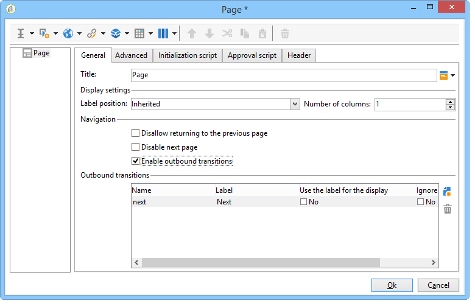
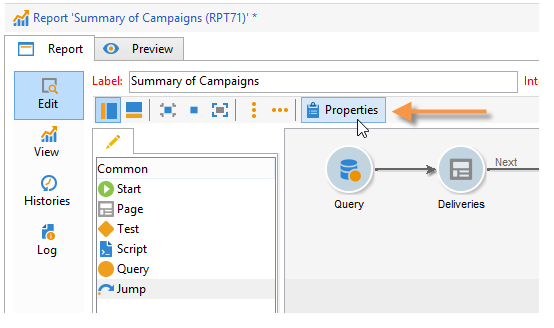
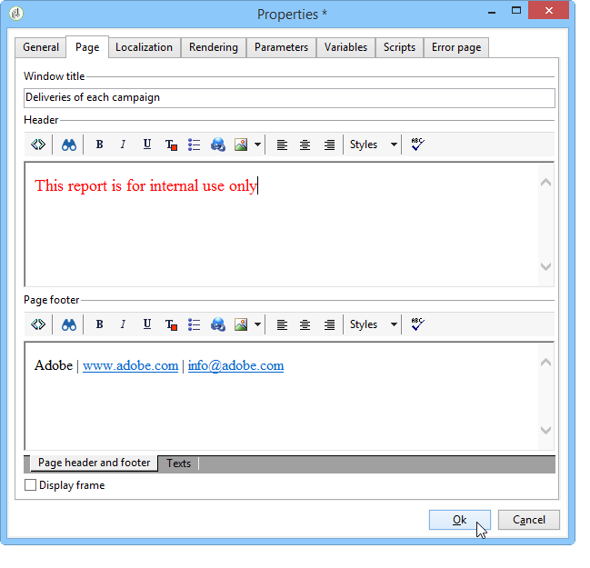
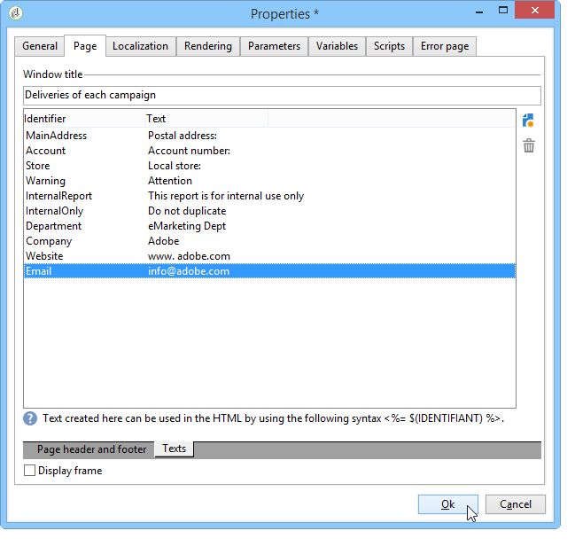
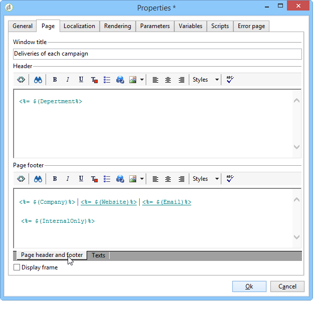

# Layout do elemento{#element-layout}

Além dos diversos gráficos detalhados [aqui](../../reporting/using/creating-a-chart.md#chart-types-and-variants), é possível adaptar a exibição e adicionar elementos à(s) página(s) do relatório.

É possível usar containers: eles permitem vincular vários elementos de uma página e configurar o layout em colunas e/ou células. Como usá-los está detalhado [nesta seção](../../web/using/defining-web-forms-layout.md#creating-containers).

É possível configurar o layout de relatório na raiz da árvore e sobrescrevê-lo em cada container. As páginas são classificadas em colunas. Os containers também são classificados em colunas. Somente os itens estáticos e gráficos são classificados em células.

## Definir as opções de cada página {#defining-the-options-for-each-page}

É possível usar as opções em cada página do relatório.

A guia **[!UICONTROL General]** permite alterar o título da página, bem como configurar as posições da legenda e navegar entre as páginas do relatório.

O campo **[!UICONTROL Title]** permite personalizar o rótulo no cabeçalho da página do relatório. O título da janela pode ser configurado pela janela **[!UICONTROL Properties]** do relatório. Para obter mais informações, consulte [Adicionar um cabeçalho e um rodapé](#adding-a-header-and-a-footer).

As opções em **[!UICONTROL Display settings]** permitem selecionar a posição da legenda de controle em uma página de relatório e definir o número de colunas na página. Para obter mais informações sobre o layout de página, consulte a seção **Item layout** [desta seção](../../web/using/defining-web-forms-layout.md#positioning-the-fields-on-the-page).

Selecione as várias opções na seção **[!UICONTROL Browse]** para autorizar a navegação de uma página de relatório para outra. Se as opções **[!UICONTROL Disable next page]** ou **[!UICONTROL Disable previous page]** forem selecionadas, os botões **[!UICONTROL Next]** e **[!UICONTROL Previous]** desaparecem da página do relatório.

## Adicionar um cabeçalho e um rodapé {#adding-a-header-and-a-footer}

A janela de propriedades do relatório também permite definir os elementos de layout, como: o título da janela, o conteúdo HTML dos cabeçalhos e rodapés.

Para acessar a janela de propriedades, clique no botão **[!UICONTROL Properties]** do relatório.

A guia **[!UICONTROL Page]** permite personalizar a exibição.

O conteúdo configurado nesta guia será visível em todas as páginas do relatório.

A subguia **[!UICONTROL Texts]** permite definir o conteúdo variável: ele será levado em conta durante o ciclo de conversão se o relatório for projetado para uso em vários idiomas.

Isso permite criar uma lista de fragmentos de texto e vinculá-los a identificadores:

Em seguida, insira esses identificadores em conteúdo HTML do relatório:

Eles serão substituídos automaticamente pelo conteúdo apropriado quando o relatório for exibido.

Como para textos HTML, esse modo operacional permite centralizar os textos usados no relatório e gerenciar sua tradução. Os textos criados nesta guia são coletados automaticamente pela ferramenta de tradução integrada do Adobe Campaign.
