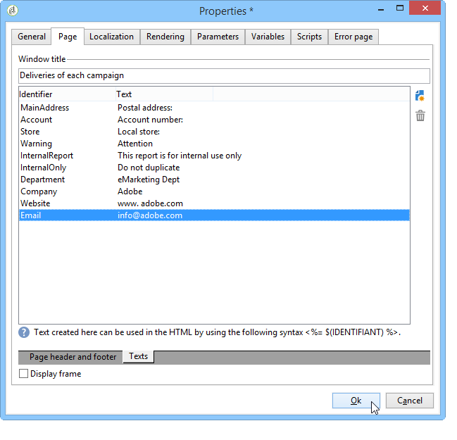

# Layout do elemento{#element-layout}

Além dos diversos gráficos detalhados aqui: Tipos e variantes [de](../../reporting/using/creating-a-chart.md#chart-types-and-variants)gráfico, você pode adaptar a exibição e adicionar elementos às páginas do relatório.

É possível usar containers: eles permitem vincular vários elementos de uma página e configurar o layout em colunas e/ou células. Como usá-los está detalhado [nesta seção](../../web/using/defining-web-forms-layout.md#creating-containers).

É possível configurar o layout de relatório na raiz da árvore e sobrescrevê-lo em cada container. As páginas são classificadas em colunas. Os containers também são classificados em colunas. Somente os itens estáticos e gráficos são classificados em células.

## Definição das opções de cada página {#defining-the-options-for-each-page}

É possível usar as opções em cada página do relatório.

The **[!UICONTROL General]** tab lets you change the title of the page, as well as configure legend positions and browsing between the report pages.

The **[!UICONTROL Title]** field lets you personalize the label in the header of the report page. The title of the window can be configured via the **[!UICONTROL Properties]** window of the report. Para obter mais informações, consulte [Adicionar um cabeçalho e um rodapé](#adding-a-header-and-a-footer).

The **[!UICONTROL Display settings]** options enable you to select the position of the control caption within a report page and to define the number of columns on the page. Para obter mais informações sobre o layout de página, consulte a seção **Item layout** [desta seção](../../web/using/defining-web-forms-layout.md#positioning-the-fields-on-the-page).

Select the various options in the **[!UICONTROL Browse]** section to authorize browsing from one report page to another. Se a opção **[!UICONTROL Disable next page]** ou **[!UICONTROL Disable previous page]** estiver selecionada, os botões **[!UICONTROL Next]** e **[!UICONTROL Previous]** desaparecerão da página do relatório.

## Adição de um cabeçalho e um rodapé {#adding-a-header-and-a-footer}

A janela de propriedades do relatório também permite definir os elementos de layout, como: o título da janela, o conteúdo HTML dos cabeçalhos e rodapés.

To access the properties window, click the **[!UICONTROL Properties]** button of the report.

The **[!UICONTROL Page]** tab enables you to personalize your display.

O conteúdo configurado nesta guia será visível em todas as páginas do relatório.

The **[!UICONTROL Texts]** sub-tab enables you to define variable content: it will be taken into account during the translation cycle if the report is designed for use in several languages.

Isso permite criar uma lista de fragmentos de texto e vinculá-los a identificadores:

Em seguida, insira esses identificadores em conteúdo HTML do relatório:

Eles serão substituídos automaticamente pelo conteúdo apropriado quando o relatório for exibido.

Como para textos HTML, esse modo operacional permite centralizar os textos usados no relatório e gerenciar sua tradução. Os textos criados nesta guia são coletados automaticamente pela ferramenta de tradução integrada do Adobe Campaign.
