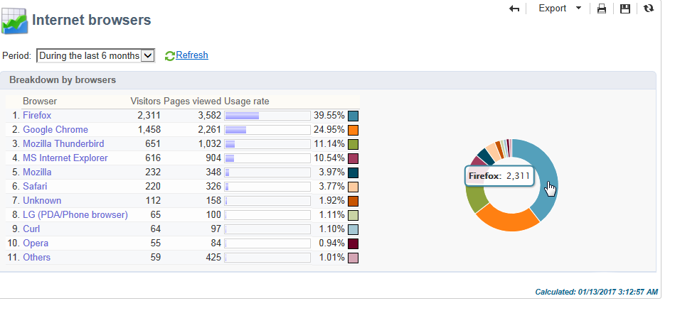

# Relatórios globais {#global-reports}

Esses relatórios dizem respeito à atividade dos dados no banco de dados inteiro. Para exibir o painel de relatórios, vá para a guia **[!UICONTROL Reports]**.

Para exibir relatórios, clique em seus nomes. Os seguintes relatórios estão disponíveis por padrão:

>[!NOTE]
>
>Esta seção mostra apenas os relatórios vinculados aos deliveries.

* **[!UICONTROL Delivery throughput]**: consulte [Taxa de transferência de delivery](#delivery-throughput).
* **[!UICONTROL Browsers]** : consulte [Navegadores](#browsers).
* **[!UICONTROL Sharing to social networks]** : consulte [Compartilhamento em redes sociais](#sharing-to-social-networks).
* **[!UICONTROL Statistics on sharing activities]** : consulte [Estatísticas de atividades de compartilhamento](#statistics-on-sharing-activities).
* **[!UICONTROL Operating systems]**: consulte [Sistemas operacionais](#operating-systems).
* **[!UICONTROL URLs and click streams]**: consulte [URLs e fluxos de clique](../../reporting/using/delivery-reports.md#urls-and-click-streams).
* **[!UICONTROL Tracking indicators]** : consulte [Indicadores de rastreamento](../../reporting/using/delivery-reports.md#tracking-indicators).
* **[!UICONTROL Non-deliverables and bounces]** : consulte [Não entregues e devoluções](#non-deliverables-and-bounces).
* **[!UICONTROL User activities]** : consulte [Atividades do usuário](#user-activities).
* **[!UICONTROL Subscription tracking]** : consulte [Rastreamento de subscrição](#subscription-tracking).
* **[!UICONTROL Delivery summary]** : consulte [Resumo do delivery](../../reporting/using/delivery-reports.md#delivery-summary).
* **[!UICONTROL Delivery statistics]** : consulte [Estatísticas de delivery](#delivery-statistics).
* **[!UICONTROL Breakdown of opens]** : consulte [Detalhamento das aberturas](#breakdown-of-opens).

## Taxa de transferência da entrega {#delivery-throughput}

Este relatório contém informações sobre a taxa de transferência de delivery da plataforma inteira por um determinado período. Para medir a velocidade em que as mensagens são entregues, os critérios são o número de mensagens enviadas por hora e o tamanho das mensagens (em bits por segundo). No exemplo abaixo, o primeiro gráfico mostra as entregas bem-sucedidas em azul e o número de deliveires incorretos em laranja.

Você pode configurar os valores exibidos alterando a escala de tempo: visualização de 1 hora, 3 horas, 24 horas, etc. Clique em **[!UICONTROL Refresh]** para confirmar a seleção.

## Atividades do usuário {#user-activities}

Este relatório mostra o detalhamento de aberturas, cliques e transações por meia hora, hora ou dia, no formato de um gráfico.

As seguintes opções estão disponíveis:

* **[!UICONTROL Opens]** : Número total de mensagens abertas. Os emails no formato de texto não são considerados. Para obter mais informações sobre rastreamento de aberturas, consulte [Rastreamento de aberturas](../../reporting/using/indicator-calculation.md#tracking-opens-).
* **[!UICONTROL Clicks]** : Número total de cliques nos links nos deliveries. Cliques em links de unsubscription e mirror pages não são considerados.
* **[!UICONTROL Transactions]** : Número total de transações depois que uma mensagem é recebida. Para que uma transação seja considerada, uma tag do tipo de transação de rastreamento Web deve ser inserida na página da Web correspondente. A configuração de rastreamento Web é apresentada [nesta seção](../../configuration/using/about-web-tracking.md).

## Não entregues e rejeitados {#non-deliverables-and-bounces}

Este relatório mostra o detalhamento de não entregues, bem como uma análise de devoluções por domínio de Internet.

**[!UICONTROL Number of messages processed]** representa o número total de mensagens processadas pelo servidor de delivery. Esse valor é menor do que o número de mensagens a serem entregues quando alguns deliveries tiverem sido interrompidos ou pausados (antes de serem processados pelo servidor).

**[!UICONTROL Breakdown of errors by type]**

>[!NOTE]
>
>Os erros exibidos nesse relatório acionam o processo de quarentena. Para obter mais informações sobre a gestão de quarentena, consulte [Gestão de Quarentena](../../delivery/using/understanding-quarantine-management.md).

A primeira seção desse relatório mostra o detalhamento de não entregues no formulário de uma tabela de valores e um gráfico.

Para cada tipo de erro, temos:

* o número de mensagens de erro desse tipo,
* a porcentagem de mensagens com erros desse tipo em comparação ao número total de mensagens com erros,
* a porcentagem de mensagens com erro desse tipo em comparação ao número total de mensagens processadas.

Os seguintes indicadores são usados:

* **[!UICONTROL User unknown]** : Tipo de erro gerado durante o delivery para indicar que o endereço de email é inválido.
* **[!UICONTROL Invalid domain]** : Tipo de erro gerado ao enviar um delivery para indicar que o domínio do endereço de email está errado ou não existe.
* **[!UICONTROL Inbox full]** : Tipo de erro gerado após cinco tentativas de delivery para indicar que a caixa de entrada dos recipients contém muitas mensagens.
* **[!UICONTROL Account disabled]** : Tipo de erro gerado ao enviar um delivery para indicar que o endereço não existe mais.
* **[!UICONTROL Rejected]** : Tipo de erro gerado quando um endereço é rejeitado pelo IAP (Provedor de Acesso à Internet), por exemplo, ao seguir uma regra de segurança da aplicação (software antispam).
* **[!UICONTROL Unreachable]** : Tipo de erro que ocorre na cadeia de caracteres de distribuição de mensagens: incidente na retransmissão SMTP, domínio temporariamente inacessível, etc
* **[!UICONTROL Not connected]** : Tipo de erro para indicar que o celular do recipient está desligado ou sem rede no momento do envio.

   >[!NOTE]
   >
   >Esse indicador apenas diz respeito aos canais móveis. Para obter mais informações, consulte [esta seção](../../delivery/using/sms-channel.md).

   Você pode abrir cada linha da tabela de valores clicando no símbolo `[+]`. Para cada tipo de erro, é possível exibir o detalhamento das mensagens de erro por domínio.

   

**[!UICONTROL Breakdown of errors per domain]**

A segunda seção desse relatório mostra o detalhamento de erros por domínio da Internet na forma de uma tabela de valores e um gráfico.

Para cada nome de domínio, temos:

* o número de mensagens com erros para esse domínio,
* a porcentagem de mensagens com erros para esse domínio em comparação ao número total de mensagens processadas para este domínio,
* a porcentagem de mensagens de erro para esse domínio em comparação ao número total de mensagens de erro.

Você pode abrir cada linha da tabela de valores clicando no símbolo [[+]]. Para cada tipo de domínio, é possível exibir o detalhamento das mensagens de erro por tipo de erro.

>[!NOTE]
>
>Os nomes de domínio exibidos nesse relatório são definidos em nível de cubo. Para alterar esses valores, edite o cubo **[!UICONTROL Delivery logs (broadlogrcp)]**. Para obter mais informações, consulte [esta seção](../../reporting/using/about-cubes.md). A categoria **[!UICONTROL Others]** inclui nomes de domínio que não pertencem a uma classe específica.

## Navegadores {#browsers}

Este relatório mostra o detalhamento dos navegadores da Internet usados pelos recipients do delivery para o período relacionado.

>[!NOTE]
>
>Os valores mostrados nesse relatório são estimativas: apenas recipients que clicaram em um delivery serão considerados.

**Estatísticas globais**

As estatísticas globais no uso do navegador são apresentadas na forma de uma tabela de valores e um gráfico.

Os seguintes indicadores são usados:

* **[!UICONTROL Visitors]** : número total de recipients alvos (por navegador de Internet) e que clicaram em um delivery pelo menos uma vez.
* **[!UICONTROL Pages viewed]** : número total de cliques nos links em um delivery (por navegador de Internet) para todos os deliveries.
* **[!UICONTROL Usage rate]** : essa taxa representa o detalhamento dos visitantes (por navegador de Internet) em relação ao número total de visitantes.

**Estatísticas por navegador**

Na tabela de valores de estatística global, você pode clicar em cada nome de navegador para exibir suas estatísticas de uso.

As estatísticas são apresentadas no formato de uma curva, um gráfico e uma tabela de valores.

A curva **[!UICONTROL History]** representa a taxa de participação deste navegador por dia. A taxa é a relação do número de visitantes por dia (nesse navegador) em comparação ao número de visitantes medidos no dia com a maior taxa de presença.

O gráfico **[!UICONTROL Breakdown per version]** representa o detalhamento dos visitantes por versão em comparação ao número total de visitantes (nesse navegador).

A tabela de valores usa os seguintes indicadores:

* **[!UICONTROL Global rate]**: essa taxa representa o detalhamento dos visitantes por versão em comparação ao número total de visitantes (em todos os navegadores).
* **[!UICONTROL Relative rate]**: essa taxa representa o detalhamento dos visitantes por versão em comparação ao número total de visitantes (nesse navegador).

### Compartilhamento em redes sociais {#sharing-to-social-networks}

O marketing viral permite que os recipients do delivery compartilhem informações com sua rede de contatos: eles podem adicionar um link ao seu perfil (Facebook, Twitter, etc.) ou enviar uma mensagem para um amigo. Cada compartilhamento e cada acesso às informações compartilhadas é controlado no delivery. Para obter mais informações sobre marketing viral, consulte [esta seção](../../delivery/using/viral-and-social-marketing.md).

Esse relatório mostra o detalhamento de mensagens compartilhadas e abertas em redes sociais (Facebook, Twitter, etc.) e/ou por email.

**[!UICONTROL Email delivery statistics]**

Nas estatísticas de delivery de email, dois valores são exibidos:

* **[!UICONTROL Number of messages to be delivered]** : Número total de mensagens processadas durante a análise de delivery.
* **[!UICONTROL Number of successful deliveries]** : Número de mensagens processadas com êxito.

**[!UICONTROL Sharing activities and mail open statistics]**

A tabela central exibe as estatísticas de compartilhamentos de email e aberturas.

Na coluna **[!UICONTROL Shares]**, há os seguintes indicadores:

* **[!UICONTROL No. of sharing activities]** : Número total de mensagens compartilhadas em cada rede social. Esse valor equivale ao número total de cliques no ícone do bloco de personalização **[!UICONTROL Links for sharing to social networks]** correspondente.
* **[!UICONTROL Breakdown]** : essa taxa representa o detalhamento de compartilhamentos por rede social em relação ao número total de compartilhamentos.
* **[!UICONTROL Sharing rate]** : essa taxa representa o detalhamento de compartilhamentos por rede social em relação ao número de mensagens a serem entregues.

Na coluna **[!UICONTROL Opens]**, há os seguintes indicadores:

* **[!UICONTROL No. of opens]** : número total de mensagens abertas por pessoas que receberam a mensagem encaminhada (por meio do bloco de personalização **[!UICONTROL Links for sharing to social networks]**). Esse valor é igual ao número de vezes de exibição da mirror page. Aberturas por recipients de delivery não são considerados.
* **[!UICONTROL Breakdown]** : essa taxa representa o detalhamento de aberturas por rede social em relação ao número total de aberturas.
* **[!UICONTROL Rate of opens]** : essa taxa representa o detalhamento de aberturas por rede social em relação ao número total de compartilhamentos.

**[!UICONTROL Breakdown of sharing activities and opens]**

Esta seção inclui dois gráficos que representam o detalhamento de atividades de compartilhamento e aberturas por rede social.

## Estatísticas de atividades de compartilhamento {#statistics-on-sharing-activities}

Esse relatório exibe a evolução dos compartilhamentos em redes sociais (Facebook, Twitter, email, etc.).

Para obter mais informações sobre marketing viral, consulte [esta seção](../../delivery/using/viral-and-social-marketing.md).

As estatísticas são apresentadas no formato de uma tabela de valores e um gráfico.

Os seguintes indicadores são usados:

* **[!UICONTROL New contacts]** : número de novas subscrições após o recebimento de uma mensagem compartilhada por email. Esse valor corresponde ao número de pessoas que receberam uma mensagem compartilhada por email, clicado no **[!UICONTROL Subscription link]** e preenchido no formulário de subscrição.
* **[!UICONTROL Opens]** : número total de mensagens abertas por pessoas para quem a mensagem foi transferida (por meio do bloco de personalização **[!UICONTROL Link for sharing to social networks]**). Esse valor é igual ao número de vezes de exibição da mirror page. Aberturas por recipients de delivery não são considerados.
* **[!UICONTROL Sharing activities]** : Número total de mensagens compartilhadas em redes sociais. Esse valor corresponde ao número total de cliques no ícone do bloco de personalização **[!UICONTROL Links for sharing to social networks]**.

## Sistemas operacionais {#operating-systems}

Este relatório exibe o detalhamento dos sistemas operacionais usados pelos recipients de delivery do período relacionado.

>[!NOTE]
>
>Os valores mostrados nesse relatório são estimativas: apenas recipients que clicaram em um delivery serão considerados.

**Estatísticas globais**

As estatísticas de uso global dos sistemas operacionais são apresentadas no formato de uma tabela de valores e um gráfico.

Os seguintes indicadores são usados:

* **[!UICONTROL Visitors]** : média diária do número total de recipients alvos (por sistema operacional) que clicaram em um delivery pelo menos uma vez.
* **[!UICONTROL Pages viewed]** : média diária do número total de cliques nos links de delivery (por sistema operacional) para todos os deliveries.
* **[!UICONTROL Rate of use]** : essa taxa representa o detalhamento dos visitantes (por sistema operacional) em relação ao número total de visitantes.

**Estatísticas por sistema operacional**

Na tabela de valores de estatística global, clique no nome de cada sistema operacional para exibir as estatísticas por sistema operacional.

As estatísticas são apresentadas no formato de uma curva, um gráfico e uma tabela de valores.

A curva **[!UICONTROL History]** representa a taxa de uso deste sistema operacional por dia. Essa taxa é a relação do número de visitantes por dia (neste sistema operacional) em relação ao número de visitantes medidos no dia com a maior participação.

O gráfico **[!UICONTROL Breakdown by version]** representa o detalhamento dos visitantes por versão em relação ao número total de visitantes neste sistema operacional.

A tabela de valores usa os seguintes indicadores:

* **[!UICONTROL Global rate]** : essa taxa representa o detalhamento dos visitantes (por versão) em relação ao número total de visitantes em todos os sistemas operacionais.
* **[!UICONTROL Relative rate]** : essa taxa representa o detalhamento dos visitantes (por versão) em relação ao número total de visitantes desse sistema operacional.

## Rastreamento de subscrição {#subscription-tracking}

Este relatório permite monitorar subscrições de serviços de informação. Ele mostra subscrições e unsubscriptions.

Ele pode ser exibido para uma subscrição clicando no nó **[!UICONTROL Profiles and targets > Services and subscriptions]** da home page ou do navegador. Selecione a subscrição desejada e depois clique na guia **[!UICONTROL Reports]**. O relatório **[!UICONTROL Subscriptions tracking]** está disponível por padrão. Ele permite ver as tendências de subscrição e unsubscription e a taxa de fidelidade por um período. Você pode configurar a representação desses dados pela lista suspensa. Clique em **[!UICONTROL Refresh]** para validar a configuração selecionada.

Para obter mais informações, consulte [esta página](../../delivery/using/managing-subscriptions.md).

**[!UICONTROL Number subscribed to date]** representa o número total de pessoas subscritas atualmente.

**[!UICONTROL Overall evolution of subscriptions]**

A tabela de valores usa os seguintes indicadores:

* **[!UICONTROL Subscribers]**: número total de assinantes do período relacionado.
* **[!UICONTROL Subscriptions]**: número de subscrições do período relacionado.
* **[!UICONTROL Unsubscriptions]**: número de cancelamentos de subscrições do período relacionado.
* **[!UICONTROL Evolution]**: número de cancelamentos de subscrições menos o número de subscrições. A taxa é calculada com base no número total de assinantes.
* **[!UICONTROL Loyalty]**: taxa de fidelidade de assinantes do período relacionado.

**[!UICONTROL Subscription evolution curves]**

Este gráfico mostra a evolução das subscrições e unsubscriptions para o período relacionado.

## Estatísticas de delivery {#delivery-statistics}

Este relatório mostra o detalhamento por domínio de Internet, de todas as mensagens processadas e enviadas, de devoluções permanentes e temporárias, aberturas, cliques e unsubscriptions.

Os seguintes indicadores são usados:

* **[!UICONTROL Emails processed]**: número total de mensagens processadas pelo servidor de delivery.
* **[!UICONTROL Delivered]**: porcentagem do número de mensagens processadas com êxito em comparação ao número total de mensagens processadas.
* **[!UICONTROL Hard bounces]**: porcentagem do número de devoluções permanentes em comparação ao número total de mensagens processadas.
* **[!UICONTROL Soft bounces]**: porcentagem do número de devoluções temporárias em comparação ao número total de mensagens processadas.

   >[!NOTE]
   >
   >Para obter mais informações sobre devoluções permanentes e temporárias, consulte [Gestão de quarentena](../../delivery/using/understanding-quarantine-management.md).

* **[!UICONTROL Opens]**: porcentagem do número de recipients alvos que abriram uma mensagem pelo menos uma vez em comparação ao número de mensagens processadas com êxito.
* **[!UICONTROL Clicks]**: porcentagem do número de pessoas que clicaram em um delivery pelo menos uma vez em comparação ao número de mensagens processadas com êxito.
* **[!UICONTROL Unsubscription]**: porcentagem do número de cliques em um link de cancelamento de subscrição em comparação ao número de mensagens processadas com êxito.

## Detalhamento de aberturas {#breakdown-of-opens}

Este relatório mostra o detalhamento de aberturas por sistema operacional, dispositivo e navegador para o período relacionado. Para cada categoria, dois gráficos são usados. O primeiro exibe estatísticas referentes a aberturas em um computador e dispositivos móveis. O segundo exibe estatísticas relacionadas apenas a aberturas em dispositivos móveis.

O número de aberturas corresponde ao número total de mensagens abertas. Os emails em formato de texto não são contados. Para obter mais informações sobre rastreamento de aberturas, consulte a seção [Tracking opens](../../reporting/using/indicator-calculation.md#tracking-opens-).

>[!NOTE]
>
>Os nomes do navegador e do sistema operacional fazem parte das informações enviadas pelo agente do usuário do navegador em que a mensagem foi aberta. O Adobe Campaign deduz o tipo de dispositivo usando as informações do dispositivo.
