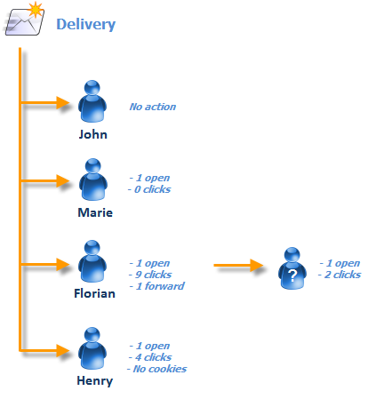
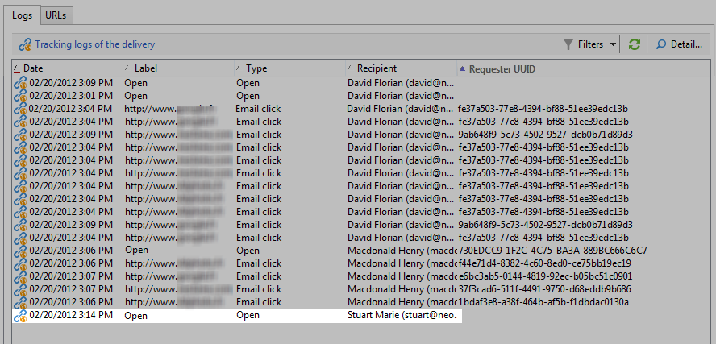
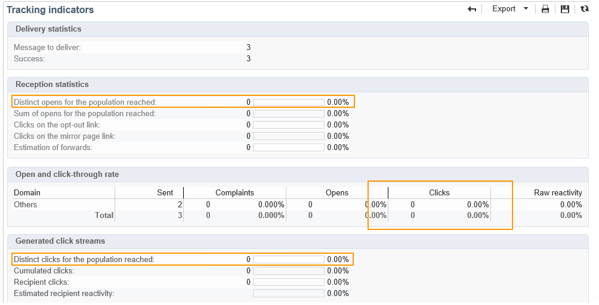

# Pessoa/pessoas e recipients {#person-people-and-recipients}

Este exemplo ajudará a entender a diferença entre uma pessoa/pessoas e um recipient no Adobe Campaign. Enviaremos um delivery para várias pessoas para destacar a diferença entre pessoas e recipients enquanto detalha o método de cálculo dos seguintes indicadores:

* **[!UICONTROL Clicks]**
* **[!UICONTROL Distinct clicks for the population reached]**
* **[!UICONTROL Distinct opens for the population reached]**
* **[!UICONTROL Estimation of forwards]**
* **[!UICONTROL Raw reactivity]**

>[!NOTE]
>
>Esses indicadores são usados no relatório **[!UICONTROL Tracking indicators]**. Para obter mais informações, consulte os [Indicadores de rastreamento](../../reporting/using/delivery-reports.md#tracking-indicators).

Três links são adicionados a um delivery Ele é enviado para 4 recipients:

* **[!UICONTROL John Davis]**: este destinatário não abre o email (e, portanto, não clica em nenhum link).
* **[!UICONTROL Marie Stuart]** : abre o email, mas não clica em nenhum link.
* **[!UICONTROL Florian David]**: abre o email e clica nos links 9 vezes. Ele também encaminha o email a alguém que o abre e clica duas vezes.
* **[!UICONTROL Henry Macdonald]**: este destinatário configurou o navegador da Internet para rejeitar os cookies. Ele abre o email e clica nos links 4 vezes.

Os seguintes logs de rastreamento são retornados:

Para ter uma ideia mais clara de como as pessoas e os recipients são contados, vamos analisar os logs de cada perfil.

## Etapa 1: John {#step-1--john}

**[!UICONTROL John Davis]** não abre o email (e, portanto, não clica em nenhum link).

Como John não abriu e nem clicou no email, ele não aparece nos logs.

**Cálculo intermediário:**

|  | Recipients que clicaram | Pessoas que clicaram | Recipients que abriram |
|---|---|---|---|
| John | - | - | - |
| Total intermediário | 0 | 0 | 0 |

## Etapa 2: Marie {#step-2--marie}

**[!UICONTROL Marie Stuart]** abre o email, mas não clica em nenhum link.

A abertura de Marie é exibida no seguinte log:

A abertura é atribuída a um destinatário: Marie. O Adobe Campaign, portanto, adiciona um novo recipient à contagem.

**Cálculo intermediário:**

|  | Recipients que clicaram | Pessoas que clicaram | Recipients que abriram |
|---|---|---|---|
| John | - | - | - |
| Marie | - | - | +1 |
| Total intermediário | 0 | 0 | 1 |

## Etapa 3: Florian {#step-3--florian}

**[!UICONTROL Florian David]** abre o email e clica nos links 9 vezes. Ele também encaminha o email a alguém que o abre e clica duas vezes.

As ações de Florian (uma abertura e 9 cliques) aparecem nos seguintes logs:

**Recipients**: a abertura e os cliques são atribuídos ao mesmo recipient (Florian). Como esse recipient é diferente do anterior (Marie), o Adobe Campaign adiciona um novo recipient à contagem.

Pessoas: quando o navegador do destinatário aceita cookies, o mesmo identificador (UUID) é atribuído a todos os logs de clique: **`fe37a503 [...]`**. O Adobe Campaign identifica corretamente esses cliques como pertencentes à mesma pessoa. Uma nova pessoa é adicionada à contagem.

**Cálculo intermediário:**

|  | Recipients que clicaram | Pessoas que clicaram | Recipients que abriram |
|---|---|---|---|
| John | - | - | - |
| Marie | - | - | +1 |
| Florian | +1 | +1 | +1 |
| Total intermediário | 1 | 1 | 2 |

Os seguintes logs correspondem à abertura e aos dois cliques realizados pela pessoa para a qual Florian encaminhou o email:

**Recipients**: seus cliques e aberturas são atribuídos ao recipient que encaminhou o email (Florian). Como esse recipient já foi contado, a contagem de recipients permanece a mesma.

**Pessoas**: com relação aos cliques, podemos ver que o mesmo identificador (UUID) é atribuído a todos os logs: **`9ab648f9 [...]`**. Esse identificador ainda não foi contado. Uma nova pessoa é então adicionada à contagem.

**Cálculo intermediário:**

|  | Recipients que clicaram | Pessoas que clicaram | Recipients que abriram |
|---|---|---|---|
| John | - | - | - |
| Marie | - | - | +1 |
| Florian | +1 | +1 | +1 |
| Pessoa desconhecida | - | +1 | - |
| Total intermediário | 1 | 2 | 2 |

## Etapa 4: Henry {#step-4--henry}

**[!UICONTROL Henry Macdonald]** configurou o navegador da Internet para rejeitar os cookies. Ele abre o email e clica nos links 4 vezes.

As aberturas e os 4 cliques realizados pelo Henry aparecem nos seguintes logs:

**Recipients**: as aberturas e os cliques são atribuídos ao mesmo recipient (Henry). Como esse recipient ainda não foi contado, o Adobe Campaign adiciona um recipient à contagem.

**Pessoas**: Como o navegador Henry não aceita cookies, um novo identificador (UUID) é gerado para cada clique. Cada um dos 4 cliques é interpretado como originário de uma pessoa diferente. Como esses identificadores ainda não foram contados, eles são adicionados à contagem.

**Cálculo intermediário:**

|  | Recipients que clicaram | Pessoas que clicaram | Recipients que abriram |
|---|---|---|---|
| John | - | - | - |
| Marie | - | - | +1 |
| Florian | +1 | +1 | +1 |
| Pessoa desconhecida | - | +1 | - |
| Henry | +1 | +4 | +1 |
| Total intermediário | 2 | 6 | 3 |

## Resumo {#summary}

No nível da entrega, temos os seguintes resultados:

* **[!UICONTROL Clicks]** (recipients que clicaram): 2
* **[!UICONTROL Distinct clicks for the population reached]** (pessoas que clicaram): 6
* **[!UICONTROL Distinct opens for the population reached]** (recipients que abriram): 3

A reatividade bruta e a estimativa de encaminhamento são calculadas como descrito a seguir:

* **[!UICONTROL Estimation of forwards]** = **B - A** (portanto 6 - 2 = 4)
* **[!UICONTROL Raw reactivity]** = **A / C** (portanto 2 / 3 = 66,67%)

>[!NOTE]
>
>Nas seguintes fórmulas:
>
>* A representa o indicador **[!UICONTROL Clicks]** (destinatários que clicaram).
>* B representa o indicador **[!UICONTROL Distinct clicks for the population reached]** (pessoas que clicaram).
>* C representa o indicador **[!UICONTROL Distinct opens for the population reached]** (destinatários que abriram).

