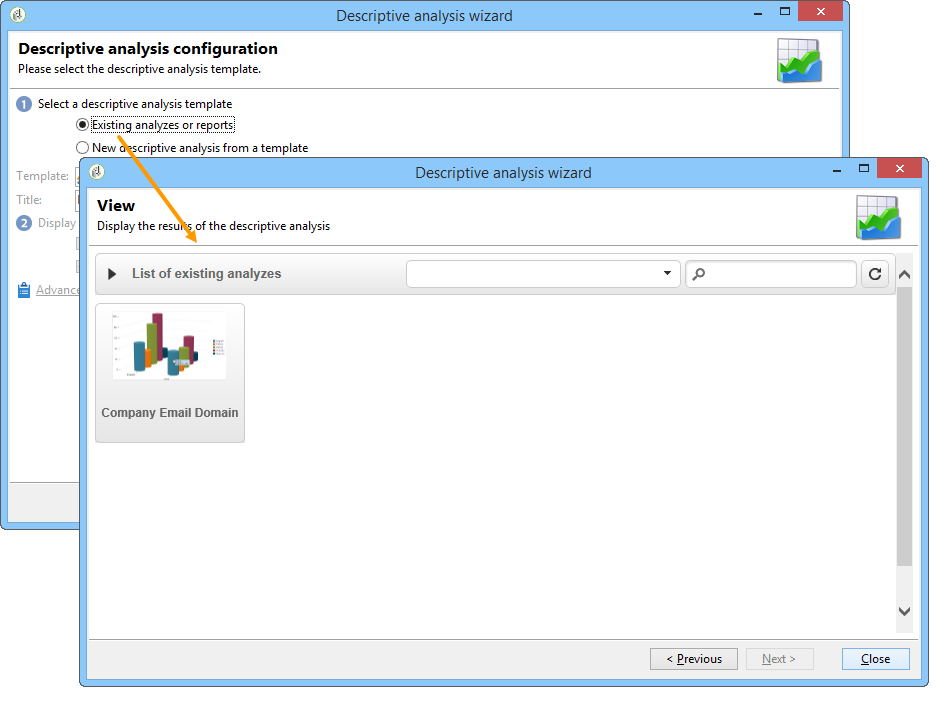
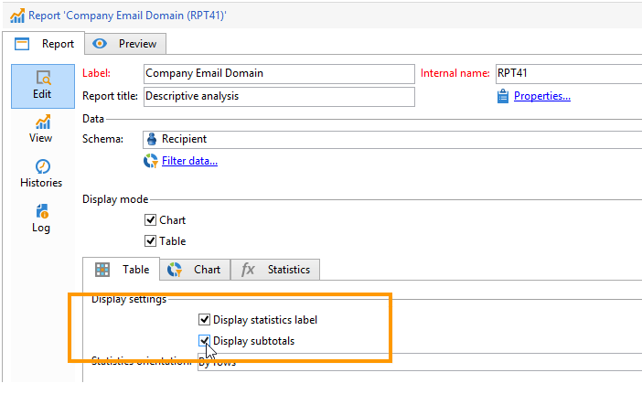

# Uso de um relatório de análise {#processing-a-report}

## Salvamento de um relatório de análise {#saving-an-analysis-report}

Se tiver os direitos apropriados, poderá salvar um relatório de análise criado a partir de um template ou exportá-lo no formato Excel, PDF ou OpenOffice.

Para salvar o relatório, clique em **[!UICONTROL Save]** e dê um rótulo a ele.

Selecione **[!UICONTROL Also save data]** se desejar criar um histórico do relatório e ver os valores do relatório no momento da gravação. Para obter mais informações, consulte [Arquivamento de relatórios de análise](#archiving-analysis-reports).

The **[!UICONTROL Share this report]** option allows other operators to access the report.

Depois de salvo, esse relatório pode ser reutilizado para gerar outros relatórios de análise:

Para fazer alterações nesse relatório, edite o nó **[!UICONTROL Administration > Configuration > Adobe Campaign tree reports]** da árvore do Adobe Campaign (ou a primeira pasta do tipo &quot;Relatórios&quot; para a qual o operador tem direitos de edição). Para obter mais informações, consulte [Configuração do layout de um relatório de análise descritiva](#configuring-the-layout-of-a-descriptive-analysis-report).

## Configurações adicionais do relatório de análise {#analysis-report-additional-settings}

Após salvar um relatório de análise descritiva, é possível editar suas propriedades e acessar opções adicionais.

Essas opções são as mesmas dos relatórios padrão e são detalhadas [nesta página](../../reporting/using/properties-of-the-report.md).

## Configuração do layout de um relatório de análise descritiva {#configuring-the-layout-of-a-descriptive-analysis-report}

É possível personalizar a visualização e layout dos dados nos gráficos e tabelas da análise descritiva. Todas as opções são acessadas através da árvore do Adobe Campaign, na guia **[!UICONTROL Edit]** de cada relatório.

### Modo de exibição do relatório de análise {#analysis-report-display-mode}

Ao criar um relatório usando o template **[!UICONTROL qualitative distribution]**, os modos de exibição de tabela e gráfico são selecionados por padrão. Se desejar apenas um modo de exibição, desmarque a caixa apropriada. Isso significa que somente a guia do modo de exibição selecionado estará disponível.

Para alterar o schema do relatório, clique em **[!UICONTROL Select the link]** e selecione outra tabela no banco de dados.

### Configurações de exibição do relatório de análise {#analysis-report-display-settings}

É possível ocultar ou exibir estatísticas e subtotais, como também escolher a orientação das estatísticas.

Ao criar estatísticas, é possível personalizar seu rótulo.

Seu nome será exibido no relatório.

No entanto, se desmarcar a opção de exibição do rótulo e do subtotal, eles não estarão visíveis no relatório. O nome aparecerá em uma dica de ferramenta ao passar o mouse sobre uma célula da tabela.

Por padrão, as estatísticas são exibidas online. Para alterar a orientação, selecione a opção apropriada na lista suspensa.

No exemplo a seguir, as estatísticas são exibidas em colunas.

### Layout de dados do relatório de análise {#analysis-report-data-layout}

É possível personalizar o layout de dados diretamente nas tabelas de análise descritivas. Para fazer isso, clique com o botão direito na variável com a qual deseja trabalhar. Selecione as opções disponíveis do menu suspenso:

* **[!UICONTROL Pivot]** para alterar o eixo da variável.
* **[!UICONTROL Up]** / **[!UICONTROL Down]** para trocar as variáveis em linhas.
* **[!UICONTROL Move to the right]** / **[!UICONTROL Move to the left]** para trocar as variáveis em colunas.
* **[!UICONTROL Turn]** para inverter os eixos das variáveis.
* **[!UICONTROL Sort from A to Z]** para classificar os valores de variável de baixo para alto.
* **[!UICONTROL Sort from Z to A]** para classificar os valores de variável de alto a baixo.

   

Para retornar à exibição inicial, atualize a visualização.

### Opções de gráfico do relatório de análise {#analysis-report-chart-options}

É possível personalizar a exibição de dados no gráfico. To do this, click the **[!UICONTROL Variables...]** link available during the chart type selection stage.

As seguintes opções estão disponíveis:

* A seção superior da janela permite modificar a área de exibição do gráfico.
* Por padrão, os rótulos são exibidos no gráfico. You can hide them by un-checking the **[!UICONTROL Show values]** option.
* A opção **[!UICONTROL Accumulate values]** permite adicionar valores de uma série a outra.
* É possível decidir se exibe ou não a legenda do gráfico: para ocultá-la, desmarque a opção apropriada. Por padrão, a legenda é exibida fora do gráfico no canto superior direito.

   A legenda também pode ser exibida na parte superior do gráfico para salvar espaço de visualização. To do this, select the option **[!UICONTROL Include in the chart]**

   Selecione o alinhamento vertical e horizontal na lista suspensa **[!UICONTROL Caption position]**.

   

## Exportação de um relatório de análise {#exporting-an-analysis-report}

Para exportar dados de um relatório de análise, clique na lista suspensa e selecione o formato de saída desejado.

Para obter mais informações, consulte [esta página](../../reporting/using/actions-on-reports.md).

## Reutilização de relatórios e análises existentes {#re-using-existing-reports-and-analyses}

É possível criar relatórios de análise descritiva em dados usando relatórios existentes já armazenados no Adobe Campaign. Esse modo é possível quando as análises foram salvas ou quando os relatórios foram criados e configurados para serem acessados via assistente de análise descritiva.

Para descobrir como salvar análises descritivas, consulte [Salvar um relatório de análise](#saving-an-analysis-report).

Para criar relatórios de análise descritiva, o assistente de análise descritiva deve ser executado por uma transição de workflow ou por meio do menu **[!UICONTROL Tools > Descriptive analysis]**.

1. Selecione **[!UICONTROL Existing analyses and reports]** e clique em **[!UICONTROL Next]**.
1. Isso permite acessar a lista de relatórios disponíveis. Selecione o relatório que deseja gerar.

   

## Arquivamento de relatórios de análise {#archiving-analysis-reports}

Ao criar uma análise descritiva baseada em uma análise existente, é possível criar arquivos para armazenar dados e comparar os resultados do relatório.

Para criar um histórico, siga as etapas abaixo:

1. Abra uma análise existente ou crie um novo assistente de análise descritiva.
1. Na página de exibição do relatório, clique no botão para criar um histórico na barra de ferramentas e, em seguida, confirme como mostrado abaixo:

   

1. Use o botão de acesso de arquivo para mostrar análises anteriores.

   

