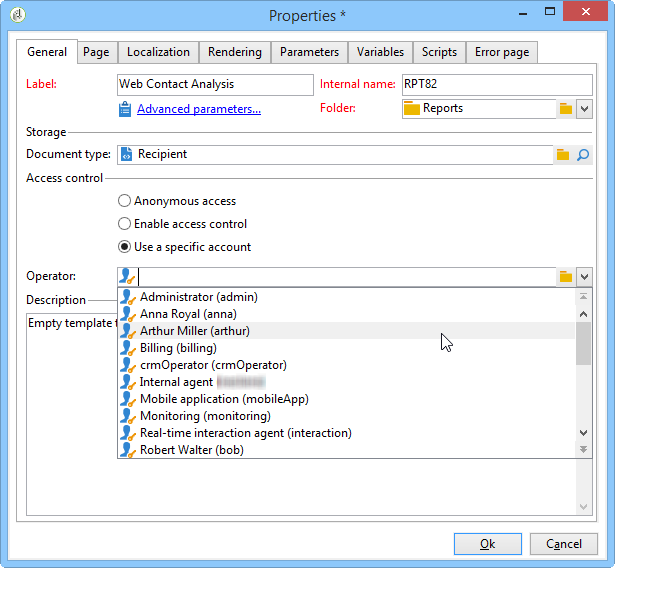
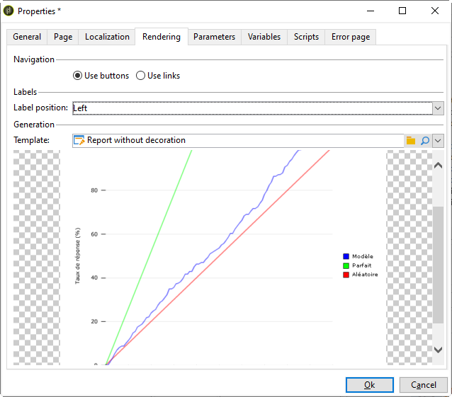

# Propriedades do relatório{#properties-of-the-report}

É possível personalizar e configurar completamente seu relatório para atender qualquer necessidade. Para fazer isso, edite suas propriedades. As propriedades do relatório são acessadas por meio do botão **[!UICONTROL Properties]** localizado acima do gráfico de sequência de atividades.

As propriedades gerais estão descritas abaixo. Os recursos avançados configurados nas guias **[!UICONTROL Parameters]**, **[!UICONTROL Variables]** e **[!UICONTROL Scripts]** estão descritos [nesta seção](../../reporting/using/advanced-functionalities.md).

## Propriedades gerais {#overall-properties}

Na guia **[!UICONTROL General]** das propriedades do relatório, é possível editar as configurações listadas abaixo:

* O rótulo e o nome interno do relatório. O **[!UICONTROL Internal name]** é usado no URL final do relatório. Não deve ser alterado após a criação do relatório.

* A **Pasta** do relatório é selecionada durante a criação do relatório. Uma prática recomendada é criar uma pasta dedicada para relatórios personalizados para que eles não sejam misturados com [relatórios incorporados](../../reporting/using/about-campaign-built-in-reports.md).

* O **Armazenamento** é selecionado ao criar o relatório. Para alterar a tabela que o relatório aborda, clique no ícone **[!UICONTROL Select link]** à direita do campo **[!UICONTROL Document type]**.

   

* Os parâmetros do **Controle de acesso**. Essas configurações estão descritas abaixo.

## Controlar acesso ao relatório {#report-accessibility}

Um relatório pode ser acessado no console do Adobe Campaign ou com um navegador da web. Nesse caso, pode ser necessário configurar o controle de acesso do relatório conforme mostrado abaixo.

As opções possíveis são:

* **[!UICONTROL Anonymous access]**: essa opção permite acesso irrestrito ao relatório. No entanto, nenhuma manipulação é possível.

   As permissões do operador técnico &quot;webapp&quot; são usadas para exibir os elementos do relatório. Saiba mais [nesta seção](../../platform/using/access-management-operators.md).

* **[!UICONTROL Access control]**: esta opção permite que os operadores do Adobe Campaign acessem o relatório quando estiverem conectados.
* **[!UICONTROL Specific account]**: a opção permite executar o relatório com os direitos do operador, selecionados no campo **[!UICONTROL Operator]**.

## Traduzir seu relatório {#report-localization}

É possível configurar os idiomas para os quais deseja que o relatório seja traduzido. Para fazer isso, clique na guia **[!UICONTROL Localization]**.

O idioma de edição é o idioma escrito. Quando adicionar um idioma, a subguia aparece na página de edição do relatório.

>[!NOTE]
>
>Para obter mais informações sobre localização da página da web no Campaign, consulte [esta seção](../../web/using/translating-a-web-form.md).

## Personalizar a renderização do HTML {#personalizing-html-rendering}

Na guia **[!UICONTROL Rendering]**, é possível personalizar o modo de exibição de dados da página. É possível selecionar:

* O tipo de navegação no relatório: por botões ou links.
* A posição padrão dos rótulos para elementos do relatório. Essa posição pode ser sobrescrita em cada elemento.
* O template ou tema usado para gerar páginas de relatório.

## Personalização da página de erro {#personalizing-the-error-page}

A guia **[!UICONTROL Error page]** permite configurar a mensagem que aparecerá no caso de erro na exibição do relatório.

É possível definir textos e vinculá-los a identificadores específicos para gerenciar a localização do relatório. Para obter mais informações, consulte [Adicionar um cabeçalho e um rodapé](../../reporting/using/element-layout.md#adding-a-header-and-a-footer).

