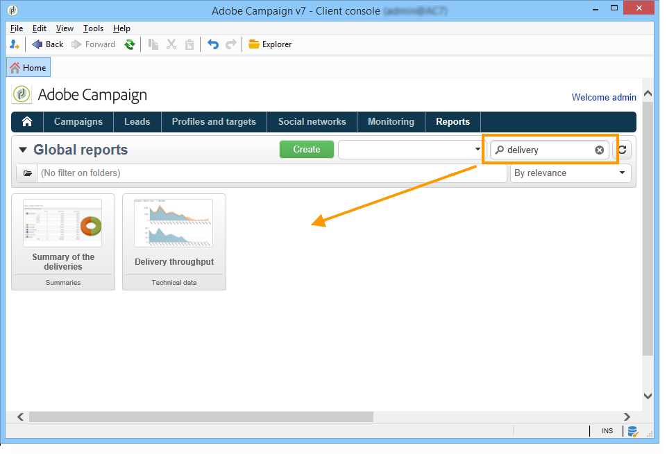

# Sobre relatórios de entregas{#reports-on-deliveries}

O Adobe Campaign oferece vários tipos de relatórios, acessíveis através do console do cliente ou de um navegador da Internet.

Os seguintes tipos de relatório estão disponíveis:

* Relatórios sobre toda a plataforma, consulte [Relatórios globais](../../reporting/using/global-reports.md).
* Relatórios do delivery, consulte [Relatórios do delivery](../../reporting/using/delivery-reports.md).
* Relatórios acumulados, consulte [Relatórios cumulativos](../../reporting/using/cumulative-reports.md).

Você pode acessar relatórios na home page do console do cliente, do painel de relatórios ou da lista de delivery. O modo de exibição de um relatório depende de seu contexto. A lista de relatórios principais está disponível na home page e permite acessar os dados de delivery rapidamente. Essa lista pode ser alterada para atender às suas necessidades. Consulte [esta seção](../../reporting/using/about-reports-creation-in-campaign.md) para obter mais informações.

Um campo de pesquisa está disponível no painel do relatório para acesso rápido a um dos relatórios na lista.

Quando o relatório é gerado, é possível executar várias ações usando os ícones na barra de ferramentas à direita da janela do relatório.

É possível:

* Exportar o relatório para o Excel, PDF ou Open Document,
* Imprimir o relatório,
* Criar o histórico do relatório,
* Exibir diferentes históricos de relatórios,
* Atualizar os dados no relatório.

>[!NOTE]
>
>Alguns relatórios apresentam gráficos (curva, barra, funil, etc.). Mova o cursor sobre um gráfico para exibir seus valores.

Para obter mais informações sobre essas opções, consulte [esta seção](../../reporting/using/about-adobe-campaign-reporting-tools.md).
