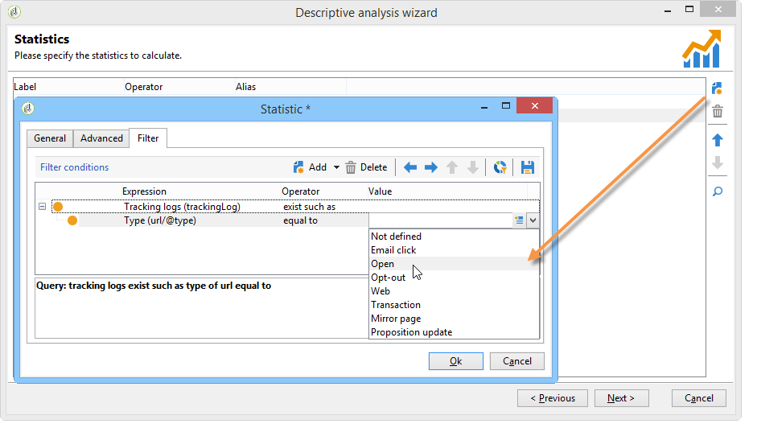

# Casos de uso{#use-cases}

## Análise de uma população {#analyzing-a-population}

O exemplo a seguir permite explorar a população direcionada por um conjunto de boletins informativos usando o assistente de análise descritiva.

As etapas de implementação são detalhadas abaixo, enquanto uma lista completa de opções e descrições está disponível nas outras seções deste capítulo.

### Identificação de uma população a ser analisada {#identifying-the-population-to-analyze}

Neste exemplo, queremos explorar a população do target dos deliveries incluídos na pasta **Newsletters**.

To do this, select the concerned deliveries, then right-click and select **[!UICONTROL Action > Explore the target...]**.


### Seleção de um tipo de análise {#selecting-a-type-of-analysis}

Na primeira etapa do assistente, é possível selecionar o template de análise descritiva a ser usado. By default, Adobe Campaign offers two templates: **[!UICONTROL Qualitative distribution]** and **[!UICONTROL Quantitative distribution]**. Para obter mais informações, consulte a seção [Configuração do modelo](../../reporting/using/using-the-descriptive-analysis-wizard.md#configuring-the-qualitative-distribution-template) de distribuição qualitativa. As várias renderizações são apresentadas na seção [Sobre análise](../../reporting/using/about-descriptive-analysis.md) descritiva.

For this example, select the **[!UICONTROL Qualitative distribution]** template and choose a display with a chart and table (array). Give the report a name (&quot;Descriptive analysis&quot;) and click **[!UICONTROL Next]**.


### Seleção de exibição de variáveis {#selecting-the-variables-to-display}

A próxima etapa permite selecionar os dados a serem exibidos na tabela.

Click the **[!UICONTROL Add...]** link to select the variable that contains the data to display. Aqui queremos exibir as cidades dos recipients do delivery em uma linha:


As colunas exibirão o número de compras por empresa. Neste exemplo, as quantidades são agregadas no campo de **compras da Web**.

Aqui, queremos definir compartimentalização dos resultados para esclarecer sua exibição. To do this, select the **[!UICONTROL Manual]** binning option and set the calculation classes for the segments to display:


Then, click **[!UICONTROL Ok]** to approve the configuration.

Depois que as linhas e colunas tiverem sido definidas, é possível alterar, mover ou excluí-las usando a barra de ferramentas.


### Definição do formato de exibição {#defining-the-display-format}

A próxima etapa do assistente permite selecionar o tipo de gráfico que deseja gerar.

Nesse caso, escolha o histograma.


As configurações possíveis dos diferentes gráficos estão detalhadas na seção de opções [do gráfico de relatório](../../reporting/using/processing-a-report.md#analysis-report-chart-options) Análise.

### Configuração da estatística a ser calculada {#configuring-the-statistic-to-calculate}

Em seguida, especifique os cálculos a serem aplicados aos dados coletados. Por padrão, o assistente de análise descritiva executa uma contagem simples dos valores.

Esta janela permite definir a lista de estatísticas a serem calculadas.


To create a new statistic, click the **[!UICONTROL Add]** button. For more on this, refer to [Statistics calculation](../../reporting/using/using-the-descriptive-analysis-wizard.md#statistics-calculation).

### Visualização e uso do relatório {#viewing-and-using-the-report}

A última etapa do assistente exibe a tabela e o gráfico.

É possível armazenar, exportar ou imprimir dados usando a barra de ferramentas acima da tabela. For more on this, refer to [Processing a report](../../reporting/using/processing-a-report.md).


## Análise de dados qualitativa {#qualitative-data-analysis}

### Exemplo de exibição de gráfico {#example-of-a-chart-display}

**Target**: gerar um relatório de análise no local de clientes em potencial ou de clientes.

1. Open the descriptive analysis wizard and select **[!UICONTROL Chart]** only.

   

   Clique **[!UICONTROL Next]** para aprovar esta etapa.

1. Then select the **[!UICONTROL 2 variables]** option and specify that the **[!UICONTROL First variable (abscissa)]** will refer to recipient status (prospects/customers) and the second variable will refer to the country.
1. Selecione **[!UICONTROL Cylinders]** como um tipo.

   

1. Clique **[!UICONTROL Next]** e deixe a **[!UICONTROL Simple count]** estatística padrão.
1. Clique em **[!UICONTROL Next]** para exibir o relatório.

   

   Passe o mouse sobre uma barra para ver o número exato de clientes ou prospectos desse país.

1. Habilite ou desabilite a exibição de um dos países com base na legenda.

   

### Exemplo de exibição de tabela {#example-of-a-table-display}

**Target**: analisar domínios de email de empresas.

1. Open the descriptive analysis wizard and select the **[!UICONTROL Array]** display mode only.

   

   Click the **[!UICONTROL Next]** button to approve this step.

1. Select the **[!UICONTROL Company]** variable as a column and the **[!UICONTROL Email domain]** variable as a row.
1. Keep the **[!UICONTROL By rows]** option for statistics orientation: the statistic calculation will be displayed to the right of the **[!UICONTROL Email domain]** variable.

   

   Clique **[!UICONTROL Next]** para aprovar esta etapa.

1. Então insira a estatística a ser calculada: mantenha a contagem padrão e crie uma nova estatística. Para fazer isso, clique **[!UICONTROL Add]** e selecione **[!UICONTROL Total percentage distribution]** como operador.

   

1. Insira um rótulo para a estatística de forma que não haja um campo em branco quando o relatório for exibido.

   

1. Clique em **[!UICONTROL Next]** para exibir o relatório.

   

1. Depois que o relatório de análise for gerado, você poderá adaptar a exibição de acordo com suas necessidades sem alterar a configuração. For instance, you can switch the axes: right-click the domain names and select **[!UICONTROL Turn]** on the shortcut menu.

   

   A tabela exibe as informações da seguinte maneira:

   

## Análise de dados quantitativos {#quantitative-data-analysis}

**Target**: gerar um relatório de análise quantitativa sobre a idade do recipient.

1. Open the descriptive analysis wizard and select **[!UICONTROL Quantitative distribution]** from the drop-down list.

   

   Click the **[!UICONTROL Next]** button to approve this step.

1. Select the **[!UICONTROL Age]** variable and enter its label. Specify whether or not it&#39;s an integer, then click **[!UICONTROL Next]**.

   

1. Suprimir as estatísticas **[!UICONTROL Deciles]**, **[!UICONTROL Distribution]** e **[!UICONTROL Sum]** : eles não são necessários aqui.

   

1. Clique em **[!UICONTROL Next]** para exibir o relatório.

   

## Análise do target de transição em um workflow {#analyzing-a-transition-target-in-a-workflow}

**Target**: gerar relatórios sobre a população de um workflow de criação de target.

1. Abra o workflow para criação de target desejado.
1. Clique com o botão direito do mouse em uma transição que aponte para a tabela de recipients.
1. Select **[!UICONTROL Analyze target]** in the drop-down menu to open the descriptive analysis window.

   

1. Nesse ponto, você pode selecionar a **[!UICONTROL Existing analyses and reports]** opção e usar os relatórios criados anteriormente (consulte [Reutilizar relatórios e análises](../../reporting/using/processing-a-report.md#re-using-existing-reports-and-analyses)existentes) ou criar uma nova análise descritiva. Para fazer isso, deixe a opção **[!UICONTROL New descriptive analysis from a template]** selecionada por padrão.

   O restante da configuração é o mesmo para todas as análises descritivas.

### Recomendações de análise de target {#target-analyze-recommendations}

A análise de uma população em um workflow requer que a população ainda esteja presente na transição. Se o workflow for iniciado, o resultado relacionado à população pode ser removido da transição. Para executar uma análise, é possível:

* Desanexar a transição da atividade de destino e iniciar o workflow para torná-lo ativo. Quando a transição começar a piscar, inicie o assistente da forma normal.

   

* Modifique as propriedades do fluxo de trabalho selecionando a **[!UICONTROL Keep the result of interim populations between two executions]** opção. Isso permite iniciar uma análise da transição de sua escolha, mesmo que o workflow tenha terminado.

   

   Se a população foi removida da transição, uma mensagem de erro solicita selecionar a opção relacionada antes de iniciar o assistente de análise descritiva.

   

>[!CAUTION]
>
>The **[!UICONTROL Keep the result of interim populations between two executions]** option must only be used in development phases, but never for an environment in production.\
>As populações interinas são automaticamente limpas quando o prazo de retenção é atingido. This deadline is specified in the workflow properties **[!UICONTROL Execution]** tab.

## Análise de logs de rastreamento do recipient {#analyzing-recipient-tracking-logs}

O assistente de análise descritiva pode gerar relatórios sobre outras tabelas de trabalho. Isso significa poder analisar logs do delivery criando um relatório dedicado.

Neste exemplo, queremos analisar a taxa de reatividade dos recipients do boletim informativo.

Para fazer isso, siga as etapas abaixo:

1. Open the descriptive analysis wizard via the **[!UICONTROL Tools > Descriptive analysis]** menu and change the default work table. Select **[!UICONTROL Recipient tracking log]** and add a filter to exclude Proofs and include newsletters.

   

   Select a table display and click **[!UICONTROL Next]**.

1. Na próxima janela, especifique que a análise aborda deliveries.

   

   Aqui, os rótulos de delivery serão exibidos na primeira coluna.

1. Exclua a contagem padrão e crie três estatísticas para configurar as estatísticas a serem exibidas na tabela.

   Aqui, para cada boletim informativo, a tabela mostrará: o número de aberturas, o número de cliques, a taxa de reatividade (como porcentagem).

1. Add a statistic for counting the number of clicks: define the relevant filter in the **[!UICONTROL Filter]** tab.

   

1. Then click the **[!UICONTROL General]** tab to rename the statistics label and alias:

   

1. Adicione uma segunda estatística para contar o número de aberturas:

   

1. Then click the **[!UICONTROL General]** tab to rename the statistics label and its alias:

   

1. Add the third statistic and select the **[!UICONTROL Calculated field]** operator to measure the reactivity rate.

   

   Go to the **[!UICONTROL User function]** field and enter the following formula:

   ```
   @clic / @open * 100
   ```

   Adapte o rótulo da estatística conforme mostrado abaixo:

   

   Finally, specify whether the values are shown as a percentage: to do this, uncheck the **[!UICONTROL Default formatting]** option in the **[!UICONTROL Advanced]** tab and select **[!UICONTROL Percentage]** without a decimal point.

   

1. Clique em **[!UICONTROL Next]** para exibir o relatório.

   

## Análise de logs de exclusão de delivery {#analyzing-delivery-exclusion-logs}

Se a análise aborda um delivery, é possível analisar a população excluída. To do this, select the deliveries to be analyzed and right-click to access the **[!UICONTROL Action > Explore exclusions]** menu.


Isso o levará ao assistente de análise descritiva e a análise abordará os logs de exclusão de recipients.

Por exemplo, é possível exibir os domínios de todos os endereços excluídos e classificá-los por data de exclusão.


Isso criaria o seguinte tipo de relatório:


