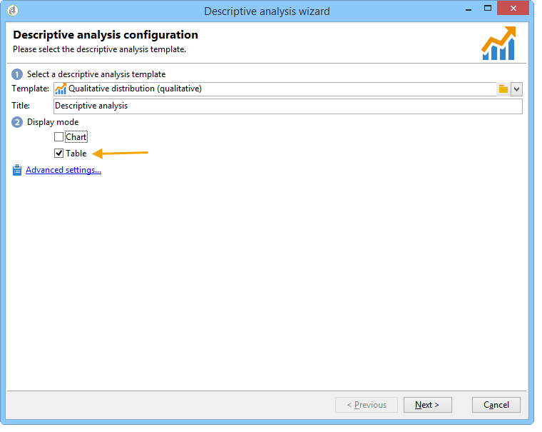

# Casos de uso{#use-cases}


## Análise de uma população {#analyzing-a-population}

O exemplo a seguir permite explorar a população direcionada por um conjunto de boletins informativos usando o assistente de análise descritiva.

As etapas de implementação são detalhadas abaixo, enquanto uma lista completa de opções e descrições está disponível nas outras seções deste capítulo.

### Identificação de uma população a ser analisada {#identifying-the-population-to-analyze}

Neste exemplo, queremos explorar a população do target dos deliveries incluídos na pasta **Newsletters**.

Para fazer isso, selecione os deliveries relacionadas e clique com o botão direito do mouse e selecione **[!UICONTROL Action > Explore the target...]**.


### Seleção de um tipo de análise {#selecting-a-type-of-analysis}

Na primeira etapa do assistente, é possível selecionar o template de análise descritiva a ser usado. Por padrão, o Adobe Campaign oferece dois templates: **[!UICONTROL Qualitative distribution]** e **[!UICONTROL Quantitative distribution]**. Para obter mais informações, consulte a seção [Configuração do template de distribuição qualitativa](../../reporting/using/using-the-descriptive-analysis-wizard.md#configuring-the-qualitative-distribution-template). As várias renderizações são apresentadas na seção [Sobre análise descritiva](../../reporting/using/about-descriptive-analysis.md).

Para este exemplo, selecione o template **[!UICONTROL Qualitative distribution]** e escolha uma exibição com um gráfico e tabela (matriz). Nomeie o relatório (&quot;Análise descritiva&quot;) e clique em **[!UICONTROL Next]**.


### Seleção de exibição de variáveis {#selecting-the-variables-to-display}

A próxima etapa permite selecionar os dados a serem exibidos na tabela.

Clique no link **[!UICONTROL Add...]** para selecionar a variável com os dados que serão exibidos. Aqui queremos exibir as cidades dos recipients do delivery em uma linha:


As colunas exibirão o número de compras por empresa. Neste exemplo, as quantidades são agregadas no campo de **compras da Web**.

Aqui, queremos definir compartimentalização dos resultados para esclarecer sua exibição. Para fazer isso, selecione a opção de compartimentalização **[!UICONTROL Manual]** e defina as classes de cálculo dos segmentos a serem exibidos:


Em seguida, clique em **[!UICONTROL Ok]** para aprovar a configuração.

Depois que as linhas e colunas tiverem sido definidas, é possível alterar, mover ou excluí-las usando a barra de ferramentas.


### Definição do formato de exibição {#defining-the-display-format}

A próxima etapa do assistente permite selecionar o tipo de gráfico que deseja gerar.

Nesse caso, escolha o histograma.


As configurações possíveis dos diferentes gráficos estão detalhadas na seção [Opções do gráfico de relatório de análise](../../reporting/using/processing-a-report.md#analysis-report-chart-options).

### Configuração da estatística a ser calculada {#configuring-the-statistic-to-calculate}

Em seguida, especifique os cálculos a serem aplicados aos dados coletados. Por padrão, o assistente de análise descritiva executa uma contagem simples dos valores.

Esta janela permite definir a lista de estatísticas a serem calculadas.


Para criar uma nova estatística, clique no botão **[!UICONTROL Add]**. Para obter mais informações, consulte [Cálculo de estatística](../../reporting/using/using-the-descriptive-analysis-wizard.md#statistics-calculation).

### Visualização e uso do relatório {#viewing-and-using-the-report}

A última etapa do assistente exibe a tabela e o gráfico.

É possível armazenar, exportar ou imprimir dados usando a barra de ferramentas acima da tabela. Para obter mais informações, consulte [Processamento de um relatório](../../reporting/using/processing-a-report.md).


## Análise de dados qualitativa {#qualitative-data-analysis}

### Exemplo de exibição de gráfico {#example-of-a-chart-display}

**Target**: gerar um relatório de análise no local de clientes em potencial ou de clientes.

1. Abra o assistente de análise descritiva e selecione somente **[!UICONTROL Chart]**.

   

   Clique em **[!UICONTROL Next]** para aprovar esta etapa.

1. Em seguida, selecione a opção **[!UICONTROL 2 variables]** e especifique que o **[!UICONTROL First variable (abscissa)]** se refere ao status do recipient (prospectos/clientes) e a segunda variável se refere ao país.
1. Selecione **[!UICONTROL Cylinders]** como um tipo.

   

1. Clique em **[!UICONTROL Next]** e saia da estatística padrão **[!UICONTROL Simple count]**.
1. Clique em **[!UICONTROL Next]** para exibir o relatório.

   

   Passe o mouse sobre uma barra para ver o número exato de clientes ou prospectos desse país.

1. Habilite ou desabilite a exibição de um dos países com base na legenda.

   

### Exemplo de exibição de tabela {#example-of-a-table-display}

**Target**: analisar domínios de email de empresas.

1. Abra o assistente de análise descritiva e selecione somente o modo de visualização **[!UICONTROL Array]**.

   

   Clique no botão **[!UICONTROL Next]** para aprovar essa etapa.

1. Selecione a variável **[!UICONTROL Company]** como uma coluna e a variável **[!UICONTROL Email domain]** como uma linha.
1. Mantenha a opção **[!UICONTROL By rows]** para orientação de estatística: o cálculo de estatística será exibido à direita da variável **[!UICONTROL Email domain]**.

   

   Clique em **[!UICONTROL Next]** para aprovar esta etapa.

1. Então insira a estatística a ser calculada: mantenha a contagem padrão e crie uma nova estatística. Para fazer isso, clique em **[!UICONTROL Add]** e selecione **[!UICONTROL Total percentage distribution]** como operador.

   

1. Insira um rótulo para a estatística de forma que não haja um campo em branco quando o relatório for exibido.

   

1. Clique em **[!UICONTROL Next]** para exibir o relatório.

   

1. Depois que o relatório de análise for gerado, você poderá adaptar a exibição de acordo com suas necessidades sem alterar a configuração. Por exemplo, é possível alternar os eixos: clique com o botão direito do mouse nos nomes de domínio e selecione **[!UICONTROL Turn]** no menu de atalho.

   

   A tabela exibe as informações da seguinte maneira:

   

## Análise de dados quantitativos {#quantitative-data-analysis}

**Target**: gerar um relatório de análise quantitativa sobre a idade do recipient.

1. Abra o assistente de análise descritiva e selecione **[!UICONTROL Quantitative distribution]** na lista suspensa.

   

   Clique no botão **[!UICONTROL Next]** para aprovar essa etapa.

1. Selecione a variável **[!UICONTROL Age]** e insira seu rótulo. Especifique se ele é ou não um inteiro, e clique em **[!UICONTROL Next]**.

   

1. Exclua as estatísticas **[!UICONTROL Deciles]**, **[!UICONTROL Distribution]** e **[!UICONTROL Sum]**: elas não são necessárias aqui.

   

1. Clique em **[!UICONTROL Next]** para exibir o relatório.

   

## Análise do target de transição em um workflow {#analyzing-a-transition-target-in-a-workflow}

**Target**: gerar relatórios sobre a população de um workflow de criação de target.

1. Abra o workflow para criação de target desejado.
1. Clique com o botão direito do mouse em uma transição que aponte para a tabela de recipients.
1. Selecione **[!UICONTROL Analyze target]** no menu suspenso para abrir a janela de análise descritiva.

   

1. Neste ponto, é possível selecionar a opção **[!UICONTROL Existing analyses and reports]** e usar os relatórios criados anteriormente (consulte [Reutilização de relatórios e análises existentes](../../reporting/using/processing-a-report.md#re-using-existing-reports-and-analyses)) ou criar uma nova análise descritiva. Para fazer isso, deixe a opção **[!UICONTROL New descriptive analysis from a template]** selecionada por padrão.

   O restante da configuração é o mesmo para todas as análises descritivas.

### Recomendações de análise do target {#target-analyze-recommendations}

A análise de uma população em um workflow requer que a população ainda esteja presente na transição. Se o workflow for iniciado, o resultado relacionado à população pode ser removido da transição. Para executar uma análise, é possível:

* Desanexar a transição da atividade de destino e iniciar o workflow para torná-lo ativo. Quando a transição começar a piscar, inicie o assistente da forma normal.

   

* Modifique as propriedades do workflow selecionando a opção **[!UICONTROL Keep the result of interim populations between two executions]**. Isso permite iniciar uma análise da transição de sua escolha, mesmo que o workflow tenha terminado.

   

   Se a população foi removida da transição, uma mensagem de erro solicita selecionar a opção relacionada antes de iniciar o assistente de análise descritiva.

   

>[!CAUTION]
>
>A opção **[!UICONTROL Keep the result of interim populations between two executions]** só deve ser usada em fases de desenvolvimento, mas nunca para um ambiente em produção.\
>As populações interinas são automaticamente limpas quando o prazo de retenção é atingido. Esse prazo é especificado na guia de propriedades **[!UICONTROL Execution]** do workflow.

## Análise de logs de rastreamento do recipient {#analyzing-recipient-tracking-logs}

O assistente de análise descritiva pode gerar relatórios sobre outras tabelas de trabalho. Isso significa poder analisar logs do delivery criando um relatório dedicado.

Neste exemplo, queremos analisar a taxa de reatividade dos recipients do boletim informativo.

Para fazer isso, siga as etapas abaixo:

1. Abra o assistente de análise descritiva via menu **[!UICONTROL Tools > Descriptive analysis]** e altere a tabela de trabalho padrão. Selecione **[!UICONTROL Recipient tracking log]** e adicione um filtro para excluir provas e incluir boletins informativos.

   

   Selecione uma exibição de tabela e clique em **[!UICONTROL Next]**.

1. Na próxima janela, especifique que a análise aborda deliveries.

   

   Aqui, os rótulos de delivery serão exibidos na primeira coluna.

1. Exclua a contagem padrão e crie três estatísticas para configurar as estatísticas a serem exibidas na tabela.

   Aqui, para cada boletim informativo, a tabela mostrará: o número de aberturas, o número de cliques, a taxa de reatividade (como porcentagem).

1. Adicione uma estatística para contar o número de cliques: defina o filtro relevante na guia **[!UICONTROL Filter]**.

   

1. Então clique na guia **[!UICONTROL General]** para renomear o rótulo da estatística e o alias:

   

1. Adicione uma segunda estatística para contar o número de aberturas:

   

1. Depois, clique na guia **[!UICONTROL General]** para renomear o rótulo da estatística e alias:

   

1. Adicione a terceira estatística e selecione o operador **[!UICONTROL Calculated field]** para medir a taxa de reatividade.

   

   Vá para o campo **[!UICONTROL User function]** e insira a seguinte fórmula:

   ```
   @clic / @open * 100
   ```

   Adapte o rótulo da estatística conforme mostrado abaixo:

   

   Ao final, especifique se os valores são mostrados como uma porcentagem: para isto, desmarque a opção **[!UICONTROL Default formatting]** na guia **[!UICONTROL Advanced]** e selecione **[!UICONTROL Percentage]** sem um ponto decimal.

   

1. Clique em **[!UICONTROL Next]** para exibir o relatório.

   

## Análise de logs de exclusão de delivery {#analyzing-delivery-exclusion-logs}

Se a análise aborda um delivery, é possível analisar a população excluída. Para fazer isso, selecione os deliveries a serem analisados e clique com o botão direito do mouse para acessar o menu **[!UICONTROL Action > Explore exclusions]**.


Isso o levará ao assistente de análise descritiva e a análise abordará os logs de exclusão de recipients.

Por exemplo, é possível exibir os domínios de todos os endereços excluídos e classificá-los por data de exclusão.


Isso criaria o seguinte tipo de relatório:


