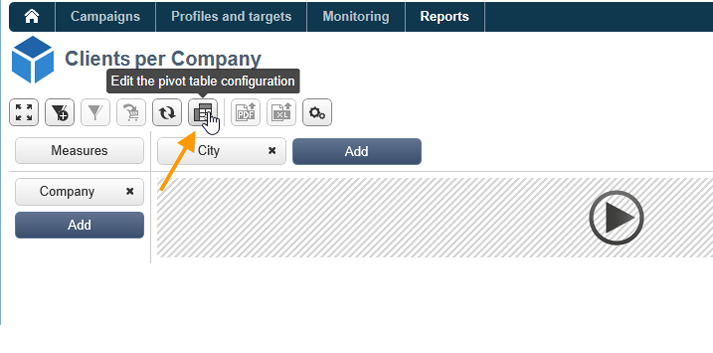

# Uso de cubos para exploração de dados{#using-cubes-to-explore-data}

O Marketing Analytics facilita a criação de relatórios e a identificação e seleção de dados do banco de dados por meio dos cubos. Isso permite:

* Criar relatórios com base em cubos. O processo é detalhado em: [Explorar os dados em um relatório](#exploring-the-data-in-a-report).
* Coletar os dados no banco de dados e agrupá-los em listas, por exemplo, para identificar e criar targets e deliveries. Para obter mais informações, consulte [Criação de uma população do target](#building-a-target-population).
* Insira uma tabela dinâmica em um relatório, faça referência a um cubo existente nele. Para obter mais informações, consulte [Inserir uma tabela dinâmica em um relatório](#inserting-a-pivot-table-into-a-report).

>[!NOTE]
>
>O Marketing Analytics é necessário para criar ou modificar cubos. Para obter mais informações, consulte [Sobre cubos](../../reporting/using/about-cubes.md).

## Exploração de dados em um relatório {#exploring-the-data-in-a-report}

### Etapa 1 - Criação de um relatório baseado em um cubo {#step-1---creating-a-report-based-on-a-cube}

Para criar um relatório com base em um cubo, clique no botão **[!UICONTROL Create]** na guia **[!UICONTROL Reports]** e selecione o cubo que deseja usar.

O processo é detalhado em: [Criação de um relatório com base em um cubo](../../reporting/using/creating-indicators.md#creating-a-report-based-on-a-cube).

### Etapa 2 - Seleção de linhas e colunas {#step-2---selecting-lines-and-columns}

A exibição padrão mostra as duas primeiras dimensões do cubo (idade e cidade, neste caso).

Os botões **[!UICONTROL Add]** em cada eixo permitem adicionar dimensões.

1. Selecione as dimensões que deseja exibir nas linhas e colunas da tabela. Para fazer isso, arraste e solte as dimensões disponíveis conforme mostrado abaixo:
1. Selecione as dimensões que deseja adicionar à tabela na lista:

   

1. Em seguida, selecione os parâmetros dessa dimensão.

   

   Os parâmetros dependem do tipo de dados da dimensão selecionada.

   Por exemplo, para datas, vários níveis podem estar disponíveis. Para obter mais informações, consulte [Exibição de medidas](../../reporting/using/concepts-and-methodology.md#displaying-measures).

   As seguintes opções estão disponíveis nesse caso:

   

   É possível:

   * Expandir dados durante o carregamento: os valores serão exibidos por padrão sempre que o relatório for atualizado (valor padrão: não).
   * Exibir o total no final da linha: quando os dados são exibidos em colunas, uma opção adicional permite exibir o total no final da linha: uma coluna é adicionada à tabela (valor padrão: sim).
   * Aplicar uma classificação: os valores da coluna podem ser classificados de acordo com o valor, rótulo ou com base em uma medida (valor padrão: por valor).
   * Exibir os valores em ordem crescente (a-z, 0-9) ou decrescente (z-a, 9-0).
   * Alterar o número de colunas a serem exibidas ao carregar (padrão: 200).

1. Clique em **[!UICONTROL Ok]** para confirmar: a dimensão é adicionada às dimensões existentes.

   O banner amarelo acima da tabela mostra que você fez alterações: clique no botão **[!UICONTROL Save]** para salvá-las.

   

### Etapa 3 - Configuração das medidas para exibir {#step-3---configuring-the-measures-to-display}

Depois que as linhas e as colunas forem implementadas, indique as medidas que deseja exibir, bem como o modo de exibição.

Por padrão, apenas uma medida é exibida. Para adicionar ou configurar medidas:

1. Clique no botão **[!UICONTROL Measures]**.

   

1. O botão **[!UICONTROL Use a measure]** permite selecionar uma das medidas existentes.

   

   Selecione as informações que deseja exibir e o tipo de formatação. A lista de opções depende do tipo da medida configurada.

   

   A configuração de medida geral também está disponível por meio do ícone **[!UICONTROL Edit the configuration of the pivot table]** no cabeçalho.

   

   Você pode então escolher se exibe ou não os rótulos de medida. Para obter mais informações, consulte [Configuração da exibição](../../reporting/using/concepts-and-methodology.md#configuring-the-display).

1. É possível criar novas medidas usando as existentes. Para fazer isso, clique **[!UICONTROL Create a measure]** e configure-a.

   

   Os seguintes tipos de medidas estão disponíveis:

   * Combinação de medidas: esse tipo de medida permite construir a nova medida utilizando as existentes:

      Os operadores disponíveis são: soma, diferença, multiplicação e taxa.

   * Proporção: esse tipo de medida permite calcular o número de registros medidos para determinada dimensão. Você pode calcular a proporcionalidade com base em uma dimensão ou subdimensão.
   * Variação: essa medida permite calcular a variação em valores de um nível.
   * Desvio padrão: esse tipo de medida permite calcular desvios em cada grupo de células em comparação à média dos valores. Por exemplo, você pode comparar o volume de compra para todos os segmentos existentes.

   A medida criada é adicionada ao relatório.

   

   Após criar uma medida, você pode editá-la e, se necessário, alterar sua configuração. Para fazer isso, clique no botão **[!UICONTROL Measures]** e vá para a guia da medida que deseja editar.

   Em seguida, clique em **[!UICONTROL Edit the dynamic measure]** para acessar o menu de configurações.

## Criação de uma população do target {#building-a-target-population}

A criação de relatórios usando cubos permitem coletar dados da tabela e salvá-los em uma lista.

Para fazer isso, adicione-os a um carrinho e processe seu conteúdo.

Para agrupar uma população em uma lista, siga as etapas abaixo:

1. Clique nas células que contêm a população a ser coletada para selecioná-las e depois clique no ícone **[!UICONTROL Add to cart]**.

   

   Faça isso quantas vezes forem necessárias para coletar vários perfis.

1. Clique no botão **[!UICONTROL Show cart]** para exibir seu conteúdo antes de executar a exportação.

   

1. O botão **[!UICONTROL Export]** permite agrupar os itens do carrinho em uma lista.

   Você precisa especificar o nome da lista e o tipo de exportação a ser executada.

   

   Clique em **[!UICONTROL Start]** para executar a exportação.

1. Uma vez concluída a exportação, uma mensagem confirma sua execução e o número de registros processados.

   

   Você pode salvar o conteúdo do carrinho ou esvaziá-lo.

   A lista relevante é acessada pela guia **[!UICONTROL Profiles and targets]**.

   

## Inserção de uma tabela dinâmica em um relatório {#inserting-a-pivot-table-into-a-report}

Para criar uma tabela e explorar os dados em um cubo, siga as etapas abaixo:

1. Crie um novo relatório com uma única página e insira uma tabela dinâmica. Para obter mais informações, consulte [esta página](../../reporting/using/creating-a-table.md#creating-a-breakdown-or-pivot-table).

   

1. Na guia **[!UICONTROL Data]** da página, selecione um cubo para processar as dimensões que ele contém e exibir medidas calculadas.

   

   Isso permite criar o relatório a ser exibido. Para obter mais informações, consulte [Etapa 2 - Seleção de linhas e colunas](#step-2---selecting-lines-and-columns).
