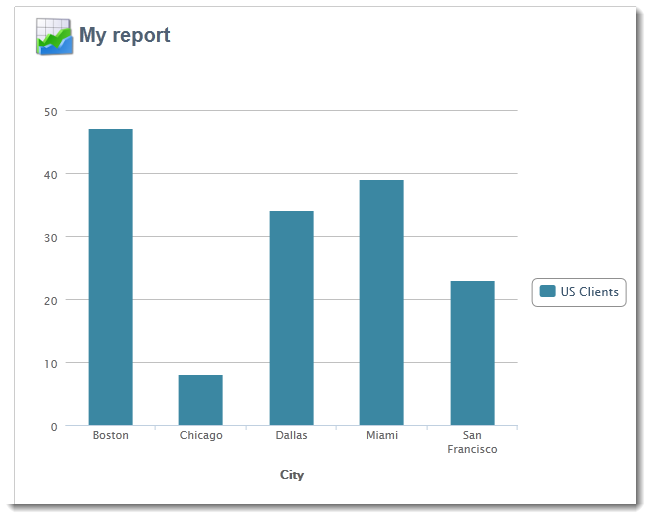
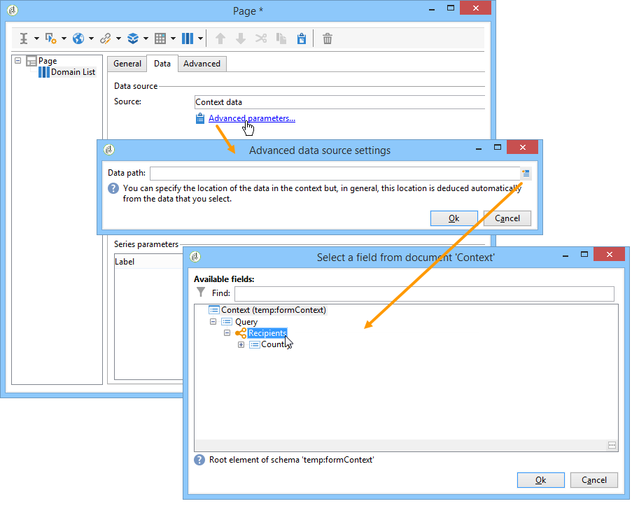

# Usar o contexto em seus relatórios{#using-the-context}

Quando quiser representar dados na forma de **[!UICONTROL tables]** ou **[!UICONTROL charts]**, eles poderão ser obtidos a partir de duas fontes: uma nova consulta (consulte [Definir um filtro direto sobre os dados](#defining-a-direct-filter-on-data)) ou o contexto do relatório (consulte [Usar dados de contexto](#using-context-data)).

## Definir um filtro direto sobre os dados {#defining-a-direct-filter-on-data}

### Filtrar dados {#filtering-data}

A utilização de uma atividade do tipo **[!UICONTROL Query]** não é obrigatória ao criar um relatório. Os dados podem ser filtrados diretamente nas tabelas e nos gráficos que compõem o relatório.

Isso permite selecionar os dados a serem exibidos no relatório diretamente por meio da atividade **[!UICONTROL Page]** do relatório.

Para fazer isso, clique no link **[!UICONTROL Filter data...]** na guia **[!UICONTROL Data]**: este link permite acessar o editor de expressão para definir uma consulta nos dados que serão analisados.

### Exemplo: usar um filtro em um gráfico {#example--use-a-filter-in-a-chart}

No exemplo a seguir, queremos que o gráfico mostre apenas perfis de recipients que vivem na França e que tenham efetuado uma compra durante o ano.

Para definir esse filtro, coloque uma página no gráfico e edite-o. Clique em **[!UICONTROL Filter data]** e crie o filtro que corresponde aos dados que deseja exibir. Para obter mais informações sobre criação de queries no Adobe Campaign, consulte [esta seção](../../platform/using/about-queries-in-campaign.md).

Aqui, queremos exibir a análise por cidade dos recipients selecionados.

A renderização terá esta aparência:

### Exemplo: usar um filtro em uma tabela dinâmica {#example--use-a-filter-in-a-pivot-table}

Neste exemplo, o filtro permite exibir somente clientes não parisienses na tabela dinâmica, sem usar outra query antecipadamente.

Siga as etapas abaixo:

1. Coloque uma página no gráfico e edite-o.
1. Crie uma tabela dinâmica.
1. Vá para a guia **[!UICONTROL Data]** e selecione o cubo a ser usado.
1. Clique no link **[!UICONTROL Filter data...]** e defina a seguinte query para remover a Adobe da lista de empresas.

   

Somente os recipients que atenderem aos critérios de filtragem aparecerão no relatório.

## Usar dados de contexto {#using-context-data}

Para representar dados no formulário de um **[!UICONTROL table]** ou um **[!UICONTROL chart]**, os dados podem vir do contexto do relatório.

Na página que contém a tabela ou o gráfico, a guia **[!UICONTROL Data]** permite selecionar a fonte de dados.

* A opção **[!UICONTROL New query]** permite criar uma consulta para coletar dados. Para obter mais informações, consulte [Definir um filtro direto sobre os dados](#defining-a-direct-filter-on-data).
* A opção **[!UICONTROL Context data]** permite usar os dados de entrada: o contexto do relatório coincide com as informações contidas na transição de entrada da página que contém o gráfico ou a tabela. Esse contexto pode, por exemplo, conter dados coletados por uma atividade **[!UICONTROL Query]** colocada antes da atividade **[!UICONTROL Page]** e para a qual é necessário especificar a tabela e os campos que o relatório aborda.

Por exemplo, em uma caixa de query, crie a seguinte query para os recipients:

Em seguida, indique a fonte de dados no relatório, neste caso: **[!UICONTROL Data from the context]**.

O local de dados é inferido automaticamente. Se necessário, é possível forçar o caminho de dados.

Quando selecionar os dados que as estatísticas abordarão, os campos disponíveis correspondem aos dados especificados na query.

