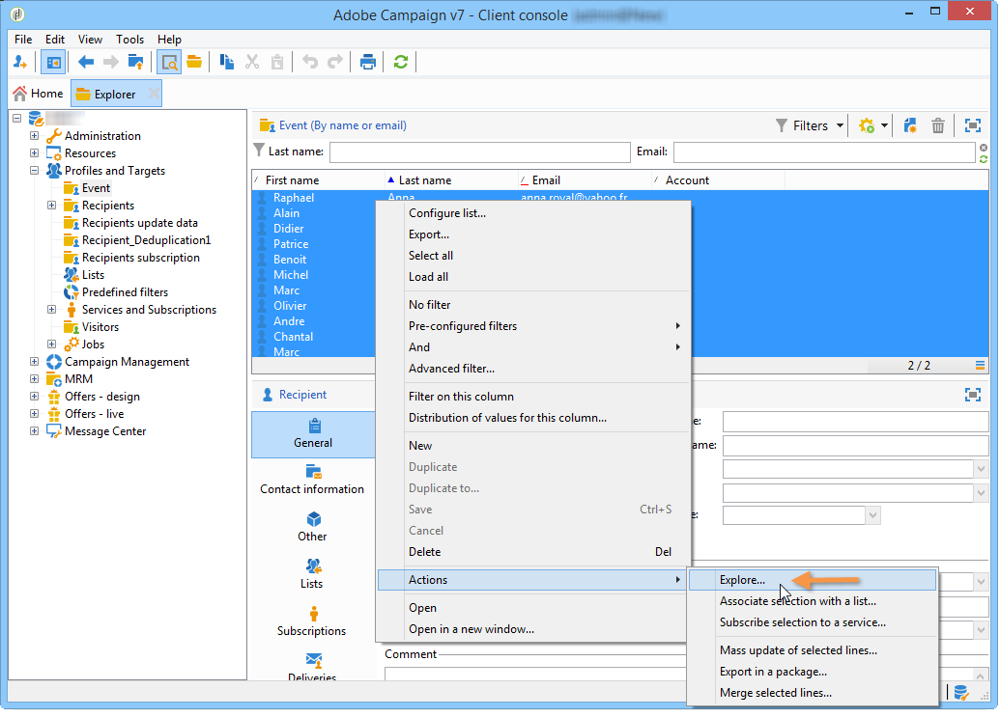

# Usar o assistente de análise descritiva{#using-the-descriptive-analysis-wizard}

Para criar um relatório de análise descritiva, use o assistente dedicado. A configuração depende dos dados a serem analisados e da renderização desejada.

## Analisar dados no banco de dados {#analyzing-data-in-the-database}

O assistente de análise descritiva pode ser iniciado por meio do menu **[!UICONTROL Tools > Descriptive analysis]**: nesse caso, a análise inclui os recipients por padrão (**nms:recipient**). Aplica-se a todos os dados do banco de dados do Adobe Campaign.

Para analisar uma tabela diferente da dos recipients padrão (**nms:recipient**), clique no link **[!UICONTROL Advanced settings...]** na última etapa do assistente e selecione a tabela que corresponde às suas configurações, neste caso **cus:individual**:

Se quiser produzir estatísticas sobre parte dos dados, é possível definir um filtro. Para fazer isso, clique no link **[!UICONTROL Advanced settings...]** e defina o filtro a ser aplicado, conforme mostrado abaixo:

A análise só abordará os recipients do banco de dados com 16 anos de idade ou mais e que moram em Londres.

## Analisar um conjunto de dados {#analyzing-a-set-of-data}

É possível usar o assistente de análise descritiva por meio de um contexto diferente: uma lista, uma transição de workflow, um ou mais deliveries, uma seleção de recipients, etc.

Ele pode ser acessado por vários nós da árvore do Adobe Campaign que apontam para a tabela de recipients.

Abra o assistente de análise descritiva selecionando os itens e clicando com o botão direito. Somente os dados selecionados serão analisados.

* Para um conjunto de **recipients**, selecione os recipients que serão analisados, clique com o botão direito do mouse e selecione **[!UICONTROL Actions > Explore...]**, conforme mostrado acima. Se um filtro for aplicado à lista de recipients, somente seu conteúdo será analisado.

   Para selecionar todos os recipients na pasta ou no filtro atual, use o atalho CTRL+A. Isso significa selecionar até mesmo os recipients não mostrados.

   Para obter um exemplo da análise descritiva dos recipients, consulte [Análise qualitativa de dados](../../reporting/using/use-cases.md#qualitative-data-analysis).

* No contexto de um **workflow**, coloque o cursor em uma transição que aponta para a tabela de recipients, clique com o botão direito do mouse e selecione **[!UICONTROL Analyze target]**. Para obter mais informações, consulte o exemplo em [Analisar um público alvo de transição em um fluxo de trabalho](../../reporting/using/use-cases.md#analyzing-a-transition-target-in-a-workflow).
* Para **listas**, selecione uma ou mais listas e aplique o mesmo processo dos recipients.
* No contexto de um **delivery**, selecione os deliveries cujo target deseja analisar, clique com o botão direito do mouse e selecione **[!UICONTROL Actions > Explore the target]**, conforme mostrado abaixo:

   

   Exemplos de análises descritivas para entregas são fornecidos aqui: [Analisar uma população](../../reporting/using/use-cases.md#analyzing-a-population), e aqui: [Analisar registros de rastreamento de recipients](../../reporting/using/use-cases.md#analyzing-recipient-tracking-logs).

## Configurar o modelo de distribuição qualitativa {#configuring-the-qualitative-distribution-template}

O modelo **[!UICONTROL Qualitative distribution]** permite criar estatísticas em todos os tipos de dados (por exemplo: nome da empresa, domínio de email).

As opções de configuração disponíveis para um relatório criado por meio do modelo **[!UICONTROL Qualitative distribution]** são detalhadas em [Exibir dados na tabela](#displaying-data-in-the-table). Um exemplo completo é detalhado em [Analisar uma população](../../reporting/using/use-cases.md#analyzing-a-population).

Ao utilizar o assistente de análise descritiva para analisar seus dados, as opções disponíveis dependem das configurações escolhidas. Veja os detalhes abaixo.

### Compartimentalização de dados {#data-binning}

Quando selecionar as variáveis a serem exibidas, é possível definir compartimentalização de dados, em outras palavras, configurar critérios de agrupamento para os dados selecionados.

>[!NOTE]
>
>Quando o campo relacionado ao cálculo é calculado usando uma agregação, marque **[!UICONTROL The data is already aggregated]** para melhorar o desempenho.

As opções serão diferentes dependendo do conteúdo do campo:

* **[!UICONTROL None]**: essa opção permite exibir todos os valores disponíveis para a variável, sem compartimentalização.

   >[!CAUTION]
   >
   >Essa opção deve ser usada com cuidado: pode ter um grande impacto no relatório e no desempenho da máquina.

* **[!UICONTROL Auto]**: essa opção permite exibir os valores n mais frequentemente representados. Eles são calculados automaticamente e cada um representa uma porcentagem das variáveis comparadas ao número de agrupamentos. Para valores numéricos, o Adobe Campaign gera automaticamente n classes para classificar os dados.
* **[!UICONTROL Manual]**: essa opção funciona como a opção **[!UICONTROL Auto]**, exceto que é possível definir esses valores manualmente. Para fazer isso, clique no botão **[!UICONTROL Add]** à direita da tabela de valores.

   Os valores podem ser inicializados automaticamente pelo Adobe Campaign antes da personalização: para fazer isso, insira o número de agrupamentos que deseja gerar e clique no link **[!UICONTROL Initialize with]**, conforme mostrado abaixo:

   

   Em seguida, adapte o conteúdo às necessidades:

   

   Dependendo do nível de precisão desejado, os campos contendo datas podem ser agrupados por tempo, dia, mês, ano, etc.

   

* **[!UICONTROL Modulo]**: permite criar grupos de valores no caso de valores numéricos. Por exemplo, um módulo com um valor de 10 permite criar um intervalo de valores que variam de dez em dez.

   

   Esse exemplo permite visualizar o detalhamento dos recipients por faixa etária.

   

### Exibir dados na tabela {#displaying-data-in-the-table}

Use a barra de ferramentas para personalizar a exibição das variáveis na tabela: exclua uma coluna, exiba dados em linhas em vez de colunas, mova uma coluna para a esquerda ou direita, exiba ou altere o cálculo de valores.

A seção superior da janela permite selecionar as configurações de exibição.

É possível exibir ou ocultar o nome das estatísticas e subtotais e escolher a orientação das estatísticas. Para obter mais informações, consulte [Configurações da exibição de relatório de análise](../../reporting/using/processing-a-report.md#analysis-report-display-settings).

### Exibir dados no gráfico {#displaying-data-in-the-chart}

Na primeira etapa do assistente de análise descritiva, é possível optar por exibir os dados no formulário do gráfico somente sem uma tabela. Nesse caso, a seleção variável deve ser feita ao configurar o gráfico. Primeiro, é necessário selecionar o número de variáveis a serem exibidas e selecionar os campos do banco de dados relevante.

Em seguida, selecione o tipo de gráfico desejado.

>[!NOTE]
>
>É possível exibir as variáveis em um gráfico e uma tabela ao mesmo tempo. Para fazer isso, insira as variáveis na janela **[!UICONTROL Table configuration]**. Clique em **[!UICONTROL Next]** e selecione o tipo de gráfico na janela de configuração do gráfico. Se subdimensões forem definidas na tabela, elas não serão exibidas no gráfico.

Clique no link **[!UICONTROL Variants]** para modificar as propriedades do gráfico.

As opções oferecidas dependem do tipo de gráfico selecionado. Para obter mais informações, consulte [esta página](../../reporting/using/creating-a-chart.md#chart-types-and-variants).

### Cálculo de estatísticas {#statistics-calculation}

O assistente de análise descritiva permite calcular vários tipos de estatística dos dados. Por padrão, somente uma contagem simples é configurada.

Clique em **[!UICONTROL Add]** para criar uma nova estatística.

As seguintes operações são possíveis:

* **[!UICONTROL Count]** para contar todos os valores não nulos do campo a ser agregado, incluindo valores duplicados (do campo de agregação),
* **[!UICONTROL Average]** para calcular a média dos valores em um campo numérico,
* **[!UICONTROL Minimum]** para calcular o mínimo dos valores em um campo numérico,
* **[!UICONTROL Maximum]** para calcular o máximo dos valores em um campo numérico,
* **[!UICONTROL Sum]** para calcular a soma dos valores em um campo numérico,
* **[!UICONTROL Standard deviation]** para calcular como os valores retornados estão distribuídos em relação à média,
* **[!UICONTROL Row percentage distribution]** para calcular a proporção do valor em uma coluna e o valor em uma linha (disponível somente para tabelas),
* **[!UICONTROL Column percentage distribution]** para calcular a proporção do valor em uma linha para o valor em uma coluna (disponível somente para tabelas),
* **[!UICONTROL Total percentage distribution]** para calcular a distribuição de recipients relacionados aos valores,

   

* **[!UICONTROL Calculated field]** para criar um operador personalizado (disponível somente para tabelas). O campo **[!UICONTROL User function]** permite inserir o cálculo a ser aplicado aos dados.

   Exemplo: cálculo do valor médio de compra por cliente com base no país e na origem

   

   Para exibir as informações acima em uma tabela, é preciso criar um campo calculado para armazenar o valor médio de compra por cliente.

   Para fazer isso:

   1. Calcule o total de compras.

      

   1. Esta estatística não será exibida na tabela. É necessário desmarcar a opção **[!UICONTROL Display in the table]** da guia **[!UICONTROL Advanced]**.

      

   1. Crie uma nova estatística do tipo **[!UICONTROL Calculated field]** e insira a seguinte fórmula no campo **[!UICONTROL User function]**: **@purchases/@count**.

      

### Exibir o relatório {#displaying-the-report}

A última etapa do assistente permite exibir o relatório, ou seja, a tabela ou o gráfico como foram configurados.

Quando o relatório contém uma tabela, a célula do resultado do cálculo é colorida. Quanto maior o resultado, mais intensa será a cor.

É possível alterar o layout dos resultados. Para fazer isso, clique com o botão direito do mouse na variável correspondente e selecione a entrada do menu de atalho.

Quando o relatório inclui um gráfico, os rótulos da legenda permitem filtrar as informações exibidas: clique em um rótulo para ativar/desativar exibição no gráfico.

## Configurar o modelo de distribuição quantitativa {#configuring-the-quantitative-distribution-template}

Para gerar uma análise descritiva por conta própria, selecione a opção **New descriptive analysis from a template** se não estiver definida por padrão.

O template **[!UICONTROL Quantitative distribution]** que permite gerar estatísticas em dados que podem ser medidos ou contados (por exemplo, valor da fatura, idade dos recipients).

O modo de configuração de um relatório de análise criado por meio do template **[!UICONTROL Quantitative distribution]** é detalhado em um exemplo de implementação [Quantitative data analysis](../../reporting/using/use-cases.md#quantitative-data-analysis).

As opções disponíveis ao utilizar o assistente de análise descritiva para criar um relatório quantitativo são detalhadas abaixo.

Comece selecionando a variável que os cálculos abordarão:

Por padrão, o Adobe Campaign oferece uma série de estatísticas a serem calculadas para os dados selecionados. É possível alterar essa lista, adicionar a ela ou excluir estatísticas, dependendo das necessidades.

As seguintes operações são possíveis:

* **[!UICONTROL Count]** para contar todos os valores não nulos do campo a ser agregado, incluindo valores duplicados (do campo de agregação),
* **[!UICONTROL Average]** para calcular a média dos valores em um campo numérico,
* **[!UICONTROL Minimum]** para calcular o mínimo dos valores em um campo numérico,
* **[!UICONTROL Maximum]** para calcular o máximo dos valores em um campo numérico.
* **[!UICONTROL Sum]** para calcular a soma dos valores em um campo numérico,
* **[!UICONTROL Standard deviation]** para calcular como os valores do resultado estão distribuídos em relação à média.
* **[!UICONTROL Number of missing values]** para calcular o número de campos numéricos sem valores definidos.
* **[!UICONTROL Decile distribution]** para distribuir os valores do resultado de forma que cada um represente 1/10 dos valores em um campo numérico.
* **[!UICONTROL Custom distribution]** para distribuir os valores do resultado com base em limites definidos pelo usuário.

   O botão **[!UICONTROL Detail...]** permite a edição de uma estatística e, se necessário, a personalização do cálculo ou exibição:

   

   A última etapa do assistente mostra o relatório de análise quantitativa.

   

   Para fazer alterações no relatório, consulte [Processar um relatório](../../reporting/using/processing-a-report.md).
