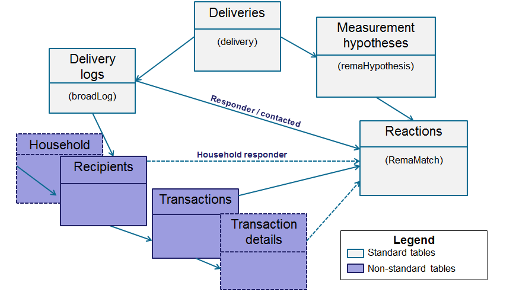
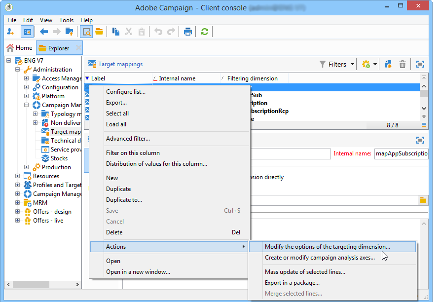
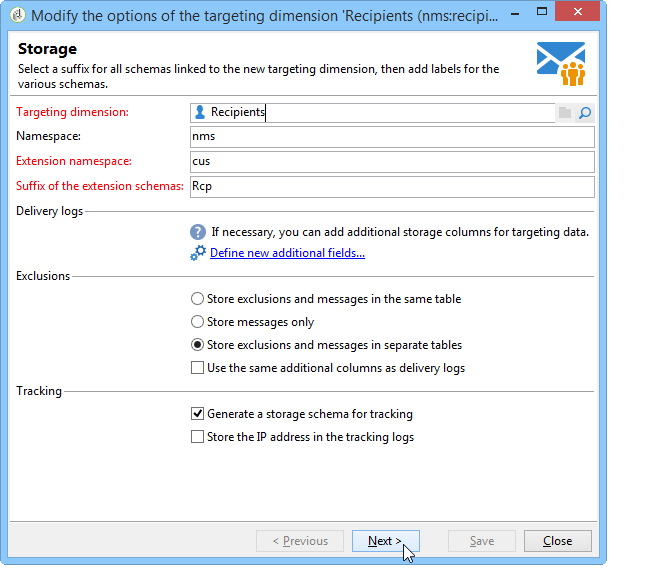
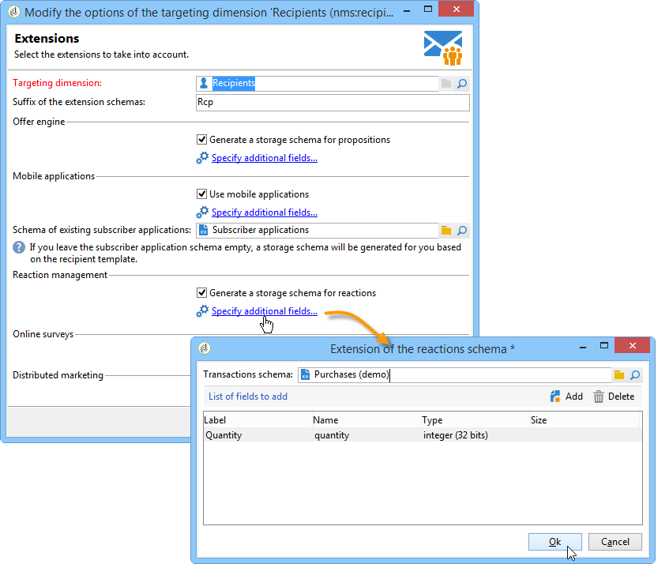

# Configurar o Gestor de respostas do Campaign{#configuration}


Esta seção destina-se às pessoas responsáveis pela configuração do gestor de resposta. Ele assume uma certa quantidade de conhecimento sobre a extensão de esquemas, definição de fluxos de trabalho e programação SQL.

Isso permite o entendimento de como adaptar o modelo de dados padrão à natureza específica de uma tabela de transações para o Adobe Campaign com a tabela de individuais. Esta tabela pode coincidir com a tabela de individuais disponíveis no Adobe Campaign ou com uma tabela diferente.

A hipótese de medição é iniciada pelo fluxo de trabalho do processo de operação (**[!UICONTROL operationMgt]** ). Cada hipótese representa um processo separado executado de forma assíncrona com um status de execução (Editando, Pendente, Concluído, Falha etc.) e controlado por um programador que gerencia as limitações de prioridade, a restrição do número de processos simultâneos, a página de baixo nível de atividades e a execução automática com frequência.

## Configurar esquemas {#configuring-schemas}

>[!CAUTION]
>
>Os esquemas padrão do aplicativo não devem ser modificados, mas é possível usar o mecanismo de extensão de esquema. Caso contrário, os esquemas modificados não serão considerados no momento das atualizações futuras do aplicativo. Isso pode resultar no mau funcionamento durante o uso do Adobe Campaign.

É necessária a integração de aplicativos antes de usar o módulo de reação para definir as várias tabelas (transações, detalhes de transações) que devem ser mensuradas e suas relações com os envios, as ofertas e os individuais.

### Esquemas padrão {#standard-schemas}

O esquema pronto para uso **[!UICONTROL nms:remaMatch]** contém a tabela do log de reação, ou seja, a relação entre individuais, hipótese e tabela de transação. Esse esquema deve ser usado como um esquema de herança para a tabela de destino final dos logs de reação.

O esquema **[!UICONTROL nms:remaMatchRcp]** também vem como um padrão, pois contém o armazenamento dos logs de reação para os destinatários do Adobe Campaign (**[!UICONTROL nms:recipient]** ). Para ser usado, é necessário estender para realizar o mapeamento para uma tabela de transação (onde contém compras, etc.).

### Tabelas e detalhes de transações {#transaction-tables-and-transaction-details}

A tabela de transações deve incluir os links diretos para os individuais.

Também é possível adicionar uma tabela contendo os detalhes da transação. Isso não está diretamente vinculado aos individuais.

Por exemplo, uma tabela de transação está vinculada a um contato (tabela de recebimento) e uma tabela de linhas está vinculada apenas à tabela de recebimento (tabela de detalhes). Então é possível configurar a hipótese diretamente no nível em que a tabela de linha de recebimento está vinculada à tabela de recebimento.

>[!NOTE]
>
>Se você quiser manter o identificador de recebimento que descreve o comportamento esperado na hipótese, é possível estender o modelo da tabela nms:remaMatchRcp para adicionar o identificador a ele (nesse caso, nenhum cálculo de ROI é vinculado a esses campos).

É altamente recomendável adicionar uma data de evento.

O esquema a seguir mostra associações entre diferentes tabelas após a conclusão da configuração:



### Gestor de resposta e destinatários {#response-management-with-adobe-campaign-recipients}

Neste exemplo, uma tabela de compras foi integrada ao módulo do gestor de respostas usando a tabela integrada de destinatários do Adobe Campaign **[!UICONTROL nms:recipient]**.

A tabela de logs de resposta em um destinatário **[!UICONTROL nms:remaMatchRcp]** é estendida para adicionar um link ao esquema da tabela de compras. No exemplo a seguir, a tabela de compra é chamada de **demo:purchase**.

1. Por meio do explorer do Adobe Campaign, selecione **[!UICONTROL Administration]** > **[!UICONTROL Campaign management]** > **[!UICONTROL Target mappings]**.
1. Clique com o botão direito do mouse em **Destinatário**, selecione **[!UICONTROL Actions]** e **[!UICONTROL Modify the options of the targeting dimensions]**.

   

1. É possível personalizar o **[!UICONTROL Extension namespace]** na próxima janela e, em seguida, clique em **[!UICONTROL Next]**.

   

1. Na categoria **[!UICONTROL Response management]**, verifique se a opção **[!UICONTROL Generate a storage schema for reactions]** está marcada.

   Em seguida, clique em **[!UICONTROL Define additional fields...]** para selecionar as tabelas de transações relacionadas e adicionar os campos desejados à extensão do esquema nms:remaMatchRcp.

   

O esquema criado tem a seguinte aparência:

```
<srcSchema _cs="Reactions (Recipients) (cus)" entitySchema="xtk:srcSchema" extendedSchema="nms:remaMatchRcp" 
img="nms:remaMatch.png" implements="xtk:persist" label="Reactions (Recipients)" mappingType="sql"
name="remaMatchRcp" namespace="cus">  
 <element label="Reactions (Recipients)" name="remaMatchRcp">    
  <key internal="true" name="match">      
   <keyfield xlink="hypothesis"/>      
   <keyfield xlink="broadLog"/>      
   <keyfield xlink="proposition"/>    
  </key>    
  <attribute label="Quantity" name="quantity" type="long"/>    
  <element name="purchase" target="demo:purchase" type="link"/>    
  <element name="hypothesis" revLabel="Reactions (Recipients)" revLink="remaMatchRcp"/>    
  <element applicableIf="HasPackage('nms:coreInteraction')" label="Proposition" name="proposition" target="nms:propositionRcp" type="link"/>   
  <element desc="Message (Delivery log)" label="Message" name="broadLog" target="nms:broadLogRcp" type="link"/>    
  <element label="Respondent" name="responder" target="nms:recipient" type="link"/>  
 </element>  
 <createdBy _cs="Administrator (admin)"/>  
 <modifiedBy _cs="Administrator (admin)"/>
</srcSchema>
```

### Gestor de respostas com uma tabela de destinatário personalizada {#response-management-with-a-personalized-recipient-table}

Neste exemplo, uma tabela de compras é integrada ao módulo do gestor de respostas com uma tabela de pessoas que não é a tabela de destinatários disponível no Adobe Campaign.

* Crie um novo esquema de registro de resposta derivado do esquema **[!UICONTROL nms:remaMatch]**.

  Como a tabela de pessoas é diferente da tabela de destinatários do Adobe Campaign, é necessário criar um novo esquema dos logs de resposta com base no esquema **[!UICONTROL nms:remaMatch]**. Em seguida, insira os links para os logs da entrega e a tabela de compras.

  No exemplo a seguir, usaremos o esquema **demo:broadLogPers** e a tabela de transações **demo:purchase**:

  ```
  <srcSchema desc="Linking of a recipient transaction to a hypothesis"    
  img="nms:remaMatch.png" label="Responses on persons" labelSingular="Responses on a person" name="remaMatchPers" namespace="nms">
    <element name="remaMatchPers" template="nms:remaMatch">
      <key internal="true" name="match">
        <keyfield xlink="hypothesis"/>
       <keyfield xlink="purchase"/>
      </key>
  
      <element name="hypothesis" revLabel="Response logs for persons" revLink="remaMatchPers"/>
      <element applicableIf="HasPackage('nms:interaction')" label="Proposition" name="proposition"
               target="demo:propositionPers" type="link"/>
      <element label="Delivery log" name="broadLog" target="demo:broadLogPers" type="link"/>
    </element>
  </srcSchema>
  ```

* Modifique o formulário de hipótese no esquema **[!UICONTROL nms:remaHypothesis]**.

  Por padrão, a lista de logs de resposta é visível nos logs de destinatário. Portanto, é possível modificar o formulário de hipótese para exibir os novos logs de resposta criados durante a etapa anterior.

  Por exemplo:

  ```
   <container type="visibleGroup" visibleIf="[context/@remaMatchStorage]= 'demo:remaMatchPers'">
                <input hideEditButtons="true" img="nms:remaMatch.png" nolabel="true" refresh="true"
                 toolbarCaption="Responses generated by the hypothesis" type="linklist"
                 xpath="remaMatchPers">
            <input xpath="[.]"/>
            <input xpath="@controlGroup"/>
          </input>
     </container> 
  ```

## Gerenciar indicadores {#managing-indicators}

O módulo Gestor de Resposta contém uma lista de indicadores predefinidos. No entanto, é possível adicionar outros indicadores de mensuração personalizados.

Para isso, é possível estender a tabela de hipótese ao inserir dois campos para cada indicador novo:

* o primeiro para a população do target,
* o segundo para o grupo de controle.

Por exemplo:

```
<srcSchema entitySchema="xtk:srcSchema" extendedSchema="nms:remaHypothesis" label="Measurement hypothesis" 
md5="1D4DED54FF8EC2432AED6736EDE6F547" name="remaHypothesis" namespace="demo" xtkschema="xtk:srcSchema">  
    <element name="remaHypothesis">    
        <element name="indicators">      
            <!-- Quantity -->      
            <attribute label="Total contacted" name="contactReactedTotalQuantity" type="long"/>
            <attribute label="Total number of people in the control group" name="proofReactedTotalquantity" type="long"/> 
        </element> 
    </element>
</srcSchema>
```
