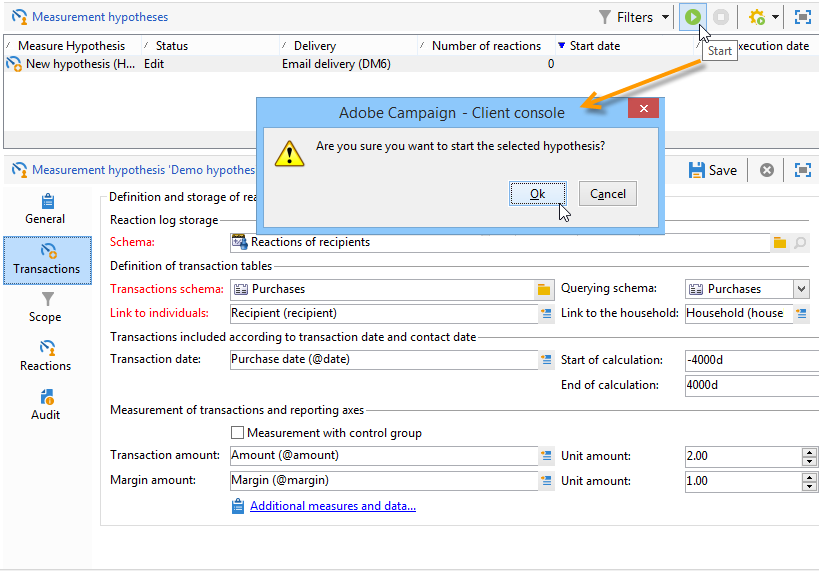
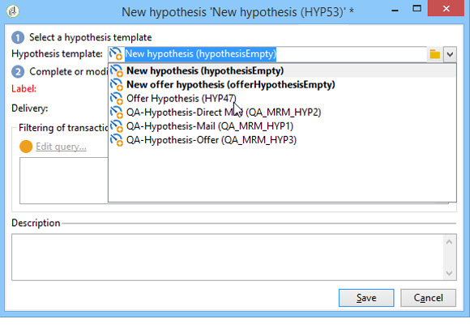

# Criar hipóteses{#creating-hypotheses}

Há várias possibilidades para criar/vincular hipóteses a uma oferta de campanha ou delivery:

* Na pasta **[!UICONTROL Measurement hypotheses]**, criando uma nova hipótese com base em um template existente e vinculando-a a um delivery existente.
* Através da guia **[!UICONTROL Edit]** > **[!UICONTROL Measurement]** em uma campanha.
* Com a opção **[!UICONTROL Measurement]** de um delivery criado de uma campanha.

A hipótese só poderá ser calculada depois que a campanha de marketing tiver sido iniciada e os recipients tiverem recebido o delivery. Se a hipótese for baseada em uma apresentação da oferta, a última necessidade deverá ser apresentada e ainda estar ativa. A oferta e o delivery são criados por meio da pasta **[!UICONTROL Measurement hypotheses]** e se baseiam em um template de hipótese. No entanto, é possível fazer referência a uma hipótese diretamente no delivery ou na campanha, antes que esta tenha início. Nesse caso, as hipóteses serão calculadas automaticamente no momento em que a campanha de marketing tiver início, com base nas configurações de execução. [Saiba mais](hypothesis-templates.md#hypothesis-template-execution-settings)

## Criar uma hipótese em tempo real em um delivery {#creating-a-hypothesis-on-the-fly-on-a-delivery}

Para criar uma hipótese em um delivery existente, aplique o seguinte processo:

>[!NOTE]
>
>Esta operação é possível somente para envios pendentes.

1. Na árvore do Adobe Campaign, acesse **[!UICONTROL Campaign management > Measurement hypotheses]**.
1. Clique no botão **[!UICONTROL New]** ou clique com o botão direito na lista de hipóteses e selecione **[!UICONTROL New]** na lista suspensa.

   

1. Na janela da hipótese, selecione um template criado anteriormente. [Saiba mais](hypothesis-templates.md)

   

   É exibido na tela o contexto da hipótese como definido no template selecionado.

   >[!NOTE]
   >
   >As configurações definidas no template e invisíveis nesta etapa também são mantidas na memória e reatribuído à hipótese em andamento.

   

1. Selecione o delivery para o qual deseja criar uma hipótese.

   

1. É possível personalizar a hipótese editando as guias **[!UICONTROL General]**, **[!UICONTROL Transactions]** e **[!UICONTROL Scope]**. [Saiba mais](hypothesis-templates.md#creating-a-hypothesis-model)
1. Comece a hipótese clicando em **[!UICONTROL Start]**.

   Um workflow é criado automaticamente para executar a mensuração. O nome é definido automaticamente de acordo com a configuração da hipótese.

   >[!CAUTION]
   >
   >É possível acessar se a caixa **[!UICONTROL Keep execution workflow]** estiver marcada.\
   >Essa opção deve ser ativada somente para fins de depuração, caso ocorra um erro durante a execução da hipótese. Os workflows gerados automaticamente são salvos na pasta **[!UICONTROL Administration]** > **[!UICONTROL Production]** > **[!UICONTROL Objects created automatically]** > **[!UICONTROL Campaign workflows]** no navegador do Adobe Campaign.
   > 
   >Além disso, os workflows gerados automaticamente não devem ser modificados. Qualquer modificação eventual em outro lugar é desconsiderada para cálculos posteriores.
   >
   >Se essa opção está marcada, exclua o workflow após a execução.

   

   Quando o cálculo é concluído, os indicadores de mensuração são atualizados automaticamente.

   

1. Se necessário, altere as configurações e reinicie a hipótese.

## Referenciar uma hipótese em um delivery de campanha {#referencing-a-hypothesis-in-a-campaign-delivery}

É possível fazer referência a uma hipótese em uma campanha de marketing antes de ela ser iniciada. Nesse caso, a hipótese será iniciada automaticamente quando o delivery for enviado, com base nas configurações de execução definidas no template da hipótese. Para criar uma hipótese em um delivery, aplique o seguinte processo:

1. Dependendo das suas necessidades, você pode criar um ou mais modelos do tipo **[!UICONTROL Delivery]**, conforme descrito [nesta seção](hypothesis-templates.md#creating-a-hypothesis-model)
1. Criar uma campanha de marketing e os workflows para construção do target.
1. Na janela do delivery, clique no ícone **[!UICONTROL Delivery measurement]**.
1. Selecione o template da hipótese (a query configurada no template é exibida na janela de hipótese).

   A hipótese será calculada automaticamente quando a campanha for concluída, com base nas datas configuradas no modelo. [Saiba mais](hypothesis-templates.md#hypothesis-template-execution-settings)

   

## Adicionar uma hipótese padrão em deliveries de uma campanha {#adding-a-default-hypothesis-to-deliveries-for-a-campaign}

Você pode fazer referência diretamente a uma hipótese no nível da campanha. Nesse caso, a hipótese será vinculada automaticamente a todos os envios criados na campanha. Para fazer isso:

1. Acesse a guia **[!UICONTROL Edit]** da campanha.
1. Na seção de mensuração, clique na guia **[!UICONTROL Default hypotheses]**.

   

1. Clique em **[!UICONTROL Add]** e selecione um template de hipótese.

   

   Agora uma hipótese baseada nesse template é referenciada por padrão em cada novo delivery da campanha.

   

Os resultados da hipótese podem ser exibidos nas guias **[!UICONTROL General]** e **[!UICONTROL Reactions]** da hipótese. [Saiba mais](hypothesis-tracking.md)

Para obter mais informações, você também pode consultar [esta amostra](#example--creating-a-hypothesis-linked-to-a-delivery).

## Criar uma hipótese em uma oferta {#creating-a-hypothesis-on-an-offer}

Criar uma hipótese em uma apresentação da oferta é semelhante à criação em um delivery de forma instantânea. A hipótese pode ser executada desde que a oferta esteja ativa. O período de cálculo é baseado na data da apresentação da oferta. Quando a hipótese permite vincular um recipient a uma compra, o status da apresentação da oferta que provavelmente será aceita pode ser alterado automaticamente. [Saiba mais](hypothesis-templates.md#transactions)

1. Crie um ou mais modelos do tipo **[!UICONTROL Offer]** conforme descrito [nesta seção](hypothesis-templates.md#creating-a-hypothesis-model).
1. Vá para o nó **[!UICONTROL Campaign management > Measurement hypotheses]**
1. Crie uma hipótese do tipo **[!UICONTROL Offers]** ao selecionar o modelo criado anteriormente.

   

   A query criada no modelo aparece na janela.

   

1. Escolha a oferta para a qual deseja criar uma hipótese.

   

1. Refine a query, se necessário.
1. Clique em **[!UICONTROL Start]** para executar a hipótese.
1. Os resultados da hipótese podem ser exibidos nas guias **[!UICONTROL General]** e **[!UICONTROL Reactions]**. [Saiba mais](hypothesis-tracking.md)

   As hipóteses feitas em uma oferta são referenciadas na guia **[!UICONTROL Measurement]**.

   

   Se a opção **[!UICONTROL Update offer proposition status]** foi habilitada no template da hipótese, o status da apresentação da oferta é alterado automaticamente, fornecendo feedback sobre o impacto da campanha (para mais informações, consulte [Transações](hypothesis-templates.md#transactions)).

## Exemplo: criar uma hipótese vinculada a uma entrega {#example--creating-a-hypothesis-linked-to-a-delivery}

Neste exemplo, queremos criar uma hipótese vinculada a uma entrega. Essa hipótese será baseada no modelo criado anteriormente. [Saiba mais](hypothesis-templates.md#example--creating-a-hypothesis-template-on-a-delivery)

Em seguida, refine a consulta herdada do modelo para fazer uma hipótese em um artigo específico da tabela de compras.

1. Crie uma campanha e uma entrega. [Saiba mais](../../campaign/using/setting-up-marketing-campaigns.md#creating-a-campaign)

   Nesse exemplo há um delivery do tipo mala direta.

1. Configurar um endereço de origem: o template de hipótese criado anteriormente foi configurado para levar um grupo de controle em consideração nos resultados da reação.

   

   >[!NOTE]
   >
   >Para obter mais informações, consulte [esta seção](../../campaign/using/marketing-campaign-deliveries.md#defining-a-control-group).

1. Abra o **[!UICONTROL Direct mail delivery]** e clique no ícone **[!UICONTROL Delivery measurement]** e, em seguida, clique em **[!UICONTROL Add]**.

   

1. Escolha na lista suspensa o template de hipótese criado anteriormente.

   

   A query criada no modelo é exibida.

   

1. Clique em **[!UICONTROL Edit query...]** e refine a query inserindo o produto que a hipótese deve relacionar.

   

   É possível verificar se a hipótese está vinculada ao delivery na guia **[!UICONTROL Edit]** > **[!UICONTROL Measurement]** da campanha.

   

1. Inicie o fluxo de trabalho de direcionamento e execute as verificações necessárias até a conclusão da campanha. [Saiba mais](../../campaign/using/marketing-campaign-deliveries.md#starting-a-delivery)

   

1. Na árvore do Adobe Campaign, acesse o nó **[!UICONTROL Campaign management > Measurement hypotheses]** para verificar os indicadores calculados pela hipótese.

   
