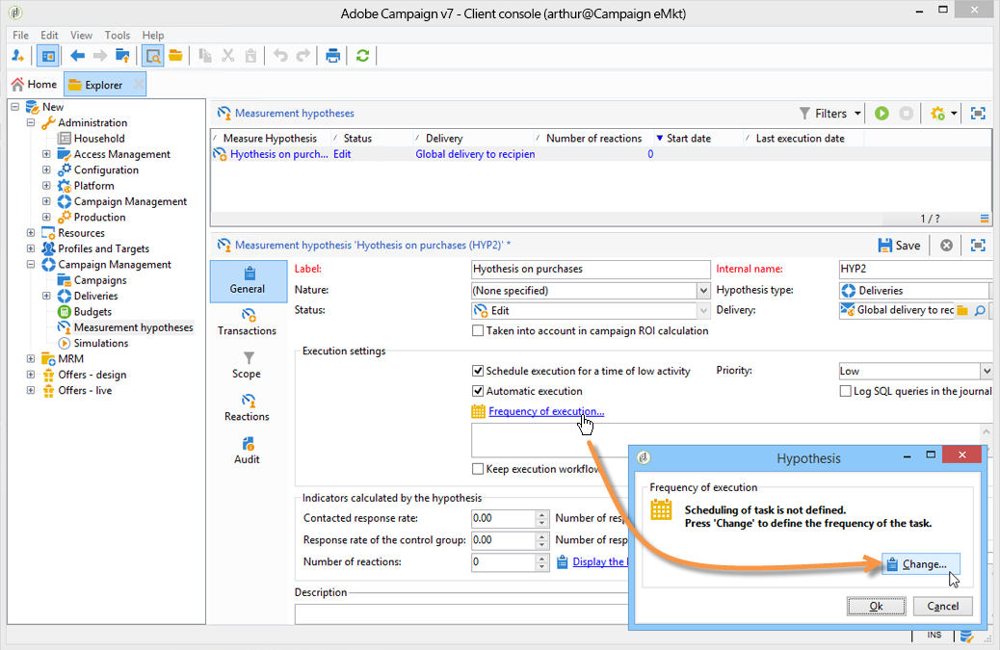
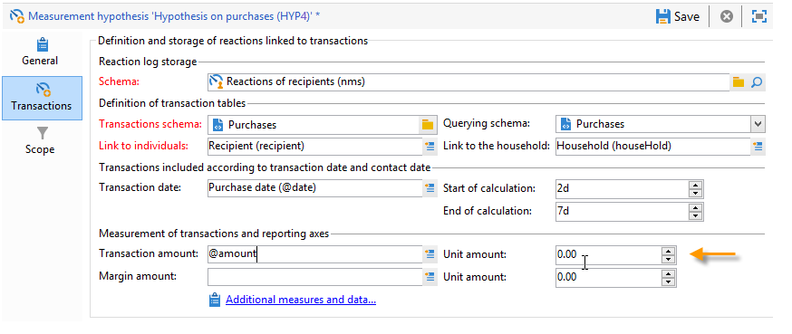

# Modelos de hipótese{#hypothesis-templates}

## Cria um modelo de hipótese {#creating-a-hypothesis-model}

A configuração do modelo de hipótese permite definir o contexto para mensurar as reações, seja para uma entrega ou para uma oferta. É onde as várias tabelas de mensuração são referenciadas, assim como aquelas que definem as relações entre individuais, hipóteses e a tabela de transações.

Aplique as seguintes etapas para criar um modelo de hipótese:

1. No explorer do Adobe Campaign, clique em **[!UICONTROL Resources>Templates>Hypothesis templates]**.

   

1. Clique em **[!UICONTROL New]** ou selecione com o botão direito na lista de modelos e escolha **[!UICONTROL New]** na lista suspensa.
1. Insira o rótulo da hipótese.
1. Especifique se o modelo for destinado às hipóteses sobre ofertas ou entregas por meio de **[!UICONTROL Hypothesis type]**.
1. Para modelos do tipo **[!UICONTROL Delivery]**, especifique se as medições devem ser realizadas com ou sem um grupo de controle. [Saiba mais](#properties-of-a-hypothesis-template)
1. Para modelos do tipo **[!UICONTROL Delivery]**, você pode escolher um canal específico ou decidir aplicar o modelo a todos os canais disponíveis no Adobe Campaign usando a lista suspensa **[!UICONTROL Channel]**. [Saiba mais](#properties-of-a-hypothesis-template)
1. Selecione a **[!UICONTROL Execution folder]** na qual deseja criar e executar automaticamente a hipótese criada a partir desse modelo.
1. Escolha as configurações de execução. [Saiba mais](#hypothesis-template-execution-settings)
1. Especifique o período de cálculo da hipótese. [Saiba mais](#hypothesis-template-execution-settings)

   >[!CAUTION]
   >
   >Esse período é determinado a partir da data de contato.

1. Na guia **[!UICONTROL Transactions]**, especifique as tabelas e os campos necessários para o cálculo da hipótese. [Saiba mais](#transactions)
1. Se o modelo estiver configurado para a hipótese de tipo **[!UICONTROL Offer]**, é possível habilitar a opção **[!UICONTROL Update offer proposition status]**. Nesse caso, selecione o status da apresentação da oferta que deseja alterar.
1. Especifique o escopo da aplicação da hipótese. [Saiba mais](#hypothesis-perimeter)
1. Se necessário, use um script para concluir a filtragem. [Saiba mais](#hypothesis-perimeter)

### Propriedades de um modelo de hipótese {#properties-of-a-hypothesis-template}

A guia **[!UICONTROL General]** permite especificar as opções gerais do modelo. Os campos disponíveis são:

* **[!UICONTROL Hypothesis type]**: permite determinar se o modelo deve ser destinado à hipótese sobre entregas ou ofertas.

  É possível optar por criar uma hipótese que será aplicada tanto em entregas quanto em ofertas.

  >[!NOTE]
  >
  >Se o modelo for aplicável a ofertas, a opção **[!UICONTROL Update offer proposition status]** estará disponível na guia **[!UICONTROL Transactions]**.

* **[!UICONTROL Measurement with control group]**: permite indicar se um grupo de controle foi definido para a entrega ou campanha, assim como incluí-lo nos indicadores de mensuração. O grupo de controle, que não recebe entregas, permite medir o impacto da campanha após a entrega, comparando-o com a população de destino que recebeu a entrega.

  >[!NOTE]
  >
  >Se o modelo está configurado para assumir um grupo de controle em conta, mas nenhum grupo está definido na entrega relacionada à hipótese, os resultados são baseados somente em destinatários direcionados.

  Para obter mais informações sobre como definir e configurar um grupo de controle, consulte a [documentação do Campaign v8](https://experienceleague.adobe.com/docs/campaign/automation/campaign-orchestration/marketing-campaign-target.html#add-a-control-group){target=_blank}.

* **[!UICONTROL Channel]**: é possível escolher um canal específico ou disponibilizar o modelo da hipótese em todos os canais no console do Adobe Campaign selecionando **[!UICONTROL All channels]** na lista suspensa. Se o modelo for configurado para um canal específico, é possível filtrar automaticamente as entregas por canal ao criar a hipótese. [Saiba mais](creating-hypotheses.md)

  

* **[!UICONTROL Execution folder]**: permite especificar a pasta de execução da hipótese.
* **[!UICONTROL Taken into account in campaign ROI calculation]**: considera o resultado da hipótese no cálculo do ROI da respectiva campanha.

### Configurações de execução do modelo de hipótese {#hypothesis-template-execution-settings}

A guia **[!UICONTROL General]** do modelo também permite especificar os parâmetros de execução da hipótese. As opções disponíveis são:

* **[!UICONTROL Schedule execution for a time of low activity]**: permite agendar a aplicação da hipótese para otimizar desempenhos do Adobe Campaign. Quando essa opção é marcada, o fluxo de trabalho do processamento em campanhas executa o cálculo de hipóteses durante o tempo de inatividade.

  

* **[!UICONTROL Priority]**: nível aplicado para espaçar as ordens de cálculo da hipótese se houver execuções simultâneas.

  

* **[!UICONTROL Automatic execution]**: se necessário, permite agendar o recálculo da hipótese (por exemplo, é possível atualizar os indicadores regularmente até o fim da entrega).

  

  Aplique o seguinte processo para especificar um cronograma:

   1. Clique no link **[!UICONTROL Frequency of execution...]** e depois no botão **[!UICONTROL Change...]**.

      

   1. Configure a frequência, os eventos relacionados e o período de validade.

      

   1. Clique em **[!UICONTROL Finish]** para salvar o cronograma.

      

* **[!UICONTROL Log SQL queries in journal]**: esta função é destinada para usuários especialistas. Ele permite adicionar uma guia à auditoria da hipótese de mensuração para mostrar queries SQL. Isso permite a detecção de possíveis defeitos se uma simulação terminar com erros.
* **[!UICONTROL Keep execution workflow]**: permite manter o fluxo de trabalho gerado automaticamente no início do cálculo da hipótese. Na hipótese criada a partir de um modelo que tem essa opção marcada, o fluxo de trabalho gerado está disponível para seguir o processo.

  >[!CAUTION]
  >
  >Essa opção deve ser ativada somente para fins de depuração, caso ocorra um erro durante a execução da hipótese.\
  >Além disso, os fluxos de trabalho gerados automaticamente não devem ser modificados. Qualquer modificação eventual em outro lugar é desconsiderada para cálculos posteriores.\
  >Se essa opção está marcada, exclua o fluxo de trabalho após a execução.

### Transações {#transactions}

Esta guia contém vários campos e tabelas que permitem salvar o histórico das reações do destinatário em termos de transações. Consulte esta [seção](../../configuration/using/about-schema-reference.md) para obter mais informações sobre as tabelas dedicadas à gestão de resposta.

* **[!UICONTROL Schema (reaction log storage)]**: selecione a tabela de reação de destinatário. A tabela pronta para uso no Adobe Campaign é a **NmsRemaMatchRcp**.
* **[!UICONTROL Transaction schema]**: escolha a tabela relacionada à hipótese, ou seja, a tabela de transação ou a de compra.
* **[!UICONTROL Querying schema]**: escolha os critérios para filtrar a hipótese.
* **[!UICONTROL Link to individuals]**: escolha o vínculo entre as Pessoas físicas e a tabela usada como esquema de transações.
* **[!UICONTROL Link to the household]**: seleciona o vínculo para a família no esquema de transações se desejar incluir todos os membros de uma organização em uma hipótese. Este campo é opcional.
* **[!UICONTROL Transaction date]**: este campo é opcional, mas recomendado, pois permite a definição de um escopo para o cálculo de hipótese.
* **[!UICONTROL Measurement period]**: permite a configuração de datas inicial e final para que as hipóteses sejam executadas e as linhas de compra sejam recuperadas.

  Quando a hipótese está vinculada a uma entrega, a mensuração é acionada automaticamente por alguns dias após a data de contato da correspondência direta ou após a data do email ou SMS.

  

  Se a hipótese é iniciada em tempo real, pode ser forçada para acionar imediatamente. Caso contrário, ocorre o acionamento automático com base na configuração de término da data de cálculo, que é baseada na data de criação da hipótese. [Saiba mais](creating-hypotheses.md#creating-a-hypothesis-on-the-fly-on-a-delivery)).

* **[!UICONTROL Transaction/Margin amount]**: esses campos são opcionais e permitem o cálculo dos indicadores de faturamento automaticamente. [Saiba mais](hypothesis-tracking.md#indicators)
* **[!UICONTROL Unit amount]**: permite que você defina um valor para calcular a receita. [Saiba mais](hypothesis-tracking.md#indicators)

  

* **[!UICONTROL Additional measures and data]**: permite a especificação de relatórios adicionais de medidas ou eixos de campos nas diferentes tabelas.
* **[!UICONTROL Update offer proposition status]**: permite a alteração do status da apresentação da oferta se um destinatário for identificado pela hipótese.

  

### Perímetro da hipótese {#hypothesis-perimeter}

Depois de definir a tabela de transações e os campos que são relacionados, é possível refinar o escopo da sua hipótese especificando as transações de destino e entregas através do uso de filtros. Também é possível usar um script JavaScript para apontar explicitamente para um produto referenciado na tabela de transações.

* **Filtragem em transações**: na guia **[!UICONTROL Scope]**, é possível configurar um filtro na hipótese. Para fazer isso:

   1. Clique no link **[!UICONTROL Edit query]**.

      

   1. Especifique as condições de filtragem.

      

   1. Selecione a transação que a hipótese deve relacionar.

      

* **Filter on recipients**: na guia **[!UICONTROL Scope]**, é possível limitar a hipótese de qualquer informação vinculada a uma mensagem (entrega, destinatário, endereço de email, serviço, etc.):

   1. Clique no link **[!UICONTROL Add a filter]** e depois em **[!UICONTROL Edit query]**.

      

   1. Especifique as condições de filtragem.

      

   1. Clique em **[!UICONTROL Finish]** para salvar sua consulta.

      

* **Script**: é possível usar um script JavaScript para sobrecarregar dinamicamente as configurações de hipótese durante a execução.

  Para fazer isto, clique em **[!UICONTROL Advanced settings]** e depois insira o script desejado.

  >[!NOTE]
  >
  >Esse procedimento destina-se somente aos usuários especializados.

  

## Exemplo: criar um modelo de hipótese em uma entrega {#example--creating-a-hypothesis-template-on-a-delivery}

Neste exemplo é criado um modelo de hipótese em uma entrega do tipo mala direta. A tabela de transações (**Compras** no exemplo) que a hipótese está baseada contém linhas de compra vinculadas aos artigos ou produtos. O template é configurado para criar hipóteses em artigos ou produtos da tabela de compras.

1. No explorer do Adobe Campaign, vá para o nó **[!UICONTROL Resources > Templates > Hypothesis templates]**.
1. Clique em **[!UICONTROL New]** para criar um modelo.

   

1. Alterar o rótulo do modelo.

   

1. Selecione **[!UICONTROL Deliveries]** como tipo de hipótese.
1. Marque a opção correspondente para especificar que a entrega pode conter um grupo de controle.
1. Escolha o canal **[!UICONTROL Direct mail]**.

   >[!NOTE]
   >
   >Como o modelo é específico para a entrega de mala direta, a hipótese criada através desse modelo pode não estar vinculada a nenhum outro tipo de entrega.

1. Na guia **[!UICONTROL Transactions]**, selecione a tabela de reações do destinatário.

   

1. No campo **[!UICONTROL Transactions schema]** escolha a tabela de compra.

   

1. Selecione as linhas de compra no campo **[!UICONTROL Querying schema]**.

   

1. Escolha os destinatários vinculados à tabela de compras.

   

1. Selecione o campo vinculado à data de compra.

   Isso permite a definição de um período de tempo para hipóteses. Este estágio não é obrigatório, mas é recomendado.

   

1. Configure o período de cálculo de 5 a 25 dias.

   

1. Na guia **[!UICONTROL Scope]**, clique em **[!UICONTROL Edit query]** para criar um filtro na hipótese.

   

   O modelo criado permite a execução da hipótese nos produtos ou artigos da tabela de compras.

1. Clique em **[!UICONTROL Save]** para registrar o modelo.
