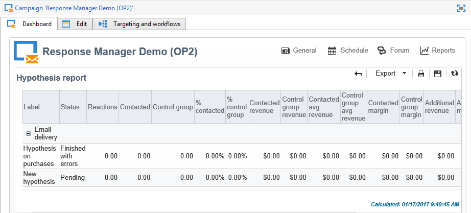

# Rastreamento de hipótese{#hypothesis-tracking}

O resultado dos cálculos da hipótese está disponível em vários níveis da plataforma Adobe Campaign: indicadores calculados pela hipótese e as reações da amostragem alvo são visíveis por meio da hipótese real, assim como nos relatórios disponíveis por campanhas e envios.

## Resultados da hipótese {#hypothesis-results}

### Indicadores {#indicators}

Depois que a hipótese é calculada, vários indicadores de medição são atualizados automaticamente. Eles estão disponíveis na guia **[!UICONTROL General]** da hipótese.

Esses indicadores são:

* **Number of respondent contacts**: número de individuais que correspondem à hipótese.
* **Contacted response rate**: número de contatos de contatos/pessoas contatadas durante o delivery.
* **Number of respondent control group contacts**: número de grupos de controle que correspondem à hipótese.
* **Response rate of the control group**: número de grupos de controle de usuário/número total de grupos de controle de deliveries.
* **Number of reactions**: número de registros na tabela que contém a relação entre individuais, a hipótese e a tabela de transações.

Para obter a lista completa de indicadores, clique no link **[!UICONTROL Display the list]**:

Os indicadores fornecem as seguintes informações:

* **Total revenue of population contacted**: valor total sobre o número de pessoas contatadas.
* **Total revenue of the control group**: valor total sobre o número de grupos de controle.
* **Average revenue per contact**: valor total / contatado.
* **Average revenue of control group**: valor total / grupo de controle.
* **Total margin per contact**: margem total sobre contatados.
* **Total margin of control group**: margem total sobre o grupo de controle.
* **Average margin per contact**: margem total / contatado.
* **Average margin of control groups**: margens totais / grupo de controle.
* **Receita adicional**: (receita média do contato - receita média do grupo de controle)&#42;Número de contatos
* **Margem adicional**: (margem média do contato - margem média do grupo de controle) / número de contatos
* **Average cost per contact**: custo de delivery calculado/Número de contatos.
* **ROI**: custo de delivery calculado/margem total por contato
* **Effective ROI**: custo de delivery calculado/margem adicional.
* **Significance**: contém valores 0 a 3 dependendo do significado da campanha.

### Reações {#reactions}

É possível exibir as reações dos destinatários com a hipótese por meio da guia **[!UICONTROL Reactions]**.

1. Depois que o cálculo da hipótese é concluído, acesse o nó **[!UICONTROL Campaign management > Measurement hypotheses]** da árvore do Adobe Campaign.
1. Selecione a hipótese e clique na guia **[!UICONTROL Reactions]** para visualizar a lista de destinatários que pode comprar algo após a campanha de marketing.

   

## Relatórios {#reports}

O **[!UICONTROL Hypothesis report]** permite a visualização dos resultados da hipótese realizada em campanhas e deliveries. Este relatório contém os indicadores calculados pela hipótese (para mais informações, consulte os [Indicadores](#indicators)).

* **No nível da campanha**: clique no link **[!UICONTROL Reports]** da campanha relevante e selecione o **[!UICONTROL Hypothesis report]**. Esse relatório contém a lista de deliveries da campanha e a hipótese calculada para cada um deles.

   

* **No nível do delivery**: para acessar o relatório, abra o delivery relacionado, clique em **[!UICONTROL Reports]** na guia **[!UICONTROL Summary]** e selecione o **[!UICONTROL Hypothesis report]**. Se várias hipóteses são calculadas para o mesmo delivery, o relatório mostra todas as alternativas.

   
