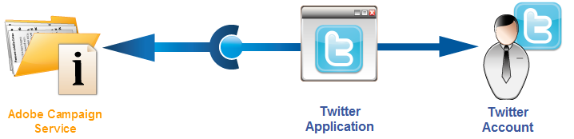

# Etapas de configuração para publicar no Twitter{#configuring-publishing-on-twitter}

Para que o Adobe Campaign possa enviar tweets para suas contas do Twitter, é necessário delegar acesso de edição ao Adobe Campaign para essas contas. Para fazer isso, siga as etapas abaixo:

* Crie uma conta do Twitter.
* Crie uma conta do Twitter de teste para enviar provas.
* Crie um aplicativo do Twitter por conta do Twitter.
* Para cada aplicativo do , crie um novo serviço do tipo **[!UICONTROL Twitter]** Twitter.

## Pré-requisitos {#prerequisites}

Comece criando uma ou mais contas do Twitter para enviar tweets.

Para criar uma conta do Twitter, acesse [https://twitter.com](https://twitter.com){target=&quot;_blank&quot;}.

## Criar uma conta de teste no Twitter {#creating-a-test-account-on-twitter}

Criar uma conta privada do Twitter que pode ser usada para enviar [provas de tweet](../../social/using/publishing-on-twitter.md#sending-the-proof). Para criar uma conta privada do Twitter, siga as etapas abaixo:

1. Crie uma nova conta do Twitter.
1. Acesse as **[!UICONTROL Settings]** da conta.
1. Navegue até **[!UICONTROL Privacy & Safety]** e **[!UICONTROL Audience and Tagging]** e marque a opção **[!UICONTROL Protect your Tweets]**. Seus tweets e outras informações da conta são visíveis apenas para as pessoas que seguem você.

## Criar um aplicativo no Twitter {#creating-an-application-on-twitter}

Para que o Adobe Campaign possa enviar tweets para suas contas do Twitter, é necessário criar um aplicativo do Twitter por conta do Twitter. Para fazer isso, siga as etapas abaixo:

1. Faça logon em sua conta do Twitter.
1. Digite o seguinte endereço no seu navegador de internet: [https://developer.twitter.com/en/apps](https://developer.twitter.com/en/apps).
1. Em seguida, clique no botão **[!UICONTROL Create an App]** à direita.

   

1. Deixe o assistente orientá-lo pelo processo.

   Para que esse aplicativo permita que o Adobe Campaign envie tweets para sua conta, vá para a guia **[!UICONTROL Permissions]** do aplicativo e selecione **[!UICONTROL Read and Write]** para a seção **[!UICONTROL Access]**. Na guia **[!UICONTROL Settings]**, também é necessário deixar o campo **[!UICONTROL Callback URL]** vazio.

   

## Delegação de acesso de gravação ao Adobe Campaign {#delegating-write-access-to-adobe-campaign}

Para cada aplicativo do , é necessário criar um serviço tipo **[!UICONTROL Twitter]** Twitter diferente que incluirá as configurações do aplicativo.

Esta etapa requer acesso simultâneo ao console do Adobe Campaign e um navegador da Internet conectado à sua conta do Twitter:

* No **Twitter**: nesta [página](https://developer.twitter.com/en/portal/projects-and-apps), selecione o aplicativo criado anteriormente e edite as **Permissões do aplicativo**.

   

   Edite a guia **Chaves e tokens** para acessar os detalhes do aplicativo.

* No **Adobe Campaign**: acesse a guia **[!UICONTROL Profiles and targets]**, clique no link **[!UICONTROL Services and Subscriptions]** e no botão **[!UICONTROL Create]**.

   

1. Selecione o tipo **[!UICONTROL Twitter]**.

   

   >[!NOTE]
   >
   >A opção **[!UICONTROL Synchronize subscriptions]** é ativada por padrão. Quando a caixa é marcada, o workflow de sincronização de conta do Twitter (consulte [Sincronização de contas do Twitter](#synchronizing-twitter-accounts)) recupera a lista de seguidores do Twitter para os enviar mensagens diretas (consulte [Envio de mensagens diretas a assinantes](../../social/using/publishing-on-twitter.md#sending-direct-messages-to-subscribers)). Se não quiser recuperar a lista de seguidores, desmarque essa caixa.

1. Insira o rótulo e o nome interno do serviço.

   

   >[!IMPORTANT]
   >
   >O **[!UICONTROL Internal name]** do serviço deve ser idêntico ao nome da conta do Twitter. Para garantir que não haja erros de entrada, execute as etapas a seguir.

   * Clique no botão **[!UICONTROL Save]**.
   * Na visão geral dos serviços, clique no serviço do Twitter que você acabou de criar.

   <!-- * Select the **[!UICONTROL Twitter page]** tab. The Twitter account should be displayed. 
    
      -->

1. No campo **[!UICONTROL Visitor folder]**, selecione a pasta na qual os seguidores serão criados. Para obter mais informações, consulte [esta seção](../../social/using/publishing-on-twitter.md#operating-principle). Por padrão, os seguidores são salvos na pasta **[!UICONTROL Visitors]**.

   

1. No Twitter, copie o conteúdo dos campos **[!UICONTROL Consumer Key (API Key)]** e **[!UICONTROL Consumer Secret (API Secret)]** e cole-o nos campos **[!UICONTROL Consumer key]** e **[!UICONTROL Consumer secret]** do console do cliente do Campaign.

   

1. No Twitter, copie o conteúdo dos campos **[!UICONTROL Access Token]** e **[!UICONTROL Access Token Secret]** e cole-o nos campos **[!UICONTROL Access token]** e **[!UICONTROL Access token secret]** do console do cliente do Campaign.

   

1. No console do cliente do Campaign, clique em **[!UICONTROL Save]**. Agora você delegou acesso de gravação ao Adobe Campaign.

   

>[!NOTE]
>
>É necessário criar um serviço do **[!UICONTROL Twitter]** por aplicativo do Twitter.

O fluxo de trabalho **[!UICONTROL Twitter account Synchronization]** sincroniza as contas do Twitter no Adobe Campaign.

## Sincronizar contas do Twitter {#synchronizing-twitter-accounts}

>[!IMPORTANT]
>
>Para que o fluxo de trabalho recupere a lista de inscritos do Twitter, a caixa **[!UICONTROL Twitter account synchronization]** deve ser marcada na seção de edição do serviço vinculado à conta. Para obter mais informações, consulte [esta seção](#delegating-write-access-to-adobe-campaign).

O workflow **[!UICONTROL Twitter account synchronization]**, acessado pelo nó **[!UICONTROL Administration > Production > Technical workflows > Managing social networks]**, permite sincronizar as contas do Twitter configuradas anteriormente com o Adobe Campaign. Por padrão, esse fluxo de trabalho é acionado todas as quintas-feiras às 7h30.

>[!NOTE]
>
>Você pode iniciar o fluxo de trabalho a qualquer momento executando o processamento antecipado da tarefa. Também é possível editar o scheduler para alterar a frequência de acionamento do workflow. Para saber mais sobre o scheduler, consulte [esta seção](../../workflow/using/scheduler.md).

Agora é possível enviar tweets para suas contas do Twitter e mensagens diretas para seus seguidores. Para obter mais informações, consulte [esta página](../../social/using/publishing-on-twitter.md).
