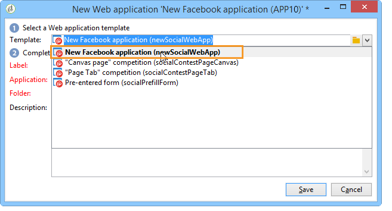

# Criação de um aplicativo do Facebook{#creating-a-facebook-application}

Graças aos aplicativos Web, o Social Marketing permite exibir um conteúdo personalizado nos seus aplicativos do Facebook, facilitando a aquisição de prospectos por meio dessa rede social. Para obter mais exemplos de aplicativos Web do tipo Facebook, consulte [Exemplos de aplicativos do Facebook](../../social/using/examples-of-facebook-apps.md).

>[!NOTE]
>
>Também é possível integrar o Adobe Campaign a um aplicativo do Facebook desenvolvido por um parceiro. Nesse caso, não há necessidade de usar o aplicativo web do Adobe Campaign para adquirir os perfis do Facebook. Para obter mais informações, consulte [Configuração de contas externas](#configuring-external-accounts).

Aplique as seguintes etapas de configuração:

1. Crie um ou mais aplicativos do Facebook. Para obter mais informações, consulte: [Criação de um aplicativo do Facebook](../../social/using/publishing-on-facebook-walls.md#creating-a-facebook-application).
1. Digite os links **[!UICONTROL terms of service]** e **[!UICONTROL Privacy policy]** a serem exibidos na tela de solicitação de permissão do Facebook. Para obter mais informações, consulte: [Inserir os links dos Termos de serviço e da Política de privacidade](#entering-the-terms-of-service-and-privacy-policy-links).
1. Para cada aplicativo do Facebook, crie uma conta externa do tipo **[!UICONTROL Facebook Connect]**. Para obter mais informações, consulte: [Configuração de contas externas](#configuring-external-accounts).
1. Para cada aplicativo do Facebook, crie um aplicativo Web do tipo Facebook no Adobe Campaign. Para obter mais informações, consulte: [Criação de um aplicativo web tipo Facebook](#creating-a-facebook-type-web-application).
1. Configure os aplicativos do Facebook para que sejam exibidos como guias na sua página do Facebook. Para obter mais informações, consulte: [Configuração das guias do Facebook](#configuring-facebook-tabs).

## Configuração de contas externas {#configuring-external-accounts}

Para cada aplicativo do Facebook, é necessário criar uma conta externa do tipo **[!UICONTROL Facebook Connect]**.

Esta etapa requer o acesso ao console do Adobe Campaign e a um navegador da Internet conectado à conta do Facebook usada na administração da página:

* **Facebook**: selecione o aplicativo criado anteriormente ( [https://developers.facebook.com/apps](https://developers.facebook.com/apps)) e selecione a guia **[!UICONTROL Settings]** > **[!UICONTROL Basic]** .

   

   >[!NOTE]
   >
   >Se a seção **[!UICONTROL Facebook Web Games]** não for exibida, clique no botão **[!UICONTROL Add Platform]**, na parte inferior da página, e selecione **[!UICONTROL Facebook Web Games]**.

* **Adobe Campaign**: vá para o **[!UICONTROL Administration > Platform > External accounts]** nó da árvore e clique em **[!UICONTROL New]**.

   

1. Digite um rótulo, um nome interno e selecione o tipo **[!UICONTROL Facebook Connect]** .

   

1. Select a hosting mode for the application: **[!UICONTROL hosted by a partner]** or **[!UICONTROL hosted by this instance]**.

   

   **Aplicativo hospedado por um parceiro**

   É possível integrar o Adobe Campaign com um aplicativo do Facebook desenvolvido por um parceiro. Nesse caso, não há necessidade de usar os aplicativos Web do Adobe Campaign para adquirir os perfis do Facebook. Quando o usuário do Facebook instala o aplicativo, uma chave (token de acesso) é gerada. O parceiro encaminha esse token de acesso para o Adobe Campaign pelo chamado de um serviço da Web. O Adobe Campaign usa esse token para fazer logon no banco de dados do Facebook e coletar os dados compartilhados pelo usuário por meio do aplicativo.

   >[!NOTE]
   >
   >Os parâmetros do serviço da Web estão detalhados no arquivo WSDL disponível aqui: **`https://<Instance name>/nl/jsp/schemawsdl.jsp?schema=nms:visitor`**

   To integrate the third-party application into Adobe Campaign, you need to copy the content of the **[!UICONTROL App ID]** and **[!UICONTROL App Secret]** Facebook fields and paste it into the **[!UICONTROL Application ID]** and **[!UICONTROL Application secret]** fields of the console.

   

   **Aplicativo hospedado por esta instância**

   Para hospedar o aplicativo nesta instância (se não houver um aplicativo de terceiros), é possível usar os aplicativos Web do Adobe Campaign para adquirir perfis do Facebook. Para obter mais informações, consulte [Exemplos de aplicativos do Facebook](../../social/using/examples-of-facebook-apps.md).

   No console do Adobe Campaign, copie o endereço contido no campo **[!UICONTROL Secure Canvas URL]** e o cole no campo **[!UICONTROL Facebook Web games (https)]** no Facebook (na seção **[!UICONTROL Facebook Web Games]**).

   

   >[!IMPORTANT]
   >
   >Evite o uso do URL inseguro nas circunstância.

   On Facebook, copy the content of the **[!UICONTROL App ID]** and **[!UICONTROL App Secret]** fields and paste it into the **[!UICONTROL Application ID]** and **[!UICONTROL Application secret]** fields in the console.

   

1. No Facebook, clique no botão **[!UICONTROL Save Changes]** na parte inferior da página.
1. No console do Adobe Campaign, clique no botão **[!UICONTROL Subscribe]** para habilitar o Adobe Campaign e recuperar os dados em tempo real sempre que um fã fizer o check-in por meio desse aplicativo. Para obter mais informações, consulte: [Exemplos de aplicativos do Facebook](../../social/using/examples-of-facebook-apps.md).

   

## Inserção dos links de Termos de serviço e Política de privacidade{#entering-the-terms-of-service-and-privacy-policy-links}

We strongly recommend adding the **[!UICONTROL Terms of service]** and **[!UICONTROL Privacy policy]** links, to be displayed on the Facebook permission request screen.

As etapas de configuração são as seguintes:

1. Digite o seguinte endereço: [https://developers.facebook.com/apps](https://developers.facebook.com/apps) e depois selecione o aplicativo do Facebook.
1. Selecione a **[!UICONTROL Settings > Basic]** guia e insira os campos **[!UICONTROL Privacy Policy URL]** e **[!UICONTROL Terms of Service URL]** .

   

## Criação de um aplicativo Web do tipo Facebook{#creating-a-facebook-type-web-application}

O aplicativo do Facebook do Adobe Campaign permite exibir o conteúdo personalizado no seu aplicativo do Facebook. Para cada aplicativo do Facebook, é necessário criar um aplicativo Web no Adobe Campaign. Para criar um aplicativo Web do Facebook, proceda da seguinte maneira:

1. Go to the **[!UICONTROL Social networks]** universe, click the **[!UICONTROL Applications]** link, then the **[!UICONTROL Create]** button.

   

1. Selecione um template de aplicativo Web do Facebook na lista e insira o rótulo.

   

   >[!NOTE]
   >
   >Por padrão, há quatro templates de aplicativos Web do Facebook oferecidos:
   >
   >* **[!UICONTROL New Facebook application]**: selecione este modelo se desejar start de um aplicativo em branco.
   >* **[!UICONTROL Pre-entered form]**: aplicativo do Facebook com um formulário e um botão &quot;Facebook login&quot; que permite que os usuários preencham automaticamente os campos usando os dados do perfil. Isso permite que os usuários preencham o formulário mais rapidamente e que as marcas obtenham informações de melhor qualidade.
   >* **[!UICONTROL "Canvas page" competition]**: aplicativo do Facebook que é exibido na tela para obter uma experiência visual melhor para os usuários.
   >* **[!UICONTROL "Page Tab" competition]**: Aplicativo do Facebook totalmente integrado nas guias da página da marca.

1. No campo **[!UICONTROL Application]**, informe a conta externa vinculada ao aplicativo do Facebook. Para obter mais informações, consulte: [Configuração de contas externas](#configuring-external-accounts).

   

1. Selecione a guia **[!UICONTROL Edit]** e edite o aplicativo Web. Para obter mais informações, consulte: [Exemplos de aplicativos do Facebook](../../social/using/examples-of-facebook-apps.md).

   

1. Quando o aplicativo Web está concluído, selecione a guia **[!UICONTROL Dashboard]** e, em seguida, clique em **[!UICONTROL Publish]** para publicar online.

   

## Configuração de guias do Facebook{#configuring-facebook-tabs}

É possível configurar os aplicativos do Facebook para serem exibidos como guias da sua página do Facebook. Para fazer isso, siga as etapas abaixo:

1. Selecione o aplicativo do Facebook ([https://developers.facebook.com/apps](https://developers.facebook.com/apps)) e selecione a guia **[!UICONTROL Settings > Basic]**.

   

1. At the bottom of the page, click the **[!UICONTROL Add Platform]** button, and select **[!UICONTROL Page Tab]**.

   

1. In the **[!UICONTROL Page Tab Name]** field of the **[!UICONTROL Page Tab]** section, enter the label as you want it to appear on the Facebook page.

   

1. In the **[!UICONTROL Secure Page Tab URL]** field, enter the public URL of the web application, which is accessible via the **[!UICONTROL Dashboard]** tab of the web application. Para obter mais informações sobre como criar aplicativos Web do tipo Facebook, consulte [Criação de um aplicativo Web do tipo Facebook](#creating-a-facebook-type-web-application).

   

1. On the **[!UICONTROL Dashboard]** of the web application, click the **[!UICONTROL Add a page tab]** link.

   

1. Selecione a página do Facebook que deve ser adicionada a guia e clique em **[!UICONTROL Add Page Tab]**.

   

