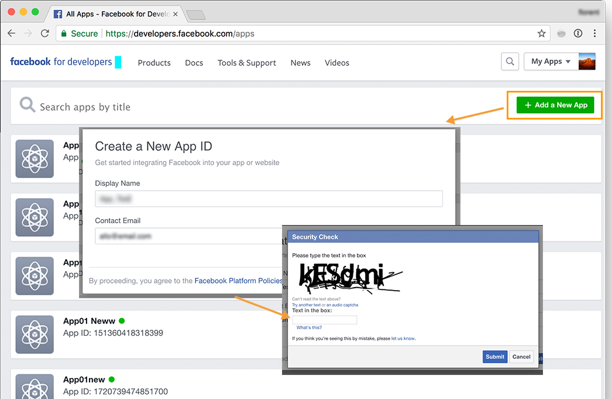
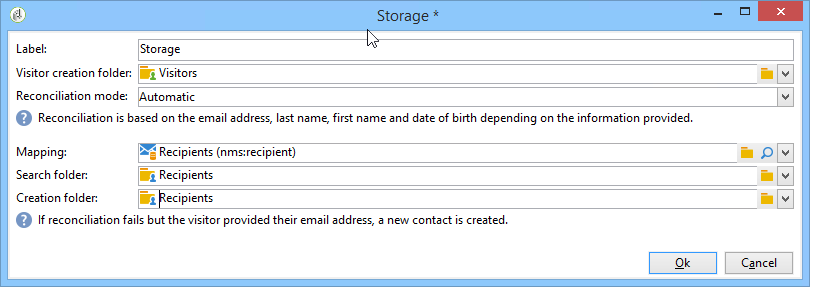

# Exemplos de aplicativos do Facebook{#examples-of-facebook-apps}

Quando um usuário clica na guia de um aplicativo do Facebook, ela é exibida em um espaço com 810 pixels de largura. O Adobe Campaign usa um aplicativo web para permitir a definição e a personalização do conteúdo exibido no aplicativo do Facebook, facilitando a aquisição de perfis.

>[!NOTE]
>
>Também é possível integrar o Adobe Campaign a um aplicativo do Facebook desenvolvido por um parceiro. Nesse caso, não há necessidade de usar o aplicativo web do Adobe Campaign para adquirir os perfis do Facebook. Para obter mais informações, consulte [Configuração de contas externas](../../social/using/creating-a-facebook-application.md#configuring-external-accounts).

>[!IMPORTANT]
>
>Siga as etapas de configuração descritas em [Criação de um aplicativo do Facebook](../../social/using/creating-a-facebook-application.md).

>[!NOTE]
>
>Esta seção detalha os elementos vinculados aos aplicativos web do tipo Facebook. Todos os elementos compartilhados com aplicativos web padrão são detalhados [nesta seção](../../web/using/about-web-applications.md).

Exemplos de aplicativos web do tipo Facebook são detalhados aqui:

* Como criar um aplicativo do Facebook em 7 etapas. Consulte [Início rápido: criação de um aplicativo do Facebook em 7 etapas](#quick-start--creating-a-facebook-application-in-7-steps).
* Como encaminhar configurações para um aplicativo do Facebook. Consulte [Como encaminhar configurações para um aplicativo do Facebook?](#how-to-forward-settings-to-a-facebook-application-).
* Como adquirir dados de fãs. Consulte [Como adquirir dados de fãs?](#how-to-acquire-fan-data-).

>[!IMPORTANT]
>
>Estes casos de uso simples são fornecidos como exemplos para ilustrar as funcionalidades de aplicativos web do tipo Facebook.

## Recomendações {#recommendations}

As seguintes limitações estão vinculadas diretamente ao Facebook:

* Deve criar todos os aplicativos web em HTTPS.
* Um aplicativo do Facebook exibido por meio de uma guia tem uma largura de 810 pixels.

## Início rápido: criação de um aplicativo do Facebook em 7 etapas {#quick-start--creating-a-facebook-application-in-7-steps}

Este exemplo fornece um processo passo a passo de como exibir um aplicativo criado pelo Adobe Campaign no Facebook. Nesse caso, queremos criar um aplicativo que permita exibir a mensagem **Welcome** quando o usuário clicar na guia do aplicativo (**App01**).

Para criar este aplicativo, execute as seguintes etapas:

1. Crie um aplicativo no Facebook ( [https://developers.facebook.com/apps](https://developers.facebook.com/apps)). Para obter mais informações, consulte: [Criação de um aplicativo do Facebook](../../social/using/publishing-on-facebook-walls.md#creating-a-facebook-application).

   

1. Crie uma conta externa do tipo **[!UICONTROL Facebook Connect]** e insira os parâmetros do aplicativo do Facebook. Para obter mais informações, consulte: [Configuração de contas externas](../../social/using/creating-a-facebook-application.md#configuring-external-accounts).

   

1. Digite os links **[!UICONTROL Terms of service]** e **[!UICONTROL Privacy policy]** que serão exibidos na tela de solicitação de permissão do Facebook. Para obter mais informações, consulte: [Inserir os links dos Termos de serviço e da Política de privacidade](../../social/using/creating-a-facebook-application.md#entering-the-terms-of-service-and-privacy-policy-links).

   

1. Crie um aplicativo web tipo Facebook no Adobe Campaign. Para obter mais informações, consulte: [Criação de um aplicativo web tipo Facebook](../../social/using/creating-a-facebook-application.md#creating-a-facebook-type-web-application).

   

1. Edite seu aplicativo web. Neste exemplo, adicionamos uma atividade **[!UICONTROL Page]** e definimos um título para ela.

   

1. Implante seu aplicativo.

   

1. Configure seu aplicativo do Facebook para que ele seja exibido como uma guia em sua página do Facebook. Para obter mais informações, consulte: [Configuração das guias do Facebook](../../social/using/creating-a-facebook-application.md#configuring-facebook-tabs).

   

Verifique se a guia do aplicativo **App01** é exibida em sua página do Facebook. Clicar nele deve chamar uma mensagem **Welcome**.

## Como encaminhar configurações para um aplicativo do Facebook? {#how-to-forward-settings-to-a-facebook-application-}

>[!IMPORTANT]
>
>Siga as etapas de configuração detalhadas em [Criação de um aplicativo do Facebook](../../social/using/creating-a-facebook-application.md).

No exemplo 1, personalizamos a exibição da página do Facebook de acordo com o valor no campo **[!UICONTROL Fan of the page]**. Também é possível processar o campo **[!UICONTROL Application settings]**. Esse campo permite recuperar dados contidos em um link gerado pelo Adobe Campaign, via Facebook.

Vejamos o exemplo de uma empresa que decide enviar uma campanha por email. No delivery, um link aponta para o aplicativo do Facebook. Esse link é personalizado graças ao parâmetro **[!UICONTROL app_data]** adicionado ao final do URL. O valor desse parâmetro pode ser um indicador que reflete a importância do cliente. Em nosso exemplo, os valores do parâmetro **[!UICONTROL app_data]** são **[!UICONTROL big]** (cliente importante) e **[!UICONTROL small]** (cliente menos importante).

Depois de personalizado, o URL fica assim:

* `http://<path of the Facebook application>&app_data=big` (para um cliente importante)
* `http://<path of the Facebook application>&app_data=small` (para um cliente menos importante)

Entre os dados anônimos encaminhados ao Adobe Campaign pelo Facebook, o valor do campo **[!UICONTROL Application parameters]** é coletado, permitindo que o Adobe Campaign personalize a exibição do aplicativo com base nesse parâmetro.

Se o usuário for um cliente importante (o valor do parâmetro **[!UICONTROL app_data]** é **[!UICONTROL big]**), a seguinte imagem será exibida:

Se o usuário for um cliente menos importante (o valor do parâmetro **[!UICONTROL app_data]** é **[!UICONTROL small]**), a seguinte imagem será exibida:

Para recriar esse caso de uso, criamos uma aplicação web composta pelos seguintes elementos:

* Uma atividade **[!UICONTROL Test]** com base no campo **[!UICONTROL Application parameter]**.
* duas páginas que contêm as imagens a serem exibidas de acordo com o valor do campo **[!UICONTROL Application parameter]**.

## Como adquirir dados de fãs? {#how-to-acquire-fan-data-}

>[!IMPORTANT]
>
>Siga as etapas de configuração detalhadas em [Criação de um aplicativo do Facebook](../../social/using/creating-a-facebook-application.md).

Este exemplo mostra como entrar em contato com usuários do Facebook e oferecer a eles que compartilhem suas informações de perfil. Vejamos o exemplo de uma empresa que quer adquirir prospectos e organiza um concurso em sua página do Facebook para atraí-los.

Sempre que um usuário clica na guia **[!UICONTROL App03]**, perguntamos se ele deseja participar do concurso.

Se decidirem participar do concurso, oferecemos a eles a opção de compartilhar suas informações de perfil.

Se eles concordarem em compartilhar suas informações, a tela a seguir será exibida.

Para construir esse caso de uso, criamos uma aplicação web composta pelos seguintes elementos:

* uma atividade **[!UICONTROL Test]**
* três páginas
* uma atividade **[!UICONTROL Access control]**
* uma atividade **[!UICONTROL Pre-loading]**
* uma atividade **[!UICONTROL Save]**
* uma atividade **[!UICONTROL End]**

### Atividade de teste {#test-activity}

A atividade **[!UICONTROL Test]** é baseada na **[!UICONTROL ID]** e no campo **[!UICONTROL Application parameters]**.

Ela é composta por três ramos:

* **[!UICONTROL identifier (UID) is empty]** : o identificador só será encaminhado pelo Facebook se o usuário já tiver concordado em compartilhar suas informações. O primeiro ramo da atividade **[!UICONTROL Test]** permite disponibilizar o concurso somente para usuários que nunca entraram, ou seja, aqueles com uma ID vazia.
* **[!UICONTROL application parameter equals 'thanks']** : para evitar um erro de exibição vinculado ao Facebook, a página final do aplicativo web aponta para o URL do aplicativo do Facebook ao qual o parâmetro **[!UICONTROL app_data]** é adicionado usando o valor **[!UICONTROL thanks]** (para obter mais informações, consulte: [Finalizar atividade](#end-activity)). O segundo ramo permite descobrir se o usuário vem da atividade **[!UICONTROL End]** do primeiro ramo (e acabou de entrar no concurso) para exibir uma mensagem de agradecimento. Para obter mais informações sobre como usar parâmetros de URL adicionais, consulte: [Como encaminhar configurações para um aplicativo do Facebook?](#how-to-forward-settings-to-a-facebook-application-).
* **[!UICONTROL Default branch]** : se o usuário já tiver entrado no concurso (ID já inserida) em uma data anterior (parâmetro de aplicativo diferente de **[!UICONTROL thanks]**), exibiremos uma página informando que já estão participando.

### Página do concurso {#competition-page}

Para contornar o erro de exibição vinculado ao Facebook, também é preciso selecionar **[!UICONTROL Parent window]** ou **[!UICONTROL In the top window]** no campo **[!UICONTROL Window]** da página do concorrente.

### Atividade de controle de acesso {#access-control-activity}

A atividade **[!UICONTROL Access control]** permite exibir a página de solicitação de permissão do Facebook quando o usuário entra no concurso. Se eles concordarem em compartilhar suas informações, elas serão recuperadas durante o pré-carregamento. Para obter mais informações, consulte [Atividade de pré-carregamento](#pre-loading-activity).

Se tiver inserido previamente a conta externa ao criar o aplicativo web (consulte [Criar um aplicativo web tipo Facebook](../../social/using/creating-a-facebook-application.md#creating-a-facebook-type-web-application)), não será necessário editar a atividade. Caso contrário, vá para o campo **[!UICONTROL Application]** e selecione a conta externa vinculada ao aplicativo do Facebook.

### Atividade de pré-carregamento {#pre-loading-activity}

Selecione a fonte de dados a ser usada para o pré-carregamento:

* **[!UICONTROL Marketing database]** : esta opção permite pré-carregar dados pelo banco de dados do Adobe Campaign.
* **[!UICONTROL Facebook]** : essa opção permite pré-carregar dados usando o Facebook.

**Banco de dados de marketing**

Essa opção permite recuperar os dados de um perfil que exista na tabela de visitantes. A verificação é realizada com base na ID externa do Facebook recuperada quando o usuário clica na guia do aplicativo do Facebook. Se um formulário for adicionado após a atividade **[!UICONTROL Pre-loading]**, os campos que contêm informações no banco de dados serão pré-carregados.

>[!NOTE]
>
>Para obter mais informações sobre como pré-carregar dados pelo banco de dados do Adobe Campaign, consulte [esta seção](../../web/using/publishing-a-web-form.md#pre-loading-the-form-data).

**Facebook**

Essa opção permite definir as informações de perfil do Facebook que serão coletadas, dentre as quais o usuário concordou em compartilhar, para salvá-las.

A opção **[!UICONTROL Database information]** permite coletar os seguintes dados:

* **[!UICONTROL External ID]**: ID do usuário
* **[!UICONTROL Gender]**: gênero do usuário
* **[!UICONTROL Verified]** : esse campo especifica se o usuário tem ou não uma conta verificada do Facebook.
* **[!UICONTROL Full name]**: nome completo do usuário
* **[!UICONTROL First name]**: primeiro nome do usuário
* **[!UICONTROL Last name]**: sobrenome do usuário
* **[!UICONTROL Language]**: idioma do usuário

Também é possível coletar a foto do perfil, a lista de amigos, o endereço de email, a data de nascimento, os interesses e o local, marcando as caixas apropriadas.

Antes de clicar em **[!UICONTROL Ok]**, marque a caixa **[!UICONTROL I agree to comply with Facebook conditions of use]**.

>[!NOTE]
>
>Se marcar uma ou mais caixas na seção **[!UICONTROL Private information]**, a tela de solicitação de permissão do Facebook exibirá automaticamente a solicitação de acesso para esses dados.
>
>Para coletar as informações selecionadas, o usuário deve concordar em compartilhá-las.
>
>Se quiser os dois tipos de pré-carregamento (via Adobe Campaign e via Facebook), adicione duas caixas de pré-carregamento uma após a outra.

### Atividade Save {#save-activity}

A atividade **[!UICONTROL Save]** permite armazenar as informações coletadas durante os estágios anteriores na tabela dos visitantes.

Se o perfil já existir na tabela dos visitantes, seus dados serão atualizados com os novos dados coletados.

Se o perfil não existir no banco de dados e o endereço de email do usuário do Facebook tiver sido coletado, um visitante será criado na tabela dos visitantes.

1. No campo **[!UICONTROL Visitor creation folder]**, selecione a pasta na qual o perfil será criado. No caso de um aplicativo web tipo Facebook, a pasta de criação padrão é **[!UICONTROL Visitors]**.
1. No campo **[!UICONTROL Reconciliation mode]**, selecione o modo de reconciliação que deseja usar:

   * **[!UICONTROL Automatic]** : A reconciliação é realizada com base no email, sobrenome, primeiro nome e data de nascimento.
   * **[!UICONTROL Manual]** : Selecione uma ou mais chaves de reconciliação.
   * **[!UICONTROL None]** : Não haverá reconciliação.

1. No campo **[!UICONTROL Mapping]**, selecione o schema no qual deseja realizar a reconciliação.

   >[!IMPORTANT]
   >
   >Verifique se os campos da guia **[!UICONTROL Social networks]** foram inseridos corretamente no mapeamento do delivery. Os mapeamentos de delivery são acessados pelo nó **[!UICONTROL Administration > Campaign management > Target mappings]**.

1. É possível selecionar uma pasta de pesquisa para a reconciliação e uma pasta de criação para novos perfis. Se os campos estiverem vazios, os perfis serão pesquisados e criados na pasta padrão do schema de mapeamento.

### Finalizar atividade {#end-activity}

Para contornar o erro de exibição vinculado ao Facebook, é necessário marcar a caixa **[!UICONTROL Use an external URL]** e inserir o URL do aplicativo do Facebook, seguido pelo parâmetro **[!UICONTROL app_data]** e um valor. Esse valor será usado na atividade **[!UICONTROL Test]** para detectar se o usuário acabou de entrar no concurso, e para exibir uma mensagem de agradecimento se for o caso. Para obter mais informações, consulte [Atividade de teste](#test-activity).

Em nosso exemplo, o valor usado é **thanks**.

### Tela de detalhes de um visitante {#details-screen-of-a-visitor}

Assim como para os seguidores do Twitter (consulte: [Princípio operacional](../../social/using/publishing-on-twitter.md#operating-principle)), os perfis do Facebook recuperados são armazenados na tabela dos visitantes. Para exibir a lista de visitantes, vá para o nó **[!UICONTROL Profiles and Targets > Visitors]**.

Cada prospecto do Facebook que concorda em compartilhar suas informações de perfil é adicionado à lista de visitantes. Se a caixa **[!UICONTROL Friends]** estiver marcada na atividade **[!UICONTROL Pre-load]** (consulte: [Atividade de pré-carregamento](#pre-loading-activity)), os amigos também são adicionados.

Na seção **[!UICONTROL Summary]** da janela de detalhes do visitante, há dois estados possíveis para o indicador **[!UICONTROL New Contact]**:

Se uma marca de seleção verde for exibida, significa que o visitante não foi reconciliado com nenhum destinatário. Nesse caso, um novo perfil é criado na lista de recipients.

Uma cruz vermelha significa que o visitante foi reconciliado com um recipient. Você pode clicar na lente de aumento à direita do campo **[!UICONTROL Recipient]** para exibir o recipient correspondente.

Vá para a janela detalhada de um destinatário para exibir o visitante correspondente, se for o caso. Selecione a guia **[!UICONTROL Others]** e clique duas vezes no nome do visitante na seção **[!UICONTROL Web identities]**.

A tela **[!UICONTROL Activities]** da página de detalhes do visitante contém as seguintes informações:

* Atividades do fã do tipo &quot;Open Graph&quot;: música reproduzida, vídeos assistidos, artigos lidos e deduções dos aplicativos instalados (Deezer, Spotify, Dailymotion, Yahoo News etc.)

   

* &quot;Curtidas&quot; e comentários adicionados pelo fã após o envio de deliveries pelo Adobe Campaign
* páginas curtidas pelo fã
* check-ins feitos pelo fã

   

   >[!NOTE]
   >
   >Para que o Adobe Campaign colete os check-ins de um fã, é necessário clicar no botão **[!UICONTROL Subscribe]** na tela de configuração do serviço. Para obter mais informações, consulte [Configuração de contas externas](../../social/using/creating-a-facebook-application.md#configuring-external-accounts).

## Como pré-carregar os campos de um formulário usando dados de perfil do Facebook {#how-to-pre-load-the-fields-of-a-form-using-facebook-profile-data}

O aplicativo **[!UICONTROL Social Marketing]** também permite adicionar um botão a um formulário, para pré-carregar campos usando informações de perfil do Facebook. Esta opção, que está disponível em todos os templates de aplicativos web (atividades do tipo **[!UICONTROL Page]**), está detalhada [nesta seção](../../web/using/static-elements-in-a-web-form.md#inserting-html-content).

>[!NOTE]
>
>Antes de começar a usar essa função, é necessário criar um aplicativo do Facebook e uma conta externa do tipo **[!UICONTROL Facebook Connect]** . Para obter mais informações, consulte [Configuração de contas externas](../../social/using/creating-a-facebook-application.md#configuring-external-accounts).

