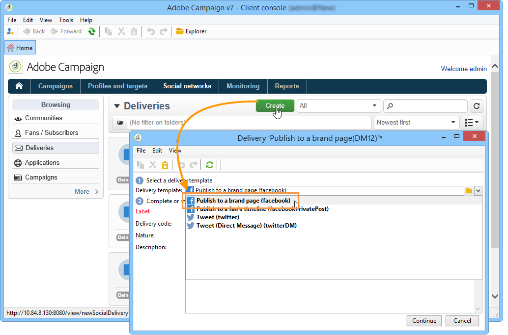
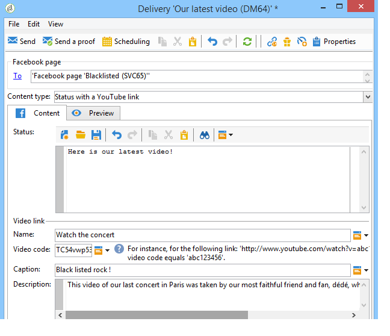

# Publicar no Facebook{#publishing-on-facebook}

Quando a configuração estiver concluída, o Social Marketing permitirá que você faça publicações nos murais das suas páginas do Facebook.

## Limitações {#limitations}

As limitações a seguir são inerentes ao Facebook.

* As cadeias de caracteres não devem exceder 1.000 caracteres.
* HTML não é aceito.

## Criar o delivery {#creating-the-delivery}

Crie um novo delivery usando o template de delivery **[!UICONTROL Publish to a brand page]**.

## Seleção do público alvo principal {#selecting-the-main-target}

É necessário selecionar as páginas nas quais você deseja fazer sua publicação.

1. Clique no link **[!UICONTROL To]**.

   

1. Clique no botão **[!UICONTROL Add]**.

   

1. Selecione **[!UICONTROL A Facebook page]**.

   

1. No campo **[!UICONTROL Folder]**, selecione a pasta de serviço que contém a página do Facebook. Por padrão, as páginas são armazenadas na raiz da pasta de serviço do **[!UICONTROL Facebook]**. Em seguida, selecione a página do Facebook na qual deseja postar.

   

## Seleção do público alvo da prova {#selecting-the-proof-target}

A guia **[!UICONTROL Target of the proofs]** permite definir a página do Facebook que você deseja usar para testar as entregas antes de enviá-las. Recomendamos a criação de uma página privada dedicada do Facebook para esse fim. Para obter mais informações sobre como criar uma página privada do Facebook, consulte [esta página](../../social/using/publishing-on-facebook-walls.md#creating-a-test-facebook-page). Para selecionar o público alvo da prova, aplique as mesmas etapas do público alvo principal. [Saiba mais](#selecting-the-main-target)

>[!NOTE]
>
>Se você estiver usando a mesma página de teste do Facebook para todos os deliveries, é possível salvar o target de prova no nó **[!UICONTROL Publish to a brand page]**, que é acessado pelo nó **[!UICONTROL Resources > Templates > Delivery templates]**. O target de prova será inserido por padrão para cada novo delivery.

## Definir a audiência {#defining-the-audience}

Se você quiser usar segmentos locais para refinar o tipo de público autorizado a exibir a publicação, recomendamos que você crie uma página do Facebook por segmento (por exemplo: Adobe Campaign Paris, Adobe Campaign London, etc.).

No entanto, também é possível usar os filtros de público usados pelo Facebook. A guia **[!UICONTROL Audience]** dos quatro filtros da oferta **[!UICONTROL Select target window]**:

* **[!UICONTROL Country]**
* **[!UICONTROL Regions]**
* **[!UICONTROL Cities]**
* **[!UICONTROL Languages]**

>[!CAUTION]
>
>Use essa função com cuidado. Nos relatórios do delivery, o indicador **[!UICONTROL Number of fans]** não levará em conta esses filtros do Facebook.
>
>O Facebook pode alterar a lista de filtros de público, bem como seus valores.

## Definir o conteúdo da mensagem {#defining-message-content}

Selecione o tipo de publicação usando o menu suspenso **[!UICONTROL Content type]**.

Os seguintes tipos de deliveries estão disponíveis:

* a **[!UICONTROL Status]**
* a **[!UICONTROL Status with a link]**
* a **[!UICONTROL Status with a YouTube link]**
* a **[!UICONTROL Photo album]**

### Publicar um status {#publishing-a-status}

Um delivery de tipo de status pode conter apenas texto, como no exemplo abaixo:

Insira o status da publicação na zona de entrada.

### Publicação de um status com um link {#publishing-a-status-with-a-link}

Um delivery do tipo de status com um link pode conter texto, imagens e um link. A seção a seguir detalha a simetria entre os campos da tela de edição do delivery e a publicação final no Facebook:

Insira os vários campos:

>[!CAUTION]
>
>Todos os URLs devem começar com **&quot;http://&quot;** ou **&quot;https://&quot;**.

1. No campo **[!UICONTROL Status]**, digite o texto que será exibido sob o nome da página.
1. No campo **[!UICONTROL Name]**, informe o título da publicação.
1. No campo **[!UICONTROL Link]**, insira o URL para o qual a publicação aponta.

   >[!NOTE]
   >
   >Se você quiser adicionar o campo **[!UICONTROL Link]** ao URL de um aplicativo do Facebook para promovê-lo, recomendamos que você o adapte aos critérios de exibição do smartphone:
   >
   >1. Selecione o aplicativo do Facebook [https://developers.facebook.com/apps](https://developers.facebook.com/apps) e selecione a guia **[!UICONTROL Settings > Basic]**.
   >1. Insira o campo **[!UICONTROL Namespace]**.
   >1. Digite o **[!UICONTROL Mobile Site URL]**: quando um usuário clica no link da publicação no smartphone, ele será automaticamente redirecionado pelo Facebook para o URL definido neste campo.
   >1. Crie a aplicação web para que a exibição do Facebook seja personalizada como função do dispositivo usado (smartphone ou PC).
   >1. Vá para o campo **[!UICONTROL Link]** da publicação por meio do console do Adobe Campaign e insira o URL do campo **[!UICONTROL Canvas page]**.

1. No campo **[!UICONTROL Image]**, insira o URL da imagem que será exibida à esquerda da publicação.

   >[!CAUTION]
   >
   >A imagem deve ser hospedada em um site público da internet para que o Facebook possa carregá-la.

1. No campo **[!UICONTROL Caption]**, insira o texto que será exibido no fim da publicação.
1. Vá para o campo **[!UICONTROL Description]** e insira o texto a ser exibido sob o título.

### Publicar um status com um link do YouTube {#publishing-a-status-with-a-youtube-link}

Esse tipo de conteúdo permite que você publique um link em um vídeo do YouTube. Assim como um status com um link regular, você pode definir um status, um nome, uma legenda, uma descrição e um link adicional. A imagem é adicionada automaticamente pelo Facebook. As simetrias entre os campos da tela de edição do delivery e a publicação final no Facebook estão detalhadas abaixo:

Insira os vários campos:

>[!CAUTION]
>
>Todos os URLs devem começar com **&quot;http://&quot;** ou **&quot;https://&quot;**.

1. No campo **[!UICONTROL Status]**, digite o texto que será exibido sob o nome da página.
1. No campo **[!UICONTROL Name]**, informe o título da publicação.
1. No campo **[!UICONTROL Video code]**, digite o código do vídeo do YouTube. Por exemplo, para o link “https://www.youtube.com/watch?v=abc123456”, o código do vídeo será “abc123456”.
1. No campo **[!UICONTROL Caption]**, insira o texto que será exibido no fim da publicação.
1. Vá para o campo **[!UICONTROL Description]** e insira o texto a ser exibido sob o título.

### Publicar um álbum de fotos {#publishing-a-photo-album}

Esse tipo de conteúdo permite que você publique um álbum de fotos. Você pode adicionar um nome e uma descrição para o álbum, bem como uma legenda para cada foto. As simetrias entre os campos da tela de edição do delivery e a publicação final no Facebook estão detalhadas abaixo:

Insira os vários campos:

1. Comece digitando o **[!UICONTROL Album name]**.
1. Em seguida, insira a **[!UICONTROL Description]** a ser exibida acima das fotos.
1. Para adicionar uma foto, clique no botão **[!UICONTROL Add]**, selecione a foto e clique em **[!UICONTROL Open]**.
1. Uma legenda pode ser adicionada a cada foto.

## Pré-visualização {#previewing}

A guia **[!UICONTROL Preview]** permite visualizar a renderização da publicação.

1. Clique na guia **[!UICONTROL Preview]**.
1. Clique no menu suspenso **[!UICONTROL Test personalization]** e selecione **[!UICONTROL Service]**.
1. No campo **[!UICONTROL Folder]**, selecione a pasta de serviço que contém suas páginas do Facebook. Por padrão, as páginas são armazenadas na raiz da pasta de serviço do **[!UICONTROL Facebook]**.
1. Selecione a página do Facebook na qual você deseja testar a visualização.

>[!NOTE]
>
>A visualização pode diferir ligeiramente da publicação final do Facebook. Recomendamos enviar uma prova antes do delivery final para uma renderização exata da publicação. [Saiba mais](#sending-the-proof).

## Configurar rastreamento {#configuring-tracking}

O rastreamento pode ser exibido nos relatórios do delivery e na guia **[!UICONTROL Edit > Tracking]** do delivery e do serviço.

Os cliques no URL contido no delivery são medidos pelo Adobe Campaign. O número de cliques no botão **[!UICONTROL Like]**, o número de comentários e o número de fãs são medidos pelo Facebook.

A configuração de rastreamento é a mesma de um delivery de email. Para obter mais informações, consulte [esta seção](../../delivery/using/about-delivery-monitoring.md).

>[!NOTE]
>
>No template de delivery **[!UICONTROL Publish to a brand page]**, o rastreamento é ativado por padrão.

## Enviar a prova {#sending-the-proof}

Recomendamos enviar uma prova de sua publicação antes da entrega final para exibir a renderização exata da publicação em uma página de teste privada do Facebook. Para obter mais informações sobre como criar uma página de teste privada do Facebook, consulte [esta página](../../social/using/publishing-on-facebook-walls.md#creating-a-test-facebook-page). As etapas para selecionar a prova do público alvo são detalhadas [nesta seção](#selecting-the-proof-target).

O delivery da prova é idêntico aos deliveries por email. Consulte [esta seção](../../delivery/using/steps-validating-the-delivery.md#sending-a-proof).

## Envie a mensagem {#sending-the-message}

1. Depois que o conteúdo for aprovado, clique no botão **[!UICONTROL Send]**.
1. Selecione **[!UICONTROL Deliver as soon as possible]** e clique no botão **[!UICONTROL Analyze]**.

   >[!NOTE]
   >
   >A opção **[!UICONTROL Postpone the delivery]** permite adiar o delivery para uma data posterior.

   

1. Quando a análise estiver concluída, verifique o resultado.
1. Clique em **[!UICONTROL Confirm delivery]** e depois em **[!UICONTROL Yes]**.

   
