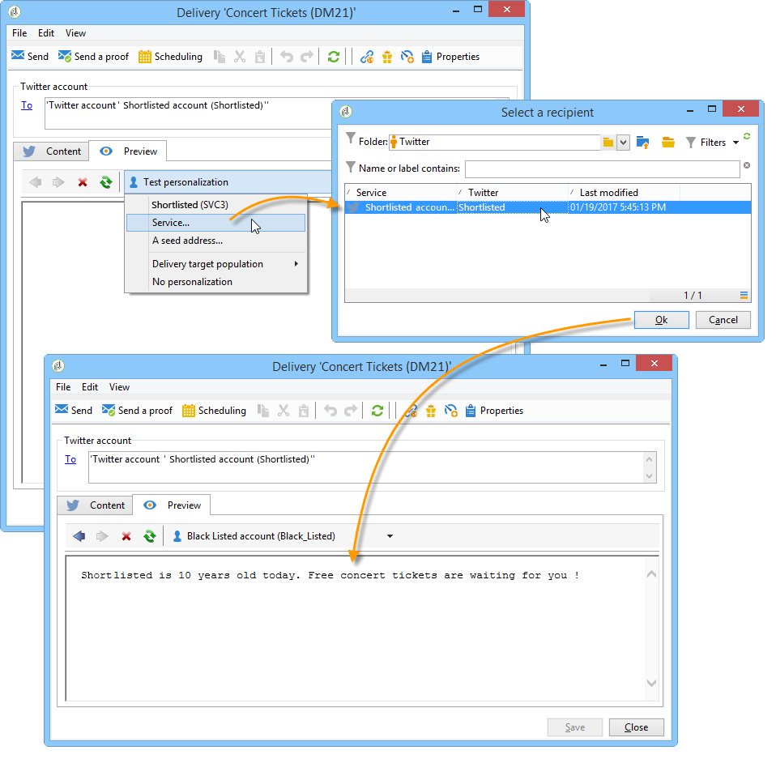

# Publicar no Twitter{#publishing-on-twitter}

## Publicar em suas contas do Twitter {#publishing-on-your-twitter-accounts}

Quando a configuração é concluída, o Social Marketing permite que você envie tweets para suas contas do Twitter.

### Limitações {#limitations}

As limitações a seguir são restrições inerentes ao Twitter.

* A mensagem não pode exceder 140 caracteres.
* O formato HTML não é aceito.

### Criação de delivery {#creating-the-delivery}

Crie um novo delivery com base no template de delivery **[!UICONTROL Tweet (twitter)]**.

### Seleção do target principal {#selecting-the-main-target}

Selecione as contas para as quais deseja enviar tweets.

1. Clique no link **[!UICONTROL To]**.

   

1. Clique no botão **[!UICONTROL Add]**.

   

1. Selecione **[!UICONTROL A Twitter account]**.

   

1. No campo **[!UICONTROL Folder]** selecione a pasta de serviço que contém a conta do Twitter. Em seguida selecione a conta do Twitter para a qual deseja enviar o tweet.

   

### Seleção do target da prova {#selecting-the-target-of-the-proof}

A guia **[!UICONTROL Target of the proofs]** permite definir a conta do Twitter a ser usada para deliveries de teste antes do delivery final. Portanto, recomendamos que você crie uma conta privada do Twitter dedicada ao envio de provas. Para obter mais informações sobre como criar uma conta privada no Twitter, consulte [Criação de uma conta de teste no Twitter](../../social/using/configuring-publishing-on-twitter.md#creating-a-test-account-on-twitter). As etapas para selecionar o target de prova são as mesmas que para selecionar o target principal. Consulte [Criação de uma conta de teste no Twitter](../../social/using/configuring-publishing-on-twitter.md#creating-a-test-account-on-twitter).

>[!NOTE]
>
>Se estiver usando a mesma conta de teste do Twitter para todos os deliveries, você pode salvar o target de prova no template de delivery **[!UICONTROL Tweet]**, acessível pelo nó **[!UICONTROL Resources > Templates > Delivery templates]**. O target de prova será preenchido por padrão para cada novo delivery.

### Definir o conteúdo da mensagem {#defining-the-message-content}

Digite o conteúdo do tweet na guia **[!UICONTROL Content]**.

### Exibir a pré-visualização {#viewing-the-preview}

A guia **[!UICONTROL Preview]** permite visualizar a renderização do tweet.

1. Clique na guia **[!UICONTROL Preview]**.
1. Clique no menu suspenso **[!UICONTROL Test personalization]** e selecione **[!UICONTROL Service]**.
1. No campo **[!UICONTROL Folder]**, selecione a pasta de serviço que contém a conta do Twitter.
1. Escolha a conta do Twitter com a qual deseja testar a visualização.

>[!NOTE]
>
>A visualização pode diferir levemente do tweet final. É recomendado enviar uma prova antes do delivery final para visualizar uma renderização exata do tweet. Consulte [Sending the proof](#sending-the-proof).

### Configuração do rastreamento {#configuring-tracking}

O rastreamento pode ser exibido nos relatórios do delivery e na guia **[!UICONTROL Edit > Tracking]** do delivery e do serviço.

A configuração de rastreamento é a mesma de um delivery de email. Para obter mais informações, consulte [esta seção](../../delivery/using/monitoring-a-delivery.md).

>[!NOTE]
>
>No template de delivery **[!UICONTROL Tweet]**, o rastreamento é ativado por padrão.

>[!IMPORTANT]
>
>Não podemos diferenciar entre robôs que analisam tweets e usuários que estão realmente clicando.

### Envio de uma prova {#sending-the-proof}

Recomendamos enviar uma prova da sua publicação antes do delivery final para obter uma renderização exata da publicação em uma página de teste privada do Twitter. Para obter mais informações sobre como criar uma conta privada no Twitter, consulte [Criação de uma conta de teste no Twitter](../../social/using/configuring-publishing-on-twitter.md#creating-a-test-account-on-twitter). As etapas para selecionar o destino do target são detalhadas em [Selecionar o target da prova](#selecting-the-target-of-the-proof).

O delivery da prova é idêntico aos deliveries por email. Consulte [esta seção](../../delivery/using/steps-validating-the-delivery.md#sending-a-proof).

### Envio da mensagem {#sending-the-message}

1. Depois que o conteúdo for aprovado, clique no botão **[!UICONTROL Send]**.
1. Selecione **[!UICONTROL Deliver as soon as possible]** e clique no botão **[!UICONTROL Analyze]**.

   >[!NOTE]
   >
   >A opção **[!UICONTROL Postpone the delivery]** permite adiar o delivery para uma data posterior.

   

1. Quando a análise for concluída, verifique o resultado.
1. Clique em **[!UICONTROL Confirm delivery]** e depois em **[!UICONTROL Yes]**.

## Enviar mensagens diretas aos assinantes {#sending-direct-messages-to-subscribers}

### Princípio operacional {#operating-principle}

O workflow **[!UICONTROL Synchronize Twitter accounts]** (consulte [Sincronizar contas do Twitter](../../social/using/configuring-publishing-on-twitter.md#synchronizing-twitter-accounts)) recupera a lista de assinantes do Twitter para que você possa enviar mensagens diretas a eles. Os seguidores recuperados são armazenados em uma tabela específica: a tabela de visitantes. Para exibir a lista de seguidores do Twitter, vá para o nó **[!UICONTROL Profiles and Targets > Visitors]**.

>[!IMPORTANT]
>
>Para que o fluxo de trabalho recupere a lista de seguidores do Twitter, a caixa **[!UICONTROL Synchronize Twitter accounts]** deve ser marcada na tela Edit do serviço vinculado à conta. Para obter mais informações, consulte: [Delegando acesso de gravação ao Adobe Campaign](../../social/using/configuring-publishing-on-twitter.md#delegating-write-access-to-adobe-campaign).

Para cada seguidor, o Adobe Campaign recupera as seguintes informações:

* **[!UICONTROL Origin]**: nome da rede social (**Twitter** neste caso)
* **[!UICONTROL External ID]**: identificador do usuário
* **[!UICONTROL User name]**: nome da conta do usuário
* **[!UICONTROL Full name]**: nome do usuário
* **[!UICONTROL Language]**: idioma do usuário
* **[!UICONTROL Number of friends]**: número de seguidores
* **[!UICONTROL Time zone]**: fuso horário do usuário
* **[!UICONTROL Verified]**: este campo indica se o usuário tem uma conta verificada do Twitter

### Limitações {#limitations-1}

As limitações a seguir são restrições inerentes ao Twitter.

* A mensagem não pode exceder 140 caracteres.
* HTML não é aceito.
* Não é possível enviar mais de 250 mensagens diretas por dia. Para não exceder esse limite, é possível entregar em várias ondas. Os deliveries em ondas são configurados como deliveries por email. Para obter mais informações, consulte [esta seção](../../delivery/using/steps-sending-the-delivery.md#sending-using-multiple-waves).

### Criação de delivery {#creating-the-delivery-}

Crie um novo delivery com base no template de delivery **[!UICONTROL Tweet (Direct Message)]**.

### Seleção do target principal {#selecting-the-main-target-1}

Selecione os seguidores para os quais deseja enviar a mensagem direta.

1. Clique no link **[!UICONTROL To]**.

   

1. Clique no botão **[!UICONTROL Add]**.

   

1. Selecione um tipo de direcionamento.

   

   * Selecione **[!UICONTROL Twitter subscribers]** para enviar uma mensagem direta a todos os seguidores da conta.

      >[!IMPORTANT]
      >
      >Não é possível enviar mais que 250 mensagens por dia. Se sua conta do Twitter tiver mais de 250 seguidores, recomendamos enviar em ondas. Isso envolve o mesmo processo que deliveries por email. Consulte [esta seção](../../delivery/using/steps-sending-the-delivery.md#sending-using-multiple-waves).

   * Selecione **[!UICONTROL Filter conditions]** para definir uma consulta e visualizar seu resultado. Essa opção é a mesma para deliveries por email. Consulte [esta seção](../../platform/using/defining-filter-conditions.md) para obter mais informações.

      

### Seleção do target da prova{#selecting-the-target-of-the-proof-1}

A guia **[!UICONTROL Target of the proofs]** permite selecionar o seguidor que receberá a prova da mensagem direta. O processo de seleção é o mesmo que para o target principal. Consulte [Seleção do target principal](#selecting-the-main-target).

>[!NOTE]
>
>Se desejar enviar todas as provas de mensagem direta para o mesmo seguidor do Twitter, você pode salvar o público alvo de prova no template de delivery **[!UICONTROL Tweet (Direct Message)]**, acessível através do nó **[!UICONTROL Resources > Templates > Delivery templates]**. O target de prova será preenchido por padrão para cada novo delivery.

### Definição do conteúdo da mensagem {#defining-message-content-}

Digite o conteúdo do tweet na guia **[!UICONTROL Content]**.

Campos de personalização podem ser usados da mesma forma que para deliveries por email, por exemplo, para adicionar o nome do seguidor no corpo da mensagem. A personalização de conteúdo é detalhada [nesta seção](../../delivery/using/about-personalization.md).

As etapas a seguir são as mesmas para enviar um tweet a uma conta do Twitter. Consulte [Publicar em suas contas do Twitter](#publishing-on-your-twitter-accounts).
