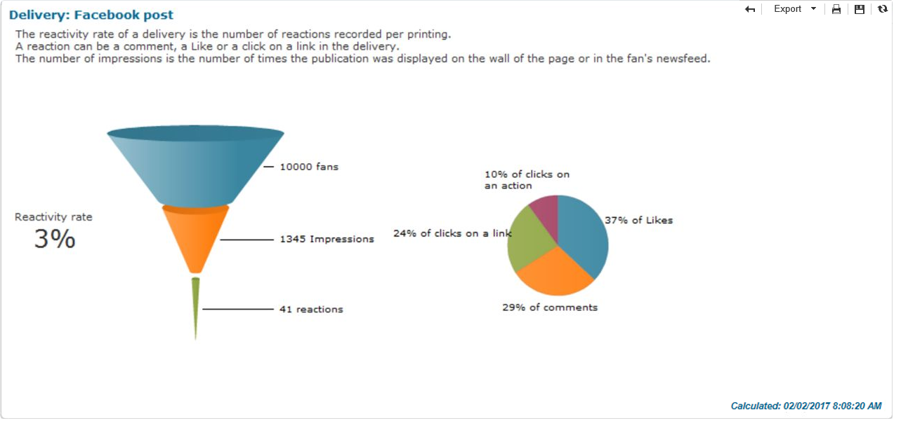

# Rastreamento{#tracking}

O Social Marketing fornece relatórios que permitem medir a taxa de reatividade de delivery do Facebook e do Twitter e analisar a aquisição de perfis do Facebook. Os seguintes relatórios estão disponíveis:

* O relatório **[!UICONTROL Reactivity rate]**, disponível na guia **[!UICONTROL Summary]** de um delivery do Facebook ou Twitter.

   

* O relatório **[!UICONTROL Reactivity rate]**, disponível na guia **[!UICONTROL Dashboard]** de um serviço do Twitter ou Facebook.

   

* O relatório **[!UICONTROL Fan acquisition]**, disponível na guia **[!UICONTROL Dashboard]** de um serviço do Facebook.

   
