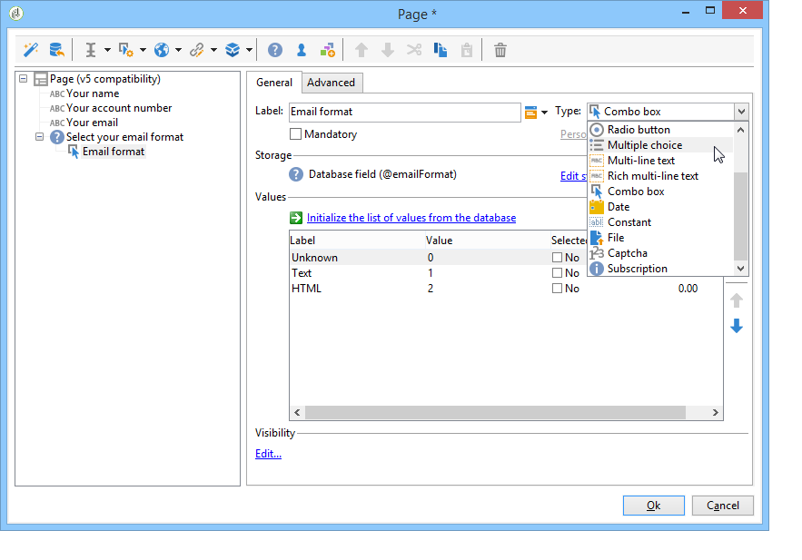

# Criar uma pesquisa{#building-a-survey}

## Criar uma nova pesquisa {#creating-a-new-survey}

Este capítulo detalha o design de um formulário do tipo de **Pesquisa** usando o Adobe Campaign, bem como as opções e configurações disponíveis. O Adobe Campaign permite disponibilizar essa pesquisa aos usuários e coletar e arquivar respostas no banco de dados.

Os formulários web são acessados por meio do nó **[!UICONTROL Resources > Online > Web applications]** da árvore. Para criar uma pesquisa, clique no botão **[!UICONTROL New]** acima da lista de aplicativos ou clique com o botão direito do mouse na lista e escolha **[!UICONTROL New]**.

Selecione o modelo de pesquisa (**[!UICONTROL newSurvey]** por padrão).

As páginas do formulário são criadas usando um editor especial que permite definir e configurar campos de entrada (texto), campos de seleção (listas, caixas de seleção etc.) e elementos estáticos (imagens, conteúdo HTML etc.). Elas podem ser coletadas em &quot;containers&quot; e dispostas de acordo com os requisitos. [Saiba mais](#adding-questions)).

>[!NOTE]
>
>Para obter mais informações sobre como definir conteúdo e criar layouts de tela para um formulário Web, consulte [este documento](../../web/using/about-web-forms.md).

## Adicionar campos {#adding-fields}

Os campos em um formulário permitem aos usuários inserir informações e selecionar opções. Para cada página no formulário, eles são criados por meio do primeiro botão na barra de ferramentas através do menu **[!UICONTROL Add using the wizard]**.

>[!NOTE]
>
>Você também pode usar um clique com o botão direito do mouse e inserir uma zona de entrada. Por padrão, a zona é inserida no final da árvore selecionada. Use as setas na barra de ferramentas para movê-la.

### Tipos de campos {#types-of-fields}

Ao adicionar um campo a uma pesquisa, você precisa selecionar seu tipo. As seguintes opções estão disponíveis:

1. **[!UICONTROL Answer a question]**: essa opção permite declarar um novo campo (conhecido como &quot;campo arquivado&quot;) para armazenar respostas. Nesse caso, todos os valores coletados são salvos, até mesmo quando um participante preenche um formulário mais de uma vez. Este modo de armazenamento está disponível somente em **Pesquisas**. [Saiba mais](../../surveys/using/managing-answers.md#storing-collected-answers).
1. **[!UICONTROL Edit a recipient]**: essa opção permite selecionar um campo no banco de dados. Nesse caso, as respostas do usuário serão armazenadas nesse campo. Para cada participante, somente o último valor salvo é mantido e adicionado aos dados do perfil.
1. **[!UICONTROL Add a variable]**: essa opção permite criar uma configuração para que as informações não sejam armazenadas no banco de dados. As variáveis locais podem ser declaradas como upstream. Você também pode adicioná-las diretamente ao criar o campo.
1. **[!UICONTROL Import an existing question]**: essa opção permite importar perguntas existentes criadas em outras pesquisas.

   >[!NOTE]
   >
   >Os modos de armazenamento e importações de campo são detalhados [nesta seção](../../surveys/using/managing-answers.md#storing-collected-answers).

A natureza do campo a ser adicionado (lista suspensa, campo de texto, caixas de seleção etc.) se adapta ao modo de armazenamento selecionado. É possível alterá-lo por meio do campo **[!UICONTROL Type]** da guia **[!UICONTROL General]**, mas mantenha a consistência com o tipo de dados.

Os vários tipos de campos disponíveis são detalhados [nesta seção](../../web/using/about-web-forms.md).

## Elementos específicos da pesquisa {#survey-specific-elements}

As pesquisas online têm como base os recursos de aplicativos Web. Os recursos específicos da pesquisa são detalhados abaixo.

### Múltipla escolha {#multiple-choice}

Para controles do tipo **[!UICONTROL Multiple choice]**, é possível definir um número mínimo e máximo de seleções. Por exemplo, essa opção permite forçar a seleção de pelo menos **2** valores e no máximo **4** valores das opções disponíveis:

Se o número de seleções for muito grande ou muito pequeno, a mensagem apropriada será exibida.

>[!NOTE]
>
>Nesse caso, as opções são selecionadas usando caixas de seleção. Quando apenas uma opção é possível, os botões de opção são usados.

A configuração correspondente é a seguinte:

Além disso, o local de armazenamento para esse campo de entrada deve ser de **[!UICONTROL Multiple values]** do tipo **archived field**:

>[!CAUTION]
>
>* Essa funcionalidade só está disponível para formulários do tipo **Pesquisa**.
>* Essa opção não é compatível com a exibição de pergunta aleatória. [Saiba mais](#adding-questions).

### Adicionar perguntas {#adding-questions}

Há dois tipos de containers: padrão e pergunta. Os containers padrão são usados para configurar o layout da página e a exibição condicional em uma página. [Saiba mais](../../web/using/about-web-forms.md).

Use um container **Pergunta** para adicionar uma pergunta à página e inserir as respostas possíveis abaixo na hierarquia. As respostas do usuário às perguntas colocadas nesse tipo de container podem ser analisadas em relatórios.

>[!CAUTION]
>
>Nunca insira um container **Pergunta** abaixo de outro container **Pergunta** na hierarquia.

O rótulo da pergunta é inserido no campo de rótulo. Nesse caso, o estilo da folha de estilos do formulário será aplicado. Selecione a opção **[!UICONTROL Enter the title in HTML format]** para personalizar. Isso dará acesso ao editor de HTML.

>[!NOTE]
>
>Consulte [este documento](../../web/using/about-web-forms.md) para obter informações sobre como usar o editor de HTML.

Por exemplo:

No exemplo acima, a renderização será a seguinte:

>[!NOTE]
>
>Todas as perguntas têm um container do tipo **Pergunta**.

Você pode habilitar o desenho aleatório de perguntas pelo Adobe Campaign. É possível especificar o número de perguntas a serem exibidas na página, no campo localizado na parte inferior da janela de configuração.

A renderização terá esta aparência:

Quando a página é atualizada, as perguntas exibidas não são as mesmas.

>[!CAUTION]
>
>Ao exibir uma pergunta aleatória (opção **[!UICONTROL Display randomly]** marcada na página), não use perguntas de múltipla escolha para as quais uma ou mais seleções são obrigatórias.
