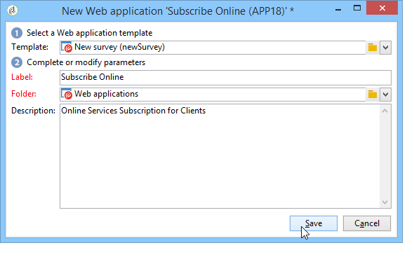

# Etapas principais para criar uma pesquisa{#getting-started-with-surveys}

A seguir há uma visão geral rápida das principais etapas para criar uma pesquisa simples, usando o seguinte modelo incorporado:

São elas:

1. [Etapa 1 — criação de uma pesquisa](#step-1---creating-a-survey),
1. [Etapa 2 — seleção do modelo](#step-2---selecting-the-template),
1. [Etapa 3 — criação da pesquisa](#step-3---building-the-survey),
1. [Etapa 4 — criação do conteúdo da página](#step-4---creating-the-page-content),
1. [Etapa 5 — armazenamento dos dados da pesquisa](#step-5---storing-the-survey-data-),
1. [Etapa 6 — publicação das páginas](#step-6---publishing-the-pages),
1. [Etapa 7 — compartilhamento da pesquisa online](#step-7---sharing-your-online-survey).

## Etapa 1 — criação de uma pesquisa {#step-1---creating-a-survey}

Para criar uma nova pesquisa, vá para a guia **[!UICONTROL Campaigns]** ou **[!UICONTROL Profiles and targets]** e clique no menu **[!UICONTROL Web Applications]**. Clique no botão **[!UICONTROL Create]** acima da lista de formulários.

## Etapa 2 — seleção do modelo {#step-2---selecting-the-template}

Selecione um template de pesquisa e nomeie a pesquisa. Esse nome não será visto pelos usuários finais, mas permite a identificação da pesquisa no Adobe Campaign. Clique em **[!UICONTROL Save]** para adicionar a pesquisa à lista de aplicações Web.

## Etapa 3 — criação da pesquisa {#step-3---building-the-survey}

As pesquisas são criadas em um diagrama no qual os seguintes elementos são posicionados: a(s) página(s) onde o conteúdo será criado, o pré-carregamento de dados e as etapas de salvamento e as fases de teste. Scripts e queries também podem ser inseridos.

Para criar o gráfico, clique no formulário **[!UICONTROL Edit]** da pesquisa.

Uma pesquisa deve conter **pelo menos** três componentes: uma página, uma caixa de armazenamento e uma página final.

* Para criar uma página, selecione o objeto da **[!UICONTROL Page]** na seção à esquerda do editor e o coloque na seção intermediária, conforme mostrado abaixo:

   

* Em seguida, selecione o objeto de **[!UICONTROL Storage]** e o coloque na transição de saída da página.
* Finalmente, selecione o objeto do **[!UICONTROL End]** e o coloque no final da transição de saída da caixa de armazenamento para obter o diagrama a seguir:

   

## Etapa 4 — criação do conteúdo da página {#step-4---creating-the-page-content}

No exemplo a seguir, estamos usando uma página do tipo **[!UICONTROL Page (v5 compatibility)]**. Esse tipo de página é acessado por meio do menu avançado da guia **[!UICONTROL Edit]**.

* **Adicionar campos de entrada**

   Para criar o conteúdo da página, você deve editá-lo: para fazer isso, clique duas vezes no objeto **[!UICONTROL Page]**. Clique no primeiro ícone na barra de ferramentas para abrir o assistente de criação de campo. Para criar um campo de entrada para o nome de usuário a ser armazenado no campo correspondente do perfil do recipient, selecione **[!UICONTROL Edit a recipient]**.

   

   Clique no botão **[!UICONTROL Next]** para selecionar o campo para armazenamento de dados no banco de dados. Nesse caso, o campo &quot;Sobrenome&quot;.

   

   Clique em **[!UICONTROL Finish]** para confirmar a criação do campo.

   Por padrão, quando as informações são armazenadas em um campo já existente no banco de dados, o campo assume o nome do campo selecionado, ou seja, &quot;Sobrenome&quot; neste exemplo. Você pode modificar esse rótulo conforme mostrado abaixo:

   

   Agora, crie um campo de entrada para o número da conta de usuário. Repita a operação e selecione o campo &quot;Número da conta&quot;.

   Siga o mesmo procedimento para adicionar um campo para o usuário inserir um endereço de email.

* **Criar uma pergunta**

   Para criar uma pergunta, clique com o botão direito do mouse no último elemento da árvore e selecione **[!UICONTROL Containers > Question]** ou clique no ícone **[!UICONTROL Containers]** e selecione **[!UICONTROL Question]**.

   

   Insira o rótulo da pergunta e insira o(s) campo(s) de resposta como sub-ramificações da pergunta. Para fazer isso, o nó vinculado à pergunta deve ser selecionado ao criar o campo de resposta. Adicione um **[!UICONTROL drop-down listx]** usando o ícone **[!UICONTROL Selection controls]** ou clicando com o botão direito do mouse, como mostrado abaixo:

   

   Selecione um espaço de armazenamento: selecione um campo de enumeração para recuperar os valores automaticamente (o formato do email, nesse caso).

   

   Na guia **[!UICONTROL General]**, clique no link **[!UICONTROL Initialize the list of values from the database]**: a tabela de valores é inserida automaticamente.

   

   Clique em **[!UICONTROL OK]** para fechar o editor e em **[!UICONTROL Save]** salvar as alterações.

   >[!NOTE]
   >
   >Para cada campo ou pergunta, você pode adaptar o layout da página para atender às suas necessidades, graças às opções na guia **[!UICONTROL Advanced]**. O layout das telas de pesquisa é detalhado [nesta seção](../../web/using/about-web-forms.md).

   Na tela de detalhes, clique na guia **[!UICONTROL Preview]** para exibir a renderização da pesquisa recém-criada.

   

## Etapa 5 — armazenamento dos dados da pesquisa {#step-5---storing-the-survey-data-}

A caixa de armazenamento permite salvar as respostas do usuário no banco de dados. Você deve selecionar uma chave de reconciliação para identificar os perfis já existentes no banco de dados.

Para fazer isso, edite a caixa e selecione o campo que será usado como uma chave de reconciliação quando os dados forem armazenados.

No exemplo abaixo, ao salvar (confirmação), se um perfil for salvo no banco de dados com o mesmo número da conta que a entrada no formulário, o perfil será atualizado. Se o perfil não existir, ele será criado.

Clique em **[!UICONTROL OK]** para confirmar e, em seguida, clique em **[!UICONTROL Save]** para salvar a pesquisa

## Etapa 6 — publicação das páginas {#step-6---publishing-the-pages}

Para que os usuários possam acessar as páginas HTML, a aplicação deve ser disponibilizada. Ela não deve estar mais no estágio de edição, mas no de produção. Para colocar uma pesquisa em produção, você deve publicá-la. Para fazer isso:

* Clique no botão **[!UICONTROL Publish]** localizado acima do painel de pesquisa.
* Clique em **[!UICONTROL Start]** para iniciar a publicação e fechar o assistente.

   

   O status da pesquisa muda para **online**.

   

## Etapa 7 — compartilhamento da pesquisa online {#step-7---sharing-your-online-survey}

Quando estiver em produção, a pesquisa é acessível no servidor e você pode entregá-la. A URL para acessar a pesquisa é exibida no painel.

Para entregar a pesquisa, você pode enviar uma mensagem contendo um link de acesso ao público alvo ou colocar a URL de acesso da pesquisa em uma página da Web, por exemplo.

Você pode monitorar as respostas do usuário por meio de relatórios e logs. Consulte [Monitoramento de resposta](../../surveys/using/publish--track-and-use-collected-data.md#response-tracking).

>[!CAUTION]
>
>A URL pública inclui o nome interno da pesquisa. Quando o nome interno é modificado, a URL é atualizada automaticamente: todos os links para a pesquisa também devem ser atualizados.
>
>Se os deliveries que contêm o link para o formulário já tiverem sido enviados, este link não funcionará mais.
