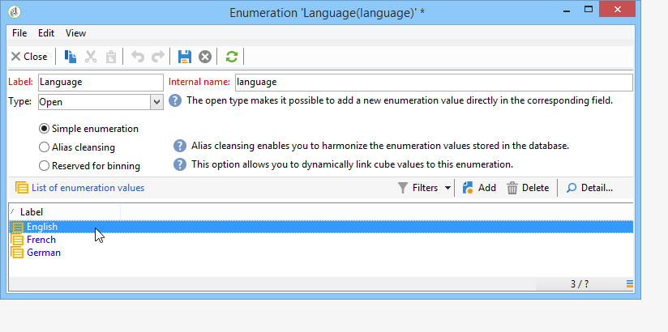

# Gerenciar respostas{#managing-answers}


## Armazenar respostas coletadas {#storing-collected-answers}

Além dos modos de armazenamento padrão comuns a todos os formulários Web no Adobe Campaign (campo de banco de dados e variável local), as pesquisas permitem a extensão dinâmica do modelo de dados usando campos arquivados.

>[!CAUTION]
>
>Esta opção está disponível somente para aplicações Web do tipo **Pesquisa.** Não é oferecido para outros tipos de formulários Web.

### Armazenamento em um campo arquivado {#storing-in-an-archived-field}

É fácil estender o modelo de dados adicionando novos espaços de armazenamento para salvar as respostas fornecidas em pesquisas. Para fazer isso, marque a opção **[!UICONTROL Store answers to a question]** ao criar o campo de entrada. Clique no link **[!UICONTROL New field...]** e forneça suas propriedades:


Insira o rótulo e o nome do campo e selecione o tipo de campo: Texto, Booliano, Número inteiro ou decimal, Data, etc.

O tipo de campo selecionado envolve um controle dos dados quando as respostas são inseridas por usuários. Para campos de **texto**, é possível adicionar uma restrição (letra maiúscula, formato) ou um link a uma enumeração existente para forçar a seleção.

Para adicionar uma restrição, selecione-a na lista suspensa. Há dois tipos de restrições:

1. Caixa de caracteres

   As informações inseridas podem ser armazenadas no campo nos seguintes formatos: todas maiúsculas, todas minúsculas ou com letra inicial maiúscula. Essa restrição não exige que o usuário insira os dados no formato selecionado, mas o conteúdo inserido no campo será convertido quando salvo.

1. Formato dos dados

Se esse campo for usado em uma lista, os valores da enumeração poderão ser recuperados automaticamente na tabela de valores usando o link **[!UICONTROL Initialize the list of values from the database]**, acima da lista de valores.

Por exemplo, é possível criar uma lista suspensa para o usuário selecionar seu idioma nativo. O campo arquivado correspondente pode ser associado à enumeração de **idioma** que contém uma lista de idiomas:


O ícone **[!UICONTROL Edit link]**, localizado à direita do campo, permite editar o conteúdo desta enumeração:



Na guia **[!UICONTROL General]** do campo, o link **[!UICONTROL Initialize the list of values from the database]** permite inserir automaticamente a lista de rótulos oferecidos.


**Exemplo**: armazenamento dos contratos de um recipient em um campo

Para armazenar diferentes tipos de contratos em um campo, crie um campo de entrada **[!UICONTROL Text]** e selecione a opção **[!UICONTROL Store answers to a question]**.

Clique no link **[!UICONTROL New field...]** e insira as propriedades do campo. Selecione a opção **[!UICONTROL Multiple values]** para habilitar o armazenamento de vários valores.


Crie campos de entrada para outros contratos e armazene os dados no mesmo campo arquivado.


Quando os usuários aprovarem a pesquisa, suas respostas serão armazenadas no campo **[!UICONTROL Contracts]**.

Em nosso exemplo, para as seguintes respostas:


O perfil do entrevistado conterá os quatro contratos inseridos.

Elas podem ser visualizadas na guia **[!UICONTROL Answers]** da pesquisa ao exibir as colunas relevantes.


Você também pode filtrar recipients com base em respostas para exibir apenas os usuários que interessam a você. Para fazer isso, crie um workflow de direcionamento e use a caixa **[!UICONTROL Survey responses]**.


Crie o query com base nos perfis que você deseja recuperar. No exemplo a seguir, o query permite selecionar perfis com pelo menos dois contratos, incluindo um contrato do tipo A.


Para cada formulário, as respostas fornecidas podem ser usadas em campos ou rótulos. Use a sintaxe a seguir para o conteúdo armazenado em um campo arquivado:

```
<%= ctx.webAppLogRcpData.name of the archived field %
```

>[!NOTE]
>
>Para outros tipos de campos, a sintaxe é detalhada [nesta seção](../../platform/using/about-queries-in-campaign.md).

### Configurações de armazenamento {#storage-settings}

É possível arquivar respostas de pesquisas em formato XML. Isso permite salvar uma cópia bruta das respostas coletadas, o que pode ser útil caso haja uma padronização excessiva dos dados em uma lista discriminada. [Saiba mais](../../surveys/using/publish--track-and-use-collected-data.md#standardizing-data)

>[!CAUTION]
>
>O arquivamento de respostas brutas interfere no espaço de armazenamento necessário. Use essa opção com cuidado.

Para fazer isso:

* Edite as propriedades da pesquisa por meio do botão **[!UICONTROL Properties]** da guia **[!UICONTROL Edit]**.
* Clique no link **[!UICONTROL Advanced parameters]** e marque a opção **[!UICONTROL Save a copy of raw answers]**.


Você pode habilitá-lo por padrão para todas as pesquisas (esta opção é aplicada quando a pesquisa é publicada). Para fazer isso, crie a opção **[!UICONTROL NmsWebApp_XmlBackup]** e atribua o valor **[!UICONTROL 1]** a ela, conforme mostrado abaixo:


## Gerenciamento de pontuação {#score-management}

Você pode atribuir uma pontuação às opções oferecidas nas páginas do formulário. As pontuações só podem ser vinculadas a perguntas fechadas: caixa de seleção, valor de uma lista suspensa, subscrição e etc.


As pontuações são acumuladas e salvas no lado do servidor ao confirmar a página, ou seja, quando o usuário clica no botão **[!UICONTROL Next]** ou **[!UICONTROL Finish]**.

>[!NOTE]
>
>Você pode usar valores positivos ou negativos, inteiros ou não inteiros.

As pontuações podem ser usadas em testes ou scripts.

>[!CAUTION]
>
>As pontuações não podem ser usadas nas condições de visibilidade para campos que estão na mesma página. No entanto, elas podem ser usadas nas páginas subsequentes.

* Para usar pontuações em testes, use o campo **[!UICONTROL Score]** na fórmula de cálculo de teste, conforme mostrado abaixo:

   

* Você pode usar a pontuação em um script.

**Exemplo**: calcule uma pontuação e use-a como uma condição para a exibição da próxima página:

* Em uma pesquisa, a próxima página permite atribuir pontuações diferentes aos usuários, dependendo do valor selecionado na lista suspensa:

   

* Você pode combinar essa pontuação com um segundo valor, dependendo da opção selecionada:

   

* Quando o usuário clica no botão **[!UICONTROL Next]**, os dois valores são somados.

   

* As condições podem ser aplicadas para que a página seja exibida de acordo com a pontuação. Isso é configurado da seguinte maneira:

   

   
