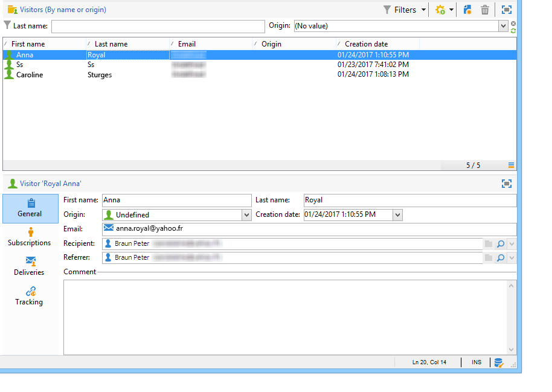

# Caso de uso: criar um formulário de indicação{#use-case-creating-a-refer-a-friend-form}


Neste exemplo, queremos oferecer uma competição aos recipients do banco de dados. O formulário Web terá uma seção para inserir respostas e outra para indicar um amigo inserindo seu endereço de email.


Os blocos de identificação e concorrência são criados usando os processos descritos anteriormente.

Para configurar e criar o bloco de referência, siga as etapas abaixo:

1. Crie um formulário Web de competição com perguntas e um campo para inserir as informações de contato de um amigo, conforme mostrado abaixo:

   

   O campo **Sua mensagem** permite inserir uma mensagem para o indicado. Quem indicou também deve inserir seu **Sobrenome**, **Nome** e **Email**.

   As informações inseridas nos campos são armazenadas em uma tabela específica conhecida como tabela do visitante.

   >[!NOTE]
   >
   >Se o recipient não tiver consentido, você não pode armazená-lo com os recipients no banco de dados. Ele será armazenado temporariamente na tabela de **visitante** (**nms:visitor**) criada para campanhas de marketing viral. Essa tabela é removida regularmente graças às operações de **limpeza**.
   >
   >Neste exemplo, queremos direcionar os recipients para sugerir que façam parte da competição recomendada por quem indicou. No entanto, nessa mensagem, também queremos oferecer uma subscrição de um de nossos serviços de informação. Caso se subscrevam, eles podem ser armazenados no banco de dados.

   

   O conteúdo dos campos relacionados ao indicado será usado no script de criação de perfil e na mensagem enviada para eles.

1. Comece criando um script para vincular quem indicou ao indicado.

   Ele contém as seguintes instruções:

   

   ```
   ctx.recipient.visitor.@id = xtk.session.GetNewIds(1)
   ctx.recipient.visitor.@forwardUrl = "APP5"
   ctx.recipient.visitor.@referrerEmail = ctx.recipient.@email
   ctx.recipient.visitor.@referrerFirstName = ctx.recipient.@firstName
   ctx.recipient.visitor.@referrerLastName = ctx.recipient.@lastName
   ```

   O sobrenome, o nome e o endereço de email inseridos no bloco de identificação da página são identificados como o sobrenome, nome e endereço de email de quem indicou. Esses campos serão reintroduzidos no corpo da mensagem enviada ao indicado.

   O valor APP5 corresponde ao nome interno do formulário Web: essas informações permitem descobrir a origem do indicado, ou seja, vincular o visitante ao formulário Web com base no qual foi criado.

1. A caixa de armazenamento permite coletar informações e armazená-las no banco de dados.

   

1. Em seguida, crie o template do delivery vinculado ao serviço de informação criado durante a etapa 1. Ele será selecionado no campo **[!UICONTROL Choose scenario]** do serviço de informações.

   O template do delivery usado para criar a mensagem de oferta de referência contém as seguintes informações:

   

   Esse template tem as seguintes características:

   * Selecione a tabela do visitante como target mapping.

      

   * As informações de contato do indicado e as informações de quem indicou são obtidas na tabela do visitante. Elas são inseridas usando o botão de personalização.

      

   * Esse template contém um link para o formulário da competição e o link de subscrição para o indicado se subscrever no boletim informativo.

      O link de subscrição é inserido por um bloco de personalização. Por padrão, ele permite subscrever perfis no serviço de **boletim informativo.** Esse bloco de personalização pode ser alterado para atender a sua necessidade, por exemplo, para subscrever o recipient a um serviço diferente.

   * O nome interno (&quot;quem indicou&quot; aqui) será usado no script de delivery da mensagem conforme mostrado abaixo.
   >[!NOTE]
   >
   >Consulte [esta página](../../delivery/using/about-templates.md) para obter mais informações sobre templates do delivery.

1. Crie o segundo script para entregar as mensagens de subscrição.

   

   ```
   // Updtate visitor to have a link to the referrer recipient
   ctx.recipient.visitor.@referrerId = ctx.recipient.@id
   ctx.recipient.visitor.@xtkschema = "nms:visitor"
   ctx.recipient.visitor.@_operation = "update" 
   ctx.recipient.visitor.@_key = "@id" 
   xtk.session.Write(ctx.recipient.visitor)
   
   // Send email to friend
   nms.delivery.QueueNotification("referrer",
   <delivery>
   <targets>
     <deliveryTarget>
       <targetPart type='query' exclusion='false' ignoreDeleteStatus='false'>
         <where>
           <condition expr={'@id IN ('+ ctx.recipient.visitor.@id +')' }/>
         </where>
       </targetPart>
      </deliveryTarget>
     </targets>
    </delivery>)
   ```

1. Publique o formulário da competição e envie um convite para os recipients do público alvo inicial. Quando um deles convida um amigo, um delivery com base no template de **oferta de indicação** é criado.

   

   O indicado é adicionado à pasta do visitante no **[!UICONTROL Administration > Visitors node]**:

   

   Seu perfil contém as informações inseridas por quem indicou. Ele é armazenado com base nas configurações inseridas no script de formulário. Se decidirem subscrever o boletim informativo, eles serão salvos na tabela de recipients.
