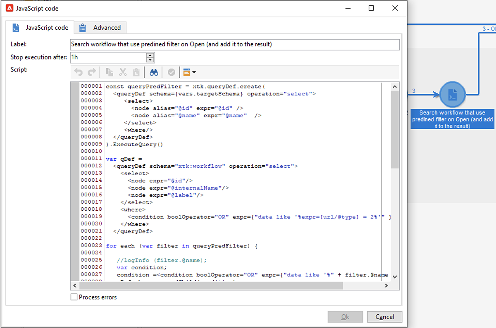
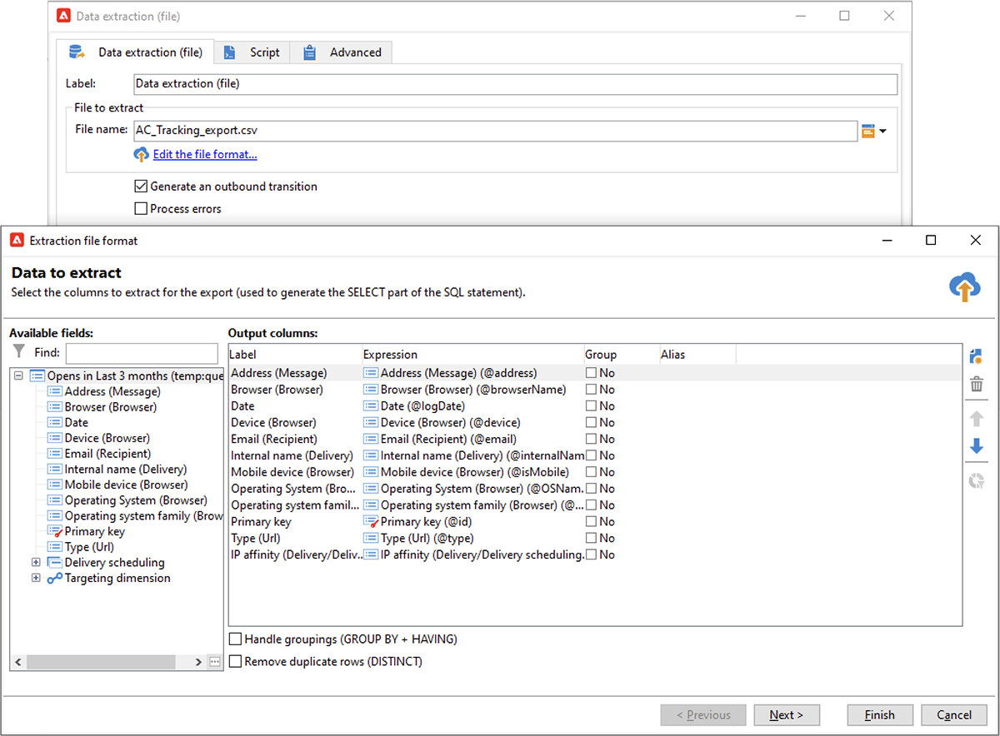

# Proteção de privacidade de email no aplicativo de email do Apple


## O que mudou?

Em 2021, o Apple apresentou novos recursos de proteção de privacidade para seu aplicativo de email nativo. Este aplicativo agora inclui o recurso Proteção de privacidade de email do Apple. Basicamente, os remetentes não podem mais usar o rastreamento de pixels para coletar informações sobre os recipients que optaram por ativar o recurso de Proteção de privacidade de email do Apple.

## Como minhas campanhas são afetadas?

O Adobe Campaign fornece a capacidade de usar pixels de rastreamento para rastrear aberturas de email. Você pode usar esse recurso não apenas para direcionamento e campanhas, mas também para métricas. Por exemplo, você pode usar as taxas de abertura de email para medir a eficácia da campanha e o engajamento do usuário. Resumindo, a segmentação, o direcionamento e as métricas podem ser afetados em suas campanhas.

## Que ações devo realizar?

O novo recurso da Apple é o formato do que está por vir no setor em termos de proteção da privacidade de email. Recomendamos que você siga as recomendações do Adobe.

### Avalie o impacto dos acionadores da campanha

Avalie como essas alterações afetam os acionadores atuais do Campaign. Identifique os workflows nos quais as aberturas de email são usadas como critério para segmentação, direcionamento ou redirecionamento. Leia o [dicas e truques](#find-email-open-tracking).

### Preservar seus dados

Preserve seus dados e consolide seu conhecimento atual sobre dispositivos. Você pode basear os KPIs (indicadores-chave de desempenho) no agente do usuário. Por exemplo, você pode criar KPIs em torno de perfis de pessoas que usam o iOS e o aplicativo de email da Apple. Leia o [dicas e truques](#preserve-tracking-data).

### Arquivar os logs de rastreamento além do período de retenção

Arquive os logs de rastreamento além do período de retenção do Adobe Campaign:

1. Verifique a duração do período de retenção na instância do Campaign.
1. Verifique novamente os target mappings ativos. Determine se você usa tabelas de perfis personalizadas além da tabela de perfis pronta para uso (`nmsRecipient`).
1. Exporte seus logs de rastreamento do Adobe Campaign. Inclua os logs que contêm dados sobre o agente do usuário e o sistema operacional.

### Avaliar a tendência atual em taxas abertas

Determine qual proporção do público-alvo usa o aplicativo de email do Apple em um dispositivo iOS.
Com essa avaliação, você pode identificar possíveis lacunas anômalas e suas causas. Você pode determinar se uma lacuna se deve a problemas de desempenho da campanha ou à funcionalidade de proteção de privacidade da Apple. Leia o [dicas e truques](#measure-ios-footprint).

### Reavalie sua estratégia de campanha e métricas de desempenho

Acima de tudo, recomendamos que você reavalie proativamente sua estratégia de campanha e suas métricas de desempenho de campanha. Você pode se concentrar novamente em métricas mais confiáveis, por exemplo, click-throughs, visualizações de produto e compras.

Recomendamos explorar os dados disponíveis no momento e avaliar a correlação entre as taxas de abertura e outras métricas. Se essas métricas estiverem correlacionadas consistentemente, você poderá melhorar seus acionadores com um bom nível de confiança.

## Dicas e truques

### Medir o espaço geral do iOS {#measure-ios-footprint}

Para coletar insights dos dados do Adobe Campaign, você pode usar relatórios prontos para uso:

* **[!UICONTROL Operating Systems]** relatório

   Para identificar a proporção de visitantes por sistema operacional e por versão, use este relatório. [Leia mais](../../reporting/using/global-reports.md#operating-systems).

   Você pode visualizar o detalhamento dos visitantes por sistema operacional em relação ao número total de visitantes.

   

   Para cada sistema operacional, é possível visualizar o detalhamento dos visitantes por versão do sistema operacional.

   

* **[!UICONTROL Breakdown of opens]** relatório

   Para identificar a proporção de aberturas de email por sistema operacional, use este relatório. [Leia mais](../../reporting/using/global-reports.md#breakdown-of-opens).

   

### Determine como o rastreamento de abertura de email é usado {#find-email-open-tracking}

Você pode identificar os workflows nos quais as aberturas de email são usadas como critério para segmentação, direcionamento e redirecionamento.

Para fazer isso, você pode usar o **[!UICONTROL type]** atributo do URL do link rastreado (**[!UICONTROL url/@type]**). Para aberturas de email, esse atributo é definido como **[!UICONTROL Open]**. Esse atributo está disponível no Editor de consultas, o **[!UICONTROL Query]** atividade em um fluxo de trabalho e filtros predefinidos. Você pode usar esse atributo como um critério de direcionamento para campanhas de marketing.


Neste exemplo, um profissional de marketing deseja enviar uma oferta de recompensa aos recipients que abriram um email de delivery específico nos últimos sete dias e fizeram uma compra no mês passado. Em queries de workflow, você pode usar aberturas de email de várias maneiras:

* Você pode usar aberturas de email como um critério de direcionamento em uma query.

   Você pode especificar, como uma condição de filtragem, que o tipo de URL dos logs de rastreamento de um delivery específico deve ser definido como **[!UICONTROL Open]**.

   

* Você pode usar um filtro predefinido. [Saiba mais](../../workflow/using/creating-a-filter.md).

   

   Você pode usar esse filtro predefinido em atividades de query em workflows.

   

   >[!NOTE]
   >
   >Em um fluxo de trabalho, não é possível exibir os critérios de direcionamento de um filtro predefinido.

Para recuperar a lista de workflows em que as aberturas de email são usadas como critério de direcionamento, você deve consultar o `xtk:workflow` esquema. O conteúdo do workflow é armazenado na variável **[!UICONTROL XML memo (data)]** no formato XML.


Você pode especificar que os workflows devem incluir este conteúdo:

`expr="[url/@type] = 2"`

Este critério de direcionamento significa que o tipo de URL rastreado deve ser definido como **[!UICONTROL Open]**.


#### Exemplo de implementação e pacote de amostra

Você pode usar este exemplo de implementação para identificar os workflows nos quais as aberturas de email são usadas como critério de direcionamento e para enviar uma notificação ao operador de campanha de sua escolha. Você pode usar essa implementação para estas finalidades:

* Você pode medir o impacto potencial de alternar de aberturas de email para outro KPI em seus workflows para construção do target. Se você não usar aberturas de email, nenhuma outra ação será necessária.
* Ao reavaliar sua implementação, você pode usar este exemplo para evitar ignorar workflows.

Este exemplo mostra uma implementação personalizada em um único fluxo de trabalho técnico.


>[!IMPORTANT]
>
>O pacote é fornecido apenas como exemplo e não é suportado pelo Adobe como um recurso do produto.
>
>Talvez seja necessário adaptar o código de amostra à implementação da campanha.
>
>O usuário final é o único responsável por instalar e usar este pacote de amostra.
>
>É altamente recomendável testar e validar esse pacote em um ambiente de não produção.

Baixe o [pacote de exemplo](assets/PKG_Search_workflows_using_Opens_in_queries_V1.xml) e instale-o. [Saiba mais](../../platform/using/working-with-data-packages.md#importing-packages).

Após instalar o pacote, você pode acessar o workflow a partir da pasta que contém os workflows técnicos prontos na sua instância:

`/Administration/Production/Technical workflows/nmsTechnicalWorkflow`

Na interface do usuário, escolha **[!UICONTROL Administration]** > **[!UICONTROL Production]** > **[!UICONTROL Technical workflows]**.


O workflow inclui estas etapas principais:

1. Liste os workflows nos quais as aberturas de email são usadas como critério de direcionamento.
1. Liste os filtros predefinidos nos quais as aberturas de email são usadas como critério de direcionamento.
1. Liste os workflows nos quais esses filtros predefinidos são usados.
1. Mescle as duas listas de workflows em uma lista.
1. Enviar uma notificação por e-mail para o operador especificado.

O workflow inclui estas etapas detalhadas:

1. A atividade inicial é uma atividade de query na `xtk:workflow` esquema. Essa atividade é usada para encontrar, na instância de acordo, as consultas explícitas do fluxo de trabalho que incluem aberturas de email como um critério de direcionamento.

   

   

   

   Uma lista de workflows é retornada como resultado.

   

   Como essas informações são reutilizadas, o nome da tabela de trabalho é armazenado em uma variável de instância de workflow global.

   

1. Uma segunda query é usada para encontrar os filtros predefinidos que incluem aberturas de email.

   

   

   

   Uma lista de filtros predefinidos é retornada como resultado.

   

1. Essa lista de filtros predefinidos é usada para localizar os workflows nos quais esses filtros são usados.
1. Ambas as listas de workflows são mescladas em uma lista.

   Para essa finalidade, é usado o código JavaScript.

   

   ```javascript
   const queryPredFilter = xtk.queryDef.create(
     <queryDef schema={vars.targetSchema} operation="select">
        <select>
          <node alias="@id" expr="@id" />
          <node alias="@name" expr="@name"  />
        </select>
        <where/>
     </queryDef>
       ).ExecuteQuery()
   
   var qDef =
     <queryDef schema="xtk:workflow" operation="select">
       <select>
         <node expr="@id"/>
         <node expr="@internalName"/>
         <node expr="@label"/>
       </select>
       <where>
         <condition boolOperator="OR" expr={"data like '%expr=[url/@type] = 2%'" }/>
       </where>
     </queryDef>
   
   for each (var filter in queryPredFilter) {       
   
      //logInfo (filter.@name);
      var condition;
      condition =<condition boolOperator="OR" expr={"data like '%" + filter.@name + "%'" }/>
      qDef.where.appendChild(condition);   
   
   }
   
   var queryWorkflowList = xtk.queryDef.create(qDef);
   var workflowList = queryWorkflowList.ExecuteQuery();
   
   var sWorkflowList = "";
   var iCount = 0
   for each (var workflow in workflowList) {       
   
      //logInfo ("Workflow ID: " + workflow.@id + " in " + instance.vars.mainTargetSchema);
   
      iWorkflowId = workflow.@id;
      iWorkflowName = workflow.@internaName;
      iWorkflowLabel = workflow.@label;
   
       xtk.session.Write(
             <{instance.vars.mainTargetSchema.split(':')[1]}
               _operation="insertOrUpdate"       
               _key="@id"
               xtkschema={instance.vars.mainTargetSchema}
               id={iWorkflowId}
               internaName={iWorkflowName}
               label={iWorkflowLabel}
             />
       )
   }
   ```

1. Os workflows duplicados são removidos da lista mesclada.

   

1. Um teste é executado para verificar se a lista não está vazia.

   

   Se a lista não estiver vazia, ela será inserida em uma tabela de HTML para notificações por email.

   

   ```js
   const queryWorkflow = xtk.queryDef.create(
       <queryDef schema={vars.targetSchema} operation="select">
           <select>
               <node alias="@id" expr="@id" />
               <node alias="@internalName" expr="@internalName"  />
               <node alias="@label" expr="@label"  />
           </select>
           <where/>
       </queryDef>
   ).ExecuteQuery()
   
   var sWorkflowList = '<table border="0" >';
   
   sWorkflowList = sWorkflowList + "<tr><th>Worklow Id</th><th>Name</th><th>Label</th></tr>";
   
   for each (var workflow in queryWorkflow) {       
   
      sWorkflowList = sWorkflowList + "<tr>" +
                       "<td>" + workflow.@id + "</td>" +
                       "<td>" + workflow.@internalName + "</td>" +
                       "<td>" + workflow.@label + "</td>" +
                       "</tr>";
   
   }
   
   sWorkflowList = sWorkflowList + "</table>";
   
   instance.vars.workflowList = sWorkflowList;
   ```

1. A tabela HTML é adicionada ao template de notificação.

   ```js
   <%= instance.vars.workflowLIst%>
   ```

   

   As notificações por email contêm a lista de workflows que incluem aberturas de email como critério de direcionamento em consultas.

   

### Preservar os dados de rastreamento atuais {#preserve-tracking-data}

#### Quais dados são afetados?

Os dados do perfil são enriquecidos com dados de rastreamento de ações como aberturas de email e click-throughs. O rastreamento também fornece, por meio do agente do usuário, quando essas informações estão disponíveis, informações importantes sobre os dispositivos do usuário.

Resumindo, os dados de rastreamento do Adobe Campaign fornecem essas informações:

* O perfil associado à pessoa que abriu ou clicou em uma mensagem de email específica
* A data de abertura
* O dispositivo usado, por exemplo, iPhone ou Mac
* O sistema operacional e a versão, por exemplo, iOS 15, macOS 12 ou Windows 10
* O aplicativo, como um aplicativo de email ou um navegador da web, e a versão, por exemplo, Outlook 2019

#### Por que devo preservar os dados de rastreamento?

Recomendamos que você preserve esses dados por vários motivos:

* Esses dados são retidos pela Adobe Campaign por um período limitado. O período de retenção varia, dependendo da configuração da sua instância.

   Verifique a configuração da sua instância. [Leia mais](../../platform/using/privacy-management.md#data-retention).

* Além das alterações recentes do Apple, você pode usar os dados de rastreamento para adicionar imenso valor e impulsionar o engajamento do seu público-alvo.
* O Apple pode trazer mais alterações ao aplicativo de email nativo e ao recurso de Proteção de privacidade de email.

Por todos esses motivos, recomendamos que você exporte esses dados o mais rápido possível. Caso contrário, os dados de rastreamento de parte do público-alvo poderão ser afetados negativamente.

#### Como posso preservar os dados de rastreamento?

Para preservar os dados de rastreamento, é necessário exportá-los do Adobe Campaign para o sistema de informações. [Leia mais](../../platform/using/get-started-data-import-export.md).

>[!IMPORTANT]
>
>O exemplo a seguir se concentra no pacote pronto para uso `nms:Recipient` esquema, que é o esquema de perfil padrão. Se você usar mapeamentos de destino personalizados adicionais que são anexados a perfis personalizados, recomendamos estender essa estratégia de exportação para todas as tabelas de logs personalizadas. [Leia mais](../../configuration/using/target-mapping.md).

##### Princípio

Por padrão, a variável `nms:Recipient` O esquema está vinculado a três esquemas que devem ser exportados:

| Schema | Conteúdo |
| --- | --- |
| nms:trackingLogRcp | Dados de rastreamento, para com, o usuário, a hora e a mensagem relacionada |
| nms:trackingUrl | Detalhes sobre o link, incluindo a natureza, por exemplo, uma abertura de email ou um click-through |
| nms:userAgent | Informações sobre o dispositivo |

As tabelas são vinculadas no modelo de dados.


Use essas relações para criar uma única consulta de exportação.


Você pode enriquecer esses dados com informações úteis de schemas vinculados:

| Schema | Conteúdo |
| --- | --- |
| nms:Recipient | Detalhes relacionados a perfis |
| nms:Delivery | Informações sobre a mensagem à qual o usuário reagiu |

É possível exportar o resultado para uma solução de armazenamento externo compatível com o Adobe Campaign:

* SFTP
* S3
* Azure Blob

##### Implementação

Este exemplo mostra como exportar dados de rastreamento do Adobe Campaign.

1. Crie um fluxo de trabalho que comece com um query.

   A query inicial é usada para recuperar os logs de rastreamento dos últimos três meses.
Você pode usar um query incremental para extrair apenas os registros que ainda não foram exportados.

   Adicione todas as informações necessárias do **[!UICONTROL Additional data]** nó.

   

1. Adicionar um **[!UICONTROL Data extraction (file)]** atividade. Mapeie todos os dados do query para um formato de arquivo de extração.

   

   Escolha o formato de arquivo, por exemplo, TXT ou CSV.

   

1. Adicione a terceira e última atividade para fazer upload do arquivo em uma solução de armazenamento compatível.


##### Implementação avançada: detalhamento por dispositivo iOS

Você pode usar fluxos de trabalho para determinar se um destinatário usa o aplicativo de email do Apple. Você pode dividir logs de rastreamento por dispositivo. Por exemplo, você pode usar filtros de consulta para dividir registros por dispositivo iOS:

| aplicação | Sistema operacional ou dispositivo  | Filtro de consulta |
| --- | --- | --- |
| E-mail do Apple | iOS 15 | `operating System (Browser) contains 'iOS 15' and browser (Browser) contains 'ApplewebKit'` |
| E-mail do Apple | iOS 14 ou iOS 13 | `browser contains 'AppleWebKit' and operating System of browser contains 'iOS 14' or operating System of browser contains 'iOS 13'` |
| E-mail do Apple | Dispositivos móveis iOS: iPad, iPod e iPhone | `device (Browser) contains iPhone or device (Browser) equal to iPod or device (Browser) equal to iPad and browser (Browser) equal to 'AppleWebKit'` |
| E-mail do Apple | iPhone, iPad ou iPod | `browser (Browser) equal to 'AppleWebKit' and device (Browser) equal to iPhone or device (Browser) equal to iPod or device (Browser) equal to iPad` |
| E-mail do Apple | Mac | `browser (Browser) equal to 'AppleWebKit' and operating System (Browser) contains 'Mac'` |
| Safari | macOS | `browser (Browser) equal to 'Safari' and device (Browser) equal to PC and operating System (Browser) contains 'Mac'` |
| Safari | Dispositivos móveis | `browser (Browser) equal to 'Safari' and device (Browser) equal to iPad or device (Browser) equal to iPod or device (Browser) equal to iPhone` |


É possível usar essas regras para vários propósitos:

* Exportar e arquivar dados em uma solução de armazenamento externo
* Calcular os KPIs a serem anexados a perfis
* Criar listas de supressão
* Relatórios

Estes exemplos mostram como é possível usar workflows para dividir registros por dispositivo iOS:

* O primeiro exemplo de fluxo de trabalho inclui estas atividades:

   1. O valor inicial **[!UICONTROL Query]** A atividade é usada para selecionar todas as aberturas de email dos últimos três meses.
   1. A **[!UICONTROL Split]** A atividade é usada para dividir a seleção por aplicativo de email, navegador, sistema operacional e dispositivo.

   1. A **[!UICONTROL Deduplication]** A atividade segue cada **[!UICONTROL Split]** atividade. A variável **[!UICONTROL Deduplication]** A atividade é usada para remover endereços de email duplicados.

      A variável **[!UICONTROL Deduplication]** A atividade é posicionada após o **[!UICONTROL Split]** atividade para evitar a perda de informações sobre recipients que usam vários dispositivos.

   1. Um **[!UICONTROL End]** A atividade segue cada **[!UICONTROL Deduplication]** atividade.

   Esse tipo de workflow é útil se você armazenar recipients somente na tabela de recipients predefinida para direcionamento.

   

* O segundo exemplo de fluxo de trabalho inclui estas atividades:

   1. O valor inicial **[!UICONTROL Query]** A atividade é usada para selecionar todas as aberturas de email dos últimos três meses.
   1. A **[!UICONTROL Deduplication]** A atividade é usada para remover endereços de email duplicados.
   1. A **[!UICONTROL Fork]** atividade é usada:

      * Em uma transição, a variável **[!UICONTROL Change dimension]** A atividade é usada para encontrar os recipients aos quais o log de rastreamento se refere.
      * Na outra transição, o **[!UICONTROL Split]** A atividade é usada para dividir a seleção por aplicativo de email, navegador, sistema operacional e dispositivo.
   1. Um **[!UICONTROL End]** A atividade de segue cada transição após a variável **[!UICONTROL Split]** atividade.

   Esse tipo de workflow é útil se você armazenar recipients em uma tabela diferente da tabela de recipients predefinida.

   
