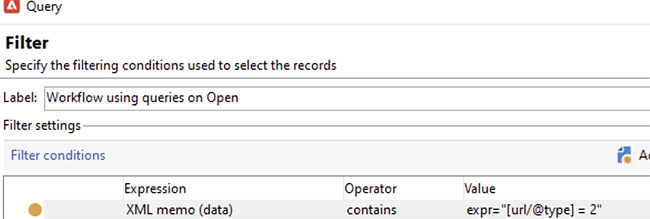

# Proteção da privacidade de email no aplicativo de email do Apple


## O que mudou?

Em 2021, a Apple apresentou novos recursos de proteção de privacidade para seu aplicativo de email nativo. Este aplicativo agora inclui o recurso Apple Mail Privacy Protection. Basicamente, os remetentes não podem mais usar pixels de rastreamento para coletar informações sobre os recipients que optaram por ativar o recurso de Proteção de privacidade de email do Apple. [Leia mais](https://experienceleague.adobe.com/docs/deliverability-learn/deliverability-best-practice-guide/additional-resources/technotes/apple-mail-privacy-faq.html?lang=pt-BR){target=&quot;_blank&quot;}.

## Como minhas campanhas são afetadas?

O Adobe Campaign fornece a capacidade de usar pixels de rastreamento para rastrear aberturas de email. Você pode usar esse recurso não apenas para campanhas e definição de metas, mas também para métricas. Por exemplo, você pode usar taxas de abertura de email para medir a eficácia da campanha e o envolvimento do usuário. Resumindo, a segmentação, o direcionamento e as métricas podem ser afetados em suas campanhas. [Leia mais](https://experienceleague.adobe.com/docs/deliverability-learn/deliverability-best-practice-guide/additional-resources/technotes/apple-mail-privacy-faq.html#in-addition-to-measuring-opens%2C-what-else-is-impacted%3F){target=&quot;_blank&quot;}.

## Que ações devo tomar?

O novo recurso do Apple é a forma das coisas que virão no setor em termos de proteção da privacidade de e-mail. Recomendamos que você siga as recomendações do Adobe.

### Avalie o impacto nos acionadores da campanha

Avalie como essas alterações afetam seus acionadores de campanha atuais. Identifique os workflows nos quais o email é aberto são usados como um critério para segmentação, direcionamento ou redirecionamento. Leia o [dicas e truques](#find-email-open-tracking).

### Preservar seus dados

Preservar seus dados e consolidar seu conhecimento atual nos dispositivos. Você pode basear os principais indicadores de desempenho (KPIs) no agente do usuário. Por exemplo, você pode criar KPIs em torno de perfis de pessoas que usam o iOS e o aplicativo Apple Mail. Leia o [dicas e truques](#preserve-tracking-data).

### Arquive seus logs de rastreamento além do período de retenção

Arquive seus logs de rastreamento além do período de retenção do Adobe Campaign:

1. Verifique a duração do período de retenção na instância da campanha.
1. Verifique novamente os mapeamentos ativos do target. Determine se você usa tabelas de perfis personalizadas, além da tabela de perfis predefinida (`nmsRecipient`).
1. Exporte seus logs de rastreamento do Adobe Campaign. Inclua os logs que contêm dados sobre o agente do usuário e o sistema operacional.

### Avaliar a tendência atual das taxas abertas

Determine qual proporção do seu público-alvo usa o aplicativo Apple Mail em um dispositivo iOS.
Com essa avaliação, você pode identificar possíveis falhas anômalas e sua causa. Você pode determinar se uma lacuna se deve a problemas de desempenho da campanha ou à funcionalidade de proteção de privacidade da Apple. Leia o [dicas e truques](#measure-ios-footprint).

### Reavalie sua estratégia de campanha e as métricas de desempenho

Acima de tudo, recomendamos que você reavalie proativamente sua estratégia de campanha e suas métricas de desempenho da campanha. Você pode se concentrar em métricas mais confiáveis, por exemplo, click-throughs, exibições de produtos e compras.

Recomendamos que você explore os dados atualmente disponíveis e avalie a correlação entre as taxas abertas e outras métricas. Se essas métricas estiverem consistentemente correlacionadas, você poderá melhorar seus acionadores com um bom nível de confiança.

## Dicas e truques

### Meça o espaço total do iOS {#measure-ios-footprint}

Para coletar insights dos dados do Adobe Campaign, você pode usar relatórios prontos para uso:

* **[!UICONTROL Operating Systems]** relatório

   Para identificar a proporção de visitantes por sistema operacional e por versão, use este relatório. [Leia mais](../../reporting/using/global-reports.md#operating-systems).

   Você pode visualizar o detalhamento dos visitantes por sistema operacional em relação ao número total de visitantes.

   

   Para cada sistema operacional, é possível visualizar o detalhamento dos visitantes por versão do sistema operacional.

   

* **[!UICONTROL Breakdown of opens]** relatório

   Para identificar a proporção de aberturas de email por sistema operacional, use esse relatório. [Leia mais](../../reporting/using/global-reports.md#breakdown-of-opens).

   

### Determine como o rastreamento de aberturas de email é usado {#find-email-open-tracking}

Você pode identificar os workflows nos quais as aberturas de email são usadas como um critério para segmentação, direcionamento e redirecionamento.

Para fazer isso, você pode usar a variável **[!UICONTROL type]** atributo do URL de link rastreado (**[!UICONTROL url/@type]**). Para aberturas de email, esse atributo é definido como **[!UICONTROL Open]**. Esse atributo está disponível no Editor de consultas, o **[!UICONTROL Query]** em um workflow e filtros predefinidos. Você pode usar esse atributo como um critério de direcionamento para campanhas de marketing.


Neste exemplo, um comerciante deseja enviar uma oferta de recompensa aos recipients que abriram um email de delivery específico nos últimos sete dias e fizeram uma compra no mês passado. Em consultas de fluxo de trabalho, você pode usar aberturas de email de várias maneiras:

* Você pode usar aberturas de email como um critério de direcionamento em uma query.

   Você pode especificar, como uma condição de filtragem, que o tipo de URL dos logs de rastreamento de um delivery específico deve ser definido como **[!UICONTROL Open]**.

   

* Você pode usar um filtro predefinido. [Saiba mais](../../workflow/using/creating-a-filter.md).

   

   Você pode usar esse filtro predefinido em atividades de query em workflows.

   

   >[!NOTE]
   >
   >Em um workflow, não é possível exibir os critérios de direcionamento de um filtro predefinido.

Para recuperar a lista de workflows em que as aberturas de email são usadas como um critério de direcionamento, você deve consultar o `xtk:workflow` esquema. O conteúdo do workflow é armazenado na variável **[!UICONTROL XML memo (data)]** no formato XML.


Você pode especificar que os fluxos de trabalho devem incluir este conteúdo:

`expr="[url/@type] = 2"`

Esse critério de direcionamento significa que o tipo de URL rastreado deve ser definido como **[!UICONTROL Open]**.



#### Exemplo de implementação e pacote de amostra

Você pode usar este exemplo de implementação para identificar os workflows nos quais o email é aberto são usados como um critério de direcionamento e para enviar uma notificação ao operador de campanha de sua escolha. É possível usar essa implementação para esses fins:

* Você pode medir o impacto potencial da alternância de aberturas de email para outro KPI em seus fluxos de trabalho de direcionamento. Se você não usar a abertura de email, nenhuma outra ação será necessária.
* Ao reavaliar sua implementação, você pode usar este exemplo para evitar a omissão de fluxos de trabalho.

Este exemplo mostra uma implementação personalizada em um único workflow técnico.


>[!IMPORTANT]
>
>O pacote é fornecido apenas como exemplo e não é suportado pelo Adobe como um recurso de produto.
>
>Talvez seja necessário adaptar o código de amostra à implementação da campanha.
>
>O usuário final é o único responsável pela instalação e uso desse pacote de amostra.
>
>É altamente recomendável testar e validar esse pacote em um ambiente de não produção.

Baixe o [pacote de amostras](assets/PKG_Search_workflows_using_Opens_in_queries_V1.xml) e instale-o. [Saiba mais](../../platform/using/working-with-data-packages.md#importing-packages).

Depois de instalar o pacote, você pode acessar o workflow da pasta que contém os workflows técnicos prontos em sua instância:

`/Administration/Production/Technical workflows/nmsTechnicalWorkflow`

Na interface do usuário, escolha **[!UICONTROL Administration]** > **[!UICONTROL Production]** > **[!UICONTROL Technical workflows]**.


O workflow compreende estas etapas principais:

1. Listar os workflows nos quais o email é aberto são usados como um critério de direcionamento.
1. Listar os filtros predefinidos nos quais o email é aberto são usados como um critério de direcionamento.
1. Liste os workflows nos quais esses filtros predefinidos são usados.
1. Mescle as duas listas de fluxos de trabalho em uma lista.
1. Envie uma notificação por email para o operador especificado.

O workflow compreende estas etapas detalhadas:

1. A atividade inicial é uma atividade de query no `xtk:workflow` esquema. Essa atividade é usada para localizar, na instância de acordo, as consultas explícitas de workflow que incluem emails são abertas como um critério de direcionamento.

   

   

   

   Como resultado, uma lista de workflows é retornada.

   

   Como essas informações são reutilizadas, o nome da tabela de trabalho é armazenado em uma variável de instância de workflow global.

   

1. Uma segunda query é usada para localizar os filtros predefinidos que incluem aberturas de email.

   

   

   

   Como resultado, uma lista de filtros predefinidos é retornada.

   

1. Essa lista de filtros predefinidos é usada para encontrar os workflows nos quais esses filtros são usados.
1. Ambas as listas de workflows são mescladas em uma lista.

   Para essa finalidade, o código JavaScript é usado.

   

   ```javascript
   const queryPredFilter = xtk.queryDef.create(
     <queryDef schema={vars.targetSchema} operation="select">
        <select>
          <node alias="@id" expr="@id" />
          <node alias="@name" expr="@name"  />
        </select>
        <where/>
     </queryDef>
       ).ExecuteQuery()
   
   var qDef =
     <queryDef schema="xtk:workflow" operation="select">
       <select>
         <node expr="@id"/>
         <node expr="@internalName"/>
         <node expr="@label"/>
       </select>
       <where>
         <condition boolOperator="OR" expr={"data like '%expr=[url/@type] = 2%'" }/>
       </where>
     </queryDef>
   
   for each (var filter in queryPredFilter) {       
   
      //logInfo (filter.@name);
      var condition;
      condition =<condition boolOperator="OR" expr={"data like '%" + filter.@name + "%'" }/>
      qDef.where.appendChild(condition);   
   
   }
   
   var queryWorkflowList = xtk.queryDef.create(qDef);
   var workflowList = queryWorkflowList.ExecuteQuery();
   
   var sWorkflowList = "";
   var iCount = 0
   for each (var workflow in workflowList) {       
   
      //logInfo ("Workflow ID: " + workflow.@id + " in " + instance.vars.mainTargetSchema);
   
      iWorkflowId = workflow.@id;
      iWorkflowName = workflow.@internaName;
      iWorkflowLabel = workflow.@label;
   
       xtk.session.Write(
             <{instance.vars.mainTargetSchema.split(':')[1]}
               _operation="insertOrUpdate"       
               _key="@id"
               xtkschema={instance.vars.mainTargetSchema}
               id={iWorkflowId}
               internaName={iWorkflowName}
               label={iWorkflowLabel}
             />
       )
   }
   ```

1. Workflows duplicados são removidos da lista mesclada.

   

1. Um teste é executado para verificar se a lista não está vazia.

   

   Se a lista não estiver vazia, ela será inserida em uma tabela HTML para notificações por email.

   

   ```js
   const queryWorkflow = xtk.queryDef.create(
       <queryDef schema={vars.targetSchema} operation="select">
           <select>
               <node alias="@id" expr="@id" />
               <node alias="@internalName" expr="@internalName"  />
               <node alias="@label" expr="@label"  />
           </select>
           <where/>
       </queryDef>
   ).ExecuteQuery()
   
   var sWorkflowList = '<table border="0" >';
   
   sWorkflowList = sWorkflowList + "<tr><th>Worklow Id</th><th>Name</th><th>Label</th></tr>";
   
   for each (var workflow in queryWorkflow) {       
   
      sWorkflowList = sWorkflowList + "<tr>" +
                       "<td>" + workflow.@id + "</td>" +
                       "<td>" + workflow.@internalName + "</td>" +
                       "<td>" + workflow.@label + "</td>" +
                       "</tr>";
   
   }
   
   sWorkflowList = sWorkflowList + "</table>";
   
   instance.vars.workflowList = sWorkflowList;
   ```

1. A tabela HTML é adicionada ao template de notificação.

   ```js
   <%= instance.vars.workflowLIst%>
   ```

   

   As notificações por email contêm a lista de workflows que incluem aberturas de email como um critério de direcionamento em queries.

   

### Preservar seus dados de rastreamento atuais {#preserve-tracking-data}

#### Quais dados são afetados?

Os dados do perfil são enriquecidos com o rastreamento de dados de ações, como aberturas de email e click-throughs. O rastreamento também fornece, por meio do agente do usuário, quando essas informações estão disponíveis, informações importantes sobre os dispositivos do usuário.

Em resumo, os dados de rastreamento do Adobe Campaign fornecem essas informações:

* O perfil associado à pessoa que abriu ou clicou em uma mensagem de email específica
* A data de abertura
* O dispositivo usado, por exemplo, iPhone ou Mac
* O sistema operacional e a versão, por exemplo, iOS 15, macOS 12 ou Windows 10
* O aplicativo, como um aplicativo de email ou um navegador da Web, e a versão, por exemplo, Outlook 2019

#### Por que devo preservar os dados de rastreamento?

Recomendamos que você preserve esses dados por vários motivos:

* Esses dados são retidos pela Adobe Campaign por um período limitado. O período de retenção varia, dependendo da configuração da sua instância.

   Verifique a configuração da sua instância. [Leia mais](../../platform/using/privacy-management.md#data-retention).

* Além das alterações recentes da Apple, você pode usar os dados de rastreamento para adicionar um valor imenso para impulsionar o envolvimento do público-alvo.
* A Apple pode trazer mais alterações para o aplicativo de email nativo e para o recurso de Proteção da privacidade de email.

Por todos esses motivos, recomendamos que você exporte esses dados o mais rápido possível. Caso contrário, os dados de rastreamento de parte do público-alvo podem ser afetados negativamente.

#### Como posso preservar os dados de rastreamento?

Para preservar os dados de rastreamento, é necessário exportá-los do Adobe Campaign para o sistema de informações. [Leia mais](../../platform/using/get-started-data-import-export.md).

>[!IMPORTANT]
>
>O exemplo a seguir foca no pronto para uso `nms:Recipient` schema , que é o schema de perfil padrão. Se você usar outros mapeamentos de público-alvo personalizados anexados a perfis personalizados, recomendamos estender essa estratégia de exportação para todas as tabelas de logs personalizados. [Leia mais](../../configuration/using/target-mapping.md).

##### Princípio

Por padrão, a variável `nms:Recipient` O schema está vinculado a três schemas que você deve exportar:

| Schema | Conteúdo |
| --- | --- |
| nms:trackingLogRcp | Rastreamento de dados, para com, o usuário, a hora e a mensagem relacionada |
| nms:trackingUrl | Detalhes sobre o link, incluindo a natureza, por exemplo, uma abertura de email ou um click-through |
| nms:userAgent | Informações sobre o dispositivo |

As tabelas são vinculadas no modelo de dados.


Use esses relacionamentos para criar um único query de exportação.


Você pode enriquecer esses dados com informações úteis de schemas vinculados:

| Esquema | Conteúdo |
| --- | --- |
| nms:Recipient | Detalhes relacionados a perfis |
| nms:Delivery | Informações sobre a mensagem com a qual o usuário reagiu |

Você pode exportar o resultado para uma solução de armazenamento externa compatível com o Adobe Campaign:

* SFTP
* S3
* Azure Blob

##### Implementação

Este exemplo mostra como exportar dados de rastreamento do Adobe Campaign.

1. Crie um workflow que inicie com um query.

   A query inicial é usada para recuperar os logs de rastreamento dos últimos três meses.
Você pode usar um query incremental para extrair apenas os registros que ainda não exportou.

   Adicione todas as informações necessárias da **[!UICONTROL Additional data]** nó .

   

1. Adicione um **[!UICONTROL Data extraction (file)]** atividade . Mapeie todos os dados da consulta para um formato de arquivo de extração.

   

   Escolha o formato de arquivo, por exemplo, TXT ou CSV.

   

1. Adicione a terceira e a última atividade para fazer upload do arquivo em uma solução de armazenamento compatível.


##### Implementação avançada: detalhamento por dispositivo iOS

Você pode usar fluxos de trabalho para determinar se um recipient usa o aplicativo Apple Mail. Você pode dividir os logs de rastreamento por dispositivo. Por exemplo, você pode usar filtros de consulta para analisar registros por dispositivo iOS:

| aplicação | Sistema operacional ou dispositivo  | Filtro Query |
| --- | --- | --- |
| Apple Mail | iOS 15 | `operating System (Browser) contains 'iOS 15' and browser (Browser) contains 'ApplewebKit'` |
| Apple Mail | iOS 14 ou iOS 13 | `browser contains 'AppleWebKit' and operating System of browser contains 'iOS 14' or operating System of browser contains 'iOS 13'` |
| Apple Mail | Dispositivos móveis iOS: iPad, iPod e iPhone | `device (Browser) contains iPhone or device (Browser) equal to iPod or device (Browser) equal to iPad and browser (Browser) equal to 'AppleWebKit'` |
| Apple Mail | iPhone , iPad ou iPod | `browser (Browser) equal to 'AppleWebKit' and device (Browser) equal to iPhone or device (Browser) equal to iPod or device (Browser) equal to iPad` |
| Apple Mail | Mac | `browser (Browser) equal to 'AppleWebKit' and operating System (Browser) contains 'Mac'` |
| Safari | macOS | `browser (Browser) equal to 'Safari' and device (Browser) equal to PC and operating System (Browser) contains 'Mac'` |
| Safari | Dispositivos móveis | `browser (Browser) equal to 'Safari' and device (Browser) equal to iPad or device (Browser) equal to iPod or device (Browser) equal to iPhone` |


Você pode usar essas regras para vários fins:

* Exportar e arquivar dados em uma solução de armazenamento externa
* Calcular os KPIs a serem anexados a perfis
* Criar listas de supressão
* Relatórios

Estes exemplos mostram como você pode usar workflows para analisar registros por dispositivo iOS:

* O primeiro workflow de exemplo inclui estas atividades:

   1. A **[!UICONTROL Query]** é usada para selecionar todas as aberturas de email nos últimos três meses.
   1. A **[!UICONTROL Split]** é usada para dividir a seleção por aplicativo de email, navegador, sistema operacional e dispositivo.

   1. A **[!UICONTROL Deduplication]** atividade segue cada **[!UICONTROL Split]** atividade . O **[!UICONTROL Deduplication]** é usada para remover endereços de email duplicados.

      O **[!UICONTROL Deduplication]** A atividade é posicionada após a variável **[!UICONTROL Split]** para evitar a perda de informações sobre recipients que usam vários dispositivos.

   1. Um **[!UICONTROL End]** atividade segue cada **[!UICONTROL Deduplication]** atividade .

   Esse tipo de workflow é útil se você armazenar recipients somente na tabela de recipients prontos para uso para direcionamento.

   

* O segundo exemplo de workflow inclui estas atividades:

   1. A **[!UICONTROL Query]** é usada para selecionar todas as aberturas de email nos últimos três meses.
   1. A **[!UICONTROL Deduplication]** é usada para remover endereços de email duplicados.
   1. A **[!UICONTROL Fork]** atividade é usada:

      * Em uma transição, a variável **[!UICONTROL Change dimension]** é usada para encontrar os recipients aos quais o log de rastreamento se refere.
      * Na outra transição, a variável **[!UICONTROL Split]** é usada para dividir a seleção por aplicativo de email, navegador, sistema operacional e dispositivo.
   1. Um **[!UICONTROL End]** A atividade segue cada transição após **[!UICONTROL Split]** atividade .

   Esse tipo de workflow é útil se você armazenar recipients em uma tabela diferente da tabela de recipients prontos para uso.

   

## Links úteis

[Perguntas frequentes sobre a proteção da privacidade do Apple Mail](https://experienceleague.adobe.com/docs/deliverability-learn/deliverability-best-practice-guide/additional-resources/technotes/apple-mail-privacy-faq.html){target=&quot;_blank&quot;}
