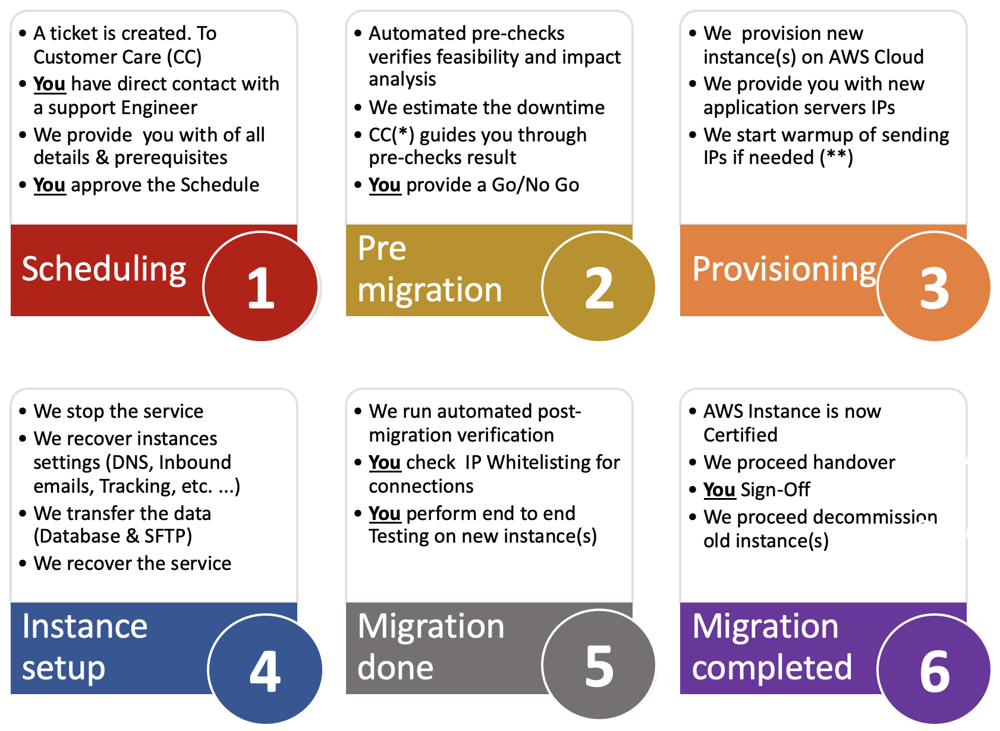

# Visão geral{#dc-ovv}

## Contexto

Como um cliente importante da Adobe Campaign Classic, temos o compromisso de fornecer a você a melhor experiência e valor. Ao longo dos anos, percebemos o valor e a confiabilidade de hospedar nossos clientes na nuvem.  Como parte da nossa [Iniciativa de atualização anual](../../rn/using/rn-overview.md#yearly-upgrade), estamos mudando todos os nossos clientes para o Adobe Managed Services (Nuvem pública na AWS) para oferecer serviços melhores e mais confiáveis.

Este programa tem três objetivos principais:

* Solucionar as vulnerabilidades de segurança identificadas ao mover a infraestrutura para um ambiente seguro e moderno (AWS).
* Eliminar os processos de dimensionamento possivelmente complicados, fornecer acesso aos nossos [MTAs aprimorados](../../delivery/using//sending-with-enhanced-mta.md) e aprimorar todos os níveis de serviço de manutenção.
* Prepare sua instância para o futuro do Adobe Campaign Classic, incluindo atualizações mais automatizadas e regulares que não exigirão tantos recursos nem tanto tempo.

### Glossário

* **Atualização de build** - Quando o software Adobe Campaign Classic é atualizado para o número de build seguro mais recente, ele ainda permanece no mesmo nível de build primário/secundário. Por exemplo: Campaign v7 20.2.3 build 9182 para Campaign v7 21.2.5 build 9188. [Saiba mais](../../platform/using/faq-build-upgrade.md).
* **MID/RT** - Servidores de execução de mensagens hospedados na Adobe Cloud (MID para campanhas em lote e RT para mensagens unitárias em tempo real)
* **Programa de atualização anual** - este programa proporciona maior segurança, melhor suporte, manutenção e estabilidade aprimoradas. Também facilita as atualizações futuras e dá acesso a novos recursos no Campaign.  [Saiba mais](../../rn/using/rn-overview.md#yearly-upgrade).
* **AWS** - Amazon Web Services (Amazon Nuvem pública)
* **SFTP** - Protocolo de transferência segura de arquivo. [Saiba mais](../../platform/using/sftp-server-usage.md).

>[!NOTE]
>A migração do Campaign Classic v7 para a Nuvem pública afeta os clientes que usam o **Adobe Managed Services** somente.

## Benefícios

**Segurança**

* Correções de segurança mais recentes
* Criptografia de dados em repouso
* Autenticação aprimorada (IMS)

**Infraestruturas**

* Escalabilidade ágil de hardware
* Restauração mais rápida
* Melhor confiabilidade e estabilidade
* Procedimentos operacionais harmonizados

**Desempenhos**

* Maior capacidade de email
* Bancos de dados maiores
* Versão comprovada do Campaign

**Ofereça uma solução robusta e confiável para clientes do Adobe Campaign Classic**

1. Melhores procedimentos de produção, resultando em maior confiabilidade, reatividade mais rápida em caso de problema, recuperação mais rápida em caso de incidente grave.
1. Maior capacidade de envio de email. As instâncias hospedadas no novo data center terão a possibilidade de se beneficiar da infraestrutura especializada para entrega de email. Isso pode resultar em maior velocidade de entrega de email ou permitir o uso de menos IPs de envio.
1. Melhor escalabilidade do hardware. O aumento dos recursos de hardware pode ser feito muito mais rapidamente. Tecnicamente, isso seria da ordem de magnitude de 1 hora em vez de vários dias.

**As atualizações anuais facilitam as atualizações futuras**

1. Quanto mais tempo sua organização esperar para atualizar, mais complexa será sua atualização e maior será a possibilidade de enfrentar vulnerabilidades (especialmente ao mudar de uma versão mais antiga).
1. Com a Atualização anual do Campaign (que era a iniciativa Gold Standard), sua instância será modernizada e estará pronta para receber atualizações mais automatizadas e regulares com menos intervenção manual e menos recursos.

## Sobre a migração

Para começar essa iniciativa, as contas que exigem essa migração receberão uma comunicação por email da Adobe fornecendo uma linha do tempo e acesso à documentação. Essa será a sua notificação de que sua conta está programada para ser migrada.

Uma migração pode ser iniciada por [abertura de um novo tíquete de suporte do Atendimento ao cliente](https://experienceleague.adobe.com/?support-solution=Campaign#support). Use a linha de assunto “Migrar para AWS”.

### Essa migração é obrigatória?

Essa migração para a nuvem é **primeiro passo para a [programa de atualização anual](../../rn/using/rn-overview.md#yearly-upgrade)** das instâncias do Adobe Campaign. Essa migração é obrigatória se você estiver hospedado em um data center que não seja a Nuvem pública (AWS).

A nuvem do Adobe Managed Services está hospedada no Amazon Web Services (AWS), um ambiente moderno, seguro e otimizado. [Saiba mais sobre o AWS](https://aws.amazon.com/application-hosting/benefits/).

O Adobe planeja desativar o data center herdado, as instâncias do Adobe Campaign em execução devem ser transferidas para o novo data center de referência, o AWS.

Esse é um caminho crítico a seguir, pois seu local atual pode estar exposto a **vulnerabilidades de segurança e desempenho**.

Além disso, essa migração agora é um **pré-requisito para qualquer atualização de Build futura** do Adobe Campaign. A atualização de build não é mais possível no Data Center herdado.

A Adobe está comprometida em proteger seus dados e colocar você no caminho certo para o futuro do Adobe Campaign. Precisamos da sua parceria para torná-la um sucesso conjunto.

**Organizamos uma equipe** de representantes dedicados do Atendimento ao cliente, Gerentes de sucesso do cliente, Gerentes de produtos, Engenheiros, Especialistas em TechOps e Consultores de produtos para auxiliar e garantir que a experiência seja perfeita e contínua. Estamos empenhados em garantir que você tenha as informações relevantes do projeto e de contato.

Investimos um grande esforço no desenvolvimento de tecnologias que tornarão essa migração rápida, contínua e segura.

### Restrições

* A migração terá um tempo de inatividade inevitável da plataforma. O objetivo deste plano é orientar para minimizar esse tempo de inatividade.
* Alteração de IP para integrações de dados.
* Aumento da entregabilidade de novos IPs de envio. No entanto, o plano é tornar essa operação transparente para a empresa, diferentemente do aumento inicial realizado durante a ativação.

Saiba mais sobre a migração do Campaign para o [Perguntas frequentes sobre a Nuvem pública](dc-migration-faq.md).

## Caminho de migração para a Nuvem pública

A Adobe resolve a maioria das ações. Precisamos de você para validação e aprovação.

## Diretrizes de migração

### Abordagem global

**Banco de dados**

O banco de dados será descarregado do data center herdado e restaurado na Nuvem pública (AWS). Quando reiniciado no novo data center, o aplicativo será retomado do estado exato em que estava antes do desligamento. Os usuários não notarão diferença, exceto que algumas tarefas programadas terão sido adiadas.

**IPs de envio de email**

Quando a migração for concluída, a instância do Campaign terá IPs de envio totalmente diferentes. Como uma questão de garantir uma transição sem problemas, a Adobe implementará um aumento dos novos IPs de envio, alternando gradativamente o tráfego dos IPs antigos para os novos.

**IPs de integração de dados**

A integração de dados no lado do cliente pode ser afetada pela mudança de IPs para integração de dados. A alteração pode afetar ambas as direções, dependendo se o Campaign atua como servidor ou cliente.
Casos típicos:

* SFTP, possivelmente ambas as direções
* HTTP, possivelmente ambas as direções
* SMPP (conexão com o provedor SMS), Campaign como cliente, alteração do IP de origem

Em geral, isso significa que o cliente deve verificar possíveis restrições de IP definidas em seus firewalls e adaptá-las de acordo.*

**Servidores do Campaign**

Os servidores do Campaign existentes (contêineres, na verdade) serão transferidos para a Nuvem pública (AWS) em uma abordagem de &quot;lift-and-shift&quot;. Ou seja, uma nova instalação do servidor não será necessária, mas todo o servidor será transferido para o novo data center. A operação não exigirá mais trabalho do que a reconfiguração técnica de baixo nível.

**Nomes dos servidores**

Nos subdomínios usados para comunicação de marketing: permanecerão os mesmos. No entanto, dependendo da implementação, poderão ser necessárias ações do lado do cliente:

* No caso de delegação de subdomínio (caso normal), a Adobe cuidará de todas as alterações e garantirá uma transição contínua
* No caso de configuração CNAME (exceção), o cliente será solicitado a implementar as alterações. Será necessária a coordenação com a Adobe.

Para acesso do usuário e integração de dados, os nomes em neolane.net permanecerão inalterados.

Isso significa que a alteração será transparente para os usuários e implementações de integração de dados, se os nomes dos servidores não forem substituídos por IPs codificados.

### Preparação

**IPs de envio de email**

Primeiro, a equipe de Entregabilidade do Adobe avaliará o status da capacidade de entrega da plataforma e recomendará um plano para a mudança para os novos IPs.

A Adobe fornecerá o mesmo número de IPs no novo data center.

O aumento de novos IPs pode começar assim que os novos IPs forem provisionados.

**Limpeza de aplicativo**  A transferência de dados entre data centers é parte do processo que impacta o tempo de inatividade.

Os dados são armazenados de duas formas:

1. De longe o mais importante, o banco de dados
1. Arquivos no servidor de aplicativos (importações e exportações de dados)

A redução do tamanho do banco de dados é da maior importância para acelerar a transferência de dados.

Sugestões:

* Reduza os períodos de retenção dos dados históricos (registros de entrega, registros de rastreamento, etc.)
* Excluir registros inúteis em outras tabelas (entregas, destinatários, tabelas personalizadas)

### Execução

**Pausar execuções**

Recomendamos desacelerar e, idealmente, pausar todas as execuções pouco antes do desligamento do aplicativo no data center herdado: entregas e fluxos de trabalho. Isso facilitará a reinicialização na Nuvem pública (AWS), pois os processos terão tempo para pausar &quot;normalmente&quot; e salvar qualquer estado de execução em andamento. 

**Durante a migração**

Enquanto a migração acontece, somente um serviço permanecerá funcional: redirecionamento de links de email. Em outras palavras, os destinatários poderão acessar a página de aterrissagem quando clicarem em um email. No entanto, esses cliques não serão registrados, portanto, as taxas de clique para as entregas que foram iniciadas pouco antes da migração serão menores do que o normal.

**Restart**

Depois de migrado para o novo ambiente, o aplicativo será reiniciado gradativamente:

* Primeiro acesso ao console, para que os usuários possam verificar o status sem nada em execução ainda
* Em seguida, fluxos de trabalho e entregas

### Pós-migração

**Exclusão de instâncias no data center herdado**

Quando a migração do aplicativo estiver concluída, não haverá plano para executar os processos novamente no data center herdado. Esperamos que todos os dados no data center herdado possam ser apagados, exceto para fins de backup temporário, até que os processos de backup programados sejam executados na Nuvem pública (AWS).

**Delegação DNS**

Normalmente, o domínio usado para enviar emails (parte à direita do sinal @ no endereço de erro) do Campaign era delegado à Adobe. A delegação pode ser alterada e implementada nos servidores DNS AWS.

## Suporte e outros links úteis{#support}

* [Perguntas frequentes sobre a migração para o Adobe Managed Services (Nuvem pública)](dc-migration-faq.md)
* [Atualizações anuais do Campaign](../../rn/using/rn-overview.md)
* [Perguntas frequentes sobre atualização de build](../../platform/using/faq-build-upgrade.md)
