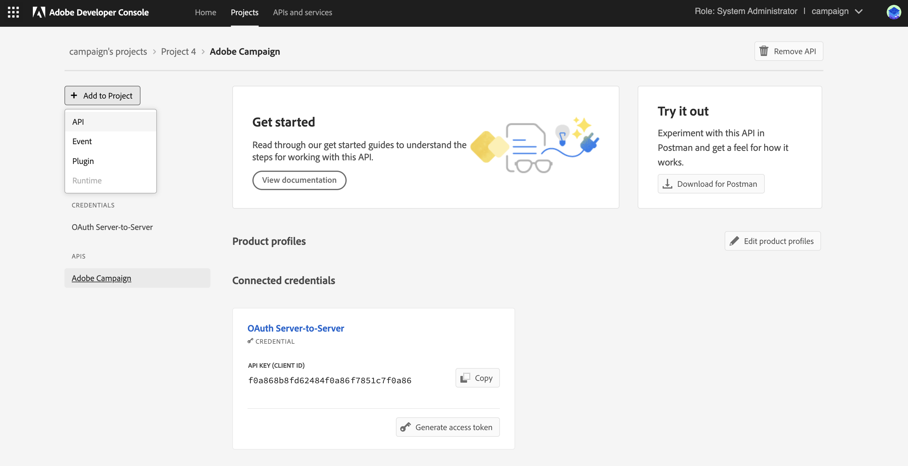

# Migração de operadores técnicos do Campaign para o Console do Adobe Developer {#migrate-tech-users-to-ims}

Como parte do esforço para reforçar a segurança e o processo de autenticação, a partir do Campaign Classic v7.3.5, o processo de autenticação para o Campaign Classic está sendo aprimorado. Os operadores técnicos devem agora utilizar o [Sistema Adobe Identity Management (IMS)](https://helpx.adobe.com/br/enterprise/using/identity.html){target="_blank"} to connect to Campaign. Learn more about the new server to server authentication process in [Adobe Developer Console documentation](https://developer.adobe.com/developer-console/docs/guides/authentication/ServerToServerAuthentication/){target="_blank"}. **O Adobe recomenda executar essa migração no Campaign v7.3.5 para poder migrar sem problemas para o Campaign v8.**

Um operador técnico é um perfil de usuário do Campaign que foi explicitamente criado para integração com a API. Este artigo detalha as etapas necessárias para migrar um operador técnico para uma conta técnica por meio do console do Adobe Developer.


## Você será afetado?{#ims-impacts}

Se você estiver fazendo chamadas de API de um sistema externo ao Campaign para sua instância de Marketing do Campaign ou para a instância do Centro de mensagens em tempo real, a Adobe recomenda que você migre o(s) operador(es) técnico(s) para conta(s) técnica(s) por meio do Console do Adobe Developer, conforme detalhado abaixo.

Essa alteração é aplicável a partir do Campaign Classic v7.3.5 (e mais recente [Versões compatíveis com a migração IMS](#ims-versions-tech)) e é **obrigatório** para migrar para o Adobe Campaign v8.

## Processo de migração {#ims-migration-procedure}

Siga as etapas abaixo para criar contas técnicas no Console do Adobe Developer e, em seguida, use essas contas recém-criadas para alterar os métodos de autenticação de todos os sistemas externos que fazem chamadas de API no Adobe Campaign.

Uma visão geral das etapas são:

* Criação de um projeto no Console do Adobe Developer
* Atribuir as APIs apropriadas ao projeto recém-criado
* Conceder os Perfis de produto do Campaign necessários ao projeto
* Atualização das APIs para usar as credenciais de conta técnica recém-criadas
* Remover os operadores técnicos herdados da instância do Campaign


### Versões compatíveis com a migração IMS {#ims-versions-tech}

Um pré-requisito para essa migração é atualizar seu ambiente para uma das seguintes versões de produto:

* Campaign v7.3.5 (recomendado)
* Campaign v7.3.3.IMS
* Campaign v7.3.2.IMS

Essas versões do Campaign estão detalhadas na seção [Notas de versão](../../rn/using/latest-release.md).

### Pré-requisitos para a migração{#ims-migration-prerequisites}

<!--To be able to create the technical accounts which replace the technical operators, the prerequisite that the proper Campaign Product Profiles exist within the Admin Console for all Campaign instances need to be validated. You can learn more about Product Profiles within the Adobe Console in [Adobe Developer Console documentation](https://developer.adobe.com/developer-console/docs/guides/projects/){target="_blank"}.-->

* Clientes do Campaign hospedados e do Managed Services

  Para chamadas de API nas instâncias do Centro de mensagens, um perfil de produto deve ter sido criado durante a atualização para o Campaign v7.3.5 (ou outro [Versão compatível com migração IMS](#ims-versions-tech)) ou durante o provisionamento da instância. Este perfil de produto é nomeado como:

  `campaign - <your campaign instance> - messagecenter`

  Se você já estiver usando a autenticação baseada em IMS para acesso de usuários ao Campaign, os perfis de produto necessários para as chamadas de API já deverão existir no Admin Console. Se você usar um grupo de operadores personalizado no Campaign para as chamadas de API para a instância de marketing, deverá criar esse perfil de produto no Admin Console.

  Para outros casos, entre em contato com o Gerenciador de transição de Adobe (para usuários do Managed Services) ou com o Atendimento ao cliente do Adobe (para outros usuários hospedados) para que as equipes técnicas do Adobe possam migrar seus grupos de operadores e direitos nomeados existentes para os Perfis de produto dentro do Admin Console.

* Clientes do Campaign no local e híbridos

  Para chamadas de API nas instâncias do Centro de mensagens, você deve criar um perfil de produto chamado:

  `campaign - <your campaign instance> - messagecenter`

  Se você já estiver usando a autenticação baseada em IMS para acesso de usuários ao Campaign, os perfis de produto necessários para as chamadas de API já deverão existir no Admin Console. Se você usar um grupo de operadores personalizado no Campaign para as chamadas de API para a instância de marketing, deverá criar esse perfil de produto no Admin Console.

  Você pode saber mais sobre Perfis de produtos no Console do Adobe em [Documentação do console do Adobe Developer](https://developer.adobe.com/developer-console/docs/guides/projects/){target="_blank"}


### Etapa 1 — criação do projeto do Campaign no console do Adobe Developer {#ims-migration-step-1}

As integrações são criadas como parte de um **Projeto** no console do Adobe Developer. Saiba mais sobre Projetos em [Documentação do console do Adobe Developer](https://developer.adobe.com/developer-console/docs/guides/projects/){target="_blank"}.

Você pode usar qualquer projeto criado anteriormente por você ou criar um novo projeto. As etapas para criar um projeto estão detalhadas na [Documentação do console do Adobe Developer](https://developer.adobe.com/developer-console/docs/guides/getting-started/){target="_blank"}. Você pode encontrar as principais etapas abaixo

<!--
For this migration, you must add below APIs in your project: **I/O Management API** and **Adobe Campaign**.

-->

Para criar um novo projeto, clique **Criar novo projeto** na tela principal do Console do Adobe Developer.


Você pode usar o **Editar projeto** botão para renomear este projeto.


### Etapa 2 - Adicionar APIs ao projeto {#ims-migration-step-2}

Na tela do projeto recém-criado, adicione as APIs necessárias para usar esse projeto como uma conta técnica para suas chamadas de API para o Adobe Campaign.

Para adicionar APIs ao seu projeto, siga estas etapas:

1. Clique em **Adicionar API** para selecionar as APIs a serem adicionadas ao projeto.
   
1. Selecione e adicione a API do Adobe Campaign ao seu projeto marcando a caixa no canto superior direito do cartão Adobe Campaign, que aparece ao passar o mouse sobre o cartão
   
1. Clique em **Próxima** na parte inferior da tela.

### Etapa 3 - Selecionar o tipo de autenticação  {#ims-migration-step-3}

No **Configurar API** selecione o tipo de autenticação necessário. **Servidor OAuth para servidor** A autenticação é necessária para este projeto. Verifique se está selecionado e clique em **Próxima** na parte inferior da tela.


<!--
Once your project is created in the Adobe Developer Console, add an API that uses Server-to-Server authentication. Learn how to set up the OAuth Server-to-Server credential in [Adobe Developer Console documentation](https://developer.adobe.com/developer-console/docs/guides/authentication/ServerToServerAuthentication/implementation/){target="_blank"}.

When the API has been successfully connected, you can access the newly generated credentials including Client ID and Client Secret, as well as generate an access token.-->

### Etapa 4 - Selecionar os perfis de produto {#ims-migration-step-4}

Conforme descrito na seção pré-requisitos, você deve atribuir os perfis de produto apropriados a serem usados pelo projeto. Nesta etapa, você deve selecionar o perfil ou os perfis de produto a serem usados pela conta técnica que está sendo criada.

Se essa conta técnica for usada para fazer chamadas de API para a instância do Centro de mensagens, selecione o perfil de produto Adobe create que termina com `messagecenter`.

Para chamadas de API para as instâncias de Marketing, selecione o perfil de produto correspondente à instância e ao Grupo de operadores.

Após selecionar os perfis de produto necessários, clique em **Salvar API configurada** na parte inferior da tela.

<!--
You can now add your Campaign product profile to the project, as detailed below:

1. Open the Adobe Campaign API.
1. Click the **Edit product profiles** button

    

1. Assign all the relevant Product Profiles to the API, for example 'messagecenter', and save your changes.
1. Browse to the **Credential details** tab of your project, and copy the **Technical Account Email** value.-->

### Etapa 5 - Adicionar a API de gerenciamento de E/S ao projeto {#ims-migration-step-5}


Na tela do projeto, clique na guia **[!UICONTROL + Add to Project]** e escolha **[!UICONTROL API]** no canto superior esquerdo da tela para poder adicionar a API de gerenciamento de E/S a este projeto.



No **Adicionar uma API** , role para baixo para encontrar a **API de gerenciamento de E/S** cartão. Selecione-a clicando na caixa de seleção exibida ao passar o mouse sobre o cartão. Clique em **Próxima** na parte inferior da tela.


No **Configurar API** , a autenticação de servidor para servidor do OAuth já existe. Clique em **Salvar API configurada** na parte inferior da tela.


Isso leva você de volta à tela Projeto na API de gerenciamento de E/S do projeto recém-criado. Clique no nome do projeto na navegação estrutural na parte superior da tela a ser retornada à página principal Detalhes do projeto.


### Etapa 6 - Verificar a configuração do projeto {#ims-migration-step-6}

Revise seu projeto para garantir que ele seja semelhante ao mostrado abaixo com o **API de gerenciamento de E/S** e **API do Adobe Campaign** visível na seção Produtos e serviços e **Servidor OAuth para servidor** na seção Credenciais.


### Etapa 7 — validação da configuração {#ims-migration-step-7}

Para experimentar a conexão, siga as etapas detalhadas na [Guia de credenciais do console do Adobe Developer](https://developer.adobe.com/developer-console/docs/guides/authentication/ServerToServerAuthentication/implementation/#generate-access-tokens){target="_blank"} para gerar um token de acesso e copiar o comando cURL de amostra fornecido. Você pode criar uma chamada soap usando essas credenciais para testar se é possível autenticar e se conectar às instâncias do Adobe Campaign corretamente. Recomendamos fazer essa validação antes de fazer todas as alterações nas integrações de API de terceiros.

### Etapa 8 - Atualizar as integrações de API de terceiros {#ims-migration-step-8}

Agora é necessário atualizar as Integrações de API que fazem chamadas para o Adobe Campaign para usar a conta técnica recém-criada.

Para obter detalhes sobre as etapas de integração da API, consulte as amostras de código abaixo.

* +++ Chamada SOAP

  ```
  curl --location --request POST 'https://<instance_name>.campaign.adobe.com/nl/jsp/soaprouter.jsp' \
  --header 'Content-Type: text/xml; charset=utf-8' \
  --header 'SOAPAction: xtk:queryDef#ExecuteQuery' \
  --header 'Authorization: Bearer eyJhw' \
  --data-raw '<?xml version="1.0" encoding="utf-8"?>
  <soap:Envelope xmlns:soap="http://schemas.xmlsoap.org/soap/envelope/">
      <soap:Body>
          <ExecuteQuery xmlns="urn:xtk:queryDef">
              <sessiontoken></sessiontoken>
              <entity>
                  <queryDef schema="nms:recipient" operation="select">
                      <!-- fields to retrieve -->
                          <select>
                              <node expr="@lastName"/>
                              <node expr="@email"/>
                              <node expr="@firstName"/>
                          </select>
                          <!-- condition on email -->
                          <!-- <where><condition expr="@email= '\''joh@com.com'\''"/>
                      </where> -->
                  </queryDef>
              </entity>
          </ExecuteQuery>
      </soap:Body>
  </soap:Envelope>
  '
  ```

+++

* +++ Java SampleCode

  ```
  import java.io.BufferedReader;
  import java.io.InputStreamReader;
  import java.io.IOException;
  import com.google.gson.Gson;
  import com.google.gson.JsonObject;
  
  import com.google.gson.JsonSyntaxException;
  import org.apache.hc.client5.http.classic.methods.HttpPost;
  import org.apache.hc.client5.http.impl.classic.CloseableHttpClient;
  import org.apache.hc.client5.http.impl.classic.CloseableHttpResponse;
  import org.apache.hc.client5.http.impl.classic.HttpClients;
  import org.apache.hc.core5.http.HttpEntity;
  import org.apache.hc.core5.http.io.entity.StringEntity;
  
  
  public class TAAccessToken {
  public static void main(String[] args) throws IOException {
      String accessToken = null;
      CloseableHttpClient httpClient = HttpClients.createDefault();
      try {
          HttpPost httpPost = new HttpPost("https://ims-na1.adobelogin.com/ims/token/v3");
  
          // Request headers
          httpPost.addHeader("Content-Type", "application/x-www-form-urlencoded");
  
          String clientId = "<client_id>";
          String clientSecret = "<client_secret>";
          String scopes = "<scopes>";
  
          // Define the request body
          String requestBody = "client_id="+clientId+"&client_secret="+clientSecret+"&grant_type=client_credentials&scope="+scopes+"";
          StringEntity requestEntity = new StringEntity(requestBody);
          httpPost.setEntity(requestEntity);
  
          // Execute the request
          CloseableHttpResponse response = httpClient.execute(httpPost);
          try {
              // Get the response entity
              HttpEntity entity = response.getEntity();
              int responseCode = response.getCode();
  
              // Print the response
              if (entity != null) {
                  BufferedReader bufferedReader = new BufferedReader(new InputStreamReader(entity.getContent()));
                  String lineImsToken;
                  StringBuilder responseImsToken = new StringBuilder();
                  while ((lineImsToken = bufferedReader.readLine()) != null) {
                      responseImsToken.append(lineImsToken);
                  }
  
                  String jsonString = responseImsToken.toString();
  
                  try {
                      Gson gson = new Gson();
                      JsonObject jsonObject = gson.fromJson(jsonString, JsonObject.class);
  
                      // Get the value of a specific key
                      accessToken = jsonObject.get("access_token").getAsString();
                  }
                  catch (JsonSyntaxException | NullPointerException e) {
                      System.err.println("Error parsing JSON: " + e.getMessage());
                      e.printStackTrace();
                  }
                  System.out.println("Response Code: " + responseCode);
                  System.out.println("Response Body: " + accessToken);
              }
          } catch (IOException e) {
              e.printStackTrace();
          } finally {
              response.close();
          }
      } finally {
          httpClient.close();
      }
  
      CloseableHttpClient httpClientSoap = HttpClients.createDefault();
      try {
          HttpPost httpPostSoap = new HttpPost("https://<instance_name>.campaign.adobe.com/nl/jsp/soaprouter.jsp");
  
          // Request headers
          httpPostSoap.addHeader("Content-Type", "text/xml; charset=utf-8");
          httpPostSoap.addHeader("SOAPAction", "xtk:queryDef#ExecuteQuery");
          httpPostSoap.addHeader("Authorization", "Bearer "+accessToken);
  
          // Request body
          String xmlData = "<?xml version=\"1.0\" encoding=\"utf-8\"?>\n" +
                  "<soap:Envelope xmlns:soap=\"http://schemas.xmlsoap.org/soap/envelope/\">\n" +
                  "  <soap:Body>\n" +
                  "    <ExecuteQuery xmlns=\"urn:xtk:queryDef\">\n" +
                  "            <sessiontoken></sessiontoken>\n" +
                  "            <entity>\n" +
                  "                <queryDef schema=\"nms:recipient\" operation=\"select\">\n" +
                  "                    <!-- fields to retrieve -->\n" +
                  "                    <select>\n" +
                  "                        <node expr=\"@lastName\"/>\n" +
                  "                        <node expr=\"@email\"/>\n" +
                  "                        <node expr=\"@firstName\"/>\n" +
                  "                    </select>\n" +
                  "                    <!-- condition on email -->\n" +
                  "                    <!-- <where><condition expr=\"@email= '\''joh@com.com'\''\"/>\n" +
                  "                </where> -->\n" +
                  "                </queryDef>\n" +
                  "            </entity>\n" +
                  "        </ExecuteQuery>\n" +
                  "  </soap:Body>\n" +
                  "</soap:Envelope>";
          StringEntity requestEntity = new StringEntity(xmlData);
          httpPostSoap.setEntity(requestEntity);
  
          // Execute the request
          CloseableHttpResponse response = httpClientSoap.execute(httpPostSoap);
          try {
              // Get the response entity
              HttpEntity entity = response.getEntity();
  
              // Print the response
              if (entity != null) {
                  BufferedReader bufferedReader = new BufferedReader(new InputStreamReader        (entity.getContent()));
                      String line;
                      while ((line = bufferedReader.readLine()) != null) {
                          System.out.println(line);
                      }
                  }
              } catch (IOException e) {
                  e.printStackTrace();
              } finally {
                  response.close();
              }
          } finally {
              httpClientSoap.close();
          }
      }
  }
  ```

+++

* +++ SampleCodePython

  ```
  import requests
  
  oauth_url = 'https://ims-na1.adobelogin.com/ims/token/v3'
  data = {
      'grant_type': 'client_credentials',
      'scope': '<scopes>',
      'client_id': '<client_id>',
      'client_secret': '<client_secret>'
  }
  
  headers = {
      'Content-Type': 'application/x-www-form-urlencoded',
      'Accept': 'application/json'
  }
  response = requests.post(oauth_url, data=data, headers=headers)
  response = response.json()
  access_token = response['access_token']
  
  url = 'https://<instance_name>.campaign.adobe.com/nl/jsp/soaprouter.jsp'
  headers = {
      'Content-Type': 'text/xml; charset=utf-8',
      'SOAPAction': 'xtk:queryDef#ExecuteQuery',
      'Authorization': 'Bearer '+access_token
  }
  xml_data = '''<?xml version="1.0" encoding="utf-8"?>
  <soap:Envelope xmlns:soap="http://schemas.xmlsoap.org/soap/envelope/">
  <soap:Body>
      <ExecuteQuery xmlns="urn:xtk:queryDef">
          <sessiontoken></sessiontoken>
          <entity>
              <queryDef schema="nms:recipient" operation="select">
                  <!-- fields to retrieve -->
                  <select>
                      <node expr="@lastName"/>
                      <node expr="@email"/>
                      <node expr="@firstName"/>
                  </select>
                  <!-- condition on email -->
                  <!-- <where><condition expr="@email= '\''joh@com.com'\''"/>
              </where> -->
              </queryDef>
          </entity>
      </ExecuteQuery>
  </soap:Body>
  </soap:Envelope>
  '''
  response = requests.post(url, headers=headers, data=xml_data)
  ```

+++

Para obter mais informações, consulte [Documentação de autenticação do console do Adobe Developer](https://developer.adobe.com/developer-console/docs/guides/authentication/ServerToServerAuthentication/){target="_blank"}.

Abaixo estão exemplos de chamadas SOAP mostrando as chamadas de antes e depois da migração para os sistemas de terceiros.

Depois que o processo de migração é alcançado e validado, as chamadas Soap são atualizadas conforme abaixo:

* Antes da migração: não havia suporte para o token de acesso da conta técnica.

  ```sql
  POST /nl/jsp/soaprouter.jsp HTTP/1.1
  Host: localhost:8080
  Content-Type: application/soap+xml;
  SOAPAction: "nms:rtEvent#PushEvent"
  charset=utf-8
  
  <?xml version="1.0" encoding="utf-8"?>  <soapenv:Envelope xmlns:soapenv="http://schemas.xmlsoap.org/soap/envelope/" xmlns:urn="urn:nms:rtEvent">
  <soapenv:Header/>
  <soapenv:Body>
      <urn:PushEvent>
          <urn:sessiontoken>SESSION_TOKEN</urn:sessiontoken>
          <urn:domEvent>
              <!--You may enter ANY elements at this point-->
              <rtEvent type="type" email="name@domain.com"/>
          </urn:domEvent>
      </urn:PushEvent>
  </soapenv:Body>
  </soapenv:Envelope>
  ```

* Após a migração: há suporte para o token de acesso da conta técnica. O token de acesso deve ser fornecido em `Authorization` cabeçalho como token de portador. O uso do token de sessão deve ser ignorado aqui, como mostrado na amostra de chamada soap abaixo.

  ```sql
  POST /nl/jsp/soaprouter.jsp HTTP/1.1
  Host: localhost:8080
  Content-Type: application/soap+xml;
  SOAPAction: "nms:rtEvent#PushEvent"
  charset=utf-8
  Authorization: Bearer <IMS_Technical_Token_Token>
  
  <?xml version="1.0" encoding="utf-8"?>  <soapenv:Envelope xmlns:soapenv="http://schemas.xmlsoap.org/soap/envelope/" xmlns:urn="urn:nms:rtEvent">
  <soapenv:Header/>
  <soapenv:Body>
      <urn:PushEvent>
          <urn:sessiontoken></urn:sessiontoken>
          <urn:domEvent>
              <!--You may enter ANY elements at this point-->
              <rtEvent type="type" email="name@domain.com"/>
          </urn:domEvent>
      </urn:PushEvent>
  </soapenv:Body>
  </soapenv:Envelope>
  ```


### Etapa 9 - (opcional) Atualizar o operador da conta técnica no Console do cliente do Campaign {#ims-migration-step-9}

Esta etapa é opcional e só está disponível nas Instâncias de marketing, não em nenhuma instância do Centro de mensagens. Se permissões específicas de pasta ou direitos nomeados tiverem sido definidos para o Operador técnico, não por meio dos Grupos de operadores atribuídos. Agora, seria necessário atualizar o usuário recém-criado da Conta técnica no Admin Console para conceder as permissões da pasta ou os direitos nomeados necessários.

Observe que o usuário da conta técnica NÃO existirá no Adobe Campaign até que pelo menos uma chamada à API seja feita para a instância do Campaign, momento em que o IMS criará o usuário no Campaign. Se não conseguir localizar os usuários técnicos no Campaign, certifique-se de enviar uma chamada à API como descrito [na Etapa 7](#ims-migration-step-7).

1. Para aplicar as alterações necessárias ao novo usuário da conta técnica, localize-as no Console do cliente do Campaign por endereço de email. Esse endereço de email foi criado durante as etapas de Criação e autenticação de projeto acima.

   Você pode localizar esse endereço de email clicando no link **Servidor OAuth para servidor** no cabeçalho **Credenciais** seção do Projeto.

   

   No **Detalhes das credenciais** , role para baixo para localizar a **Email da conta técnica** e clique no link **Copiar** botão.

   

1. Agora é necessário atualizar o operador técnico recém-criado no Console do cliente do Adobe Campaign. Você deve aplicar as permissões existentes da pasta do operador técnico ao novo operador técnico.

   Para atualizar esse operador, siga estas etapas:

   1. No explorador do Console do cliente do Campaign, navegue até o **Administração > Gerenciamento de acesso > Operadores**.
   1. Acesse o operador técnico existente usado para APIs.
   1. Navegue até as permissões da pasta e verifique os direitos.
   1. Aplique as mesmas permissões ao operador técnico recém-criado. O email deste operador é o **Email da conta técnica** valor copiado anteriormente.
   1. Salve as alterações.


>[!CAUTION]
>
>O novo operador técnico deve ter feito pelo menos uma chamada à API para ser adicionada ao Console do cliente do Campaign.
>

### Etapa 10 - Remover o operador técnico antigo do Adobe Campaign {#ims-migration-step-10}

Depois de migrar todos os sistemas de terceiros para usar a nova conta técnica com autenticação IMS, você pode excluir o operador técnico antigo do console do cliente do Campaign.

Para fazer isso, faça logon no console do cliente do Campaign, navegue até **Administração > Gerenciamento de acesso > Operadores** e localizar os usuários técnicos antigos e excluí-los.
