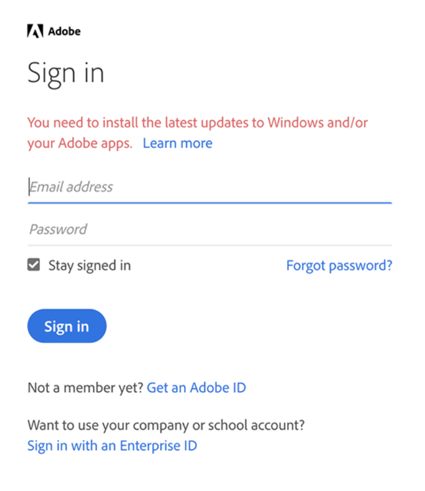

# Como atualizar seu ambiente para se conectar ao Adobe Campaign com IMS {#acc-ims-faq}

Em 30 de junho de 2021, foram [Sistema Adobe Identity Management](https://helpx.adobe.com/br/enterprise/using/identity.html) (IMS) recursos de logon que podem afetar sua capacidade de continuar usando o Adobe Campaign. Saiba como garantir que continue usando o Adobe Campaign Classic v7 sem interrupções.

## O que mudou?

O Adobe Identity Management Service (IMS) parou de oferecer suporte a versões antigas do Internet Explorer no **30 de junho de 2021**. [Saiba mais](https://helpx.adobe.com/x-productkb/global/update-operating-system-and-browser.html).

O Adobe deseja preservar a funcionalidade IMS para todos os clientes após 30 de junho de 2021. O IMS faz parte da estrutura de segurança que permite aos usuários fazer logon no console do cliente, ou seja, no Adobe Campaign.

Para preservar essa funcionalidade, os clientes devem atualizar o Console do cliente no computador de cada usuário e garantir a atualização mais recente do [Versão do Windows](../../rn/using/compatibility-matrix.md#ClientConsoleoperatingsystems), com **Internet Explorer 11** incorporada, o é instalado no computador de cada usuário.

## Você será afetado?

Se estiver se conectando ao Campaign [por meio de uma Adobe ID](../../integrations/using/about-adobe-id.md), pelo Adobe Identity Management Service (IMS) e ao executar uma versão do Campaign mais antiga do que as listadas abaixo, você será afetado.

Se você já atualizou, mas está usando uma versão antiga do Microsoft Internet Explorer, é necessário atualizar para o Internet Explorer 11.

## Como atualizar?

* Como cliente hospedado, o Adobe já atualizou sua(s) instância(s) para a versão mais recente.

* Como cliente local/híbrido, você precisa atualizar para uma das versões mais recentes listadas acima para se beneficiar do novo console do cliente e garantir uma transição contínua **antes de 30 de junho de 2021**.

   A atualização para uma das novas versões listadas abaixo é obrigatória:

   * Gold Standard 11. [Saiba mais](../../rn/using/gold-standard.md)
   * Campaign versão 21.1.3. [Saiba mais](../../rn/using/latest-release.md)
   * Campaign versão 20.2.5. [Saiba mais](../../rn/using/release--2020.md#release-20-2-5-build-9188)
   * Campaign versão 20.1.4. [Saiba mais](../../rn/using/release--2020.md#release-20-1-4-build-9126)
   * Campaign versão 19.2.4. [Saiba mais](../../rn/using/release--2019.md#release-19-2-4-build-9082)

   Essas versões são fornecidas com um novo protocolo de conexão. A atualização é obrigatória para o servidor do Campaign e o Console do cliente: depois que todas as instâncias forem atualizadas, o Console do cliente precisará ser atualizado para essa versão, bem como para poder se conectar ao Campaign após **30 de junho de 2021**.

Além disso, verifique a atualização mais recente do seu [Versão do Windows](../../rn/using/compatibility-matrix.md#ClientConsoleoperatingsystems), com **Internet Explorer 11** incorporada, o é instalado no computador de cada usuário.

## Perguntas frequentes

**Como posso verificar minha versão do Campaign?**

Saiba como verificar sua versão [nesta seção](../../platform/using/launching-adobe-campaign.md#getting-your-campaign-version).

**Como posso verificar se uso o IMS?**

Para verificar o modo de conexão, você pode:

* Inicie o Console do cliente do Campaign e acesse as configurações de conexão da instância. Se a variável **Conectar-se com uma Adobe ID** for selecionada, você estará usando o Adobe IMS.

   

ou

* Inicie o Console do cliente do Campaign e verifique a janela de conexão. Se estiver se conectando com uma Adobe ID, como mostrado na tela abaixo, você está usando o IMS.

   

**Mensagem de aviso de conexão**

A seguinte mensagem de aviso estará visível para os usuários se eles precisarem atualizar o Console do cliente ou usar uma versão antiga do Microsoft Internet Explorer: **Você precisa instalar os aplicativos atualizados mais recentes para o Windows e/ou o Adobe.**

Se aparecer esse aviso, instale as atualizações mais recentes do sistema operacional que você está usando. [Saiba mais](https://helpx.adobe.com/x-productkb/global/update-operating-system-and-browser.html)

Se você não atualizou sua versão do Internet Explorer, verá a seguinte mensagem e não poderá mais se conectar ao Adobe Campaign:

>[!NOTE]
>
>Em caso de dúvidas sobre essas alterações, entre em contato com o [Atendimento ao cliente da Adobe](https://helpx.adobe.com/br/enterprise/admin-guide.html/enterprise/using/support-for-experience-cloud.ug.html).

## Links úteis

* [Atualizar o ambiente](../../production/using/build-upgrade.md)
* [Perguntas frequentes sobre atualização de build](../../platform/using/faq-build-upgrade.md)
* [Disponibilizar o novo Console do cliente para os usuários](../../installation/using/client-console-availability-for-windows.md)
* [Instalar o console do cliente do Campaign](../../installation/using/installing-the-client-console.md)
* [Distribuição de software de Adobe de acesso](https://experienceleague.adobe.com/docs/experience-cloud/software-distribution/home.html?lang=pt-BR)
* [Baixar build de Campaign Classic](https://experience.adobe.com/#/downloads/content/software-distribution/br/campaign.html)
