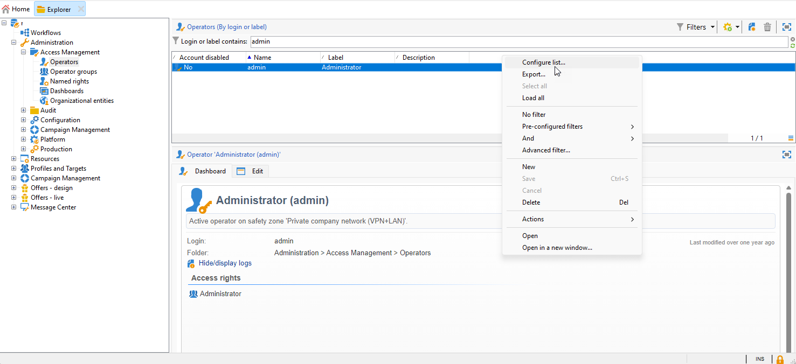

# Migrar operadores do Campaign para o Adobe Identity Management System (IMS) {#migrate-users-to-ims}

Como parte do esforço para reforçar a segurança e o processo de autenticação, a Adobe Campaign recomenda migrar o modo de autenticação do usuário final da autenticação nativa de logon/senha para o Adobe Identity Management System (IMS). Todos os operadores devem implementar [Sistema Adobe Identity Management (IMS)](https://helpx.adobe.com/br/enterprise/using/identity.html){target="_blank"} para se conectar ao Campaign.

Observe que no Campaign v8, a conexão com usuário/senha (também conhecida como autenticação nativa) não será mais permitida. **O Adobe recomenda executar essa migração no Campaign v7.3.5 para poder migrar sem problemas para o Campaign v8.**

## O que mudou?{#move-to-ims-changes}

Com o Campaign Classic, todos os usuários regulares já podem se conectar ao console do cliente Adobe Campaign usando sua Adobe ID, por meio do Adobe Identity Management System (IMS). No entanto, as conexões de usuário/senha ainda estão disponíveis. Isso não será mais permitido com o Campaign v8.

Além disso, como parte do esforço para reforçar a segurança e o processo de autenticação, o aplicativo cliente do Adobe Campaign agora chama as APIs do Campaign diretamente usando o token de conta técnica do IMS. migração para os operadores técnicos é apresentada em pormenor num artigo [esta página](ims-migration.md).

Essa alteração já é aplicável no Campaign Classic v7 e será **obrigatório** para migrar para o Campaign v8.

O Adobe ajuda você nesse esforço de migração. Você pode encontrar contexto detalhado e diretrizes passo a passo no artigo abaixo.

## Você será afetado?{#migrate-ims-impacts}

Esse procedimento se aplica a todos os usuários do Campaign que ainda não estão se conectando ao Campaign com sua Adobe ID.

Se os operadores em sua organização estiverem se conectando ao console do cliente do Campaign usando seu logon/senha (também conhecido como. autenticação nativa), você será afetado e deverá migrar esses operadores para o Adobe IMS conforme detalhado abaixo.

Migração para [Sistema Adobe Identity Management (IMS)](https://helpx.adobe.com/br/enterprise/using/identity.html){target="_blank"} O é uma obrigação de segurança para tornar seus ambientes seguros e padronizados, pois a maioria das outras soluções e aplicativos da Adobe Experience Cloud já está no IMS.

## Como migrar ambientes hospedados e do Managed Services? {#ims-migration-procedure}

### Pré-requisitos {#ims-migration-prerequisites}

Antes de iniciar o processo de migração, entre em contato com o Gerenciador de transição do Adobe (para clientes do Managed Services) ou com o Atendimento ao cliente do Adobe (para outros clientes hospedados), para que as equipes técnicas do Adobe possam migrar seus grupos de operadores e direitos nomeados existentes para o Adobe Identity Management System (IMS).

### Versões compatíveis com a migração IMS {#ims-versions}

Um pré-requisito para essa migração é atualizar seu ambiente para uma das seguintes versões de produto:

* Campaign v7.3.5 (recomendado)
* Campaign v7.3.3.IMS
* Campaign v7.3.2.IMS

Essas versões do Campaign estão detalhadas na seção [Notas de versão](../../rn/using/latest-release.md).

### Principais etapas {#ims-migration-steps}

As principais etapas dessa migração estão listadas abaixo:

1. O Adobe atualiza seus ambientes para o Campaign v7.3.5 (ou um [Versão compatível com migração IMS](#ims-versions)).
1. Após a atualização, ainda será possível criar novos usuários com ambos os métodos, como usuário nativo ou com IMS.
1. O administrador interno do Campaign deve adicionar emails exclusivos a todos os usuários nativos no console do cliente do Campaign e confirmar para o representante do Adobe/Atendimento ao cliente depois que isso for concluído.  Essa etapa está detalhada em [nesta seção](#ims-migration-id).
1. Trabalhe com seu representante da Adobe/Atendimento ao cliente para garantir uma data para o Adobe executar a migração automatizada para seus usuários (operadores) e perfis de produto não técnicos. Esta etapa requer uma janela de uma hora sem tempo de inatividade para nenhum de seus serviços.
1. O administrador interno do Campaign valida essas alterações e fornece aprovação. Após essa migração, não será mais necessário criar nenhum outro operador autenticado com este logon e senha.

Você também pode migrar seus operadores técnicos para o Console do Adobe Developer, conforme detalhado em [esta nota técnica](ims-migration.md).

Após concluir a migração, confirme para o Gerenciador de transição do Adobe (para usuários do Managed Services) ou para o Atendimento ao cliente do Adobe (para clientes hospedados). O Adobe marca a migração como concluída. Seu ambiente é então protegido e padronizado.

## Como migrar ambientes híbridos e no local? {#ims-migration-procedure-on-prem}

As principais etapas dessa migração estão listadas abaixo:

1. Atualize seus ambientes para o Campaign v7.3.5 (ou um [Versão compatível com migração IMS](#ims-versions)).
1. Após a atualização, ainda será possível criar novos usuários com ambos os métodos, como usuário nativo ou com IMS.
1. O administrador interno do Campaign deve configurar o Adobe IMS conforme detalhado em [nesta seção](../../integrations/using/configuring-ims.md).
1. Em seguida, adicione emails exclusivos a todos os usuários nativos no console do cliente do Campaign. Essa etapa está detalhada em [nesta seção](#ims-migration-id).
1. Crie usuários e perfis de produto no Adobe Admin Console conforme detalhado em [Documentação do Campaign v8](https://experienceleague.adobe.com/docs/campaign/campaign-v8/admin/permissions/manage-permissions.html){target="_blank"}.
1. Ativar o **Conectar-se ao Adobe ID** para todos os operadores.
1. Implemente o Adobe IMS para sua conexão conforme detalhado em [esta página](../../integrations/using/implementing-ims.md).

Você também pode migrar seus operadores técnicos para o Console do Adobe Developer, conforme detalhado em [esta nota técnica](ims-migration.md).

## Perguntas frequentes {#ims-migration-faq}

### Quando posso iniciar a migração? {#ims-migration-start}

Uma recomendação para a migração para [Sistema Adobe Identity Management (IMS)](https://helpx.adobe.com/br/enterprise/using/identity.html){target="_blank"} é atualizar seu ambiente para o Campaign Classic v7.3.5 (ou um [Versão compatível com migração IMS](#ims-versions)).

Você pode iniciar a migração IMS no ambiente de preparo depois que ele for atualizado para a versão mais recente e planejar adequadamente o ambiente de produção.

### O que acontece após a atualização de build para o Campaign Classic v7.3.5? {#ims-migration-after-upgrade}

Depois que seus ambientes tiverem sido atualizados para o Campaign Classic v7.3.5 (ou um [Versão compatível com migração IMS](#ims-versions)), você pode iniciar sua transição para [Sistema Adobe Identity Management (IMS)](https://helpx.adobe.com/br/enterprise/using/identity.html){target="_blank"}.

### Quando a migração é concluída? {#ims-migration-end}

Quando a migração do usuário final e a migração técnica do usuário para o Adobe Identity Management System (IMS) estiverem concluídas, você deverá entrar em contato com o representante da Adobe/Suporte ao cliente para que o Adobe possa marcar a migração como concluída.

### Como criar usuários após a migração? {#ims-migration-native}

O Adobe recomenda criar somente usuários do IMS após atualizar para o Campaign Classic v7.3.5 (ou um [Versão compatível com migração IMS](#ims-versions)).

Como administrador do Campaign, você pode conceder permissões aos usuários da organização por meio do Adobe Admin Console e do Console do cliente do Campaign. Os usuários fazem logon no Adobe Campaign com a Adobe ID. Saiba como configurar permissões com o IMS no [Documentação do Campaign v8](https://experienceleague.adobe.com/docs/campaign/campaign-v8/admin/permissions/gs-permissions.html?lang=pt-BR){target="_blank"}.

### Como adicionar emails para usuários nativos atuais? {#ims-migration-id}

Como administrador do Campaign, você deve adicionar IDs de email para todos os usuários nativos do console do cliente. Para fazer isso, siga as etapas abaixo:

1. Conecte-se ao console do cliente e navegue até **Administração > Gerenciamento de acesso > Operadores**.
1. Selecione o operador a ser atualizado na lista de operadores.
1. Insira o email do operador nas **Pontos de contato** seção do formulário do operador.
1. Salve as alterações.

<!--You can also import a CSV file to update all your operator profiles with their email.-->

### Como fazer logon no Campaign via IMS? {#ims-migration-log}

Saiba como se conectar ao Campaign com sua Adobe ID no [nesta seção](../../integrations/using/implementing-ims.md).

### Haverá um tempo de inatividade durante essa migração? {#ims-migration-downtime}

Para clientes do Hosted e do Managed Services, para finalizar a migração (migrar usuários e perfis de produtos), o Adobe requer uma janela de uma hora sem tempo de inatividade para nenhuma de suas instâncias (workflows etc.).

Durante esse período, todos os usuários do Campaign precisam fazer logoff e fazer logon novamente com sua Adobe ID após a conclusão da migração para o IMS.

A Adobe recomenda que todos os usuários sejam desconectados durante a janela de migração.

### Os usuários em minha organização já estão usando o IMS. Ainda preciso executar a migração do IMS?{#ims-migration-needed}

Há dois aspectos nesta migração: migração de usuários finais (além de perfis de produtos) e migração de usuários técnicos (usada em APIs do no código personalizado).

Se todos os seus usuários (operadores do Campaign) estiverem no IMS, você ainda precisará entrar em contato com o representante da Adobe/suporte ao cliente para planejar a Migração de perfis de produto. Você também precisará migrar Usuários técnicos que podem ter sido usados no código personalizado. Saiba mais [nesta página](ims-migration.md).

### Como visualizar o tipo de autenticação de seus Operadores?

Saiba como visualizar o tipo de autenticação de seus Operadores no Campaign:

1. No **Explorer**, acesso **Administração** `>` **Gerenciamento de acesso** `>` **Operadores**.

1. Clique com o botão direito do mouse na linha de cabeçalho e selecione a **Configurar lista** menu.

   

1. Adicionar **Conta Desabilitada** e **Tipo de autenticação** as **Colunas de saída**.

   

Agora você pode ver a lista de seus **Operadores** e seus **Tipo de autenticação**.

## Links úteis {#ims-useful-links}

* [Migração de usuários técnicos para o console do Adobe Developer](ims-migration.md)
* [Notas de versão do Adobe Campaign v8](../../rn/using/latest-release.md)
* [O que é o Sistema Adobe Identity Management (IMS)](https://helpx.adobe.com/br/enterprise/using/identity.html){target="_blank"}
