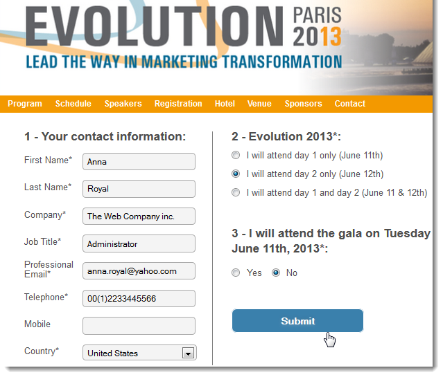
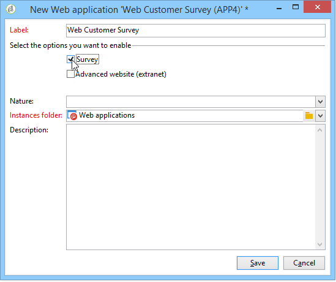

# Introdução a aplicativos Web{#about-web-applications}

O Adobe Campaign permite criar e publicar aplicações web dinâmicas e interativas com dados do banco de dados e conteúdo adaptado aos direitos do usuário conectado.

É possível criar páginas, como um formulário de edição em uma extranet ou formulários de notificação, incluindo dados do banco de dados com tabelas, gráficos, formulários de entrada, etc. Essa funcionalidade permite criar e publicar páginas da Web em que os usuários podem pesquisar ou inserir informações.

Pode ser um formulário de subscrição contendo dados pré-carregados com informações no banco de dados do Adobe Campaign, como mostrado abaixo:

Este capítulo fornece uma visão geral de como gerenciar as aplicações web.

>[!NOTE]
>
>Consulte a [lista de verificação de segurança e privacidade](https://helpx.adobe.com/campaign/kb/acc-security.html) para saber como otimizar a segurança para aplicativos web.

>[!CAUTION]
>
>Por motivos de privacidade, recomendamos usar HTTPS para todos os recursos externos.

## Escopo do aplicativo web {#web-application-scope}

Os aplicativos Web no Adobe Campaign oferecem acesso às seguintes funcionalidades:

* Criação de formulários com várias páginas. Para obter mais informações, consulte esta [página](about-web-forms.md).
* Gestão de pesquisa multilíngue com uma ferramenta de tradução integrada. Para obter mais informações, consulte esta [página](translating-a-web-application.md).
* Interface de gestão de página gráfica, layout de página com várias colunas. Para obter mais informações, consulte esta [página](designing-a-web-application.md).
* Personalização de renderização e posição de campo. Para obter mais informações, consulte esta [página](editing-content.md#adding-personalization-content).
* Exibição condicional de campos de pesquisa de acordo com as respostas. Para obter mais informações, consulte esta [página](form-rendering.md#defining-fields-conditional-display).
* Exibição aleatória de perguntas. Para obter mais informações, consulte esta [página](../../surveys/using/building-a-survey.md#adding-questions).
* Exibição de página condicional. Para obter mais informações, consulte esta [página](defining-web-forms-page-sequencing.md#conditional-page-display).
* Verificação de informações antes da validação, dependendo do tipo de dados esperado (número, endereço de email, data etc.) e os campos obrigatórios. Para obter mais informações, consulte esta [página](form-rendering.md#defining-control-settings).
* Convites ou notificações por email. Para obter mais informações, consulte esta [página](publishing-a-web-form.md#delivering-a-form-via-email).
* Personalização de mensagens de erros e mensagens finais. Para obter mais informações, consulte esta [página](defining-web-forms-properties.md#setting-up-an-error-page).
* Uso de imagens, vídeos, links de hipertexto, captcha etc. Para obter mais informações, consulte esta [página](editing-content.md).
* Monitoramento de respostas em tempo real. Para obter mais informações, consulte esta [página](../../surveys/using/publish-track-and-use-collected-data.md#response-tracking).

O módulo de criação **Survey** opcional oferece as seguintes funcionalidades adicionais:

* Extensão dinâmica do banco de dados: criação de respostas não incluídas no modelo de dados inicial. Para obter mais informações, consulte esta [página](../../surveys/using/managing-answers.md#storing-collected-answers).
* Geração de relatórios dedicados. Para obter mais informações, consulte esta [página](../../surveys/using/publish-track-and-use-collected-data.md#reports-on-surveys).

Em comparação às aplicações Web, as pesquisas têm uma interface gráfica simplificada com um número reduzido de controles de edição.

>[!NOTE]
>
>As pesquisas estão detalhadas [nesta seção](../../surveys/using/about-surveys.md).
>
>As funcionalidades gerais de formulários web no Adobe Campaign estão detalhadas [nesta seção](about-web-forms.md).

## Implementação do aplicativo web {#web-application-implementation}

Para criar e publicar uma aplicação web, você deve:

1. Crie o conteúdo (campos, listas, tabelas, gráficos, etc.).

   Você também pode exibir a seção que detalha os campos disponíveis para formulários: todos esses campos também estão disponíveis para aplicações web. Essas informações estão disponíveis [nesta página](adding-fields-to-a-web-form.md).

1. Conforme necessário, você pode adicionar pré-carregamento, testar e salvar etapas e configurar o sistema de controle de acesso (principalmente dentro da estrutura de uma publicação extranet).
1. Publique a aplicação web para torná-la disponível em uma extranet ou no Adobe Campaign.

## Configuração inicial do aplicativo web {#web-application-initial-configuration}

Os aplicativos web são criados por meio do link **[!UICONTROL Web Applications]** nas guias **[!UICONTROL Campaigns]** e **[!UICONTROL Profiles and targets]**.

Os aplicativos web são armazenados no nó **[!UICONTROL Resources > Online > Web Applications]** da árvore do Adobe Campaign. As configurações estão divididas nas seguintes pastas:

* **[!UICONTROL Administration > Configuration > Form renderings]**: contém os modelos de renderização para a apresentação do formulário Web (aplicativos e pesquisas). O modelo permite gerar o formulário. Ele também usa uma folha de estilos CSS. Essa folha de estilos pode ser sobrecarregada no nível do modelo. Para obter mais informações, consulte [esta página](form-rendering.md#selecting-the-form-rendering-template).
* **[!UICONTROL Resources > Templates > Web application templates]**: contém modelos de formulário. Para criar um formulário ou um aplicativo Web, você deve começar com um modelo.

## Modelos de aplicativo web {#web-application-templates}

Por padrão, o Adobe Campaign fornece um modelo por aplicação web disponível.

>[!NOTE]
>
>Você pode converter uma aplicação web existente em um modelo. Para fazer isso, selecione o formulário e clique com o botão direito do mouse. Selecione **[!UICONTROL Actions > Save as template...]**.

Você pode criar novos modelos no nó **[!UICONTROL Resources > Templates > Web Application templates]** da árvore do Adobe Campaign.

O assistente de criação permite selecionar as opções que você deseja habilitar, conforme mostrado abaixo.

>[!CAUTION]
>
>As aplicações disponíveis dependem das opções e dos módulos. Verifique o contrato de licença.
