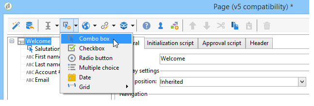

# Introdução aos formulários web{#about-web-forms}

O Adobe Campaign integra um módulo gráfico para definir e publicar formulários web a fim de criar páginas contendo campos de entrada e seleção e que possam incluir dados no banco de dados. Isso permite a criação e publicação de páginas da Web onde os usuários podem visualizar ou inserir informações.

Este capítulo detalha a criação e o gerenciamento de formulários web, campos e páginas, assim como os modos de armazenamento e salvamento.

>[!CAUTION]
>
>Por motivos de privacidade, recomendamos usar HTTPS para todos os recursos externos.

## Etapas para criar um formulário web {#steps-for-creating-a-web-form}

Este capítulo detalha as etapas necessárias para criar um formulário do tipo **webForm** no Adobe Campaign, assim como as opções e configurações disponíveis. O Adobe Campaign permite disponibilizar esse formulário web aos usuários, assim como coletar e arquivar respostas no banco de dados.

>[!CAUTION]
>
>Ao configurar os aplicativos web e formulários web, é necessário uma resolução mínima de 900 pixels (por exemplo, 1600 x 900).

Os formulários web são acessados pelo menu Web Applications da guia **Campaigns**. Na árvore do Adobe Campaign, elas estão agrupadas no nó **[!UICONTROL Resources > Online > Web Applications]**.

Para criar um formulário web, clique no botão **[!UICONTROL Create]** acima da lista de aplicações web.

Selecione o template do formulário web (**[!UICONTROL newWebForm]** por padrão).

Isso o levará ao painel do formulário.

A guia **[!UICONTROL Edit]** permite criar o conteúdo.

Para definir a configuração e o conteúdo do formulário Web, siga as etapas abaixo:

* Comece com a criação das páginas e verificações necessárias: campos de entrada, listas suspensas, conteúdo HTML, etc.

   Essa etapa é detalhada abaixo.

* Defina o sequenciamento de páginas e condicione a exibição.

   Essa etapa está detalhada em [Definição do sequenciamento de páginas de formulários web](defining-web-forms-page-sequencing.md).

* Traduza o conteúdo, se necessário.

   Esta etapa está detalhada em [Tradução de um formulário web](translating-a-web-form.md).

## Sobre o design do formulários web {#about-web-forms-designing}

As páginas do formulário são criadas por meio de um editor específico que permite definir e configurar as zonas de entrada (texto), campos de seleção (listas, caixas de seleção, etc.) e elementos estáticos (imagens, conteúdo HTLM, etc.). Elas podem ser agrupadas em contêineres e o layout pode ser alterado para atender às suas necessidades (para obter mais informações, consulte).

As seções a seguir detalham como definir o conteúdo e o layout nas telas do formulário:

* [Inclusão de campos em um formulário web](adding-fields-to-a-web-form.md),
* [Inserção de conteúdo HTML](static-elements-in-a-web-form.md#inserting-html-content),
* [Elementos estáticos em um formulário web](static-elements-in-a-web-form.md),
* [Definição do layout de formulários web](defining-web-forms-layout.md).

>[!NOTE]
>
>* Durante o design da página, é possível exibir a renderização final na guia **[!UICONTROL Preview]**. Para visualizar as alterações, salve o formulário primeiro. Todos os erros são exibidos na guia **[!UICONTROL Log]**.
>* Para garantir que a exibição da página e o armazenamento de informações ocorram na sequência apropriada, habilite o modo de depuração no formulário Web. Para fazer isso, vá para a subguia **[!UICONTROL Preview]** e marque a caixa **[!UICONTROL Enable debug mode]**: todas as informações coletadas e possíveis erros de execução são exibidos na parte inferior de cada página.

>

### Utilização dos ícones na barra de ferramentas {#using-the-icons-in-the-toolbar}

É possível usar os ícones na barra de ferramentas ou um clique com o botão direito do mouse para inserir uma zona de entrada.

Nesse caso, primeiro selecione o tipo de campo que deve ser adicionado e o modo de armazenamento de resposta.

Clique em **[!UICONTROL Ok]** para aprovar a seleção.

