<?xml version="1.0" encoding="UTF-8"?>
<xliff xmlns="urn:oasis:names:tc:xliff:document:1.2" xmlns:okp="okapi-framework:xliff-extensions" xmlns:its="http://www.w3.org/2005/11/its" xmlns:itsxlf="http://www.w3.org/ns/its-xliff/" version="1.2" its:version="2.0">
<file original="help/web/using/adding-fields-to-a-web-form.md.mdnouisc" source-language="en-US" target-language="en-XX" datatype="x-text/markdown">
<body>
<trans-unit id="tu186" xml:space="preserve">
<source xml:lang="en-US">https://experienceleague.adobe.com/pt-br/tools/campaign-api</source>
<target xml:lang="en-XX">https://experienceleague.adobe.com/pt-br/tools/campaign-api</target>
</trans-unit>
<trans-unit id="tu1" restype="x-YAML_METADATA_HEADER_VALUE" xml:space="preserve">
<source xml:lang="en-US">Add fields to a web form</source>
<target xml:lang="en-XX">Adicionar campos a um formulário web</target>
</trans-unit>
<trans-unit id="tu2" restype="x-YAML_METADATA_HEADER_VALUE" xml:space="preserve">
<source xml:lang="en-US">Add fields to a web form</source>
<target xml:lang="en-XX">Adicionar campos a um formulário web</target>
</trans-unit>
<trans-unit id="tu3" xml:space="preserve">
<source xml:lang="en-US">Also applies to v8</source>
<target xml:lang="en-XX">Também se aplica ao v8</target>
</trans-unit>
<trans-unit id="tu4" xml:space="preserve">
<source xml:lang="en-US">Also applies to Campaign v8</source>
<target xml:lang="en-XX">Também se aplica ao Campaign v8</target>
</trans-unit>
<trans-unit id="tu5" xml:space="preserve">
<source xml:lang="en-US">Add fields to a web form</source>
<target xml:lang="en-XX">Adicionar campos a um formulário web</target>
</trans-unit>
<trans-unit id="tu6" xml:space="preserve">
<source xml:lang="en-US">In a Web form, fields enable users to enter information and select options. Web forms can offer input fields, selection fields, static and advanced content (captchas, subscriptions, etc.).</source>
<target xml:lang="en-XX">Em um formulário Web, os campos permitem que os usuários insiram informações e selecionem opções. Os formulários web podem oferecer campos de entrada, campos de seleção, conteúdo estático e avançado (captchas, subscrições, etc.).</target>
</trans-unit>
<trans-unit id="tu7" xml:space="preserve">
<source xml:lang="en-US">When you use the assistant to add fields, the field type is detected automatically based on the selected field or storage variable. You can edit it using the <ph id="1" ctype="x-STRONG_EMPHASIS">**[!UICONTROL Type]**</ph> drop-down box in the <ph id="4" ctype="x-STRONG_EMPHASIS">**[!UICONTROL General]**</ph> tab.</source>
<target xml:lang="en-XX">Quando o assistente é utilizado para adicionar campos, o tipo de campo é detectado automaticamente com base no campo ou na variável de armazenamento selecionada. É possível editá-lo usando a caixa suspensa <ph id="1" ctype="x-STRONG_EMPHASIS">**[!UICONTROL Type]**</ph> na guia <ph id="4" ctype="x-STRONG_EMPHASIS">**[!UICONTROL General]**</ph>.</target>
</trans-unit>
<trans-unit id="tu8" xml:space="preserve">
<source xml:lang="en-US"><ph id="1" ctype="x-IMAGE"></ph></source>
<target xml:lang="en-XX"><ph id="1" ctype="x-IMAGE"></ph></target>
</trans-unit>
<trans-unit id="tu9" xml:space="preserve">
<source xml:lang="en-US">When using the buttons in the toolbar, select the type of field you want to add.</source>
<target xml:lang="en-XX">Ao usar os botões na barra de ferramentas, selecione o tipo de campo que deseja adicionar.</target>
</trans-unit>
<trans-unit id="tu10" xml:space="preserve">
<source xml:lang="en-US">The following types of field are available:</source>
<target xml:lang="en-XX">Os seguintes tipos de campo estão disponíveis:</target>
</trans-unit>
<trans-unit id="tu11" xml:space="preserve">
<source xml:lang="en-US">Text/number input. See <ph id="1" ctype="x-LINK">[</ph>Adding input fields<ph id="2" ctype="x-LINK">](#adding-input-fields)</ph>.</source>
<target xml:lang="en-XX">Entrada de texto/número. Consulte <ph id="1" ctype="x-LINK">[</ph>Adição de campos de entrada<ph id="2" ctype="x-LINK">](#adding-input-fields)</ph>.</target>
</trans-unit>
<trans-unit id="tu12" xml:space="preserve">
<source xml:lang="en-US">Drop-down list selection. See <ph id="1" ctype="x-LINK">[</ph>Adding drop-down lists<ph id="2" ctype="x-LINK">](#adding-drop-down-lists)</ph>.</source>
<target xml:lang="en-XX">Seleção da lista suspensa. Consulte <ph id="1" ctype="x-LINK">[</ph>Adição de listas suspensas<ph id="2" ctype="x-LINK">](#adding-drop-down-lists)</ph>.</target>
</trans-unit>
<trans-unit id="tu13" xml:space="preserve">
<source xml:lang="en-US">Multiple choice via checkboxes. See <ph id="1" ctype="x-LINK">[</ph>Adding checkboxes<ph id="2" ctype="x-LINK">](#adding-checkboxes)</ph>.</source>
<target xml:lang="en-XX">Múltipla escolha por meio de caixas de seleção. Consulte <ph id="1" ctype="x-LINK">[</ph>Adição de caixas de seleção<ph id="2" ctype="x-LINK">](#adding-checkboxes)</ph>.</target>
</trans-unit>
<trans-unit id="tu14" xml:space="preserve">
<source xml:lang="en-US">Exclusive selection via radio buttons. See <ph id="1" ctype="x-LINK">[</ph>Adding radio buttons<ph id="2" ctype="x-LINK">](#adding-radio-buttons)</ph>.</source>
<target xml:lang="en-XX">Seleção exclusiva por meio de botões de opção. Consulte <ph id="1" ctype="x-LINK">[</ph>Adição de botões de opção<ph id="2" ctype="x-LINK">](#adding-radio-buttons)</ph>.</target>
</trans-unit>
<trans-unit id="tu15" xml:space="preserve">
<source xml:lang="en-US">Vote in an option grid. See <ph id="1" ctype="x-LINK">[</ph>Adding grids<ph id="2" ctype="x-LINK">](#adding-grids)</ph>.</source>
<target xml:lang="en-XX">Voto em uma grade de opções. Consulte <ph id="1" ctype="x-LINK">[</ph>Adição de grades<ph id="2" ctype="x-LINK">](#adding-grids)</ph>.</target>
</trans-unit>
<trans-unit id="tu16" xml:space="preserve">
<source xml:lang="en-US">Numbers and dates. See <ph id="1" ctype="x-LINK">[</ph>Adding dates and numbers<ph id="2" ctype="x-LINK">](#adding-dates-and-numbers)</ph>.</source>
<target xml:lang="en-XX">Números e datas. Consulte <ph id="1" ctype="x-LINK">[</ph>Adição de datas e números<ph id="2" ctype="x-LINK">](#adding-dates-and-numbers)</ph>.</target>
</trans-unit>
<trans-unit id="tu17" xml:space="preserve">
<source xml:lang="en-US">Subscription/unsubscription to an information service. See <ph id="1" ctype="x-LINK">[</ph>Subscription checkboxes<ph id="2" ctype="x-LINK">](#subscription-checkboxes)</ph>.</source>
<target xml:lang="en-XX">Subscrição/cancelamento de subscrição de um serviço de informação. Consulte <ph id="1" ctype="x-LINK">[</ph>Caixas de seleção de subscrição<ph id="2" ctype="x-LINK">](#subscription-checkboxes)</ph>.</target>
</trans-unit>
<trans-unit id="tu18" xml:space="preserve">
<source xml:lang="en-US">Captcha validation. See <ph id="1" ctype="x-LINK">[</ph>Inserting a captcha<ph id="2" ctype="x-LINK">](#inserting-a-captcha)</ph>.</source>
<target xml:lang="en-XX">Validação de captcha. Consulte <ph id="1" ctype="x-LINK">[</ph>Inserir um captcha<ph id="2" ctype="x-LINK">](#inserting-a-captcha)</ph>.</target>
</trans-unit>
<trans-unit id="tu19" xml:space="preserve">
<source xml:lang="en-US">Download button. <ph id="1" ctype="x-LINK">[</ph>Uploading a file<ph id="2" ctype="x-LINK">](#uploading-a-file)</ph>.</source>
<target xml:lang="en-XX">Botão Download. <ph id="1" ctype="x-LINK">[</ph>Upload de arquivo<ph id="2" ctype="x-LINK">](#uploading-a-file)</ph>.</target>
</trans-unit>
<trans-unit id="tu20" xml:space="preserve">
<source xml:lang="en-US">Hidden constant. See <ph id="1" ctype="x-LINK">[</ph>Inserting a hidden constant<ph id="2" ctype="x-LINK">](#inserting-a-hidden-constant)</ph>.</source>
<target xml:lang="en-XX">Constante oculta. Consulte <ph id="1" ctype="x-LINK">[</ph>Inserir uma constante oculta<ph id="2" ctype="x-LINK">](#inserting-a-hidden-constant)</ph>.</target>
</trans-unit>
<trans-unit id="tu21" xml:space="preserve">
<source xml:lang="en-US">Please specify the response storage mode: update a field in the database (stores only the last value saved) or store in a variable (the answer is not stored). For more on this, refer to <ph id="1" ctype="x-LINK">[</ph>Response storage fields<ph id="2" ctype="x-LINK">](web-forms-answers.md#response-storage-fields)</ph>.</source>
<target xml:lang="en-XX">Especifique o modo de armazenamento de resposta: atualize um campo no banco de dados (armazena somente o último valor salvo) ou armazene em uma variável (a resposta não é armazenada). Para obter mais informações, consulte <ph id="1" ctype="x-LINK">[</ph>Campos de armazenamento de resposta<ph id="2" ctype="x-LINK">](web-forms-answers.md#response-storage-fields)</ph>.</target>
</trans-unit>
<trans-unit id="tu22" xml:space="preserve">
<source xml:lang="en-US"><ph id="1" ctype="x-regxph" equiv-text="&lbrack;!NOTE">[!NOTE]</ph></source>
<target xml:lang="en-XX"><ph id="1" ctype="x-regxph" equiv-text="&lbrack;!NOTE">[!NOTE]</ph></target>
</trans-unit>
<trans-unit id="tu23" xml:space="preserve">
<source xml:lang="en-US">By default, the field is inserted at the bottom of the current tree. Use the arrows in the toolbar to move it up or down.</source>
<target xml:lang="en-XX">Por padrão, o campo é inserido na parte inferior da árvore atual. Use as setas na barra de ferramentas para movê-lo para cima ou para baixo.</target>
</trans-unit>
<trans-unit id="tu24" xml:space="preserve">
<source xml:lang="en-US">Field creation assistant</source>
<target xml:lang="en-XX">Assistente de criação de campos</target>
</trans-unit>
<trans-unit id="tu25" xml:space="preserve">
<source xml:lang="en-US">For each page of the form, you can add a field via the first button in the toolbar. To do this, go to the <ph id="1" ctype="x-STRONG_EMPHASIS">**[!UICONTROL Add using the assistant]**</ph> menu.</source>
<target xml:lang="en-XX">Para cada página do formulário, é possível adicionar um campo usando o primeiro botão da barra de ferramentas. Para fazer isso, acesse o menu <ph id="1" ctype="x-STRONG_EMPHASIS">**[!UICONTROL Add using the assistant]**</ph>.</target>
</trans-unit>
<trans-unit id="tu26" xml:space="preserve">
<source xml:lang="en-US"><ph id="1" ctype="x-IMAGE">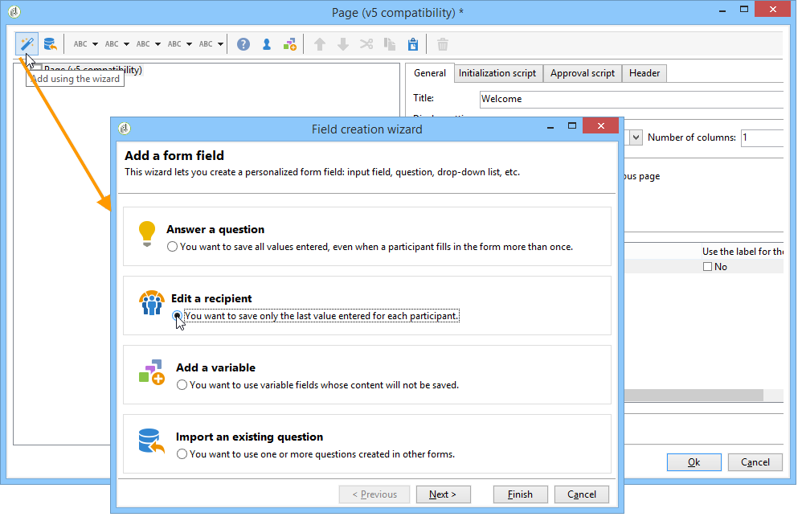</ph></source>
<target xml:lang="en-XX"><ph id="1" ctype="x-IMAGE"></ph></target>
</trans-unit>
<trans-unit id="tu27" xml:space="preserve">
<source xml:lang="en-US">Select the type of field you want to create: you can choose to add a field in the database, a variable or to import a group of fields created in another form and collected in a container.</source>
<target xml:lang="en-XX">Selecione o tipo de campo que deseja criar: é possível escolher a inclusão de um campo no banco de dados, uma variável ou até importar um grupo de campos criado em outro formulário e coletado em um container.</target>
</trans-unit>
<trans-unit id="tu28" xml:space="preserve">
<source xml:lang="en-US">Click <ph id="1" ctype="x-STRONG_EMPHASIS">**[!UICONTROL Next]**</ph> and select the storage field or variable, or the container you want to import.</source>
<target xml:lang="en-XX">Clique em <ph id="1" ctype="x-STRONG_EMPHASIS">**[!UICONTROL Next]**</ph> e selecione o campo de armazenamento, a variável ou o container que deseja importar.</target>
</trans-unit>
<trans-unit id="tu29" xml:space="preserve">
<source xml:lang="en-US"><ph id="1" ctype="x-IMAGE">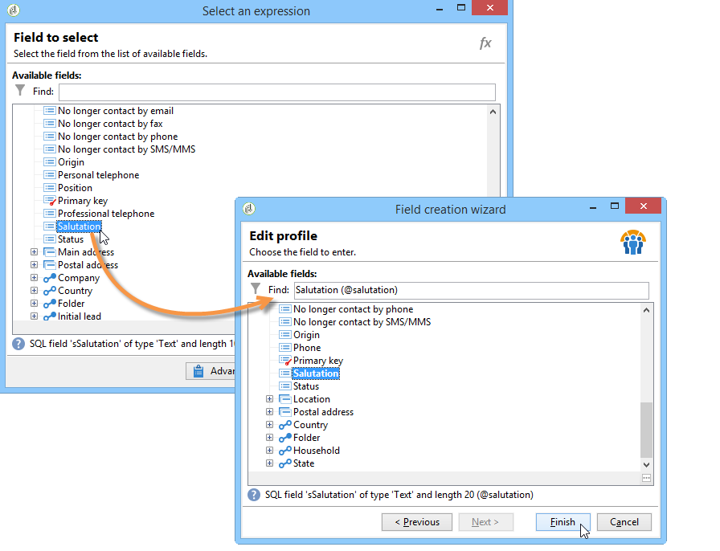</ph></source>
<target xml:lang="en-XX"><ph id="1" ctype="x-IMAGE"></ph></target>
</trans-unit>
<trans-unit id="tu30" xml:space="preserve">
<source xml:lang="en-US">Click <ph id="1" ctype="x-STRONG_EMPHASIS">**[!UICONTROL Finish]**</ph> to insert the selected field into the page.</source>
<target xml:lang="en-XX">Clique em <ph id="1" ctype="x-STRONG_EMPHASIS">**[!UICONTROL Finish]**</ph> para inserir o campo selecionado na página.</target>
</trans-unit>
<trans-unit id="tu31" xml:space="preserve">
<source xml:lang="en-US"><ph id="1" ctype="x-IMAGE"></ph></source>
<target xml:lang="en-XX"><ph id="1" ctype="x-IMAGE"></ph></target>
</trans-unit>
<trans-unit id="tu32" xml:space="preserve">
<source xml:lang="en-US">Adding input fields</source>
<target xml:lang="en-XX">Adição de campos de entrada</target>
</trans-unit>
<trans-unit id="tu33" xml:space="preserve">
<source xml:lang="en-US">To add an input field, click the <ph id="1" ctype="x-STRONG_EMPHASIS">**[!UICONTROL Input control]**</ph> button and choose the type of field you want to add.</source>
<target xml:lang="en-XX">Para adicionar um campo de entrada, clique no botão <ph id="1" ctype="x-STRONG_EMPHASIS">**[!UICONTROL Input control]**</ph> e escolha o tipo de campo que deseja adicionar.</target>
</trans-unit>
<trans-unit id="tu34" xml:space="preserve">
<source xml:lang="en-US"><ph id="1" ctype="x-IMAGE"></ph></source>
<target xml:lang="en-XX"><ph id="1" ctype="x-IMAGE"></ph></target>
</trans-unit>
<trans-unit id="tu35" xml:space="preserve">
<source xml:lang="en-US">Types of input fields</source>
<target xml:lang="en-XX">Tipos de campos de entrada</target>
</trans-unit>
<trans-unit id="tu36" xml:space="preserve">
<source xml:lang="en-US">Five different types of text fields can be inserted into a form page:</source>
<target xml:lang="en-XX">Há cinco tipos diferentes de campos de texto que podem ser inseridos em uma página de formulário:</target>
</trans-unit>
<trans-unit id="tu37" xml:space="preserve">
<source xml:lang="en-US"><ph id="1" ctype="x-STRONG_EMPHASIS">**</ph>Text<ph id="2" ctype="x-STRONG_EMPHASIS">**</ph>: lets the user enter a text on one line.</source>
<target xml:lang="en-XX"><ph id="1" ctype="x-STRONG_EMPHASIS">**</ph>Text<ph id="2" ctype="x-STRONG_EMPHASIS">**</ph>: permite que o usuário insira um texto em uma linha.</target>
</trans-unit>
<trans-unit id="tu38" xml:space="preserve">
<source xml:lang="en-US"><ph id="1" ctype="x-IMAGE"></ph></source>
<target xml:lang="en-XX"><ph id="1" ctype="x-IMAGE"></ph></target>
</trans-unit>
<trans-unit id="tu39" xml:space="preserve">
<source xml:lang="en-US"><ph id="1" ctype="x-STRONG_EMPHASIS">**</ph>Number<ph id="2" ctype="x-STRONG_EMPHASIS">**</ph>: lets the user enter a number on one line. for more on this, refer to <ph id="3" ctype="x-LINK">[</ph>Adding numbers<ph id="4" ctype="x-LINK">](#adding-numbers)</ph>.</source>
<target xml:lang="en-XX"><ph id="1" ctype="x-STRONG_EMPHASIS">**</ph>Number<ph id="2" ctype="x-STRONG_EMPHASIS">**</ph>: permite que o usuário insira um texto em uma linha. Para obter mais informações, consulte <ph id="3" ctype="x-LINK">[</ph>Adicionar números<ph id="4" ctype="x-LINK">](#adding-numbers)</ph>.</target>
</trans-unit>
<trans-unit id="tu40" xml:space="preserve">
<source xml:lang="en-US">When the page is approved, field content is checked to make sure the value entered is compatible with the field. For more on this, refer to <ph id="1" ctype="x-LINK">[</ph>Defining control settings<ph id="2" ctype="x-LINK">](form-rendering.md#defining-control-settings)</ph>.</source>
<target xml:lang="en-XX">Quando a página é aprovada, o conteúdo é verificado para garantir que o valor inserido seja compatível com o campo. Para obter mais informações, consulte <ph id="1" ctype="x-LINK">[</ph>Definir configurações de controle<ph id="2" ctype="x-LINK">](form-rendering.md#defining-control-settings)</ph>.</target>
</trans-unit>
<trans-unit id="tu41" xml:space="preserve">
<source xml:lang="en-US"><ph id="1" ctype="x-STRONG_EMPHASIS">**</ph>Password<ph id="2" ctype="x-STRONG_EMPHASIS">**</ph>: lets the user enter text on a single line. During text entry, the characters are replaced by periods:</source>
<target xml:lang="en-XX"><ph id="1" ctype="x-STRONG_EMPHASIS">**</ph>Password<ph id="2" ctype="x-STRONG_EMPHASIS">**</ph>: permite que o usuário insira texto em uma única linha. Durante a inserção de texto, os caracteres são substituídos por pontos:</target>
</trans-unit>
<trans-unit id="tu42" xml:space="preserve">
<source xml:lang="en-US"><ph id="1" ctype="x-IMAGE"></ph></source>
<target xml:lang="en-XX"><ph id="1" ctype="x-IMAGE"></ph></target>
</trans-unit>
<trans-unit id="tu43" xml:space="preserve">
<source xml:lang="en-US"><ph id="1" ctype="x-regxph" equiv-text="&lbrack;!CAUTION">[!CAUTION]</ph></source>
<target xml:lang="en-XX"><ph id="1" ctype="x-regxph" equiv-text="&lbrack;!CAUTION">[!CAUTION]</ph></target>
</trans-unit>
<trans-unit id="tu44" xml:space="preserve">
<source xml:lang="en-US">Passwords are stored unencrypted in the database.</source>
<target xml:lang="en-XX">As senhas são armazenadas de forma não criptografada no banco de dados.</target>
</trans-unit>
<trans-unit id="tu45" xml:space="preserve">
<source xml:lang="en-US"><ph id="1" ctype="x-STRONG_EMPHASIS">**</ph>Multi-line text<ph id="2" ctype="x-STRONG_EMPHASIS">**</ph>: lets the user enter text on several lines.</source>
<target xml:lang="en-XX"><ph id="1" ctype="x-STRONG_EMPHASIS">**</ph>Multi-line text<ph id="2" ctype="x-STRONG_EMPHASIS">**</ph>: permite que o usuário insira texto em várias linhas.</target>
</trans-unit>
<trans-unit id="tu46" xml:space="preserve">
<source xml:lang="en-US"><ph id="1" ctype="x-IMAGE">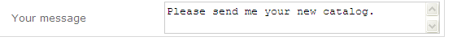</ph></source>
<target xml:lang="en-XX"><ph id="1" ctype="x-IMAGE"></ph></target>
</trans-unit>
<trans-unit id="tu47" xml:space="preserve">
<source xml:lang="en-US"><ph id="1" ctype="x-regxph" equiv-text="&lbrack;!CAUTION">[!CAUTION]</ph></source>
<target xml:lang="en-XX"><ph id="1" ctype="x-regxph" equiv-text="&lbrack;!CAUTION">[!CAUTION]</ph></target>
</trans-unit>
<trans-unit id="tu48" xml:space="preserve">
<source xml:lang="en-US">Multi-line text fields are specific fields that can contain carriage returns. Their storage space must be associated with a field mapped on an XML element, not an XML attribute.</source>
<target xml:lang="en-XX">Campos de texto multilinha são campos específicos que podem conter código de fim de linha. O espaço de armazenamento deve estar associado a um campo mapeado em um elemento XML, não em um atributo XML.</target>
</trans-unit>
<trans-unit id="tu49" xml:space="preserve">
<source xml:lang="en-US"><ph id="1" ctype="x-STRONG_EMPHASIS">**</ph>Enriched multi-line text<ph id="2" ctype="x-STRONG_EMPHASIS">**</ph>: lets the user enter text with a layout which will be stored in HTML format.</source>
<target xml:lang="en-XX"><ph id="1" ctype="x-STRONG_EMPHASIS">**</ph>Enriched multi-line text<ph id="2" ctype="x-STRONG_EMPHASIS">**</ph>: permite que o usuário insira texto com um layout que será armazenado em formato HTML.</target>
</trans-unit>
<trans-unit id="tu50" xml:space="preserve">
<source xml:lang="en-US"><ph id="1" ctype="x-IMAGE"></ph></source>
<target xml:lang="en-XX"><ph id="1" ctype="x-IMAGE"></ph></target>
</trans-unit>
<trans-unit id="tu51" xml:space="preserve">
<source xml:lang="en-US">You can select the type of editor offered to users. To do this, use the drop-down box of the <ph id="1" ctype="x-STRONG_EMPHASIS">**[!UICONTROL HTML editor]**</ph> field in the <ph id="4" ctype="x-STRONG_EMPHASIS">**[!UICONTROL Advanced]**</ph> tab.</source>
<target xml:lang="en-XX">É possível selecionar o tipo de editor oferecido aos usuários. Para fazer isso, use a caixa suspensa do campo <ph id="1" ctype="x-STRONG_EMPHASIS">**[!UICONTROL HTML editor]**</ph> na guia <ph id="4" ctype="x-STRONG_EMPHASIS">**[!UICONTROL Advanced]**</ph>.</target>
</trans-unit>
<trans-unit id="tu52" xml:space="preserve">
<source xml:lang="en-US"><ph id="1" ctype="x-IMAGE"></ph></source>
<target xml:lang="en-XX"><ph id="1" ctype="x-IMAGE"></ph></target>
</trans-unit>
<trans-unit id="tu53" xml:space="preserve">
<source xml:lang="en-US">The number of icons displayed varies depending on the type of editor. For an <ph id="1" ctype="x-STRONG_EMPHASIS">**[!UICONTROL Advanced]**</ph> editor, the rendering will be as follows:</source>
<target xml:lang="en-XX">O número de ícones exibidos varia dependendo do tipo de editor. Para um editor <ph id="1" ctype="x-STRONG_EMPHASIS">**[!UICONTROL Advanced]**</ph>, a renderização será a seguinte:</target>
</trans-unit>
<trans-unit id="tu54" xml:space="preserve">
<source xml:lang="en-US"><ph id="1" ctype="x-IMAGE"></ph></source>
<target xml:lang="en-XX"><ph id="1" ctype="x-IMAGE"></ph></target>
</trans-unit>
<trans-unit id="tu55" xml:space="preserve">
<source xml:lang="en-US">Configure input fields</source>
<target xml:lang="en-XX">Configurar campos de entrada</target>
</trans-unit>
<trans-unit id="tu56" xml:space="preserve">
<source xml:lang="en-US">Input fields are all configured based on the same mode, using the following options:</source>
<target xml:lang="en-XX">Todos os campos de entrada são configurados com base no mesmo modo, utilizando as seguintes opções:</target>
</trans-unit>
<trans-unit id="tu57" xml:space="preserve">
<source xml:lang="en-US"><ph id="1" ctype="x-IMAGE"></ph></source>
<target xml:lang="en-XX"><ph id="1" ctype="x-IMAGE"></ph></target>
</trans-unit>
<trans-unit id="tu58" xml:space="preserve">
<source xml:lang="en-US">The <ph id="1" ctype="x-STRONG_EMPHASIS">**[!UICONTROL General]**</ph> tab lets you enter the name of the field and attribute a default value to it if necessary.</source>
<target xml:lang="en-XX">A guia <ph id="1" ctype="x-STRONG_EMPHASIS">**[!UICONTROL General]**</ph> permite inserir o nome do campo e atribuir um valor padrão, se necessário.</target>
</trans-unit>
<trans-unit id="tu59" xml:space="preserve">
<source xml:lang="en-US">The answer storage mode can be altered via the <ph id="1" ctype="x-STRONG_EMPHASIS">**[!UICONTROL Edit storage...]**</ph> link. Values can be stored in an existing field of the database; or you can choose not to save information in the database (use a local variable).</source>
<target xml:lang="en-XX">O modo de armazenamento de resposta pode ser alterado por meio do link <ph id="1" ctype="x-STRONG_EMPHASIS">**[!UICONTROL Edit storage...]**</ph>. Os valores podem ser armazenados em um campo existente do banco de dados; ou você pode escolher não salvar informações no banco de dados (use uma variável local).</target>
</trans-unit>
<trans-unit id="tu60" xml:space="preserve">
<source xml:lang="en-US"><ph id="1" ctype="x-regxph" equiv-text="&lbrack;!NOTE">[!NOTE]</ph></source>
<target xml:lang="en-XX"><ph id="1" ctype="x-regxph" equiv-text="&lbrack;!NOTE">[!NOTE]</ph></target>
</trans-unit>
<trans-unit id="tu61" xml:space="preserve">
<source xml:lang="en-US">Storage modes are detailed in <ph id="1" ctype="x-LINK">[</ph>Response storage fields<ph id="2" ctype="x-LINK">](web-forms-answers.md#response-storage-fields)</ph></source>
<target xml:lang="en-XX">Os modos de armazenamento são detalhados em <ph id="1" ctype="x-LINK">[</ph>Response storage fields<ph id="2" ctype="x-LINK">](web-forms-answers.md#response-storage-fields)</ph></target>
</trans-unit>
<trans-unit id="tu62" xml:space="preserve">
<source xml:lang="en-US">The <ph id="1" ctype="x-STRONG_EMPHASIS">**[!UICONTROL Advanced]**</ph> tab lets you define display parameters for the field (position of labels, alignment, etc.). See <ph id="4" ctype="x-LINK">[</ph>Defining web forms layout<ph id="5" ctype="x-LINK">](defining-web-forms-layout.md)</ph>.</source>
<target xml:lang="en-XX">A guia <ph id="1" ctype="x-STRONG_EMPHASIS">**[!UICONTROL Advanced]**</ph> permite definir parâmetros de exibição para o campo (posição dos rótulos, alinhamento, etc.). Consulte <ph id="4" ctype="x-LINK">[</ph>Definição do layout de formulários Web<ph id="5" ctype="x-LINK">](defining-web-forms-layout.md)</ph>.</target>
</trans-unit>
<trans-unit id="tu63" xml:space="preserve">
<source xml:lang="en-US">Adding drop-down lists</source>
<target xml:lang="en-XX">Adição de listas suspensas</target>
</trans-unit>
<trans-unit id="tu64" xml:space="preserve">
<source xml:lang="en-US">You can insert a drop-down list into a survey page. This lets the user select a value from those on offer in a drop-down menu.</source>
<target xml:lang="en-XX">É possível inserir uma lista suspensa em uma página de pesquisa. Isso permite que o usuário selecione um valor com base na oferta em um menu suspenso.</target>
</trans-unit>
<trans-unit id="tu65" xml:space="preserve">
<source xml:lang="en-US"><ph id="1" ctype="x-IMAGE">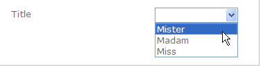</ph></source>
<target xml:lang="en-XX"><ph id="1" ctype="x-IMAGE"></ph></target>
</trans-unit>
<trans-unit id="tu66" xml:space="preserve">
<source xml:lang="en-US">To add a drop-down box to a form page, click the <ph id="1" ctype="x-STRONG_EMPHASIS">**[!UICONTROL Selection controls > Drop-down list]**</ph> button in the toolbar of the page editor.</source>
<target xml:lang="en-XX">Para adicionar uma caixa suspensa a uma página de formulário, clique no botão <ph id="1" ctype="x-STRONG_EMPHASIS">**[!UICONTROL Selection controls > Drop-down list]**</ph> na barra de ferramentas do editor de páginas.</target>
</trans-unit>
<trans-unit id="tu67" xml:space="preserve">
<source xml:lang="en-US"><ph id="1" ctype="x-IMAGE">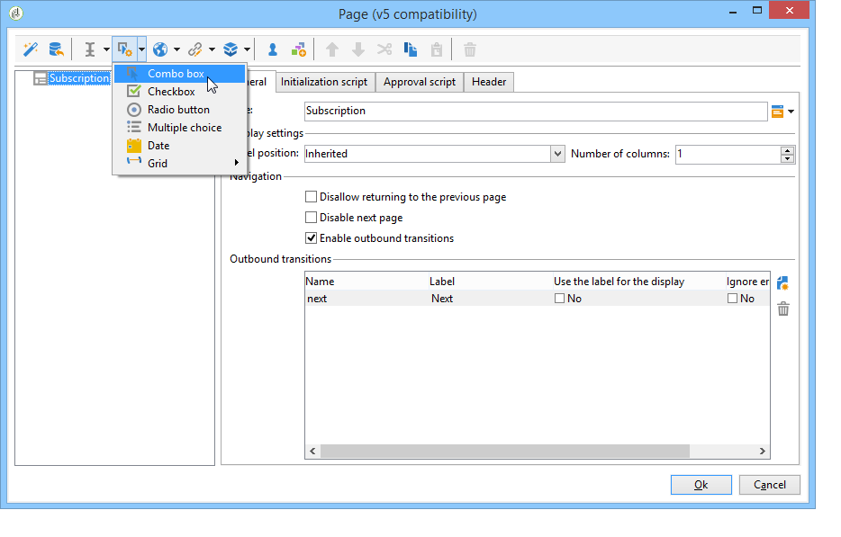</ph></source>
<target xml:lang="en-XX"><ph id="1" ctype="x-IMAGE"></ph></target>
</trans-unit>
<trans-unit id="tu68" xml:space="preserve">
<source xml:lang="en-US">Select the answer storage mode and confirm your choice.</source>
<target xml:lang="en-XX">Selecione o modo de armazenamento de resposta e confirme sua escolha.</target>
</trans-unit>
<trans-unit id="tu69" xml:space="preserve">
<source xml:lang="en-US">Define the labels and values of the list in the lower section of the <ph id="1" ctype="x-STRONG_EMPHASIS">**[!UICONTROL General]**</ph> tab. If the information is stored in an existing field of the database and it is an enumeration field, you can fill in the values automatically by clicking <ph id="4" ctype="x-STRONG_EMPHASIS">**[!UICONTROL Initialize the list of values from the database]**</ph> , as shown below:</source>
<target xml:lang="en-XX">Defina os rótulos e os valores da lista na seção inferior da guia <ph id="1" ctype="x-STRONG_EMPHASIS">**[!UICONTROL General]**</ph>. Se as informações forem armazenadas em um campo existente do banco de dados e esse for um campo de enumeração, é possível preencher os valores automaticamente clicando em <ph id="4" ctype="x-STRONG_EMPHASIS">**[!UICONTROL Initialize the list of values from the database]**</ph>, conforme mostrado abaixo:</target>
</trans-unit>
<trans-unit id="tu70" xml:space="preserve">
<source xml:lang="en-US"><ph id="1" ctype="x-IMAGE">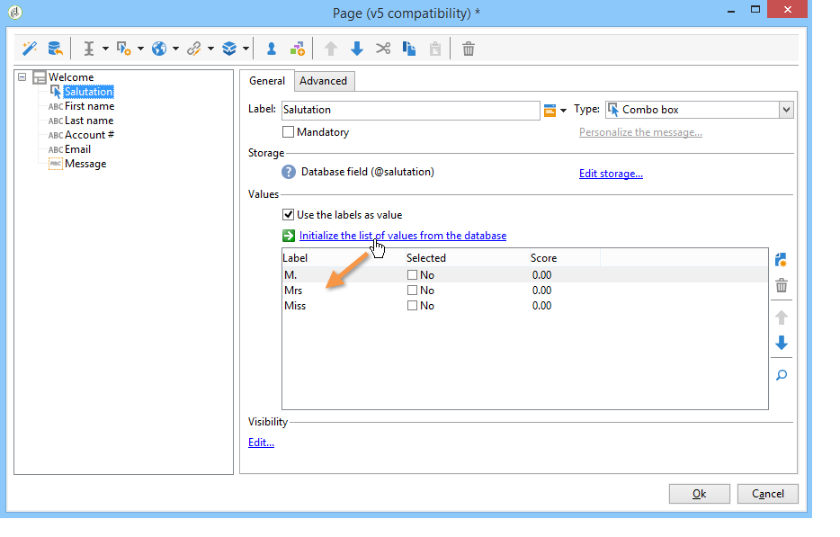</ph></source>
<target xml:lang="en-XX"><ph id="1" ctype="x-IMAGE"></ph></target>
</trans-unit>
<trans-unit id="tu71" xml:space="preserve">
<source xml:lang="en-US"><ph id="1" ctype="x-regxph" equiv-text="&lbrack;!NOTE">[!NOTE]</ph></source>
<target xml:lang="en-XX"><ph id="1" ctype="x-regxph" equiv-text="&lbrack;!NOTE">[!NOTE]</ph></target>
</trans-unit>
<trans-unit id="tu72" xml:space="preserve">
<source xml:lang="en-US">Use the arrows to the right of the list of values to change their sequence.</source>
<target xml:lang="en-XX">Use as setas à direita da lista de valores para alterar sua sequência.</target>
</trans-unit>
<trans-unit id="tu73" xml:space="preserve">
<source xml:lang="en-US">If the data is stored in a linked table, you can select the field where the values to be suggested in the list are saved. For example, if you select the table of countries, click <ph id="1" ctype="x-STRONG_EMPHASIS">**[!UICONTROL Initialize the list of values from the database...]**</ph> and select the desired field.</source>
<target xml:lang="en-XX">Se os dados estiverem armazenados em uma tabela vinculada, você poderá selecionar o campo onde os valores a serem sugeridos na lista serão salvos. Por exemplo, se a tabela de países estiver selecionada, clique em <ph id="1" ctype="x-STRONG_EMPHASIS">**[!UICONTROL Initialize the list of values from the database...]**</ph> e selecione o campo desejado.</target>
</trans-unit>
<trans-unit id="tu74" xml:space="preserve">
<source xml:lang="en-US"><ph id="1" ctype="x-IMAGE"></ph></source>
<target xml:lang="en-XX"><ph id="1" ctype="x-IMAGE"></ph></target>
</trans-unit>
<trans-unit id="tu75" xml:space="preserve">
<source xml:lang="en-US">Next, click the <ph id="1" ctype="x-STRONG_EMPHASIS">**[!UICONTROL Load]**</ph> link to retrieve the values:</source>
<target xml:lang="en-XX">Em seguida, clique no link <ph id="1" ctype="x-STRONG_EMPHASIS">**[!UICONTROL Load]**</ph> para recuperar os valores:</target>
</trans-unit>
<trans-unit id="tu76" xml:space="preserve">
<source xml:lang="en-US"><ph id="1" ctype="x-IMAGE">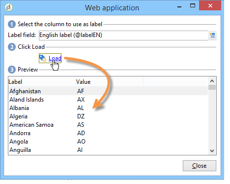</ph></source>
<target xml:lang="en-XX"><ph id="1" ctype="x-IMAGE"></ph></target>
</trans-unit>
<trans-unit id="tu77" xml:space="preserve">
<source xml:lang="en-US"><ph id="1" ctype="x-regxph" equiv-text="&lbrack;!CAUTION">[!CAUTION]</ph></source>
<target xml:lang="en-XX"><ph id="1" ctype="x-regxph" equiv-text="&lbrack;!CAUTION">[!CAUTION]</ph></target>
</trans-unit>
<trans-unit id="tu78" xml:space="preserve">
<source xml:lang="en-US">Repeat this operation whenever the list is updated to refresh the values on offer.</source>
<target xml:lang="en-XX">Repita essa operação sempre que a lista for atualizada para atualizar os valores na oferta.</target>
</trans-unit>
<trans-unit id="tu79" xml:space="preserve">
<source xml:lang="en-US">Adding checkboxes</source>
<target xml:lang="en-XX">Adição de caixas de seleção</target>
</trans-unit>
<trans-unit id="tu80" xml:space="preserve">
<source xml:lang="en-US">In order for the user to select an option, you need to use a checkbox.</source>
<target xml:lang="en-XX">Para selecionar uma opção, o usuário precisa usar uma caixa de seleção.</target>
</trans-unit>
<trans-unit id="tu81" xml:space="preserve">
<source xml:lang="en-US"><ph id="1" ctype="x-IMAGE"></ph></source>
<target xml:lang="en-XX"><ph id="1" ctype="x-IMAGE"></ph></target>
</trans-unit>
<trans-unit id="tu82" xml:space="preserve">
<source xml:lang="en-US">To add a checkbox to a form, click the <ph id="1" ctype="x-STRONG_EMPHASIS">**[!UICONTROL Selection controls > Checkbox...]**</ph> icon in the toolbar of the page editor.</source>
<target xml:lang="en-XX">Para adicionar uma caixa de seleção a um formulário, clique no ícone <ph id="1" ctype="x-STRONG_EMPHASIS">**[!UICONTROL Selection controls > Checkbox...]**</ph> na barra de ferramentas do editor de páginas.</target>
</trans-unit>
<trans-unit id="tu83" xml:space="preserve">
<source xml:lang="en-US">Select the answer storage mode and confirm your choice.</source>
<target xml:lang="en-XX">Selecione o modo de armazenamento de resposta e confirme sua escolha.</target>
</trans-unit>
<trans-unit id="tu84" xml:space="preserve">
<source xml:lang="en-US">Enter the label of the box in the <ph id="1" ctype="x-STRONG_EMPHASIS">**[!UICONTROL Label]**</ph> field of the <ph id="4" ctype="x-STRONG_EMPHASIS">**[!UICONTROL General]**</ph> tab.</source>
<target xml:lang="en-XX">Insira o rótulo da caixa no campo <ph id="1" ctype="x-STRONG_EMPHASIS">**[!UICONTROL Label]**</ph> da guia <ph id="4" ctype="x-STRONG_EMPHASIS">**[!UICONTROL General]**</ph>.</target>
</trans-unit>
<trans-unit id="tu85" xml:space="preserve">
<source xml:lang="en-US"><ph id="1" ctype="x-IMAGE"></ph></source>
<target xml:lang="en-XX"><ph id="1" ctype="x-IMAGE"></ph></target>
</trans-unit>
<trans-unit id="tu86" xml:space="preserve">
<source xml:lang="en-US">A checkbox lets you assign a value to the storage field (or value) depending on whether or not the box is checked. The <ph id="1" ctype="x-STRONG_EMPHASIS">**[!UICONTROL Values]**</ph> section lets you enter the value to assign if the box is checked (in the <ph id="4" ctype="x-STRONG_EMPHASIS">**[!UICONTROL Value]**</ph> field), and the value to assign if it is not checked (in the <ph id="7" ctype="x-STRONG_EMPHASIS">**[!UICONTROL Empty value]**</ph> field). These values depend on the data storage format.</source>
<target xml:lang="en-XX">Uma caixa de seleção permite atribuir um valor ao campo de armazenamento (ou valor) dependendo se a caixa estiver ou não marcada. A seção <ph id="1" ctype="x-STRONG_EMPHASIS">**[!UICONTROL Values]**</ph> permite inserir o valor a ser atribuído se a caixa estiver marcada (no campo <ph id="4" ctype="x-STRONG_EMPHASIS">**[!UICONTROL Value]**</ph>) e o valor a ser atribuído se não estiver marcado (no campo <ph id="7" ctype="x-STRONG_EMPHASIS">**[!UICONTROL Empty value]**</ph>). Esses valores dependem do formato de armazenamento de dados.</target>
</trans-unit>
<trans-unit id="tu87" xml:space="preserve">
<source xml:lang="en-US">If the storage field (or variable) is boolean, the value to assign if the box is not checked will be deduced automatically. In this case, only the <ph id="1" ctype="x-STRONG_EMPHASIS">**[!UICONTROL Value if checked]**</ph> field is offered, as shown below:</source>
<target xml:lang="en-XX">Se o campo de armazenamento (ou variável) for booliano, o valor a ser atribuído se a caixa não estiver marcada será deduzido automaticamente. Nesse caso, somente o campo <ph id="1" ctype="x-STRONG_EMPHASIS">**[!UICONTROL Value if checked]**</ph> é oferecido, conforme mostrado abaixo:</target>
</trans-unit>
<trans-unit id="tu88" xml:space="preserve">
<source xml:lang="en-US"><ph id="1" ctype="x-IMAGE"></ph></source>
<target xml:lang="en-XX"><ph id="1" ctype="x-IMAGE"></ph></target>
</trans-unit>
<trans-unit id="tu89" xml:space="preserve">
<source xml:lang="en-US">Example: Assign a value to a field if a box is checked</source>
<target xml:lang="en-XX">Exemplo: atribuição de um valor a um campo, se uma caixa estiver marcada</target>
</trans-unit>
<trans-unit id="tu90" xml:space="preserve">
<source xml:lang="en-US">We want to insert a checkbox into a form to send a maintenance request, as shown below:</source>
<target xml:lang="en-XX">Queremos inserir uma caixa de seleção em um formulário para enviar uma solicitação de manutenção, conforme mostrado abaixo:</target>
</trans-unit>
<trans-unit id="tu91" xml:space="preserve">
<source xml:lang="en-US"><ph id="1" ctype="x-IMAGE"></ph></source>
<target xml:lang="en-XX"><ph id="1" ctype="x-IMAGE"></ph></target>
</trans-unit>
<trans-unit id="tu92" xml:space="preserve">
<source xml:lang="en-US">The information will be uploaded to the database and into an existing field (in this case, the <ph id="1" ctype="x-STRONG_EMPHASIS">**[!UICONTROL Comment]**</ph> field):</source>
<target xml:lang="en-XX">As informações serão carregadas no banco de dados e em um campo existente (neste caso, o campo <ph id="1" ctype="x-STRONG_EMPHASIS">**[!UICONTROL Comment]**</ph>):</target>
</trans-unit>
<trans-unit id="tu93" xml:space="preserve">
<source xml:lang="en-US"><ph id="1" ctype="x-IMAGE"></ph></source>
<target xml:lang="en-XX"><ph id="1" ctype="x-IMAGE"></ph></target>
</trans-unit>
<trans-unit id="tu94" xml:space="preserve">
<source xml:lang="en-US">If the "Maintenance required" box is checked, the <ph id="1" ctype="x-STRONG_EMPHASIS">**[!UICONTROL Comment]**</ph> column will contain "Maintenance required". If the box isn't checked, the column will show "Maintenance not required". To obtain this result, apply the following configuration to the checkbox on the form page:</source>
<target xml:lang="en-XX">Se a caixa "Maintenance required" estiver marcada, a coluna <ph id="1" ctype="x-STRONG_EMPHASIS">**[!UICONTROL Comment]**</ph> conterá "Maintenance required". Se a caixa não estiver marcada, a coluna exibirá "Manutenção não necessária". Para obter esse resultado, aplique a seguinte configuração à caixa de seleção na página do formulário:</target>
</trans-unit>
<trans-unit id="tu95" xml:space="preserve">
<source xml:lang="en-US"><ph id="1" ctype="x-IMAGE">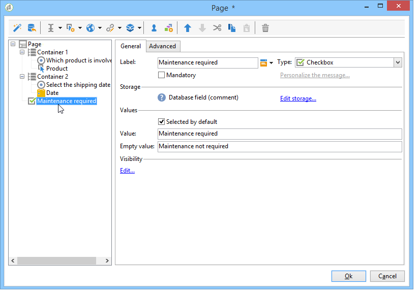</ph></source>
<target xml:lang="en-XX"><ph id="1" ctype="x-IMAGE"></ph></target>
</trans-unit>
<trans-unit id="tu96" xml:space="preserve">
<source xml:lang="en-US">Adding radio buttons</source>
<target xml:lang="en-XX">Adição de botões de opção</target>
</trans-unit>
<trans-unit id="tu97" xml:space="preserve">
<source xml:lang="en-US">Radio buttons let you offer the user a series of exclusive options to choose from. These are different values for the same field.</source>
<target xml:lang="en-XX">Os botões de opção permitem oferecer uma série de opções exclusivas aos usuários. Esses são valores diferentes para o mesmo campo.</target>
</trans-unit>
<trans-unit id="tu98" xml:space="preserve">
<source xml:lang="en-US"><ph id="1" ctype="x-IMAGE">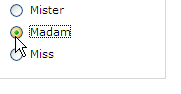</ph></source>
<target xml:lang="en-XX"><ph id="1" ctype="x-IMAGE"></ph></target>
</trans-unit>
<trans-unit id="tu99" xml:space="preserve">
<source xml:lang="en-US">You can create radio buttons individually (unitary buttons) or via a multiple-choice list, but since the point of the radio buttons is to select one option or another, we will always create at least a pair of radio buttons, never just a single button.</source>
<target xml:lang="en-XX">Você pode criar botões de opção individualmente (botões unitários) ou por uma lista de múltipla escolha. Mas como o objetivo dos botões de opção é selecionar uma opção ou outra, sempre criaremos pelo menos um par de botões de opção, nunca apenas um único botão.</target>
</trans-unit>
<trans-unit id="tu100" xml:space="preserve">
<source xml:lang="en-US"><ph id="1" ctype="x-regxph" equiv-text="&lbrack;!CAUTION">[!CAUTION]</ph></source>
<target xml:lang="en-XX"><ph id="1" ctype="x-regxph" equiv-text="&lbrack;!CAUTION">[!CAUTION]</ph></target>
</trans-unit>
<trans-unit id="tu101" xml:space="preserve">
<source xml:lang="en-US">To make selection mandatory, you need to create a multiple choice list.</source>
<target xml:lang="en-XX">Para tornar a seleção obrigatória, você precisa criar uma lista de várias opções.</target>
</trans-unit>
<trans-unit id="tu102" xml:space="preserve">
<source xml:lang="en-US">Add single buttons</source>
<target xml:lang="en-XX">Adição de botões únicos</target>
</trans-unit>
<trans-unit id="tu103" xml:space="preserve">
<source xml:lang="en-US">To add a radio button to a form page, go to the <ph id="1" ctype="x-STRONG_EMPHASIS">**[!UICONTROL Selection controls > Radio button]**</ph> menu in the toolbar of the page editor and choose a storage mode.</source>
<target xml:lang="en-XX">Para adicionar um botão de opção a uma página de formulário, vá para o menu <ph id="1" ctype="x-STRONG_EMPHASIS">**[!UICONTROL Selection controls > Radio button]**</ph> na barra de ferramentas do editor de páginas e escolha um modo de armazenamento.</target>
</trans-unit>
<trans-unit id="tu104" xml:space="preserve">
<source xml:lang="en-US"><ph id="1" ctype="x-IMAGE"></ph></source>
<target xml:lang="en-XX"><ph id="1" ctype="x-IMAGE"></ph></target>
</trans-unit>
<trans-unit id="tu105" xml:space="preserve">
<source xml:lang="en-US">Radio buttons are configured in a similar way to checkboxes (see <ph id="1" ctype="x-LINK">[</ph>Adding checkboxes<ph id="2" ctype="x-LINK">](#adding-checkboxes)</ph>). However, no value is assigned if the option is not selected. In order for several buttons to be interdependent, i.e. selecting one automatically deselects the others, they must be stored in the same field. If they are not stored in the database, the same local variable must be used for temporary storage. See <ph id="3" ctype="x-LINK">[</ph>Response storage fields<ph id="4" ctype="x-LINK">](web-forms-answers.md#response-storage-fields)</ph>.</source>
<target xml:lang="en-XX">A configuração dos botões de opção é semelhante a das caixas de seleção (consulte <ph id="1" ctype="x-LINK">[</ph>Adição de caixas de seleção<ph id="2" ctype="x-LINK">](#adding-checkboxes)</ph>). No entanto, nenhum valor será atribuído se a opção não estiver selecionada. Para que vários botões sejam interdependentes, ou seja, a seleção de um desmarca o outro automaticamente, eles devem ser armazenados no mesmo campo. Se eles não estiverem armazenados no banco de dados, a mesma variável local deverá ser usada para o armazenamento temporário. Consulte <ph id="3" ctype="x-LINK">[</ph>Campos de armazenamento de resposta<ph id="4" ctype="x-LINK">](web-forms-answers.md#response-storage-fields)</ph>.</target>
</trans-unit>
<trans-unit id="tu106" xml:space="preserve">
<source xml:lang="en-US">Add a list of buttons</source>
<target xml:lang="en-XX">Adição de uma lista de botões</target>
</trans-unit>
<trans-unit id="tu107" xml:space="preserve">
<source xml:lang="en-US">To add radio buttons via a list, go to the <ph id="1" ctype="x-STRONG_EMPHASIS">**[!UICONTROL Selection controls>Multiple choice]**</ph> menu in the toolbar of the page editor.</source>
<target xml:lang="en-XX">Para adicionar botões de opção por meio de uma lista, vá para o menu <ph id="1" ctype="x-STRONG_EMPHASIS">**[!UICONTROL Selection controls>Multiple choice]**</ph> na barra de ferramentas do editor de páginas.</target>
</trans-unit>
<trans-unit id="tu108" xml:space="preserve">
<source xml:lang="en-US"><ph id="1" ctype="x-IMAGE">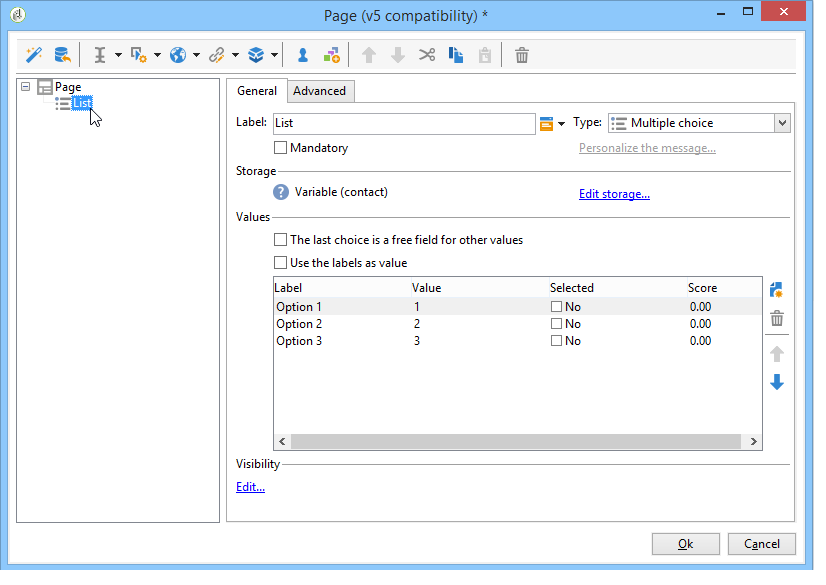</ph></source>
<target xml:lang="en-XX"><ph id="1" ctype="x-IMAGE"></ph></target>
</trans-unit>
<trans-unit id="tu109" xml:space="preserve">
<source xml:lang="en-US">Add as many radio buttons as there are labels. The advantage of this feature is that you can import values from an existing field (in case of an itemized field) and make it for the user to choose one option. However, the layout of buttons is less flexible.</source>
<target xml:lang="en-XX">Adicione a mesma quantidade de botões de opção que houver de rótulos. A vantagem desse recurso é que você pode importar valores de um campo existente (caso de um campo discriminado) e fazer com que o usuário escolha uma opção. No entanto, o layout dos botões é menos flexível.</target>
</trans-unit>
<trans-unit id="tu110" xml:space="preserve">
<source xml:lang="en-US"><ph id="1" ctype="x-regxph" equiv-text="&lbrack;!NOTE">[!NOTE]</ph></source>
<target xml:lang="en-XX"><ph id="1" ctype="x-regxph" equiv-text="&lbrack;!NOTE">[!NOTE]</ph></target>
</trans-unit>
<trans-unit id="tu111" xml:space="preserve">
<source xml:lang="en-US">You cannot enable multi-selection in a web application.
<ph id="1" ctype="x-BLOCK_QUOTE">></ph>It is possible, however, to insert a <ph id="2" ctype="x-STRONG_EMPHASIS">**[!UICONTROL Multiple choice]**</ph> type field into a Web application but this will not enable the user to select several values.</source>
<target xml:lang="en-XX">Não é possível habilitar a seleção múltipla em um aplicativo Web.
<ph id="1" ctype="x-BLOCK_QUOTE">></ph>No entanto, é possível inserir um campo do tipo <ph id="2" ctype="x-STRONG_EMPHASIS">**[!UICONTROL Multiple choice]**</ph> em um aplicativo Web, mas isso não permitirá que o usuário selecione vários valores.</target>
</trans-unit>
<trans-unit id="tu112" xml:space="preserve">
<source xml:lang="en-US">Adding grids</source>
<target xml:lang="en-XX">Adição de grades</target>
</trans-unit>
<trans-unit id="tu113" xml:space="preserve">
<source xml:lang="en-US">Grids are used to design voting pages in Web applications. This lets you offer lists of radio buttons for answering survey or assessment type Web forms, as shown below:</source>
<target xml:lang="en-XX">As grades são usadas para criar páginas de votação em aplicações Web. Isso permite oferecer listas de botões de opção para responder pesquisas ou formulários Web do tipo avaliação, conforme mostrado abaixo:</target>
</trans-unit>
<trans-unit id="tu114" xml:space="preserve">
<source xml:lang="en-US"><ph id="1" ctype="x-IMAGE">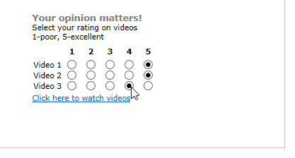</ph></source>
<target xml:lang="en-XX"><ph id="1" ctype="x-IMAGE"></ph></target>
</trans-unit>
<trans-unit id="tu115" xml:space="preserve">
<source xml:lang="en-US">To use this type of element in a form, create a simple grid and add a line for each element to be assessed.</source>
<target xml:lang="en-XX">Para usar esse tipo de elemento em um formulário, crie uma grade simples e adicione uma linha para cada elemento a ser avaliado.</target>
</trans-unit>
<trans-unit id="tu116" xml:space="preserve">
<source xml:lang="en-US"><ph id="1" ctype="x-IMAGE"></ph></source>
<target xml:lang="en-XX"><ph id="1" ctype="x-IMAGE"></ph></target>
</trans-unit>
<trans-unit id="tu117" xml:space="preserve">
<source xml:lang="en-US">The number of radio buttons in each line of the grid matches the number of values defined in the simple grid.</source>
<target xml:lang="en-XX">O número de botões de opção em cada linha da grade corresponde ao número de valores definidos na grade simples.</target>
</trans-unit>
<trans-unit id="tu118" xml:space="preserve">
<source xml:lang="en-US"><ph id="1" ctype="x-IMAGE">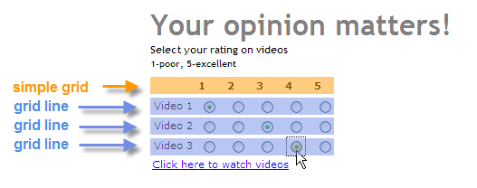</ph></source>
<target xml:lang="en-XX"><ph id="1" ctype="x-IMAGE"></ph></target>
</trans-unit>
<trans-unit id="tu119" xml:space="preserve">
<source xml:lang="en-US">Only one option can be selected per grid line.</source>
<target xml:lang="en-XX">Somente uma opção pode ser selecionada por linha de grade.</target>
</trans-unit>
<trans-unit id="tu120" xml:space="preserve">
<source xml:lang="en-US"><ph id="1" ctype="x-regxph" equiv-text="&lbrack;!NOTE">[!NOTE]</ph></source>
<target xml:lang="en-XX"><ph id="1" ctype="x-regxph" equiv-text="&lbrack;!NOTE">[!NOTE]</ph></target>
</trans-unit>
<trans-unit id="tu121" xml:space="preserve">
<source xml:lang="en-US">In our example, the label of the grid is hidden. To do this, go to the <ph id="1" ctype="x-STRONG_EMPHASIS">**[!UICONTROL Advanced]**</ph> tab, the <ph id="4" ctype="x-STRONG_EMPHASIS">**[!UICONTROL Label position]**</ph> display is defined as <ph id="7" ctype="x-STRONG_EMPHASIS">**[!UICONTROL Hidden]**</ph> . See <ph id="10" ctype="x-LINK">[</ph>Defining the position of labels<ph id="11" ctype="x-LINK">](defining-web-forms-layout.md#defining-the-position-of-labels)</ph>.</source>
<target xml:lang="en-XX">No nosso exemplo, o rótulo da grade está oculto. Para fazer isso, vá para a guia <ph id="1" ctype="x-STRONG_EMPHASIS">**[!UICONTROL Advanced]**</ph>, a exibição da <ph id="4" ctype="x-STRONG_EMPHASIS">**[!UICONTROL Label position]**</ph> é definida como <ph id="7" ctype="x-STRONG_EMPHASIS">**[!UICONTROL Hidden]**</ph>. Consulte <ph id="10" ctype="x-LINK">[</ph>Definição da posição dos rótulos<ph id="11" ctype="x-LINK">](defining-web-forms-layout.md#defining-the-position-of-labels)</ph>.</target>
</trans-unit>
<trans-unit id="tu122" xml:space="preserve">
<source xml:lang="en-US">Adding dates and numbers</source>
<target xml:lang="en-XX">Adição de datas e números</target>
</trans-unit>
<trans-unit id="tu123" xml:space="preserve">
<source xml:lang="en-US">The content of the form fields can be formatted to match the data stored in the database or to satisfy a particular requirement. You can create suitable fields for the entry of numbers and dates.</source>
<target xml:lang="en-XX">O conteúdo dos campos de formulário pode ser formatado para corresponder aos dados armazenados no banco de dados ou para atender a um requisito específico. Você pode criar campos adequados para a entrada de números e datas.</target>
</trans-unit>
<trans-unit id="tu124" xml:space="preserve">
<source xml:lang="en-US">Adding dates</source>
<target xml:lang="en-XX">Adição de datas</target>
</trans-unit>
<trans-unit id="tu125" xml:space="preserve">
<source xml:lang="en-US"><ph id="1" ctype="x-IMAGE"></ph></source>
<target xml:lang="en-XX"><ph id="1" ctype="x-IMAGE"></ph></target>
</trans-unit>
<trans-unit id="tu126" xml:space="preserve">
<source xml:lang="en-US">To allow the user to enter a date in a form page, add an input field and select the type <ph id="1" ctype="x-STRONG_EMPHASIS">**[!UICONTROL Date...]**</ph>.</source>
<target xml:lang="en-XX">Para permitir que o usuário insira uma data em uma página de formulário, adicione um campo de entrada e selecione o tipo <ph id="1" ctype="x-STRONG_EMPHASIS">**[!UICONTROL Date...]**</ph>.</target>
</trans-unit>
<trans-unit id="tu127" xml:space="preserve">
<source xml:lang="en-US">Enter a label for the field and configure the data storage mode.</source>
<target xml:lang="en-XX">Insira um rótulo para o campo e configure o modo de armazenamento de dados.</target>
</trans-unit>
<trans-unit id="tu128" xml:space="preserve">
<source xml:lang="en-US"><ph id="1" ctype="x-IMAGE"></ph></source>
<target xml:lang="en-XX"><ph id="1" ctype="x-IMAGE"></ph></target>
</trans-unit>
<trans-unit id="tu129" xml:space="preserve">
<source xml:lang="en-US">The lower section of the window lets you select the date and time formats for the values stored in this field.</source>
<target xml:lang="en-XX">A seção inferior da janela permite selecionar os formatos de data e hora dos valores armazenados neste campo.</target>
</trans-unit>
<trans-unit id="tu130" xml:space="preserve">
<source xml:lang="en-US"><ph id="1" ctype="x-IMAGE"></ph></source>
<target xml:lang="en-XX"><ph id="1" ctype="x-IMAGE"></ph></target>
</trans-unit>
<trans-unit id="tu131" xml:space="preserve">
<source xml:lang="en-US">You can also choose not to display the date (or time).</source>
<target xml:lang="en-XX">Você também pode escolher não exibir a data (ou hora).</target>
</trans-unit>
<trans-unit id="tu132" xml:space="preserve">
<source xml:lang="en-US">Dates can be selected via a calendar or drop-down boxes. You can also enter them directly in the field, but they need to match the format specified in the screen above.</source>
<target xml:lang="en-XX">As datas podem ser selecionadas por meio de um calendário ou caixas suspensas. Você também pode inseri-las diretamente no campo, mas eles precisam corresponder ao formato especificado na tela acima.</target>
</trans-unit>
<trans-unit id="tu133" xml:space="preserve">
<source xml:lang="en-US"><ph id="1" ctype="x-regxph" equiv-text="&lbrack;!NOTE">[!NOTE]</ph></source>
<target xml:lang="en-XX"><ph id="1" ctype="x-regxph" equiv-text="&lbrack;!NOTE">[!NOTE]</ph></target>
</trans-unit>
<trans-unit id="tu134" xml:space="preserve">
<source xml:lang="en-US">By default, dates used in forms are entered via a calendar. For multilingual forms, please check that calendars are available in all the languages used. See <ph id="1" ctype="x-LINK">[</ph>Translating a web form<ph id="2" ctype="x-LINK">](translating-a-web-form.md)</ph>.</source>
<target xml:lang="en-XX">Por padrão, as datas usadas em formulários são inseridas por meio de um calendário. Para formulários multilíngues, verifique se os calendários estão disponíveis em todos os idiomas usados. Consulte <ph id="1" ctype="x-LINK">[</ph>Tradução de um formulário web<ph id="2" ctype="x-LINK">](translating-a-web-form.md)</ph>.</target>
</trans-unit>
<trans-unit id="tu135" xml:space="preserve">
<source xml:lang="en-US">However in some cases, (for entering dates of birth, for instance) it may be easier to use drop-down lists.</source>
<target xml:lang="en-XX">No entanto, em alguns casos (para inserir datas de nascimento, por exemplo), pode ser mais fácil usar listas suspensas.</target>
</trans-unit>
<trans-unit id="tu136" xml:space="preserve">
<source xml:lang="en-US"><ph id="1" ctype="x-IMAGE"></ph></source>
<target xml:lang="en-XX"><ph id="1" ctype="x-IMAGE"></ph></target>
</trans-unit>
<trans-unit id="tu137" xml:space="preserve">
<source xml:lang="en-US">To do this, click the <ph id="1" ctype="x-STRONG_EMPHASIS">**[!UICONTROL Advanced]**</ph> tab and choose the input mode using <ph id="4" ctype="x-STRONG_EMPHASIS">**[!UICONTROL Drop-down lists]**</ph>.</source>
<target xml:lang="en-XX">Para fazer isso, clique na guia <ph id="1" ctype="x-STRONG_EMPHASIS">**[!UICONTROL Advanced]**</ph> e escolha o modo de entrada usando <ph id="4" ctype="x-STRONG_EMPHASIS">**[!UICONTROL Drop-down lists]**</ph>.</target>
</trans-unit>
<trans-unit id="tu138" xml:space="preserve">
<source xml:lang="en-US"><ph id="1" ctype="x-IMAGE">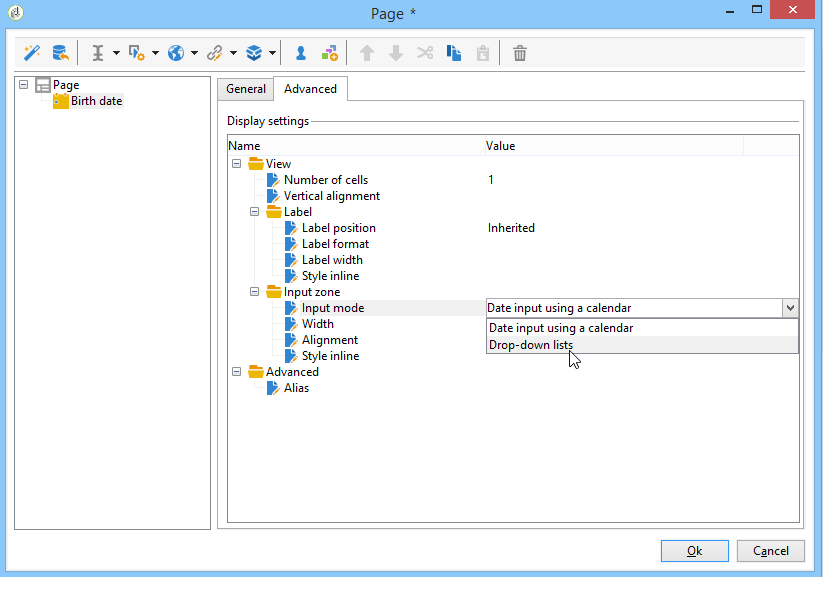</ph></source>
<target xml:lang="en-XX"><ph id="1" ctype="x-IMAGE"></ph></target>
</trans-unit>
<trans-unit id="tu139" xml:space="preserve">
<source xml:lang="en-US">You can then set limits to the values offered in the list.</source>
<target xml:lang="en-XX">Você pode então definir limites para os valores oferecidos na lista.</target>
</trans-unit>
<trans-unit id="tu140" xml:space="preserve">
<source xml:lang="en-US"><ph id="1" ctype="x-IMAGE">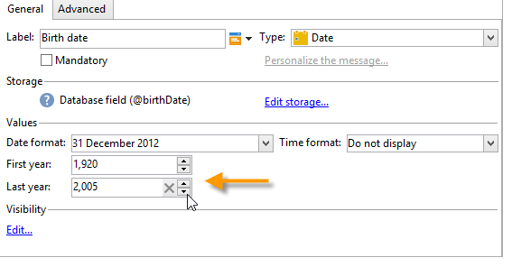</ph></source>
<target xml:lang="en-XX"><ph id="1" ctype="x-IMAGE"></ph></target>
</trans-unit>
<trans-unit id="tu141" xml:space="preserve">
<source xml:lang="en-US">Adding numbers</source>
<target xml:lang="en-XX">Adição de números</target>
</trans-unit>
<trans-unit id="tu142" xml:space="preserve">
<source xml:lang="en-US">You can create suitable fields for the entry of numbers.</source>
<target xml:lang="en-XX">Você pode criar campos adequados para a entrada de números.</target>
</trans-unit>
<trans-unit id="tu143" xml:space="preserve">
<source xml:lang="en-US"><ph id="1" ctype="x-IMAGE"></ph></source>
<target xml:lang="en-XX"><ph id="1" ctype="x-IMAGE"></ph></target>
</trans-unit>
<trans-unit id="tu144" xml:space="preserve">
<source xml:lang="en-US">In a numeric field, the user can enter numbers only. Entry control is applied automatically when the page is approved.</source>
<target xml:lang="en-XX">Em um campo numérico, o usuário pode inserir somente números. O controle de entrada é aplicado automaticamente quando a página é aprovada.</target>
</trans-unit>
<trans-unit id="tu145" xml:space="preserve">
<source xml:lang="en-US">Depending on the field in which data is stored in the database, special formatting or certain restrictions may be applied. You can also specify maximum and minimum values. This type of field is configured as follows:</source>
<target xml:lang="en-XX">Dependendo do campo no qual os dados são armazenados no banco de dados, a formatação especial ou certas restrições podem ser aplicadas. Também é possível especificar valores máximos e mínimos. Esse tipo de campo é configurado da seguinte maneira:</target>
</trans-unit>
<trans-unit id="tu146" xml:space="preserve">
<source xml:lang="en-US"><ph id="1" ctype="x-IMAGE"></ph></source>
<target xml:lang="en-XX"><ph id="1" ctype="x-IMAGE"></ph></target>
</trans-unit>
<trans-unit id="tu147" xml:space="preserve">
<source xml:lang="en-US">The default value is the value displayed in the field when the form is published. It can be corrected by the user.</source>
<target xml:lang="en-XX">O valor padrão é o valor exibido no campo quando o formulário é publicado. Ele pode ser corrigido pelo usuário.</target>
</trans-unit>
<trans-unit id="tu148" xml:space="preserve">
<source xml:lang="en-US">You can add a prefix and/or suffix to the numeric field via the <ph id="1" ctype="x-STRONG_EMPHASIS">**[!UICONTROL Advanced]**</ph> tab, as shown below:</source>
<target xml:lang="en-XX">Você pode adicionar um prefixo e/ou sufixo ao campo numérico por meio da guia <ph id="1" ctype="x-STRONG_EMPHASIS">**[!UICONTROL Advanced]**</ph>, conforme mostrado abaixo:</target>
</trans-unit>
<trans-unit id="tu149" xml:space="preserve">
<source xml:lang="en-US"><ph id="1" ctype="x-IMAGE"></ph></source>
<target xml:lang="en-XX"><ph id="1" ctype="x-IMAGE"></ph></target>
</trans-unit>
<trans-unit id="tu150" xml:space="preserve">
<source xml:lang="en-US">In the form, the rendering will be as follows:</source>
<target xml:lang="en-XX">No formulário, a renderização será conforme a seguir:</target>
</trans-unit>
<trans-unit id="tu151" xml:space="preserve">
<source xml:lang="en-US"><ph id="1" ctype="x-IMAGE"></ph></source>
<target xml:lang="en-XX"><ph id="1" ctype="x-IMAGE"></ph></target>
</trans-unit>
<trans-unit id="tu152" xml:space="preserve">
<source xml:lang="en-US">Subscription checkboxes</source>
<target xml:lang="en-XX">Caixas de seleção de subscrição</target>
</trans-unit>
<trans-unit id="tu153" xml:space="preserve">
<source xml:lang="en-US">You can add controls to allow users to subscribe to or unsubscribe from one or more information services (newsletters, warnings, real-time notifications, etc.). To subscribe, the user checks the corresponding service.</source>
<target xml:lang="en-XX">Você pode adicionar controles para permitir que os usuários realizaem a subscrição ou unsubscription de um ou mais serviços de informação (boletins informativos, avisos, notificações em tempo real, etc.). Para se subscrever, o usuário marca o serviço correspondente.</target>
</trans-unit>
<trans-unit id="tu154" xml:space="preserve">
<source xml:lang="en-US">To create a subscription checkbox, click <ph id="1" ctype="x-STRONG_EMPHASIS">**[!UICONTROL Advanced controls>Subscription]**</ph>.</source>
<target xml:lang="en-XX">Para criar uma caixa de seleção de subscrição, clique em <ph id="1" ctype="x-STRONG_EMPHASIS">**[!UICONTROL Advanced controls>Subscription]**</ph>.</target>
</trans-unit>
<trans-unit id="tu155" xml:space="preserve">
<source xml:lang="en-US"><ph id="1" ctype="x-IMAGE"></ph></source>
<target xml:lang="en-XX"><ph id="1" ctype="x-IMAGE"></ph></target>
</trans-unit>
<trans-unit id="tu156" xml:space="preserve">
<source xml:lang="en-US">Indicate the label for the checkbox and select the information service concerned using the <ph id="1" ctype="x-STRONG_EMPHASIS">**[!UICONTROL Service]**</ph> drop-down box.</source>
<target xml:lang="en-XX">Indique o rótulo da caixa de seleção e selecione o serviço de informação em questão, usando a caixa suspensa <ph id="1" ctype="x-STRONG_EMPHASIS">**[!UICONTROL Service]**</ph>.</target>
</trans-unit>
<trans-unit id="tu157" xml:space="preserve">
<source xml:lang="en-US"><ph id="1" ctype="x-regxph" equiv-text="&lbrack;!NOTE">[!NOTE]</ph></source>
<target xml:lang="en-XX"><ph id="1" ctype="x-regxph" equiv-text="&lbrack;!NOTE">[!NOTE]</ph></target>
</trans-unit>
<trans-unit id="tu158" xml:space="preserve">
<source xml:lang="en-US">Information services are detailed in <ph id="1" ctype="x-LINK">[</ph>this page<ph id="2" ctype="x-LINK">](../../delivery/using/managing-subscriptions.md)</ph>.</source>
<target xml:lang="en-XX">Os serviços de informação são detalhados nesta <ph id="1" ctype="x-LINK">[</ph>página<ph id="2" ctype="x-LINK">](../../delivery/using/managing-subscriptions.md)</ph>.</target>
</trans-unit>
<trans-unit id="tu159" xml:space="preserve">
<source xml:lang="en-US">The user subscribes to the service by checking the relevant option.</source>
<target xml:lang="en-XX">O usuário se subscreve no serviço marcando a opção relevante.</target>
</trans-unit>
<trans-unit id="tu160" xml:space="preserve">
<source xml:lang="en-US"><ph id="1" ctype="x-IMAGE">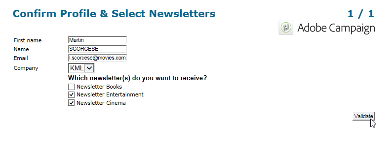</ph></source>
<target xml:lang="en-XX"><ph id="1" ctype="x-IMAGE"></ph></target>
</trans-unit>
<trans-unit id="tu161" xml:space="preserve">
<source xml:lang="en-US"><ph id="1" ctype="x-regxph" equiv-text="&lbrack;!CAUTION">[!CAUTION]</ph></source>
<target xml:lang="en-XX"><ph id="1" ctype="x-regxph" equiv-text="&lbrack;!CAUTION">[!CAUTION]</ph></target>
</trans-unit>
<trans-unit id="tu162" xml:space="preserve">
<source xml:lang="en-US">If the user is already subscribed to an information service and the box linked to this service isn't checked when they approve the form, they will be unsubscribed.</source>
<target xml:lang="en-XX">Se o usuário já estiver subscrito em um serviço de informação e a caixa vinculada a esse serviço não estiver marcada ao aprovar o formulário, a subscrição será cancelada.</target>
</trans-unit>
<trans-unit id="tu163" xml:space="preserve">
<source xml:lang="en-US">Inserting a captcha</source>
<target xml:lang="en-XX">Inserção de um captcha</target>
</trans-unit>
<trans-unit id="tu164" xml:space="preserve">
<source xml:lang="en-US">The purpose of <ph id="1" ctype="x-STRONG_EMPHASIS">**</ph>captcha<ph id="2" ctype="x-STRONG_EMPHASIS">**</ph> tests is to prevent fraudulent use of your Web forms.</source>
<target xml:lang="en-XX">O objetivo dos testes de <ph id="1" ctype="x-STRONG_EMPHASIS">**</ph>captcha<ph id="2" ctype="x-STRONG_EMPHASIS">**</ph> é evitar o uso fraudulento dos formulários web.</target>
</trans-unit>
<trans-unit id="tu165" xml:space="preserve">
<source xml:lang="en-US"><ph id="1" ctype="x-regxph" equiv-text="&lbrack;!CAUTION">[!CAUTION]</ph></source>
<target xml:lang="en-XX"><ph id="1" ctype="x-regxph" equiv-text="&lbrack;!CAUTION">[!CAUTION]</ph></target>
</trans-unit>
<trans-unit id="tu166" xml:space="preserve">
<source xml:lang="en-US">If your form contains several pages, the Captcha must always be placed on the last page, just before the storage box, to prevent any circumvention of the security measures.</source>
<target xml:lang="en-XX">Se seu formulário contiver várias páginas, o Captcha deverá sempre ser colocado na última página, logo antes da caixa de armazenamento, para evitar qualquer erro das medidas de segurança.</target>
</trans-unit>
<trans-unit id="tu167" xml:space="preserve">
<source xml:lang="en-US">To insert a Captcha into a form, click the first button on the toolbar and Select <ph id="1" ctype="x-STRONG_EMPHASIS">**[!UICONTROL Advanced controls>Captcha]**</ph>.</source>
<target xml:lang="en-XX">Para inserir um Captcha em um formulário, clique no primeiro botão na barra de ferramentas e selecione <ph id="1" ctype="x-STRONG_EMPHASIS">**[!UICONTROL Advanced controls>Captcha]**</ph>.</target>
</trans-unit>
<trans-unit id="tu168" xml:space="preserve">
<source xml:lang="en-US"><ph id="1" ctype="x-IMAGE"></ph></source>
<target xml:lang="en-XX"><ph id="1" ctype="x-IMAGE"></ph></target>
</trans-unit>
<trans-unit id="tu169" xml:space="preserve">
<source xml:lang="en-US">Enter the label of the field. This label will be displayed in front of the Captcha display area. You can change the position of this label in the <ph id="1" ctype="x-STRONG_EMPHASIS">**[!UICONTROL Advanced]**</ph> tab.</source>
<target xml:lang="en-XX">Insira o rótulo do campo. Esse rótulo será exibido na frente da área de exibição Captcha. Você pode alterar a posição desse rótulo na guia <ph id="1" ctype="x-STRONG_EMPHASIS">**[!UICONTROL Advanced]**</ph>.</target>
</trans-unit>
<trans-unit id="tu170" xml:space="preserve">
<source xml:lang="en-US"><ph id="1" ctype="x-IMAGE">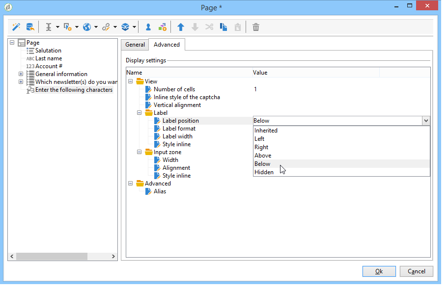</ph></source>
<target xml:lang="en-XX"><ph id="1" ctype="x-IMAGE"></ph></target>
</trans-unit>
<trans-unit id="tu171" xml:space="preserve">
<source xml:lang="en-US"><ph id="1" ctype="x-regxph" equiv-text="&lbrack;!NOTE">[!NOTE]</ph></source>
<target xml:lang="en-XX"><ph id="1" ctype="x-regxph" equiv-text="&lbrack;!NOTE">[!NOTE]</ph></target>
</trans-unit>
<trans-unit id="tu172" xml:space="preserve">
<source xml:lang="en-US">For <ph id="1" ctype="x-STRONG_EMPHASIS">**[!UICONTROL captcha]**</ph> type controls, there is no need to indicate a storage field or variable.</source>
<target xml:lang="en-XX">Para controles do tipo <ph id="1" ctype="x-STRONG_EMPHASIS">**[!UICONTROL captcha]**</ph>, não há necessidade de indicar um campo ou variável de armazenamento.</target>
</trans-unit>
<trans-unit id="tu173" xml:space="preserve">
<source xml:lang="en-US">The Captcha is inserted into the page with an input field placed under the visual. These two elements are inseparable and are considered as a single item for the purpose of page layout (they occupy a single cell).</source>
<target xml:lang="en-XX">O Captcha é inserido na página com um campo de entrada posicionado sob o visual. Esses dois elementos são inseparáveis e considerados como um único item para o propósito do layout da página (eles ocupam uma única célula).</target>
</trans-unit>
<trans-unit id="tu174" xml:space="preserve">
<source xml:lang="en-US"><ph id="1" ctype="x-IMAGE">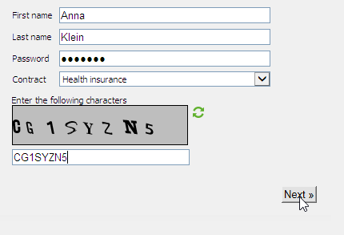</ph></source>
<target xml:lang="en-XX"><ph id="1" ctype="x-IMAGE"></ph></target>
</trans-unit>
<trans-unit id="tu175" xml:space="preserve">
<source xml:lang="en-US">When the page is confirmed, the input field is displayed in red if the content of the Captcha was not entered correctly.</source>
<target xml:lang="en-XX">Quando a página é confirmada, o campo de entrada é exibido em vermelho se o conteúdo do Captcha não foi inserido corretamente.</target>
</trans-unit>
<trans-unit id="tu176" xml:space="preserve">
<source xml:lang="en-US"><ph id="1" ctype="x-IMAGE"></ph></source>
<target xml:lang="en-XX"><ph id="1" ctype="x-IMAGE"></ph></target>
</trans-unit>
<trans-unit id="tu177" xml:space="preserve">
<source xml:lang="en-US">You can create an error message to display. To do that, use the <ph id="1" ctype="x-STRONG_EMPHASIS">**[!UICONTROL Personalize the message]**</ph> link in the <ph id="4" ctype="x-STRONG_EMPHASIS">**[!UICONTROL General]**</ph> tab.</source>
<target xml:lang="en-XX">Você pode criar uma mensagem de erro para exibir. Para fazer isso, use o link <ph id="1" ctype="x-STRONG_EMPHASIS">**[!UICONTROL Personalize the message]**</ph> na guia <ph id="4" ctype="x-STRONG_EMPHASIS">**[!UICONTROL General]**</ph>.</target>
</trans-unit>
<trans-unit id="tu178" xml:space="preserve">
<source xml:lang="en-US"><ph id="1" ctype="x-IMAGE">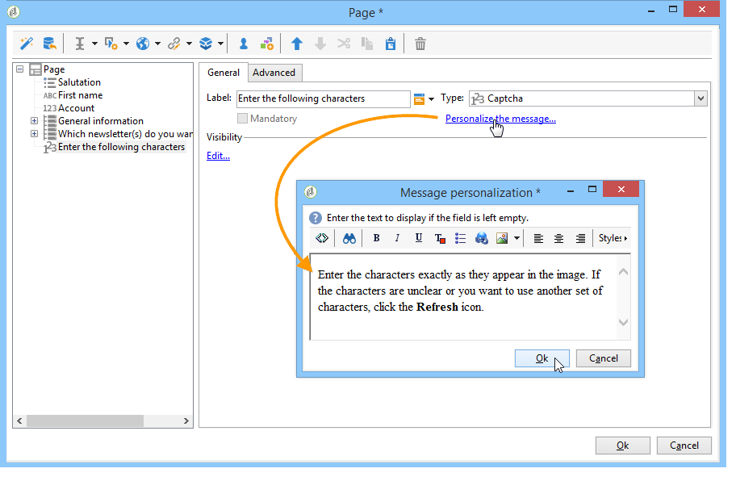</ph></source>
<target xml:lang="en-XX"><ph id="1" ctype="x-IMAGE"></ph></target>
</trans-unit>
<trans-unit id="tu179" xml:space="preserve">
<source xml:lang="en-US"><ph id="1" ctype="x-regxph" equiv-text="&lbrack;!NOTE">[!NOTE]</ph></source>
<target xml:lang="en-XX"><ph id="1" ctype="x-regxph" equiv-text="&lbrack;!NOTE">[!NOTE]</ph></target>
</trans-unit>
<trans-unit id="tu180" xml:space="preserve">
<source xml:lang="en-US">Captchas are always 8 characters long. You cannot modify this value.</source>
<target xml:lang="en-XX">Os Captchas têm sempre 8 caracteres. Você não pode modificar esse valor.</target>
</trans-unit>
<trans-unit id="tu181" xml:space="preserve">
<source xml:lang="en-US">Uploading a file</source>
<target xml:lang="en-XX">Fazer upload de arquivo</target>
</trans-unit>
<trans-unit id="tu182" xml:space="preserve">
<source xml:lang="en-US">You can add an upload field to a page. This functionality can be useful for intranet file sharing, for instance.</source>
<target xml:lang="en-XX">Você pode adicionar um campo de carregamento a uma página. Essa funcionalidade pode ser útil para o compartilhamento de arquivos da intranet, por exemplo.</target>
</trans-unit>
<trans-unit id="tu183" xml:space="preserve">
<source xml:lang="en-US"><ph id="1" ctype="x-IMAGE"></ph></source>
<target xml:lang="en-XX"><ph id="1" ctype="x-IMAGE"></ph></target>
</trans-unit>
<trans-unit id="tu184" xml:space="preserve">
<source xml:lang="en-US">To insert an upload field to a form page, select the <ph id="1" ctype="x-STRONG_EMPHASIS">**[!UICONTROL Advanced controls > File...]**</ph> menu in the toolbar of the page editor.</source>
<target xml:lang="en-XX">Para inserir um campo para fazer upload em uma página de formulário, selecione o menu <ph id="1" ctype="x-STRONG_EMPHASIS">**[!UICONTROL Advanced controls > File...]**</ph> na barra de ferramentas do editor de páginas.</target>
</trans-unit>
<trans-unit id="tu185" xml:space="preserve">
<source xml:lang="en-US">By default, the uploaded files are stored in resource files accessible via the <ph id="1" ctype="x-STRONG_EMPHASIS">**[!UICONTROL Resources > Online > Public resources]**</ph> menu. You can use a script to change this behavior. This script can use the functions defined in <ph id="4" ctype="x-LINK">&lbrack;</ph>Campaign JSAPI documentation<ph id="5" ctype="x-LINK">[#$tu186]</ph>, including those that concern file manipulation.</source>
<target xml:lang="en-XX">Por padrão, os arquivos carregados são armazenados em arquivos de recurso acessíveis por meio do menu <ph id="1" ctype="x-STRONG_EMPHASIS">**[!UICONTROL Resources > Online > Public resources]**</ph>. Você pode usar um script para alterar esse comportamento. Esse script pode usar as funções definidas na <ph id="4" ctype="x-LINK">&lbrack;</ph>documentação do Campaign JSAPI<ph id="5" ctype="x-LINK">[#$tu186]</ph>, incluindo as que se referem à manipulação de arquivos.</target>
</trans-unit>
<trans-unit id="tu187" xml:space="preserve">
<source xml:lang="en-US">You can store the link to these files in a local variable or in a database field. For example, you can extend the recipient schema to add a link to file-based resources.</source>
<target xml:lang="en-XX">Você pode armazenar o link para esses arquivos em uma variável local ou em um campo de banco de dados. Por exemplo, você pode estender o esquema de destinatários para adicionar um link a recursos baseados em arquivo.</target>
</trans-unit>
<trans-unit id="tu188" xml:space="preserve">
<source xml:lang="en-US"><ph id="1" ctype="x-regxph" equiv-text="&lbrack;!CAUTION">[!CAUTION]</ph></source>
<target xml:lang="en-XX"><ph id="1" ctype="x-regxph" equiv-text="&lbrack;!CAUTION">[!CAUTION]</ph></target>
</trans-unit>
<trans-unit id="tu189" xml:space="preserve">
<source xml:lang="en-US">This type of file must be reserved for forms with secure access (using credentials).</source>
<target xml:lang="en-XX">Esse tipo de arquivo deve ser reservado para formulários com acesso seguro (usando credenciais).</target>
</trans-unit>
<trans-unit id="tu190" xml:space="preserve">
<source xml:lang="en-US">Adobe Campaign does not control the size or the type of resource uploaded: we therefore highly recommend using upload fields for secure type intranet sites only.</source>
<target xml:lang="en-XX">O Adobe Campaign não controla o tamanho ou o tipo de recurso carregado: portanto, é altamente recomendável usar campos de carregamento para sites de intranet tipo seguro.</target>
</trans-unit>
<trans-unit id="tu191" xml:space="preserve">
<source xml:lang="en-US">If several servers are linked to the instance (load balancing architecture), you need to make sure calls to the Web form arrive on the same server.</source>
<target xml:lang="en-XX">Se vários servidores estiverem vinculados à instância ("balanceamento de carga"), você precisará verificar se as chamadas para o formulário web chegam no mesmo servidor.</target>
</trans-unit>
<trans-unit id="tu192" xml:space="preserve">
<source xml:lang="en-US">These implementations require the assistance of the Adobe Campaign Consulting team.</source>
<target xml:lang="en-XX">Essas implementações exigem a assistência da equipe de consulta do Adobe Campaign.</target>
</trans-unit>
<trans-unit id="tu193" xml:space="preserve">
<source xml:lang="en-US">Inserting a hidden constant</source>
<target xml:lang="en-XX">Inserção de uma constante oculta</target>
</trans-unit>
<trans-unit id="tu194" xml:space="preserve">
<source xml:lang="en-US">When the user validates one of the pages of the form, you can set a specific value to a field of their profile or to a variable.</source>
<target xml:lang="en-XX">Quando o usuário valida uma das páginas do formulário, é possível definir um valor específico para um campo desse perfil ou para uma variável.</target>
</trans-unit>
<trans-unit id="tu195" xml:space="preserve">
<source xml:lang="en-US">This field is not visible to the user, but can be used to enrich the data in the user profile.</source>
<target xml:lang="en-XX">Este campo não está visível para o usuário, mas pode ser utilizado para enriquecer os dados no perfil de usuário.</target>
</trans-unit>
<trans-unit id="tu196" xml:space="preserve">
<source xml:lang="en-US">To do this, place a <ph id="1" ctype="x-STRONG_EMPHASIS">**</ph>constant<ph id="2" ctype="x-STRONG_EMPHASIS">**</ph> in the page and specify the value and the storage location.</source>
<target xml:lang="en-XX">Para fazer isso, coloque uma <ph id="1" ctype="x-STRONG_EMPHASIS">**</ph>constante<ph id="2" ctype="x-STRONG_EMPHASIS">**</ph> na página e especifique o valor e o local de armazenamento.</target>
</trans-unit>
<trans-unit id="tu197" xml:space="preserve">
<source xml:lang="en-US">In the following example, the <ph id="1" ctype="x-STRONG_EMPHASIS">**</ph>origin<ph id="2" ctype="x-STRONG_EMPHASIS">**</ph> field of the recipient profile is filled in automatically whenever a user approves this page. The constant is not displayed on the page.</source>
<target xml:lang="en-XX">No exemplo a seguir, o arquivo de <ph id="1" ctype="x-STRONG_EMPHASIS">**</ph>origem<ph id="2" ctype="x-STRONG_EMPHASIS">**</ph> do perfil do destinatário é preenchido automaticamente sempre que um usuário aprova essa página. A constante não é exibida na página.</target>
</trans-unit>
<trans-unit id="tu198" xml:space="preserve">
<source xml:lang="en-US"><ph id="1" ctype="x-IMAGE"></ph></source>
<target xml:lang="en-XX"><ph id="1" ctype="x-IMAGE"></ph></target>
</trans-unit>
</body>
</file>
</xliff>