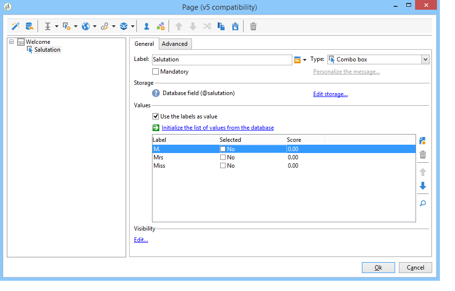
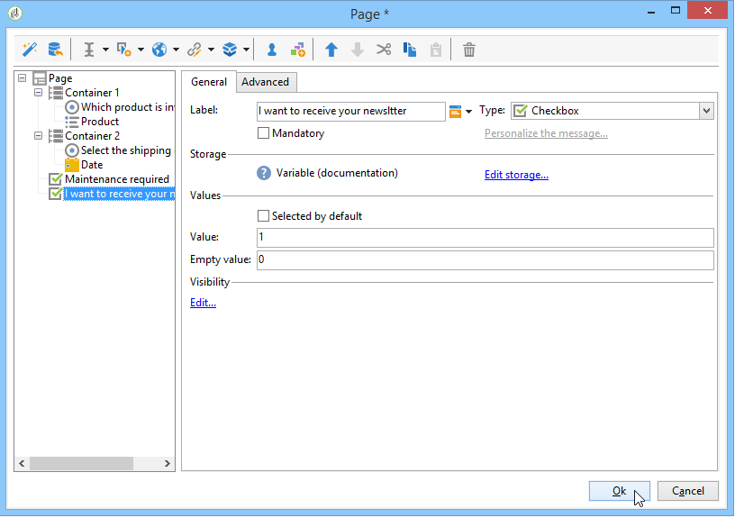
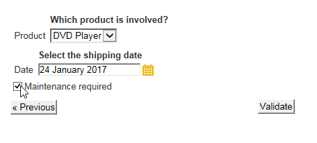
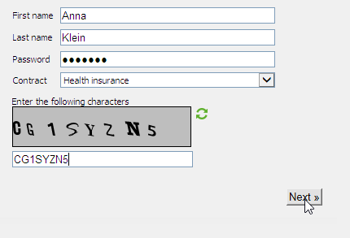

# Inclusão de campos em um formulário web{#adding-fields-to-a-web-form}

Em um formulário Web, os campos permitem que os usuários insiram informações e selecionem opções. Os formulários web podem oferecer campos de entrada, campos de seleção, conteúdo estático e avançado (captchas, subscrições, etc.).

Quando o assistente é utilizado para adicionar campos, o tipo dele é automaticamente detectado com base no campo ou na variável de armazenamento selecionada. É possível editá-lo usando a caixa suspensa **[!UICONTROL Type]** na guia **[!UICONTROL General]**.

Ao usar os botões na barra de ferramentas, selecione o tipo de campo que deseja adicionar.

Os seguintes tipos de campo estão disponíveis:

* Entrada de texto/número. Consulte [Adição de campos de entrada](#adding-input-fields).
* Seleção da lista suspensa. Consulte [Adição de listas suspensas](#adding-drop-down-lists).
* Múltipla escolha por meio de caixas de seleção. Consulte [Adição de caixas de seleção](#adding-checkboxes).
* Seleção exclusiva por meio de botões de opção. Consulte [Adição de botões de opção](#adding-radio-buttons).
* Voto em uma grade de opções. Consulte [Adição de grades](#adding-grids).
* Números e datas. Consulte [Adição de datas e números](#adding-dates-and-numbers).
* Subscrição/cancelamento de subscrição de um serviço de informação. Consulte [Caixas de seleção de subscrição](#subscription-checkboxes).
* Validação de captcha. Consulte [Inserir um captcha](#inserting-a-captcha).
* Botão Download. [Carregamento de um arquivo](#uploading-a-file).
* Constante oculta. Consulte [Inserir uma constante oculta](#inserting-a-hidden-constant).

Especifique o modo de armazenamento de resposta: atualize um campo no banco de dados (armazena somente o último valor salvo) ou armazene em uma variável (a resposta não é armazenada). Para obter mais informações, consulte [Campos de armazenamento de resposta](../../web/using/web-forms-answers.md#response-storage-fields).

>[!NOTE]
>
>Por padrão, o campo é inserido na parte inferior da árvore atual. Use as setas na barra de ferramentas para movê-lo para cima ou para baixo.

## Assistente de criação do campo {#field-creation-wizard}

Para cada página do formulário, é possível adicionar um campo ao usar o primeiro botão da barra de ferramentas. Para fazer isso, acesse o menu **[!UICONTROL Add using the wizard]**.

Selecione o tipo de campo que deseja criar: é possível escolher a inclusão de um campo no banco de dados, uma variável ou até importar um grupo de campos criado em outro formulário e coletado em um container.

Clique em **[!UICONTROL Next]** e selecione o campo de armazenamento, a variável ou o container que deseja importar.

Clique em **[!UICONTROL Finish]** para inserir o campo selecionado na página.

## Adição de campos de entrada {#adding-input-fields}

Para adicionar um campo de entrada, clique no botão **[!UICONTROL Input control]** e escolha o tipo de campo que deseja adicionar.

### Tipos de campos de entrada {#types-of-input-fields}

Há cinco tipos diferentes de campos de texto que podem ser inseridos em uma página de formulário:

* **Text**: permite que o usuário insira um texto em uma linha.

   

* **Number**: permite que o usuário insira um texto em uma linha. Para obter mais informações, consulte [Adicionar números](#adding-numbers).

   Quando a página é aprovada, o conteúdo é verificado para garantir que o valor inserido seja compatível com o campo. Para obter mais informações, consulte [Definir configurações de controle](../../web/using/form-rendering.md#defining-control-settings).

* **Password**: permite que o usuário insira texto em uma única linha. Durante a inserção de texto, os caracteres são substituídos por pontos:

   

   >[!CAUTION]
   >
   >As senhas são armazenadas de forma não criptografada no banco de dados.

* **Multi-line text**: permite que o usuário insira texto em várias linhas.

   

   >[!CAUTION]
   >
   >Campos de texto multilinha são campos específicos que podem conter código de fim de linha. O espaço de armazenamento deve estar associado a um campo mapeado em um elemento XML, não em um atributo XML. Para obter mais informações sobre os tipos de dados em schemas, consulte o capítulo &quot;Referência de schemas&quot; [nesta seção](../../configuration/using/about-schema-reference.md).
   >   
   >Se o módulo **Pesquisa** estiver sendo utilizado, é possível armazenar esse tipo de campo em um campo arquivado que se adapte automaticamente ao formato. Para obter mais informações, consulte [esta seção](../../web/using/about-surveys.md).

* **Enriched multi-line text**: permite que o usuário insira texto com um layout que será armazenado em formato HTML.

   

   É possível selecionar o tipo de editor oferecido aos usuários. Para fazer isso, use a caixa suspensa do campo **[!UICONTROL HTML editor]** na guia **[!UICONTROL Advanced]**.

   

   O número de ícones exibidos varia dependendo do tipo de editor. Para um editor **[!UICONTROL Advanced]**, a renderização será a seguinte:

   

### Configurar campos de entrada {#configure-input-fields}

Todos os campos de entrada são configurados com base no mesmo modo, utilizando as seguintes opções:

A guia **[!UICONTROL General]** permite inserir o nome do campo e atribuir um valor padrão, se necessário.

O modo de armazenamento de resposta pode ser alterado por meio do link **[!UICONTROL Edit storage...]**. Os valores podem ser armazenados em um campo existente do banco de dados; ou você pode escolher não salvar informações no banco de dados (use uma variável local).

>[!NOTE]
>
>Os modos de armazenamento são detalhados em [Response storage fields](../../web/using/web-forms-answers.md#response-storage-fields)

A guia **[!UICONTROL Advanced]** permite definir parâmetros de exibição para o campo (posição dos rótulos, alinhamento, etc.). Consulte [Definição do layout de formulários web](../../web/using/defining-web-forms-layout.md).

## Adição de listas suspensas {#adding-drop-down-lists}

É possível inserir uma lista suspensa em uma página de pesquisa. Isso permite que o usuário selecione um valor com base na oferta em um menu suspenso.

Para adicionar uma caixa suspensa a uma página de formulário, clique no botão **[!UICONTROL Selection controls > Drop-down list]** na barra de ferramentas do editor de páginas.

Selecione o modo de armazenamento de resposta e confirme sua escolha.

Defina os rótulos e os valores da lista na seção inferior da guia **[!UICONTROL General]**. Se as informações forem armazenadas em um campo existente do banco de dados e esse for um campo de lista discriminada, é possível preencher os valores automaticamente clicando em **[!UICONTROL Initialize the list of values from the database]**, conforme mostrado abaixo:

>[!NOTE]
>
>Use as setas à direita da lista de valores para alterar sua sequência.

Se os dados estiverem armazenados em uma tabela vinculada, você poderá selecionar o campo onde os valores a serem sugeridos na lista serão salvos. Por exemplo, se a tabela de países estiver selecionada, clique em **[!UICONTROL Initialize the list of values from the database...]** e selecione o campo desejado.

Em seguida, clique no link **[!UICONTROL Load]** para recuperar os valores:

>[!CAUTION]
>
>Repita essa operação sempre que a lista for atualizada para renovar os valores na oferta.

## Adição de caixas de seleção {#adding-checkboxes}

Para selecionar uma opção, o usuário precisa usar uma caixa de seleção.

Para adicionar uma caixa de seleção a um formulário, clique no ícone **[!UICONTROL Selection controls > Checkbox...]** na barra de ferramentas do editor de páginas.

Selecione o modo de armazenamento de resposta e confirme sua escolha.

Insira o rótulo da caixa no campo **[!UICONTROL Label]** da guia **[!UICONTROL General]**.

Uma caixa de seleção permite atribuir um valor ao campo de armazenamento (ou valor) dependendo se a caixa estiver ou não marcada. A seção **[!UICONTROL Values]** permite inserir o valor a ser atribuído se a caixa estiver marcada (no campo **[!UICONTROL Value]**) e o valor a ser atribuído se não estiver marcado (no campo **[!UICONTROL Empty value]**). Esses valores dependem do formato de armazenamento de dados.

Se o campo de armazenamento (ou variável) for booliano, o valor a ser atribuído se a caixa não estiver marcada será deduzido automaticamente. Nesse caso, somente o campo **[!UICONTROL Value if checked]** é oferecido, conforme mostrado abaixo:

## Exemplo: atribuição de um valor a um campo se uma caixa estiver marcada {#example--assign-a-value-to-a-field-if-a-box-is-checked}

Queremos inserir uma caixa de seleção em um formulário para enviar uma solicitação de manutenção, conforme mostrado abaixo:

As informações serão carregadas no banco de dados e em um campo existente (neste caso, o campo **[!UICONTROL Comment]**):

Se a caixa &quot;Maintenance required&quot; estiver marcada, a coluna **[!UICONTROL Comment]** conterá &quot;Maintenance required&quot;. Se a caixa não estiver marcada, a coluna exibirá &quot;Manutenção não necessária&quot;. Para obter esse resultado, aplique a seguinte configuração à caixa de seleção na página do formulário:

## Adição de botões de opção {#adding-radio-buttons}

Os botões de opção permitem oferecer uma série de opções exclusivas aos usuários. Esses são valores diferentes para o mesmo campo.

Você pode criar botões de opção individualmente (botões unitários) ou por uma lista de múltipla escolha, mas como o objetivo dos botões de opção é selecionar uma opção ou outra, sempre criaremos pelo menos um par de botões de opção, nunca apenas um único botão.

>[!CAUTION]
>
>Para tornar a seleção obrigatória, você precisa criar uma lista de várias opções.

### Adição de botões únicos{#add-single-buttons}

Para adicionar um botão de opção a uma página de formulário, vá para o menu **[!UICONTROL Selection controls > Radio button]** na barra de ferramentas do editor de páginas e escolha um modo de armazenamento.

A configuração dos botões de opção é semelhante a das caixas de seleção (consulte [Adição de caixas de seleção](#adding-checkboxes)). No entanto, nenhum valor será atribuído se a opção não estiver selecionada. Para que vários botões sejam interdependentes, ou seja, a seleção de um desmarca o outro automaticamente, eles devem ser armazenados no mesmo campo. Se eles não estiverem armazenados no banco de dados, a mesma variável local deverá ser usada para o armazenamento temporário. Consulte [Campos de armazenamento de resposta](../../web/using/web-forms-answers.md#response-storage-fields).

### Adição de uma lista de botões {#add-a-list-of-buttons}

Para adicionar botões de opção por meio de uma lista, vá para o menu **[!UICONTROL Selection controls>Multiple choice]** na barra de ferramentas do editor de páginas.

Adicione a mesma quantidade de botões de opção que houver de rótulos. A vantagem desse recurso é que você pode importar valores de um campo existente (caso de um campo discriminado) e fazer com que o usuário escolha uma opção. No entanto, o layout dos botões é menos flexível.

>[!NOTE]
>
>Os formulários Web não autorizam a seleção de vários valores. Várias seleções podem ser ativadas somente para formulários de tipo **Pesquisa.** Para obter mais informações, consulte [esta seção](../../web/using/about-surveys.md).\
>Entretanto, é possível inserir um campo do tipo **[!UICONTROL Multiple choice]** em um aplicativo web; mas sem autorizar a seleção de vários valores: as opções oferecidas podem ser selecionadas usando botões de opção.

## Adição de grades {#adding-grids}

As grades são usadas para criar páginas de votação em aplicações Web. Isso permite oferecer listas de botões de opção para responder pesquisas ou formulários Web do tipo avaliação, conforme mostrado abaixo:

Para usar esse tipo de elemento em um formulário, crie uma grade simples e adicione uma linha para cada elemento a ser avaliado.

O número de botões de opção em cada linha da grade corresponde ao número de valores definidos na grade simples.

Somente uma opção pode ser selecionada por linha de grade.

>[!NOTE]
>
>No nosso exemplo, o rótulo da grade está oculto. Para fazer isso, vá para a guia **[!UICONTROL Advanced]**, a exibição da **[!UICONTROL Label position]** é definida como **[!UICONTROL Hidden]**. Consulte [Definição da posição dos rótulos](../../web/using/defining-web-forms-layout.md#defining-the-position-of-labels).

## Adição de datas e números {#adding-dates-and-numbers}

O conteúdo dos campos de formulário pode ser formatado para corresponder aos dados armazenados no banco de dados ou para atender a um requisito específico. Você pode criar campos adequados para a entrada de números e datas.

### Adição de datas {#adding-dates}

Para permitir que o usuário insira uma data em uma página de formulário, selecione **[!UICONTROL Add input field > Date...]** na barra de ferramentas ou no editor de páginas.

Insira um rótulo para o campo e configure o modo de armazenamento de dados.

A seção inferior da janela permite selecionar os formatos de data e hora dos valores armazenados neste campo.

Você também pode escolher não exibir a data (ou hora).

As datas podem ser selecionadas por meio de um calendário ou caixas suspensas. Você também pode inseri-las diretamente no campo, mas eles precisam corresponder ao formato especificado na tela acima.

>[!NOTE]
>
>Por padrão, as datas usadas em formulários são inseridas por meio de um calendário. Para formulários multilíngues, verifique se os calendários estão disponíveis em todos os idiomas usados. Consulte [Tradução de um formulário web](../../web/using/translating-a-web-form.md).

No entanto, em alguns casos (para inserir datas de nascimento, por exemplo), pode ser mais fácil usar listas suspensas.

Para fazer isso, clique na guia **[!UICONTROL Advanced]** e escolha o modo de entrada usando **[!UICONTROL Drop-down lists]**.

Você pode então definir limites para os valores oferecidos na lista.

### Adição de números {#adding-numbers}

Você pode criar campos adequados para a entrada de números.

Em um campo numérico, o usuário pode inserir somente números. O controle de entrada é aplicado automaticamente quando a página é aprovada.

Dependendo do campo no qual os dados são armazenados no banco de dados, a formatação especial ou certas restrições podem ser aplicadas. Também é possível especificar valores máximos e mínimos. Esse tipo de campo é configurado da seguinte maneira:

O valor padrão é o valor exibido no campo quando o formulário é publicado. Ele pode ser corrigido pelo usuário.

Você pode adicionar um prefixo e/ou sufixo ao campo numérico por meio da guia **[!UICONTROL Advanced]**, conforme mostrado abaixo:

No formulário, a renderização será a seguinte:

## Caixas de seleção de subscrição {#subscription-checkboxes}

Você pode adicionar controles para permitir que os usuários realizaem a subscrição ou unsubscription de um ou mais serviços de informação (boletins informativos, avisos, notificações em tempo real, etc.). Para se subscrever, o usuário marca o serviço correspondente.

Para criar uma caixa de seleção de subscrição, clique em **[!UICONTROL Advanced controls>Subscription]**.

Indique o rótulo da caixa de seleção e selecione o serviço de informação em questão, usando a caixa suspensa **[!UICONTROL Service]**.

>[!NOTE]
>
>Os serviços de informação são detalhados nesta [página](../../delivery/using/managing-subscriptions.md).

O usuário se subscreve no serviço marcando a opção relevante.

>[!CAUTION]
>
>Se o usuário já estiver subscrito em um serviço de informação e a caixa vinculada a esse serviço não estiver marcada ao aprovar o formulário, a subscrição será cancelada.

Exemplos de subscrições e referências estão disponíveis [nesta seção](../../web/using/about-surveys.md).

## Inserção de um captcha {#inserting-a-captcha}

O objetivo dos testes de **captcha** é evitar o uso fraudulento dos formulários web.

>[!CAUTION]
>
>Se seu formulário contiver várias páginas, o Captcha deverá sempre ser colocado na última página, logo antes da caixa de armazenamento, para evitar qualquer erro das medidas de segurança.

Para inserir um Captcha em um formulário, clique no primeiro botão na barra de ferramentas e selecione **[!UICONTROL Advanced controls>Captcha]**.

Insira o rótulo do campo. Esse rótulo será exibido na frente da área de exibição Captcha. Você pode alterar a posição desse rótulo na guia **[!UICONTROL Advanced]**.

>[!NOTE]
>
>Para controles do tipo **[!UICONTROL captcha]**, não há necessidade de indicar um campo ou variável de armazenamento.

O Captcha é inserido na página com um campo de entrada posicionado sob o visual. Esses dois elementos são inseparáveis e considerados como um único item para o propósito do layout da página (eles ocupam uma única célula).

Quando a página é confirmada, o campo de entrada é exibido em vermelho se o conteúdo do Captcha não foi inserido corretamente.

Você pode criar uma mensagem de erro para exibir. Para fazer isso, use o link **[!UICONTROL Personalize the message]** na guia **[!UICONTROL General]**.

>[!NOTE]
>
>Os Captchas têm sempre 8 caracteres. Você não pode modificar esse valor.

## Carregamento de um arquivo {#uploading-a-file}

Você pode adicionar um campo de carregamento a uma página. Essa funcionalidade pode ser útil para o compartilhamento de arquivos da intranet, por exemplo.

Para inserir um campo para fazer upload em uma página de formulário, selecione o menu **[!UICONTROL Advanced controls > File...]** na barra de ferramentas do editor de páginas.

Por padrão, os arquivos carregados são armazenados em arquivos de recurso acessíveis por meio do menu **[!UICONTROL Resources > Online > Public resources]**. Você pode usar um script para alterar esse comportamento. Esse script pode usar as funções definidas na [documentação do Campaign JSAPI](https://docs.adobe.com/content/help/br/campaign-classic/technicalresources/api/index.html), incluindo as que se referem à manipulação de arquivos.

Você pode armazenar o link para esses arquivos em uma variável local ou em um campo de banco de dados. Por exemplo, você pode estender o schema de recipients para adicionar um link a recursos baseados em arquivo.

>[!CAUTION]
>
>* Esse tipo de arquivo deve ser reservado para formulários com acesso seguro (usando credenciais).
>* O Adobe Campaign não controla o tamanho ou o tipo de recurso carregado: portanto, é altamente recomendável usar campos de carregamento para sites de intranet tipo seguro.
>* Se vários servidores estiverem vinculados à instância (&quot;balanceamento de carga&quot;), você precisará verificar se as chamadas para o formulário web chegam no mesmo servidor.
>* Essas implementações exigem a assistência da equipe de consulta do Adobe Campaign.

>

## Inserir uma constante oculta {#inserting-a-hidden-constant}

Você pode realçar um campo quando o usuário passa em uma das páginas do formulário. Para fazer isso, coloque uma constante na página e especifique o valor e o local de armazenamento.

Este campo não está visível para o usuário, mas pode ser utilizado para enriquecer os dados no perfil de usuário.

No exemplo a seguir, o arquivo de **origem** do perfil do recipient é preenchido automaticamente sempre que um usuário aprova essa página. A constante não é exibida na página.

