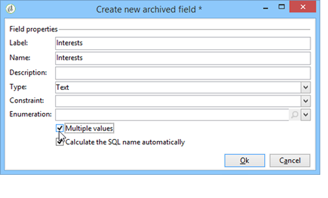
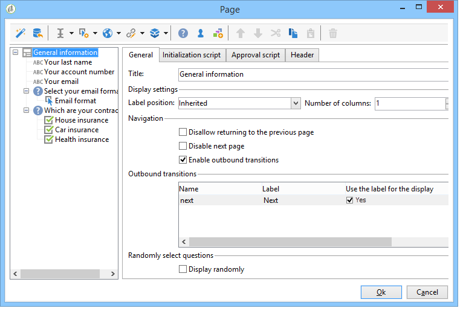

# Criação de uma pesquisa{#building-a-survey}

## Criação de uma nova pesquisa {#creating-a-new-survey}

Este capítulo detalha o design de um formulário do tipo de **Pesquisa** usando o Adobe Campaign, bem como as opções e configurações disponíveis. O Adobe Campaign permite disponibilizar essa pesquisa aos usuários e coletar e arquivar respostas no banco de dados.

Web forms are accessed via the **[!UICONTROL Resources > Online > Web applications]** node of the tree. To create a survey, click the **[!UICONTROL New]** button above the list of applications, or right-click the list and choose **[!UICONTROL New]**.

Select the survey template (**[!UICONTROL newSurvey]** by default).

As páginas do formulário são criadas usando um editor especial que permite definir e configurar campos de entrada (texto), campos de seleção (listas, caixas de seleção, etc.) e elementos estáticos (imagens, conteúdo HTML, etc.). They can be collected in &quot;containers&quot; and laid out according to requirements (see [Adding questions](#adding-questions)).

>[!NOTE]
>
>Para obter mais informações sobre como definir conteúdo e criar layouts de tela para um formulário Web, consulte [esta seção](../../web/using/about-web-forms.md).

## Adição de campos {#adding-fields}

Os campos em um formulário permitem aos usuários inserir informações e selecionar opções. For each page in the form, they are created via the first button in the toolbar using the **[!UICONTROL Add using the wizard]** menu.

>[!NOTE]
>
>Você também pode usar um clique com o botão direito do mouse e inserir uma zona de entrada. Por padrão, a zona é inserida no final da árvore selecionada. Use as setas na barra de ferramentas para movê-la.

### Tipos de campos {#types-of-fields}

Ao adicionar um campo a uma pesquisa, você precisa selecionar seu tipo. As seguintes opções estão disponíveis:

1. **[!UICONTROL Answer a question]**: essa opção permite declarar um novo campo (conhecido como &quot;campo arquivado&quot;) para armazenar respostas. Nesse caso, todos os valores coletados são salvos, até mesmo quando um participante preenche um formulário mais de uma vez. Este modo de armazenamento está disponível somente em **Pesquisas**. Consulte [Armazenamento de respostas](../../web/using/managing-answers.md#storing-collected-answers)coletadas.
1. **[!UICONTROL Edit a recipient]**: essa opção permite selecionar um campo no banco de dados. Nesse caso, as respostas do usuário serão armazenadas nesse campo. Para cada participante, somente o último valor salvo é mantido e adicionado aos dados do perfil.
1. **[!UICONTROL Add a variable]**: essa opção permite criar uma configuração para que as informações não sejam armazenadas no banco de dados. As variáveis locais podem ser declaradas como upstream. Você também pode adicioná-las diretamente ao criar o campo.
1. **[!UICONTROL Import an existing question]**: essa opção permite importar perguntas existentes criadas em outras pesquisas.

   >[!NOTE]
   >
   >Os modos de armazenamento e as importações de campo são detalhados em [Armazenamento de respostas](../../web/using/managing-answers.md#storing-collected-answers)coletadas.

A natureza do campo a ser adicionado (lista suspensa, campo de texto, caixas de seleção e etc.) se adapta ao modo de armazenamento selecionado. You can change it using the **[!UICONTROL Type]** field of the **[!UICONTROL General]** tab, but make sure to remain consistent with the data type.

Os vários tipos de campos disponíveis são detalhados [nesta seção](../../web/using/about-web-forms.md).

## Elementos específicos da pesquisa {#survey-specific-elements}

Pesquisas online estão usando recursos de aplicações Web. Os recursos específicos vinculados aos campos de pesquisa são detalhados abaixo.

### Múltipla escolha {#multiple-choice}

For **[!UICONTROL Multiple choice]** type controls, you can define a minimum and maximum number of selections. Por exemplo, essa opção permite forçar a seleção de pelo menos **2** valores e no máximo **4** valores das opções disponíveis:

Se o número de seleções for muito grande ou muito pequeno, a mensagem apropriada será exibida.

>[!NOTE]
>
>Nesse caso, as opções são selecionadas usando caixas de seleção. Quando apenas uma opção é possível, os botões de opção são usados.

A configuração correspondente é a seguinte:

In addition, the storage location for this input field must be a **[!UICONTROL Multiple values]** type **archived field**:

>[!CAUTION]
>
>* Essa funcionalidade só está disponível para formulários do tipo **Pesquisa**.
>* Essa opção não é compatível com a exibição de pergunta aleatória. For more on this, refer to [Adding questions](#adding-questions).

### Adição de perguntas {#adding-questions}

Há dois tipos de containers: padrão e pergunta. Os containers padrão são usados para configurar o layout da página e a exibição condicional em uma página. Eles são detalhados [nesta seção](../../web/using/about-web-forms.md).

Use um container **Pergunta** para adicionar uma pergunta à página e inserir as respostas possíveis abaixo na hierarquia. As respostas do usuário às perguntas colocadas nesse tipo de container podem ser analisadas em relatórios.

>[!CAUTION]
>
>Nunca insira um container **Pergunta** abaixo de outro container **Pergunta** na hierarquia.

O rótulo da pergunta é inserido no campo de rótulo. Nesse caso, o estilo da folha de estilos do formulário será aplicado. Selecione a **[!UICONTROL Enter the title in HTML format]** opção para personalizá-la. Isso dará acesso ao editor de HTML.

>[!NOTE]
>
>Consulte [esta seção](../../web/using/about-web-forms.md) para obter mais informações sobre o uso do editor de HTML.

Por exemplo:

No exemplo acima, a renderização será a seguinte:

>[!NOTE]
>
>Todas as perguntas têm um container do tipo **Pergunta**.

Você pode habilitar o desenho aleatório de perguntas pelo Adobe Campaign. É possível especificar o número de perguntas a serem exibidas na página, no campo localizado na parte inferior da janela de configuração.

A renderização terá esta aparência:

Quando a página é atualizada, as perguntas exibidas não são as mesmas.

>[!CAUTION]
>
>When you display a question randomly (**[!UICONTROL Display randomly]** option checked on the page), be careful not to use multiple choice questions for which one or more selections are mandatory.

