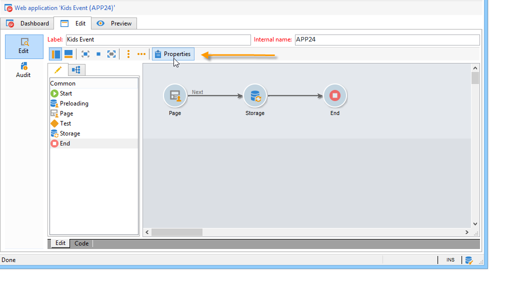

# Configuração de pesquisas{#configuring-surveys}

## Propriedades da pesquisa {#survey-properties}

As pesquisas online são totalmente configuráveis e personalizáveis para atender aos seus requisitos. Os parâmetros devem ser inseridos na janela de propriedades.

Os parâmetros disponíveis são detalhados [nesta seção](../../web/using/defining-web-forms-properties.md).

## Armazenamento de dados de pesquisa {#survey-data-storage}

Por padrão, os campos de formulário Web são armazenados na tabela de recipients. Para usar outra tabela, selecione-a no campo **[!UICONTROL Document type]**. O ícone **[!UICONTROL Zoom]** permite visualizar o conteúdo da tabela selecionada.

Respostas das pesquisas fornecidas por usuários que não são armazenados nos campos (mas em variáveis locais) são armazenadas nas tabelas **Respostas das pesquisas** . É possível alterar o schema usado com base no campo **[!UICONTROL Library]**. Este campo está disponível somente para **pesquisas**.
