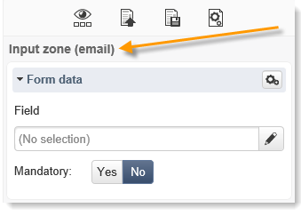
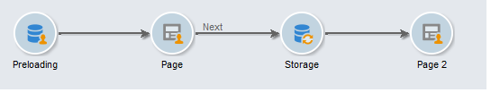

# Práticas recomendadas de edição de conteúdo{#content-editing-best-practices}


Para garantir a operação ideal do editor, recomendamos observar as seguintes diretrizes:

* Antes de **importar um modelo da página HTML** no Adobe Campaign, abra e exiba o modelo corretamente nos vários navegadores.
* Se a página HTML contiver **scripts JavaScript**, eles precisarão executar **sem erros** fora do editor.
* Ao criar um modelo, recomendamos adicionar um atributo **‘type’** às `<input>` tags. Essas informações serão processadas pelo editor e ajudarão o usuário a vincular um campo do banco de dados ao campo do formulário, ao configurar a aplicação web.

  Exemplo de código HTML no modelo:

  ```
  <input id="email" type="email" name="email"/>
  ```

  O atributo **&quot;type&quot;** é visível na interface do seguinte formulário:

  

  A lista oficial de atributos ‘type’ está disponível [neste site](https://www.w3schools.com/tags/att_input_type.asp).

* Etapas para simular uma página final com o DCE:

  

* Verifique se há apenas um `<body> </body>` na página.
* Quando um arquivo CSS ou JS é carregado, as imagens contidas no arquivo .zip não são carregadas. As referências a essas imagens presentes no CSS, portanto, não são atualizadas.

## Formatos compatíveis com o editor de conteúdo {#content-editor-supported-formats}

O Editor de conteúdo digital é compatível com o formato HTML: você pode mudar para o modo de **origem** a qualquer momento.

A função de importação do Editor de conteúdo digital funciona conforme os seguintes formatos compatíveis:

* CSS: as imagens presentes no arquivo .zip não são importadas. As referências a essas imagens no CSS não são atualizadas.
* JS: as imagens presentes no arquivo .zip não são importadas. As referências a essas imagens no JS não são atualizadas.
* Iframe: as páginas vinculadas não são importadas.
* Páginas de destino e aplicações web: se uma tag de **formulário** estiver ausente, um aviso será exibido. Um `<form> </form>` deve estar sempre presente no corpo da mensagem.

O Editor de conteúdo digital também funciona com as seguintes Páginas de código compatíveis:

* iso-8859-1
* iso-8859-2
* utf-7
* utf-8 (recomendado ao usar uma BOM)
* iso-8859-15
* us-ascii
* transferir jis
* iso-2022-jp
* big-5
* euc-kr
* utf-16

>[!NOTE]
>
>A página de código HTML deve ser definida em uma meta tag (HTML 4 ou HTML 5) ou na BOM. Se nenhuma página de código estiver disponível, abra o arquivo em latin1.

## Status de conteúdo HTML {#html-content-statuses}

A seção superior do editor exibe mensagens relacionadas ao status do conteúdo. Os códigos de cor das mensagens são os seguintes:

* **Mensagem cinza**: mensagem de informação, nenhuma ação precisa ser executada no editor.
* **Mensagem azul**: mensagem de informação relacionada ao conteúdo que está sendo editado.
* **Mensagem amarela**: aviso ou mensagem de erro que requer ação em nome do usuário.

### Lista de mensagens ao editar uma aplicação web {#list-of-messages-when-editing-a-web-application}

* O conteúdo HTML é funcional.
* A aplicação web não foi publicada e não pode ser acessada online.
* A aplicação web está online, publique novamente para aplicar as alterações.
* O conteúdo da página não é funcional. Deve incluir um formulário HTML (`<form>`)
* Há n área(s) de entrada ou botões para configurar.
* Para habilitar a transição para a próxima página, você precisa vincular a ação &quot;Próxima página&quot; a um botão ou link na página atual.

### Lista de mensagens ao editar uma entrega {#list-of-messages-when-editing-a-delivery}

* O conteúdo da entrega é funcional
* Há n campos ou blocos de personalização para configurar.
* O conteúdo da entrega está pronto, execute a análise novamente para aplicar as alterações.
* A entrega está pronta para ser enviada.
