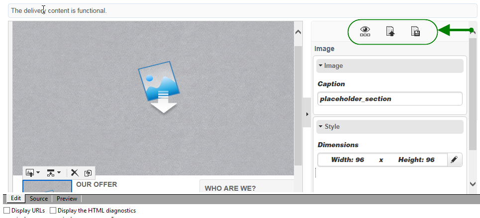

# Interface do editor de conteúdo{#content-editor-interface}

## Janela de edição {#editing-window}

A janela de edição do DCE está dividida em três seções diferentes. Elas permitem visualizar, modificar e verificar o status do conteúdo.

1. A seção **superior** é uma área de exibição para mensagens do usuário. Essas mensagens indicam o status da aplicação web ou o delivery sendo criado, bem como avisos e mensagens de erro relacionadas ao conteúdo. Para obter mais informações, consulte [Status de conteúdo HTML](content-editing-best-practices.md#html-content-statuses).
1. A seção à **esquerda** da janela é a área para edição de conteúdo. Nessa área, o usuário pode interagir diretamente com o conteúdo usando a barra de ferramentas pop-up: inserir um link em uma imagem, alterar a fonte, excluir um campo, etc. Para obter mais informações, consulte [Edição de formulários](editing-content.md#editing-forms).
1. A seção à **direita** da janela é a área do painel de controle. Essa área agrupa as diferentes opções do editor, particularmente as relacionadas à configuração do título da página e opções gerais de um bloco: adicionar uma borda, vincular um campo de banco de dados a uma zona de entrada, acessar propriedades da página da Web, etc. Para obter mais informações, consulte as seções [Global options](#global-options) e [Editing content](editing-content.md)

## Opções globais {#global-options}

A seção superior direita do editor permite que você acesse opções globais que possibilitam controlar o conteúdo que está sendo criado no momento.

Ela tem quatro ícones:

* O ícone **Display/Hide blocks** permite exibir quadros azuis ao redor dos blocos de conteúdo (correspondentes à tag HTML `
`).

* O ícone **Escolher outro conteúdo** permite que o usuário carregue o novo conteúdo de um template (template existente ou template pronto para uso).

   

   >[!CAUTION]
   >
   >O conteúdo selecionado substitui o conteúdo atual.

* O ícone **Salvar como template** permite salvar o conteúdo atual como template. Você deve inserir o rótulo e o nome interno do template. Os templates são armazenados no nó **[!UICONTROL Resources > Templates > Content templates]**.

   

   Depois de salvo, o template está disponível e pode ser selecionado ao criar o novo conteúdo.

   

* O ícone **Propriedades da página** permite selecionar informações de conteúdo na parte superior da página HTML.

   

   >[!NOTE]
   >
   >Essas informações correspondem à **`<title>`** e **`<meta>`** às tags HTML na página.
   >
   >As palavras-chave devem ser separadas por vírgulas.

## Opções de bloco {#block-options}

A seção à direita do editor agrupa as principais opções que permitem que você atue de acordo com o conteúdo. Para exibir essas opções, você deve selecionar um bloco: a natureza dessas opções depende do bloco selecionado.

É possível:

* Determine a exibição de um ou vários blocos, consulte [Definição de uma condição de visibilidade](editing-content.md#defining-a-visibility-condition),
* Defina as bordas e os quadros, consulte [Adição de uma borda e um plano de fundo](editing-content.md#adding-a-border-and-background),
* Defina os atributos da imagem (tamanho, legenda), consulte [Edição de propriedades da imagem](editing-content.md#editing-image-properties),
* Vincule o banco de dados a um elemento de formulário (zona de entrada, caixa de seleção); consulte [Alteração das propriedades dos dados de um formulário](editing-content.md#changing-the-data-properties-for-a-form),
* Torne uma parte de um formulário obrigatória, consulte [Alteração das propriedades dos dados de um formulário](editing-content.md#changing-the-data-properties-for-a-form),
* Defina uma ação para um botão, consulte [Adição de uma ação a um botão](editing-content.md#adding-an-action-to-a-button).

## Barra de ferramentas Conteúdo {#content-toolbar}

A barra de ferramentas é um **elemento pop-up** da interface do DCE que apresenta funções diferentes de acordo com o bloco selecionado.

>[!CAUTION]
>
>Certas funções de barra de ferramentas permitem formatar o conteúdo HTML. No entanto, se a página contiver uma folha de estilos CSS, as **instruções** da folha de estilos podem provar a **prioridade** sobre as instruções especificadas com a barra de ferramentas.
