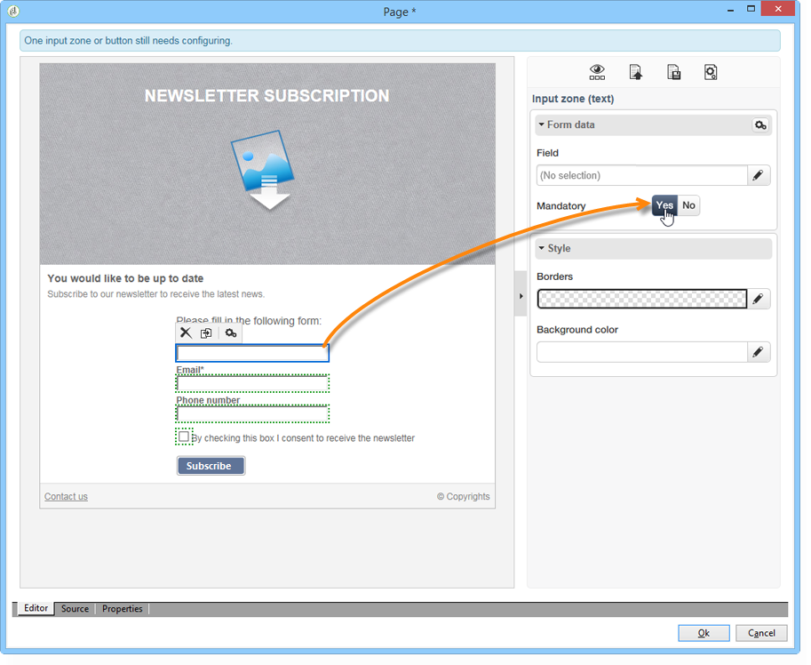
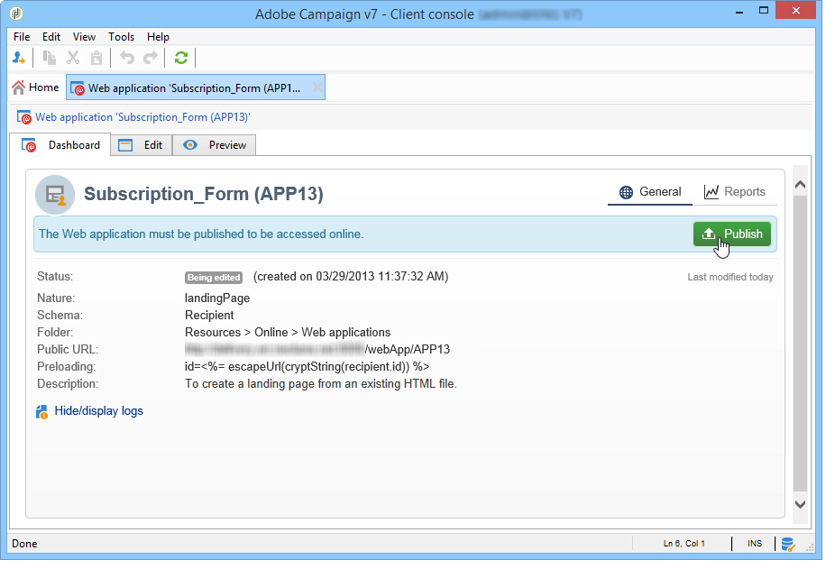

# Criar uma landing page{#creating-a-landing-page}

## Sobre a criação de landing pages {#about-landing-pages-creation}

Este caso de uso mostra o uso do Editor digital para criar uma Landing page no console do Adobe Campaign.

Antes de começar a configurar a Landing page no Adobe Campaign, verifique se você tem **um ou mais templates** para representar a(s) página(s) HTML.

O principal objetivo desse caso de uso é fazer com que os campos de formulário da Landing page correspondam aos campos internos no Adobe Campaign usando as funções no DCE.

## Criação da landing page {#creating-the-landing-page}

Para criar um novo aplicativo web tipo landing page, siga estas etapas:

1. Vá para a guia **[!UICONTROL Campaigns]**, clique no link **[!UICONTROL Web application]** e clique no botão **[!UICONTROL Create]**.
1. Selecione o modelo **[!UICONTROL New landing page]**, insira um rótulo e clique em **[!UICONTROL Save]**.

   

1. Clique na guia **[!UICONTROL Edit]**.
1. Exclua a atividade **Final**.
1. Adicione uma atividade **[!UICONTROL Page]** após a atividade **[!UICONTROL Storage]**.
1. Edite a atividade **Page 2** e desmarque a opção **[!UICONTROL Activate outbound transitions]** na guia **[!UICONTROL Properties]**.

   

1. Salve as alterações.

Você obterá a seguinte sequência:

>[!NOTE]
>
>Para obter mais informações sobre criação de aplicação web, consulte [esta seção](creating-a-new-web-application.md).

## Etapa 1 — seleção e carregamento de modelos {#step-1---selecting-and-loading-templates}

Nesta seção, vamos examinar como **importar conteúdo HTML** para cada página da aplicação Web.

Um template deve conter:

* um arquivo **HTML** (obrigatório)
* um ou mais arquivos **CSS** (opcional)
* uma ou mais **imagens** (opcional)

Para carregar o template na primeira página, siga as etapas abaixo:

1. Abra a primeira atividade **[!UICONTROL Page]** da aplicação web.
1. Selecione **[!UICONTROL From a file]** para buscar seu modelo de conteúdo.

   

1. Selecione o arquivo HTML a ser usado.
1. Clique em **Abrir** para iniciar a importação.

   Durante o carregamento, a lista de arquivos compartilhados é exibida. O sistema de importação verifica se todos os arquivos vinculados ao HTML selecionado estão no lugar (CSS, imagens, etc.).

   Clique no botão **[!UICONTROL Close]** após a conclusão da importação.

   

   >[!CAUTION]
   >
   >Aguarde até obter a seguinte mensagem antes de fechar: **[!UICONTROL The external resources have been successfully published]**.

1. Clique na guia **[!UICONTROL Properties]**.
1. Digite um **rótulo** para cada página (por exemplo: &quot;Page 1= Collect&quot;, &quot;Page 2=Thank you&quot;).

   

Aplique essas etapas para cada página inserida na aplicação web.

>[!CAUTION]
>
>**O DCE executa o código JavaScript para a página HTML carregada.** Erros JavaScript no template HTML que podem aparecer na interface do Adobe Campaign. Esses erros não estão relacionados ao editor. Para garantir que não haja erros nos arquivos importados, recomenda-se testar em um navegador antes de importar os arquivos para o DCE.

## Etapa 2 - Configuração do conteúdo {#step-2---configuring-the-content}

Nesta seção, vamos ajustar o conteúdo importado e vincular os campos do banco de dados ao formulário da página da Web. A aplicação web criada anteriormente é:

### Modificação de conteúdo {#modifying-content}

Vamos começar alterando as cores da página. Para fazer isso:

1. Abra a página **[!UICONTROL Collection]**.
1. Clique no plano de fundo.
1. Clique em **Cor do plano de fundo** no lado direito.
1. Selecione uma nova cor de plano de fundo.
1. Clique em **OK** para confirmar a alteração.

   

1. Aplique esses mesmos processos para alterar a cor do botão

   

### Vinculação de campos de formulário {#linking-form-fields}

Vamos vincular os campos na página aos campos no banco de dados, para salvar as informações fornecidas.

1. Selecione um campo de formulário.
1. Editar a seção **[!UICONTROL Field]** no lado direito do editor.
1. Selecione o campo de banco de dados que deseja vincular ao campo selecionado.

   

1. Repita esse processo para cada campo na página.

Você pode tornar um campo obrigatório: por exemplo, clique no campo **[!UICONTROL Email]** e habilite a opção **Mandatory**.

### Criação de um link para a próxima página {#creating-a-link-to-the-next-page}

Esta etapa é obrigatória porque permitirá que o aplicativo Web determine a sequência das próximas etapas: salvar os dados coletados no banco de dados e exibir a próxima página (página **Obrigado**).

1. Selecione o botão **[!UICONTROL Send it!]** da página **[!UICONTROL Collection]**.
1. Clique no menu suspenso **[!UICONTROL Action]**.
1. Selecione a ação **[!UICONTROL Next page]**.

   

### Inserção de um campo de personalização {#inserting-a-personalization-field}

Esta etapa permite personalizar a página de agradecimento. Para fazer isso:

1. Abra a página **[!UICONTROL Thank you]**.
1. Coloque o cursor em uma área de texto, onde você deseja inserir o nome do recipient.
1. Selecione **[!UICONTROL Personalization field]** no menu **[!UICONTROL Insert]** da barra de ferramentas.
1. Selecione o nome.

   

O campo de personalização tem um plano de fundo amarelo no editor.

## Etapa 3 - Publicação de conteúdo {#step-3---publishing-content}

O conteúdo é publicado pelo painel do aplicativo web. Clique no botão **[!UICONTROL Publish]** para executá-lo.

Durante a publicação, é exibido um log. O sistema de publicação analisa todo o conteúdo encontrado na aplicação Web

>[!NOTE]
>
>No log de publicação, os avisos e erros são classificados por atividade.

Agora o formulário está disponível: sua URL está acessível no painel do aplicativo e pode ser enviada para os recipients.
