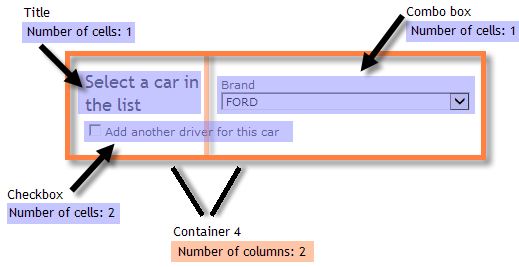

# Definir o layout de formulários web{#defining-web-forms-layout}

## Criação de containers {#creating-containers}

Os containers permitem combinar os campos de uma página e configurar seu layout para organizar os elementos na página.

Para cada página do formulário, os são criados por meio do botão **[!UICONTROL Containers]** Containers da barra de ferramentas.

Use um container para agrupar elementos da página sem adicionar um rótulo à renderização final. Os elementos são agrupados na subárvore container. Os containers padrão permitem gerenciar o layout.

Por exemplo:

A posição dos rótulos é aplicada aos elementos posicionados abaixo do container na hierarquia. Ela pode ser sobrecarregada para cada elemento, se necessário. Adicionar ou remover colunas para alterar o layout. Consulte [Posicionamento dos campos na página](#positioning-the-fields-on-the-page).

No exemplo acima, a renderização será a seguinte:

## Posicionamento dos campos na página {#positioning-the-fields-on-the-page}

O layout do formulário web é definido pela página em cada container e pode ser sobrecarregado se necessário.

As páginas são divididas em colunas: cada página contém determinado número de colunas. Cada campo da página ocupa **n** células. Os containers também ocupam determinado número de colunas e os campos que contêm ocupam determinado número de células.

Por padrão, as páginas são criadas em uma única coluna e cada elemento ocupa uma célula. Isso significa que os campos são exibidos um embaixo do outro e cada um ocupa uma linha inteira, como mostrado abaixo:

No exemplo a seguir, a configuração padrão foi mantida. A página ocupa uma única coluna que inclui quatro containers.

Cada container ocupa uma coluna e cada elemento ocupa uma célula:

A renderização é a seguinte:

Você pode adaptar os parâmetros de exibição para obter a seguinte renderização:

No exemplo de renderização acima, cada campo de entrada, título e imagem ocupa uma célula nas colunas dos containers.

Você pode modificar a formatação em cada container. No nosso exemplo, você pode distribuir o conteúdo do container 4 em duas colunas e distribuir os elementos.

O título e a lista ocupam uma célula cada (e, portanto, uma linha inteira do container) e a caixa de seleção se estende por duas células. O número de células atribuídas ao campo de entrada é definido na guia **[!UICONTROL General]** ou na guia **[!UICONTROL Advanced]**, de acordo com o tipo de campo:

## Definição da posição dos rótulos {#defining-the-position-of-labels}

Você pode definir o alinhamento dos campos e rótulos no formulário.

Por padrão, os parâmetros de exibição para campos e outros conteúdos da página são herdados da configuração geral do formulário, da configuração da página ou da configuração do container primário, se existir.

Os parâmetros de exibição global para todo o formulário são especificados na caixa de propriedades do formulário. A guia **[!UICONTROL Rendering]** permite selecionar a posição dos rótulos.

Essa posição pode ser sobrecarregada para cada página, cada container e cada campo, por meio da guia **[!UICONTROL Advanced]**.

Os seguintes alinhamentos são suportados:

* Herdado: o alinhamento é herdado do elemento primário (valor padrão), ou seja, o container primário, se houver, ou a página,
* Esquerda/Direita: o rótulo é posicionado à direita ou à esquerda do campo,
* Acima/Abaixo: o rótulo está posicionado acima ou abaixo do campo,
* Oculto: o rótulo não é exibido.
