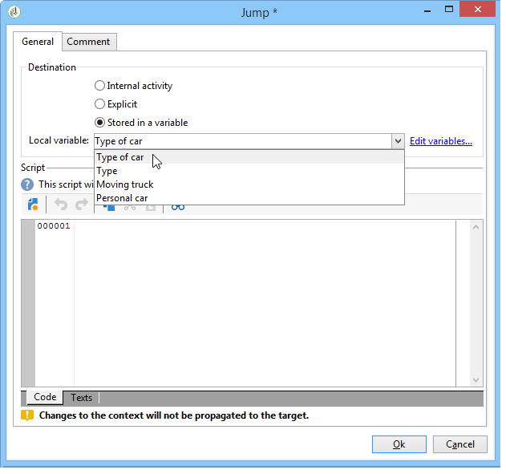
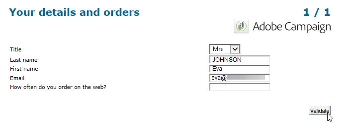

# Definição do sequenciamento de páginas dos formulários web{#defining-web-forms-page-sequencing}


O formulário pode conter uma ou mais páginas. Ele é criado por meio de um diagrama que permite o sequenciamento de páginas e testes, execução de scripts e estágios de gravação de jump da página. O modo de construção do diagrama global é o mesmo que para um workflow do Campaign.

## Sobre a página anterior e a próxima página {#about-previous-page-and-next-page}

Para cada página, você pode excluir os botões **[!UICONTROL Next]** ou **[!UICONTROL Previous]**. Para fazer isso, selecione a página relevante e a opção **[!UICONTROL Disable next page]** ou **[!UICONTROL Disallow returning to the previous page]** .


Você pode substituir esses botões por links. Consulte [Inserção de conteúdo HTML](static-elements-in-a-web-form.md#inserting-html-content).

## Inserção de um jump {#inserting-a-jump}

O objeto **[!UICONTROL Jump]** dá acesso a outra página ou outro formulário quando o usuário clica em **[!UICONTROL Next]**.

O destino pode ser:

* Outra página do formulário. Para fazer isso, selecione **[!UICONTROL Internal activity]** e especifique a página desejada, conforme abaixo:

   

* Outro formulário. Para fazer isso, clique na opção **[!UICONTROL Explicit]** e especifique o formulário de destino.

   

* O destino pode ser armazenado em uma variável. Nesse caso, selecione-o na lista suspensa, conforme mostrado abaixo:

   

* A guia **[!UICONTROL Comment]** permite inserir informações que serão visíveis pelo operador quando clicarem no objeto no diagrama.

   

## Exemplo: acessar outro formulário de acordo com um parâmetro do URL {#example--accessing-another-form-according-to-a-parameter-of-the-url}

No exemplo a seguir, queremos configurar um formulário web que, quando aprovado, exibirá outro formulário designado por um parâmetro da URL. Para fazer isso, siga as etapas abaixo:

1. Insira um jump no final de um formulário: isto substitui a caixa **[!UICONTROL End]**.

   

1. Nas propriedades do formulário, adicione um parâmetro (**próximo**) armazenado em uma variável local (**próximo**). As variáveis locais são detalhadas em [Armazenamento de dados em uma variável local](web-forms-answers.md#storing-data-in-a-local-variable).

   

1. Edite o objeto **[!UICONTROL Jump]**, selecione a opção **[!UICONTROL Stored in a variable]** e selecione a variável **next** na caixa suspensa.

   

1. A URL do delivery deve incluir o nome interno do formulário de destino, por exemplo:

   ```
   https://[myserver]/webForm/APP62?&next=APP22
   ```

   Quando o usuário clica no botão **[!UICONTROL Approve]**, o formulário **APP22** é exibido.

## Inserção de um link para outra página do formulário {#inserting-a-link-to-another-page-of-the-form}

Você pode inserir links para outras páginas do formulário. Para fazer isso, adicione um elemento estático tipo **[!UICONTROL Link]** à página. Para obter mais informações, consulte [Inserção de um link](static-elements-in-a-web-form.md#inserting-a-link).

## Exibição de página condicional {#conditional-page-display}

### Exibir com base em respostas {#display-based-on-responses}

A caixa **[!UICONTROL Test]** permite determinar a condição do sequenciamento de páginas em um formulário. Ela permite definir várias linhas de filial, dependendo dos resultados do teste. Isso permite exibir páginas diferentes dependendo das respostas fornecidas pelos usuários.

Por exemplo, você pode exibir uma página diferente para clientes que já solicitaram online e outra para aqueles que fizeram mais de dez pedidos. Para fazer isso, na primeira página do formulário, insira um campo de entrada do tipo **[!UICONTROL Number]** para o usuário que indique quantos pedidos eles fizeram.



Você pode armazenar essas informações em um campo do banco de dados ou usar uma variável local.

>[!NOTE]
>
>Os modos de armazenamento são detalhados em [Campos de armazenamento de resposta](web-forms-answers.md#response-storage-fields).

No nosso exemplo, queremos usar uma variável:


No diagrama do formulário, insira uma caixa de teste para definir as condições. Para cada condição, uma nova ramificação será adicionada na saída da caixa de teste.


Selecione a opção **[!UICONTROL Activate the default branching]** para adicionar uma transição para casos em que nenhuma das condições é verdadeira. Essa opção é desnecessária se cada caso possível for coberto pelas condições definidas.

Em seguida, defina o sequenciamento de página quando uma ou outra das condições for verdadeira, por exemplo:


### Exibir com base em parâmetros {#display-based-on-parameters}

Você também pode personalizar o sequenciamento de página de acordo com os parâmetros de inicialização do formulário web ou de acordo com os valores armazenados no banco de dados. Consulte [Parâmetros da URL do formulário](defining-web-forms-properties.md#form-url-parameters).

## Adição de scripts {#adding-scripts}

O objeto **[!UICONTROL Script]** permite inserir um script JavaScript diretamente, por exemplo, para modificar o valor de um campo, recuperar dados do banco de dados ou chamar uma API do Adobe Campaign.

## Personalização da página final {#personalizing-the-end-page}

Você deve colocar uma página final no final do diagrama. A página final é exibida quando o usuário clica no botão **[!UICONTROL Approve]** no formulário web.

Para personalizar essa página, clique duas vezes em **[!UICONTROL End]** e insira o conteúdo da página no editor central.


* Você pode copiar e colar conteúdo HTML existente. Para fazer isso, clique em **[!UICONTROL Display source code]** e insira o código HTML.
* Você pode usar uma URL externa; para fazer isso, selecione a opção correspondente e digite a URL da página a ser exibida.
