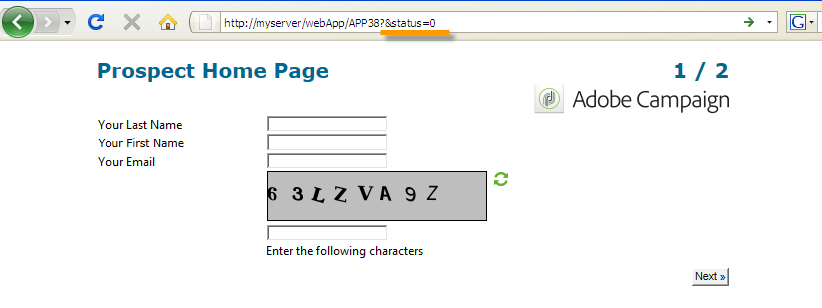

# Definição das propriedades dos formulários web{#defining-web-forms-properties}

Os formulários web são completamente configuráveis e personalizáveis para atender aos seus requisitos. Os parâmetros devem ser inseridos na janela de propriedades.

A janela de propriedades é acessível por meio do botão **[!UICONTROL Properties]** na barra de ferramentas do formulário web. Essa janela permite que você acesse um intervalo de configurações específicas ao formulário web. Algumas configurações podem resultar da configuração do template.

## Propriedades gerais do formulário {#overall-form-properties}

Na guia **[!UICONTROL General]** da janela de propriedades, você pode modificar o **Label** do formulário. É extremamente recomendável não alterar o **nome Interno**.

O template de formulário é escolhido durante a criação do formulário. Ele não pode ser alterado posteriormente. Para obter mais informações sobre como criar e gerenciar modelos de formulário, consulte [Uso de um modelo de formulário web](using-a-web-form-template.md).

## Armazenamento de dados do formulário {#form-data-storage}

Por padrão, os campos de formulários web são armazenados na tabela de recipients. Você pode alterar a tabela usada selecionando uma nova tabela no campo **[!UICONTROL Document type]**. O ícone **[!UICONTROL Zoom]** permite visualizar o conteúdo da tabela selecionada.

Por padrão, as respostas são armazenadas na tabela **Answer to a recipient form**.

## Configuração de uma página de erro {#setting-up-an-error-page}

Você pode configurar uma página de erro: essa página será exibida caso ocorra erros durante a execução do formulário.

A página de erro é definida na guia correspondente da janela de propriedades do formulário.

Por padrão, ela mostra as seguintes informações:

O conteúdo das cadeias de caracteres exibidas é definido na guia **[!UICONTROL Error page]** da janela de propriedades. A guia **[!UICONTROL HTML]** exibe a renderização e a guia **[!UICONTROL Texts]** permite modificar as cadeias de caracteres de texto e adicionar texto se necessário:

## Localização do formulário {#form-localization}

A guia **[!UICONTROL Localization]** permite selecionar os idiomas de design e exibição para o formulário web.

Consulte [Tradução de um formulário web](translating-a-web-form.md).

## Navegação e renderização de formulários {#form-browsing-and-rendering}

A guia **[!UICONTROL Rendering]** permite definir o tipo de navegação entre páginas do formulário web e o modelo de renderização usado.

Você pode escolher navegar por meio de links ou botões.

Os botões são os elementos de navegação por padrão. Eles permitem executar as seguintes ações:

* Aprove a página atual e exiba a próxima página clicando em **[!UICONTROL Next]**. Esse botão é exibido em todas as páginas, exceto o último.
* Exiba a página anterior clicando em **[!UICONTROL Previous]**. Esse botão é exibido em todas as páginas, exceto o primeiro.
* Salve as respostas do formulário clicando no botão **[!UICONTROL Approve]**. Esse botão só é exibido na última página.

Esses elementos são exibidos na parte inferior de cada página. Suas posições podem ser alteradas. Para fazer isso, você deve modificar a folha de estilos.

>[!NOTE]
>
>É possível ocultar o botão **[!UICONTROL Previous]** em algumas páginas. Para fazer isso, vá para a página relacionada e marque a opção **[!UICONTROL Disallow returning to the previous page]**. Essa opção é acessível quando a raiz da árvore de página é selecionada.

O campo **[!UICONTROL Template]** da guia **[!UICONTROL Rendering]** permite selecionar um tema entre os disponíveis.

Os temas são salvos no nó **[!UICONTROL Administration>Configuration>Form rendering]** da árvore. Consulte [Seleção do modelo de renderização do formulário](form-rendering.md#selecting-the-form-rendering-template)

Uma renderização de amostra é exibida na parte inferior da janela de propriedades. O ícone **[!UICONTROL Edit link]** permite visualizar a configuração do tema selecionado.

## Textos no formulário {#texts-in-the-form}

A guia **[!UICONTROL Page]** permite definir o conteúdo do cabeçalho e rodapé do formulário. Consulte [Definição de cabeçalhos e rodapés](form-rendering.md#defining-headers-and-footers)

Também permite gerenciar traduções. Consulte [Tradução de um formulário web](translating-a-web-form.md).

## Acessibilidade do formulário {#accessibility-of-the-form}

Um formulário web é acessível aos usuários se ele estiver **[!UICONTROL Online]** e se a data atual estiver dentro de seu período de validade. O status do formulário é modificado durante o estágio de publicação (consulte [Publicação de um formulário](publishing-a-web-form.md#publishing-a-form)). O status é exibido na seção **Project** da guia **[!UICONTROL General]** da janela de propriedades.

O período de validade é executado da data **[!UICONTROL Start]** para a data **[!UICONTROL End date]**. Se nenhuma data for especificada nesses campos, o formulário terá validade permanente.

>[!NOTE]
>
>Se o formulário estiver fechado e, portanto, seu período de validade não tiver sido atingido ou expirado, ou se ele tiver sido fechado pelo operador do Adobe Campaign, uma mensagem será exibida quando o usuário tentar acessá-lo. É possível personalizar esta mensagem ao clicar em **[!UICONTROL Personalize the message displayed if the form is closed...]**.

## Controle de acesso ao formulário {#form-access-control}

Por padrão, o acesso aos formulários web é realizado no modo anônimo: todos os operadores que acessam o formulário recebem os direitos de operador do WebApp.

Você pode habilitar o controle de acesso para a exibição do formulário, por exemplo, ao entregar um formulário em um site da Intranet para autenticar usuários. Para fazer isso, exiba a janela **[!UICONTROL Properties]** do formulário relacionado e clique na opção **[!UICONTROL Enable access control]**, conforme mostrado abaixo:

Quando a página for acessada, o seguinte formulário de autenticação será exibido:

O login e a senha são aqueles usados pelos operadores do Adobe Campaign. Para obter mais informações, consulte [esta seção](../../platform/using/access-management.md).

A opção **[!UICONTROL Use a specific account]** permite limitar a permissão de leitura ou gravação do operador que acessa o formulário. Use a caixa suspensa para selecionar um operador ou grupo de operadores que estará encarregado de conceder essas permissões.

## Parâmetros da URL do formulário {#form-url-parameters}

É possível incluir parâmetros adicionais na URL de um formulário para personalizar seu conteúdo e inicializar um contexto (idioma, ID do recipient criptografada, empresa, fórmula calculada armazenada em uma variável, etc.). Isso permite que você dê acesso a um formulário por meio de várias URLs diferentes e personalize o conteúdo da página com base no valor do(s) parâmetro(s) indicado(s) na URL.

Por padrão, o Adobe Campaign oferece parâmetros para pré-visualizar o formulário e verificar erros. Você pode criar novas configurações vinculadas ao formulário, que pode usar os valores de um campo no banco de dados ou de uma variável local.

## Parâmetros padrão {#standard-parameters}

Os seguintes parâmetros estão disponíveis por padrão:

* **id** para indicar o identificador criptografado.
* **lang** para alterar o idioma de exibição.
* **origin** para especificar a origem do entrevistado.
* **_uuid** permite a exibição de formulário antes da publicação e do rastreamento de erros. Esse parâmetro é para uso interno (criação e depuração): quando você acessa o formulário web por meio dessa URL, os registros criados não são levados em consideração no rastreamento (relatórios). A origem é forçada ao valor **[!UICONTROL Adobe Campaign]**.

   Ele é usado com os parâmetros **_preview** e/ou **_debug**:

   **_preview** para exibir a última versão salva. Esse parâmetro deve ser usado somente na fase de teste.

   **_debug** para exibir o rastreamento da entrada de dados ou calculada nas páginas do formulário. Isso é usado para obter mais informações sobre erros, incluindo uma vez que o formulário foi publicado.

   >[!CAUTION]
   >
   >Quando o formulário é exibido por meio de um URL com o parâmetro **_uuid** , o valor do parâmetro **[!UICONTROL origin]** é forçado ao **Adobe Campaign**.

## Adição de parâmetros {#adding-parameters}

Os parâmetros podem ser adicionados através da guia **[!UICONTROL Parameters...]** na janela Propriedades do formulário. Eles podem ser obrigatórios, conforme mostrado abaixo:

Você deve especificar um local de armazenamento a partir do qual o valor do parâmetro será recuperado. Para fazer isso, selecione uma das opções de armazenamento e clique na guia **[!UICONTROL Storage]** para selecionar o campo ou a variável correspondente. As opções de armazenamento são detalhadas nos [Response storage fields](web-forms-answers.md#response-storage-fields).

O status do entrevistado (0, 1 ou qualquer outro valor) pode então ser adicionado ao URL para acessar o formulário. Essas informações podem ser reutilizadas nas páginas do formulário ou em uma caixa de teste. As páginas exibidas podem ser condicionadas com base no valor do contexto, conforme mostrado abaixo:

1. Home page para clientes (**status=1**):

   

1. Home page para clientes potenciais (**status=0**):

   

1. Home page para outros perfis (por exemplo, **status=12**):

   

Para configurar este formulário, crie uma caixa de teste e coloque-a no início do diagrama, conforme mostrado abaixo:

A caixa de teste permite configurar as condições de sequenciamento de página:

