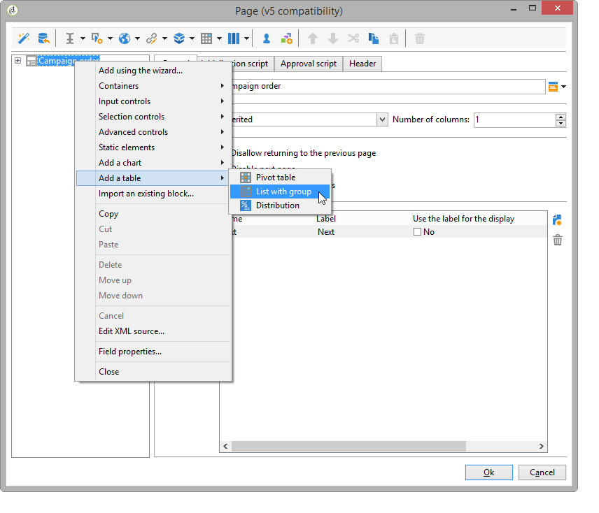

# Criação de uma aplicação web{#designing-a-web-application}

Aplicativos web são criados e gerenciados de acordo com o mesmo princípio de [pesquisas online](../../web/using/about-surveys.md).

No entanto, as diferenças funcionais são as seguintes:

* As aplicações web não usam campos arquivados. Portanto, os dados podem ser armazenados em campos de banco de dados ou em variáveis locais apenas.
* Não há relatórios integrados em aplicativos web.
* Campos adicionais são oferecidos, principalmente para a criação de tabelas e gráficos.

>[!CAUTION]
>
>É extremamente recomendável que as configurações aplicadas sejam continuamente verificadas para detectar erros com antecedência no processo de criação da aplicação web. Para verificar a renderização de uma modificação, salve o aplicativo e clique na subguia **[!UICONTROL Preview]**.
>
>Até que a aplicação web seja publicada, as alterações não poderão ser vistas pelo usuário final.

## Inserção de gráficos em uma aplicação web {#inserting-charts-in-a-web-application}

Você pode incluir gráficos em aplicações web. Para fazer isso, use a lista suspensa de gráficos na barra de tarefas para selecionar o tipo de gráfico a ser inserido.

É possível também selecionar o menu **[!UICONTROL Add a chart]**.

## Inserção de tabelas em uma aplicação web {#inserting-tables-in-a-web-application}

Para adicionar uma tabela, use a lista suspensa de tabelas na barra de tarefas para selecionar o tipo de tabela a ser usada.

Você também pode selecionar o tipo de tabela no menu suspenso.

## Aplicações web tipo Visão geral {#overview-type-web-applications}

A interface do Adobe Campaign usa muitas aplicações web para acessar, gerenciar e interagir com recipients, deliveries, campanhas, estoques, etc.

Elas são vistas na interface do formulário de painéis com apenas uma página.

Os aplicativos web prontos para uso são armazenadas no nó **[!UICONTROL Administration > Configuration > Web applications]**.

## Editar aplicativos Web do tipo formulários {#edit-forms-type-web-applications}

As aplicações web de formulários de edição para uma extranet são caracterizadas por:

* Uma caixa de pré-carregamento

   Na maioria dos casos, os dados a ser exibidos devem ser pré-carregados. Como os usuários que acessam esses formulários são identificados (por meio de um controle de acesso), o pré-carregamento não é necessariamente criptografado.

* Uma caixa de salvamento
* Adição de páginas

   Enquanto as aplicações web tipo &quot;Visão geral&quot; têm uma única página, os formulários de edição podem oferecer uma sequência de páginas com base em critérios específicos (testes, seleções, perfil do operador conectado, etc.).

A operação desse tipo de aplicação web é semelhante às **Pesquisas**, mas sem gestão de histórico ou arquivamento de campo. Os usuários normalmente o acessam por meio de uma página de login onde eles devem se identificar.
