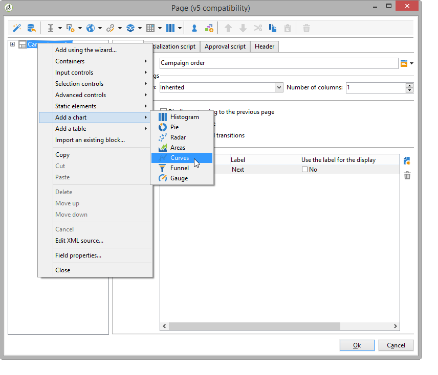
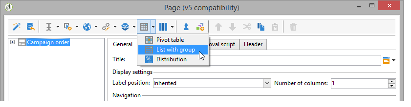
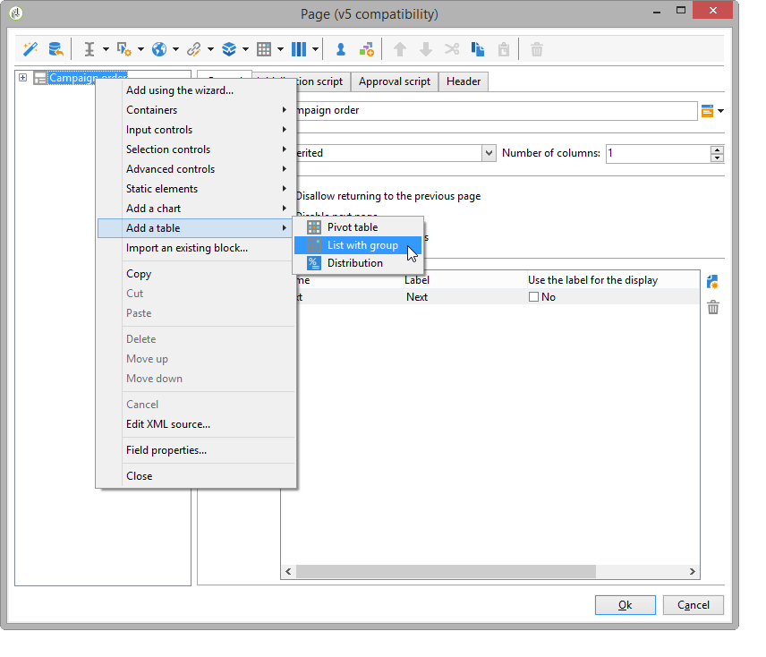

# Criar um aplicativo web{#designing-a-web-application}

Os aplicativos Web são criados e gerenciados de acordo com o mesmo princípio que [formulários Web](about-web-forms.md).

>[!CAUTION]
>
>Use a subguia **[!UICONTROL Preview]** para verificar erros durante a criação do aplicativo web. Observe que o perfil de teste usado para visualizar seu aplicativo web precisa estar em uma pasta com **[!UICONTROL Access rights]** para o operador **[!UICONTROL Web application agent]**.  Até que o aplicativo web seja publicado, as alterações não serão expostas aos usuários finais.

## Inserção de gráficos em um aplicativo web {#inserting-charts-in-a-web-application}

Você pode incluir gráficos em aplicações web. Para fazer isso, use a lista suspensa de gráficos na barra de tarefas para selecionar o tipo de gráfico a ser inserido.

É possível também selecionar o menu **[!UICONTROL Add a chart]**.

## Inserção de tabelas em um aplicativo web {#inserting-tables-in-a-web-application}

Para adicionar uma tabela, use a lista suspensa de tabelas na barra de tarefas para selecionar o tipo de tabela a ser usada.

Você também pode selecionar o tipo de tabela no menu suspenso.

## Aplicativos Web do tipo Visão geral {#overview-type-web-applications}

A interface do Adobe Campaign usa muitas aplicações web para acessar, gerenciar e interagir com destinatários, entregas, campanhas, estoques, etc.

Elas são vistas na interface do formulário de painéis com apenas uma página.

Os aplicativos web prontos para uso são armazenadas no nó **[!UICONTROL Administration > Configuration > Web applications]**.

## Editar aplicativos Web do tipo formulários {#edit-forms-type-web-applications}

As aplicações web de formulários de edição para uma extranet são caracterizadas por:

* Uma caixa de pré-carregamento

  Na maioria dos casos, os dados a ser exibidos devem ser pré-carregados. Como os usuários que acessam esses formulários são identificados (por meio de um controle de acesso), o pré-carregamento não é necessariamente criptografado.

* Uma caixa de salvamento
* Adição de páginas

  Enquanto as aplicações web tipo &quot;Visão geral&quot; têm uma única página, os formulários de edição podem oferecer uma sequência de páginas com base em critérios específicos (testes, seleções, perfil do operador conectado, etc.).

