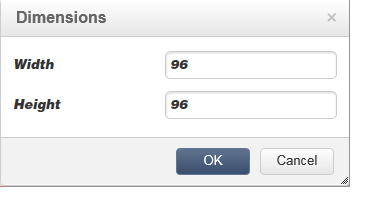

# Edição de conteúdo{#editing-content}

## Definição de uma condição de visibilidade {#defining-a-visibility-condition}

Você pode especificar uma condição de visibilidade em um elemento de página da web: esse elemento será visível somente se a condição for respeitada.

To add a visibility condition, select a block and enter the condition in the **[!UICONTROL Visibility condition]** field using the expression editor.


>[!NOTE]
>
>A edição de expressão avançada é apresentada [nesta página](../../platform/using/defining-filter-conditions.md#list-of-functions).


These conditions adopt the XTK expression syntax (for example **ctx.recipient.@email != &quot;&quot;** ou **ctx.receipt.@status==&quot;0&quot;**). Por padrão, todos os campos são visíveis.

>[!NOTE]
>
>Blocos dinâmicos não visíveis, como menus suspensos, não podem ser editados.

## Adição de uma borda e um plano de fundo {#adding-a-border-and-background}

Você pode adicionar uma **borda** a um bloco selecionado. As bordas são definidas usando três opções: estilo, tamanho e cor.


Você também pode definir uma **cor de plano de fundo** selecionando uma cor no gráfico de cores.


## Edição de formulários {#editing-forms}

### Alteração das propriedades dos dados de um formulário {#changing-the-data-properties-for-a-form}

Você pode vincular campos de banco de dados à zona de entrada, ao botão de opção ou aos blocos de tipo de caixa de seleção.


>[!NOTE]
>
>Os campos padrão são aqueles no schema de armazenamento da aplicação web.

O **campo** zona de entrada permite selecionar um campo de banco de dados com o campo de formulário.

Por padrão, os campos oferecidos são aqueles na tabela **nms:recipient**.


A opção de **campo Obrigatório** permite autorizar a aprovação da página somente se o usuário tiver preenchido o campo. Se um campo obrigatório não for preenchido, uma mensagem de erro será exibida.

Para botões de opção e caixas de seleção, é **necessária uma configuração adicional**.

Na verdade, se o template usado não contiver um valor por padrão, você deve preenchê-lo no editor.

Para fazer isso:

* Clique no **[!UICONTROL Edit]** ícone.

   

* Enter the itemized list value (defined by the selected field) into the **[!UICONTROL Value]** field.

   

### Modificação de campos de formulário {#modifying-form-fields}

Campos de formulário como botões de opção, zonas de entrada, listas suspensas, etc. podem ser modificados nas barras de ferramentas.

Isso significa que é possível:

* Delete the block containing the form fields using the **[!UICONTROL Delete]** icon.
* Duplicate the selected field by creating a new block using the **[!UICONTROL Duplicate]** icon.
* Edit the **[!UICONTROL Form data]** window to link a database field to the form zone, using the **[!UICONTROL Edit]** icon.

   

## Adição de uma ação a um botão {#adding-an-action-to-a-button}

Quando o usuário clica em um botão, você pode definir uma ação associada. Para fazer isso, selecione a ação a ser executada da lista suspensa.


As opções disponíveis são as seguintes:

* **[!UICONTROL Refresh]** : atualiza a página atual.
* **[!UICONTROL Next page]** : cria um link para a próxima página no aplicativo da Web.
* **[!UICONTROL Previous page]** : cria um link para a página anterior no aplicativo da Web.

>[!NOTE]
>
>The **[!UICONTROL None]** value allows you to not activate the button.

Você pode modificar o rótulo vinculado ao botão no campo correspondente.

## Adição de um link {#adding-a-link}

Você pode inserir um link em qualquer elemento de página: imagem, palavra, grupo de palavras, bloco de texto, etc.

Para fazer isso, selecione o elemento, então use o primeiro ícone do menu pop-up.


Esse ícone permite acessar todos os tipos de links disponíveis.


Blocos de personalização e campos só podem ser inseridos em blocos de tipo de texto.

>[!NOTE]
>
>Para cada tipo de link, você pode configurar o modo de abertura: selecione a janela de público alvo na lista suspensa **Público-alvo.** This value corresponds to the **`<target>`** HTML tag.
>
>A lista de **público alvo** disponíveis é a seguinte:

>* Outro (IFrame)
>* Janela superior (_top)
* Janela pai (_parent)
* Nova janela (_blank)
* Janela atual (_self)
* Comportamento do navegador padrão


### Vincular a uma URL {#link-to-a-url}

A opção **Vincular a uma URL externa** permite abrir qualquer URL do conteúdo de origem.


Digite o endereço de link em questão no campo **URL.** The URL field should be entered as: **https://www.myURL.com**.

### Vinculação a uma aplicação web {#link-to-a-web-application}

A opção **Link para uma aplicação web** permite acessar uma aplicação web do Adobe Campaign.


Selecione a aplicação web no campo correspondente.

The list of suggested Web applications corresponds to the available applications in the **[!UICONTROL Resources > Online > Web Applications]** node.

### Vincular a uma ação {#link-to-an-action}

O **Link que define uma opção de ação** permite configurar uma ação ao clicar em um elemento de origem.


>[!NOTE]
As ações disponíveis são detalhadas na seção [Adicionar uma ação a um botão](#adding-an-action-to-a-button) .

### Excluir um link {#delete-a-link}

Quando um link é inserido, a barra de ferramentas oferece dois novos ícones: **Editar link** e **Quebrar o link** que permite interagir com o link criado.

* **[!UICONTROL Edit link]** permite exibir uma janela com todos os parâmetros do link.
* **[!UICONTROL Break the link]** permite excluir, após a confirmação, o link e todos os parâmetros relacionados.

>[!NOTE]
Se o link for excluído, o conteúdo ainda será mantido.

## Alteração de atributos de fonte {#changing-font-attributes}

Ao selecionar um elemento de texto, é possível modificar os atributos de fonte (estilo, formato).


As opções disponíveis são as seguintes:

* **Ícone Ampliar fonte** : aumenta o tamanho do texto selecionado (adicionar `<span style="font size:">`)
* **Ícone Reduzir fonte** : reduz o tamanho do texto selecionado (adicionar `<span style="font size:">`)
* **Ícone Negrito** : torna o texto selecionado em negrito (vincule o texto com a `<strong> </strong>` marca)
* **Ícone Itálico** : torna o texto selecionado em itálico (texto em contorno com a `<em> </em>` tag)
* **Ícone Sublinhado** : torna o texto selecionado sublinhado (texto em contorno com a `<span style="text-decoration: underline;">` tag)
* Ícone **Align left**: alinha o texto à esquerda do bloco selecionado (adicione style=&quot;text-align: left;&quot;)
* Ícone **Center**: centraliza o texto do bloco selecionado (adicione style=&quot;text-align: center;&quot;)
* Ícone **Align right**: alinha o texto à direita do bloco selecionado (adicione style=&quot;text-align: right;&quot;)
* Ícone **Change the background color**: permite alterar a cor do plano de fundo do bloco selecionado (adicione style=&quot;background-color: rgba(170, 86, 255, 0.87))
* Ícone **Change text color**: permite alterar a cor do texto do bloco selecionado ou apenas o texto selecionado (`<span style="color: #CODE">`)

>[!NOTE]
* Ícone **Delete**: exclui o bloco e todo o conteúdo.

* Ícone **Duplicate**: duplica o bloco e todos os estilos relacionados ao bloco.


## Gerenciamento de imagens e animações {#managing-images-and-animations}

O Editor de conteúdo digital permite trabalhar em **qualquer tipo de imagem** compatível com os navegadores.

Para ser compatível com o DCE, as **animações tipo &quot;** Flash&quot; devem ser inseridas em uma página HTML da seguinte maneira:

```
<object type="application/x-shockwave-flash" data="https://www.mydomain.com/flash/your_animation.swf" width="200" height="400">
 <param name="movie" value="https://www.mydomain.com/flash/your_animation.swf" />
 <param name="quality" value="high" />
 <param name="play" value="true"/>
 <param name="loop" value="true"/> 
</object>
```

>[!CAUTION]
You must not call up external files in a **script** tag of the HTML page. Esses arquivos não serão importados para o servidor do Adobe Campaign.

### Adição / exclusão / duplicação de uma imagem {#adding---deleting---duplicating-an-image}

Para inserir uma imagem, selecione um bloco tipo Imagem e clique no ícone Imagem. ****


Selecione um arquivo de imagem salvo localmente.


The **Delete** icon deletes the  tag containing the image.

The **Duplicate** icon duplicates the  tag and its content.

>[!CAUTION]
Quando você duplica uma imagem, os identificadores relacionados à nova imagem são excluídos.

### Edição de propriedades da imagem {#editing-image-properties}

Ao selecionar um bloco contendo uma imagem, você acessa as seguintes propriedades:

* **Caption** permite definir a legenda vinculada à imagem (corresponde ao atributo HTML **alt** ).
* **Dimensions** permite especificar o tamanho da imagem, em pixels.

   

## Adição de conteúdo de personalização {#adding-personalization-content}

### Inserção de um campo de personalização {#inserting-a-personalization-field}

A opção **Campo de personalização** do ícone de inserção permite adicionar um campo de banco de dados ao conteúdo, como o nome do recipient. Essa opção só está disponível para blocos tipo texto.


By default, the fields offered are from the **[!UICONTROL Recipient]** table. Quando necessário, edite as propriedades da aplicação web para selecionar outra tabela.

O nome do campo aparece no editor, destacado em amarelo. Ele será substituído pelo perfil do recipient de destino quando a personalização for gerada (por exemplo, ao pré-visualizar uma landing page).

Um exemplo é apresentado na seção [Inserindo um campo](../../web/using/creating-a-landing-page.md#inserting-a-personalization-field) de personalização.

### Inserção de um bloco de personalização {#inserting-a-personalization-block}

A opção de **Bloco de personalização** permite inserir blocos dinâmicos e personalizados no conteúdo. Por exemplo, você pode adicionar um logotipo ou uma mensagem de saudação. Não está disponível para blocos tipo texto.


Depois de inserido, o nome do bloco de personalização aparece no editor, realçado em amarelo. Ele é adaptado automaticamente ao perfil do recipient quando a personalização é gerada.

For more on built-in personalization blocks and how to define custom personalization blocks, refer to [this page](../../delivery/using/personalization-blocks.md).
