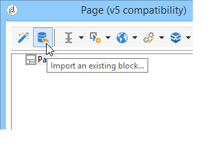

# Renderização do formulário{#form-rendering}

## Seleção do modelo de renderização do formulário {#selecting-the-form-rendering-template}

As configurações de formulário permitem selecionar o modelo usado para gerar as páginas. Para acessá-las, clique no botão **[!UICONTROL Properties]** na barra de ferramentas de detalhes do formulário e selecione a guia **[!UICONTROL Rendering]**. Há vários templates (folhas de estilos) disponíveis por padrão.

A seção inferior do editor permite exibir uma renderização do template selecionado.

O recurso de zoom permite editar o template selecionado.

É possível modificar ou substituir esses templates. Para fazer isso, clique no link **[!UICONTROL Page layout...]** e personalize as informações.

É possível:

* Alterar a imagem usada como um logotipo e adaptar seu tamanho,
* Especificar também o caminho para acessar a imagem de pré-visualização quando os usuários selecionam esse template de renderização.

A guia **[!UICONTROL Headers/Footers]** permite alterar as informações exibidas nos cabeçalhos e rodapés de cada página de formulário usando esse template.

Cada linha da seção **[!UICONTROL Page headers]** e **[!UICONTROL Page footers]** corresponde a uma linha na página HTML. Clique em **[!UICONTROL Add]** para criar uma nova linha.

Selecione uma linha existente e clique no botão **[!UICONTROL Detail]** para personalizá-la.

Você pode alterar o conteúdo da linha, adicionar bordas e alterar os atributos da fonte por meio das guias relevantes. Clique em **[!UICONTROL OK]** para confirmar as alterações.

Os campos **[!UICONTROL Position]** permitem definir a posição dos elementos no cabeçalho e no rodapé da página.

>[!NOTE]
>
>Os templates de renderização estão armazenados no nó **[!UICONTROL Administration > Configuration > Form rendering]**.\
>Para obter mais informações, consulte [Personalização da renderização de formulários](#customizing-form-rendering).

## Personalização da renderização de formulários {#customizing-form-rendering}

### Alteração do layout dos elementos {#changing-the-layout-of-elements}

Você pode sobrecarregar a folha de estilos de cada elemento do formulário (campos de entrada, imagens, botões de opção, etc.).

Para fazer isso, use a guia **[!UICONTROL Advanced]**.

Ela permite que você defina as seguintes propriedades:

* **[!UICONTROL Label position]**: consulte [Definição da posição de rótulos](defining-web-forms-layout.md#defining-the-position-of-labels),
* **[!UICONTROL Label format]**: Quebra de texto ou quebra automática de linha,
* **[!UICONTROL Number of cells]** : consulte [Posicionamento de campos na página](defining-web-forms-layout.md#positioning-the-fields-on-the-page),
* **[!UICONTROL Horizontal alignment]** (à esquerda, à direita, centralizado) e **[!UICONTROL Vertical alignment]** (em cima, embaixo, no meio),
* **[!UICONTROL Width]** da zona: pode ser expresso como uma porcentagem ou em ems, pontos ou pixels (valor padrão),
* **[!UICONTROL Length]** máximo: número máximo de caracteres permitidos (para controles do tipo texto, número e senha),
* **[!UICONTROL Lines]**: número de linhas para uma zona de tipo **[!UICONTROL Multi-line text]**,
* **[!UICONTROL Style inline]**: permite que você sobrecarregue a folha de estilos CSS com configurações adicionais. Eles são separados usando os caracteres **;** como mostrado no exemplo abaixo:

   

### Definição de cabeçalhos e rodapés {#defining-headers-and-footers}

Os campos são sequenciados em uma estrutura de árvore cuja raiz tem o mesmo nome que a página. Selecione para modificar o nome.

O título da janela deve ser inserido na guia **[!UICONTROL Page]** da janela de propriedade do formulário. Você também pode adicionar um conteúdo definido ao cabeçalho e ao rodapé da página (essas informações serão exibidas em todas as páginas). Esse conteúdo é inserido nas seções correspondentes da guia **[!UICONTROL Texts]**, conforme mostrado abaixo:

### Adição de elementos ao cabeçalho HTML {#adding-elements-to-html-header}

É possível inserir elementos adicionais no cabeçalho HTML de uma página de formulário. Para fazer isso, insira os elementos na guia **[!UICONTROL Header]** da página relevante.

Isso permite que você faça referência a um ícone que será exibido na barra de título da página, por exemplo.

## Definição das configurações de controle {#defining-control-settings}

Quando o usuário preenche o formulário, uma verificação é automaticamente executada em determinados campos, dependendo do formato ou da configuração. Isso permite que você torne determinados campos obrigatórios (consulte [Definição de campos obrigatórios](#defining-mandatory-fields)) ou verifique o formato dos dados inseridos (consulte [Verificação do formato de dados ](#checking-data-format)). As verificações são realizadas durante a aprovação da página (clicando em um link ou botão que permite uma transição de saída).

### Definição de campos obrigatórios {#defining-mandatory-fields}

Para tornar determinados campos obrigatórios, selecione essa opção ao criar o campo.

Se o usuário aprovar essa página sem ter inserido o campo, a seguinte mensagem será exibida:

Você pode personalizar esta mensagem clicando no link **[!UICONTROL Personalize this message]**.

Se o usuário aprovar essa página sem ter inserido o campo, a seguinte mensagem será exibida:

### Verificação do formato de dados {#checking-data-format}

Para verificar se os valores são armazenados em um campo existente do banco de dados, as regras do campo de armazenamento serão aplicadas.

Para verificações de formulário cujos valores são armazenados em uma variável, as regras de aprovação dependem do formato da variável.

Por exemplo, se você criar uma verificação **[!UICONTROL Number]** para armazenar o número do cliente, conforme mostrado abaixo:

O usuário deve inserir um inteiro no campo de formulário.

## Definição da exibição condicional de campos {#defining-fields-conditional-display}

Você pode configurar a exibição de campos na página a ser exibida com base nos valores escolhidos pelo usuário. Isso pode ser aplicado a um campo ou grupo de campos (quando eles são agrupados em um container).

Para cada elemento da página, a seção **[!UICONTROL Visibility]** permite definir as condições de exibição.

As condições podem se referir ao valor dos campos ou variáveis do banco de dados.

Na janela de seleção de campo, você pode escolher entre os seguintes dados:

* A árvore principal contém os parâmetros do contexto de formulário. Os parâmetros padrão incluem o Identificador (que corresponde ao identificador criptografado do recipient), Idioma e Origem.

   Para obter mais informações, consulte esta [página](defining-web-forms-properties.md#form-url-parameters).

* A subárvore **[!UICONTROL Recipients]** contém os campos de entrada inseridos no formulário e armazenados no banco de dados.

   Para obter mais informações, consulte [Armazenamento de dados no banco de dados](web-forms-answers.md#storing-data-in-the-database).

* A subárvore **[!UICONTROL Variables]** contém as variáveis disponíveis para esse formulário. Para obter mais informações, consulte [Armazenamento de dados em uma variável local](web-forms-answers.md#storing-data-in-a-local-variable).

Para obter mais informações, consulte o caso de uso disponível aqui: [Exibição de opções diferentes de acordo com os valores selecionados](use-cases--web-forms.md#displaying-different-options-depending-on-the-selected-values).

Você também pode condicionar a exibição de páginas de formulário usando o objeto **[!UICONTROL Test]**. Para obter mais informações, consulte esta [página](defining-web-forms-page-sequencing.md#conditional-page-display).

## Importação dos elementos de um formulário existente {#importing-elements-from-an-existing-form}

É possível importar campos ou containers de outros formulários web. Isso permite criar uma biblioteca de blocos reutilizáveis que serão inseridos em formulários, como o bloco de endereços, a área de subscrição do boletim informativo, etc.

Para importar um elemento para um formulário, siga as etapas abaixo:

1. Edite a página em que deseja inserir um ou mais elementos e clique em **[!UICONTROL Import an existing block]** na barra de ferramentas.

   

1. Selecione o formulário web que contém os campos a serem importados e escolha os containers e campos a serem importados.

   

   >[!NOTE]
   >
   >O ícone **[!UICONTROL Edit link]** à direita do nome do formulário de origem permite exibir o formulário web selecionado.

1. Clique em **[!UICONTROL Ok]** para confirmar a inserção.

   
