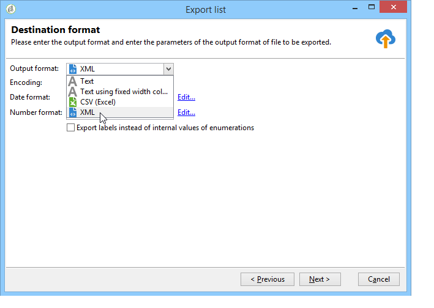

# Publicar, acompanhar e usar dados coletados{#publish-track-and-use-collected-data}

Depois que o formulário tiver sido criado, configurado e publicado, é possível compartilhar o link com o público e acompanhar as respostas.

>[!NOTE]
>
>O ciclo de vida de uma pesquisa no Adobe Campaign, bem como seus modos de publicação e delivery são semelhantes aos dos formulários Web: esses são detalhados [nesta seção](../../web/using/about-web-forms.md).

## Painel de pesquisa {#survey-dashboard}

Cada pesquisa tem seu próprio painel de controle que permite visualizar seu status, descrição, URL pública e cronograma de disponibilidade. Também permite exibir os relatórios disponíveis. Para obter mais informações, consulte [Relatórios de pesquisa](#reports-on-surveys).

A URL pública da pesquisa é mostrada no painel:


## Acompanhamento de resposta {#response-tracking}

Você pode acompanhar as respostas da pesquisa em logs e relatórios.

### Logs de pesquisa {#survey-logs}

Para cada pesquisa entregue, você pode acompanhar as respostas na guia **[!UICONTROL Logs]**. Essa guia exibe a lista de usuários que concluíram a pesquisa e sua origem:


Clique duas vezes em uma linha para exibir o formulário de pesquisa como preenchido pelo entrevistado. Você pode navegar pela pesquisa e acessar as respostas integralmente. Elas podem ser exportadas em um arquivo externo. Para obter mais informações, consulte [Exportação de respostas](#exporting-answers).

A origem é indicada na URL da pesquisa adicionando os seguintes caracteres:

```
?origin=xxx
```

while the survey is being edited, its URL contains the parameter **[!UICONTROL __uuid]**, which indicates that it is in a test phase and not yet online. Ao acessar a pesquisa por meio dessa URL, os registros criados não são considerados no acompanhamento (relatórios). The origin is forced to the value **[!UICONTROL Adobe Campaign]**.

Para obter mais informações sobre os parâmetros da URL, consulte [esta página](../../web/using/defining-web-forms-properties.md#form-url-parameters).

### Relatórios sobre pesquisas {#reports-on-surveys}

A guia do painel permite acessar relatórios de pesquisa. Clique em um nome de relatório para visualizá-lo.


A estrutura da pesquisa é visível no relatório **[!UICONTROL Documentation]**.

Two other reports on Web surveys are available in the **[!UICONTROL Reports]** tab of the surveys: **[!UICONTROL General]** and **[!UICONTROL Breakdown of responses]**.

* Geral

   Este relatório contém informações gerais sobre a pesquisa: como o número de respostas é alterado com o tempo e a distribuição por origem e idioma.

   Exemplo de um relatório geral:

   

* Detalhamento das respostas

   Este relatório mostra o detalhamento das respostas para cada pergunta. Esse detalhamento só está disponível para respostas dos campos armazenados em containers do tipo **[!UICONTROL Question]**. É válido apenas para controles de seleção (sem detalhamento em campos de texto, por exemplo).

   

## Exportação de respostas {#exporting-answers}

As respostas de uma pesquisa podem ser exportadas em um arquivo externo para serem processadas posteriormente. Há duas maneiras de fazer isso:

1. Exportação de dados de relatórios

   Para exportar dados do relatório, clique no botão **[!UICONTROL Export]** e escolha o formato de exportação.

   Para obter mais informações sobre exportação de dados de relatórios, consulte [esta seção](../../reporting/using/about-reports-creation-in-campaign.md).

1. Exportação de respostas

   Para exportar respostas, clique na guia **[!UICONTROL Responses]** da pesquisa e clique com o botão direito do mouse. Selecione **[!UICONTROL Export...]**.

   

   Em seguida, insira as informações que deseja exportar e o arquivo de armazenamento.

   Você pode configurar o conteúdo e o formato do arquivo de saída no assistente de exportação.

   Isso permite:

   * adicionar colunas ao arquivo de saída e recuperar as informações do recipient (que é armazenado no banco de dados),
   * formatar os dados exportados,
   * selecionar o formato de codificação para as informações no arquivo.

   If the survey you want to export contains several **[!UICONTROL Multi-line text]** or **[!UICONTROL HTML text]** fields, it has to be exported in **[!UICONTROL XML]** format. Para fazer isso, selecione este formato na lista suspensa do campo **[!UICONTROL Output format]**, conforme mostrado abaixo:

   

   Clique em **[!UICONTROL Start]** para executar a exportação.

   >[!NOTE]
   >
   >As exportações de dados e as etapas de sua configuração são detalhadas [nesta seção](../../platform/using/generic-imports-and-exports.md).

## Uso dos dados coletados {#using-the-collected-data}

As informações coletadas por pesquisas online podem ser recuperadas dentro da estrutura de um workflow para construção do target. To do this, use the **[!UICONTROL Survey responses]** box.

No exemplo a seguir, queremos fazer uma oferta da Web especialmente para os cinco recipients com pelo menos duas crianças e com as pontuações mais altas em uma pesquisa online. As respostas para essa pesquisa são:


No workflow para construção do target, as **[!UICONTROL Survey responses]** serão configuradas da seguinte maneira:


Comece selecionando a pesquisa relacionada e os dados a serem extraídos na seção central da janela. Nesse caso, precisamos extrair pelo menos a coluna de pontuação, pois ela será usada na caixa de divisão para recuperar as cinco pontuações mais altas.

Indicate the filtering conditions for answers by clicking the **[!UICONTROL Edit query...]** link.


Inicie o workflow para construção do target. O query recupera 8 recipients.


Clique com o botão direito do mouse na transição de saída da caixa de coleção para exibi-los.


Em seguida, coloque uma caixa de divisão no workflow para recuperar os 5 recipients com a pontuação mais alta.

Edite a caixa de divisão para configurá-la:

* Comece selecionando o schema adequado na guia **[!UICONTROL General]** e configure o subconjunto:

   

* Go to the **[!UICONTROL Sub-sets]** tab and select the **[!UICONTROL Limit the selected records]** option, then click the **[!UICONTROL Edit...]** link.

   

* Select the **[!UICONTROL Keep only the first records after sorting]** option and select the sort column. Marque a opção **[!UICONTROL Descending sort]**.

   

* Clique no botão **[!UICONTROL Next]** e limite o número de registros a 5.

   

* Clique em **[!UICONTROL Finish]** e reinicie o workflow para aprovar o target.

## Padronização de dados {#standardizing-data}

É possível configurar processos de padronização no Adobe Campaign para dados coletados usando aliases. Isso permite padronizar os dados armazenados no banco de dados: para fazer isso, defina aliases nas listas discriminadas que contêm as informações relevantes.

Para obter mais informações, consulte [esta página](../../platform/using/managing-enumerations.md#about-enumerations).
