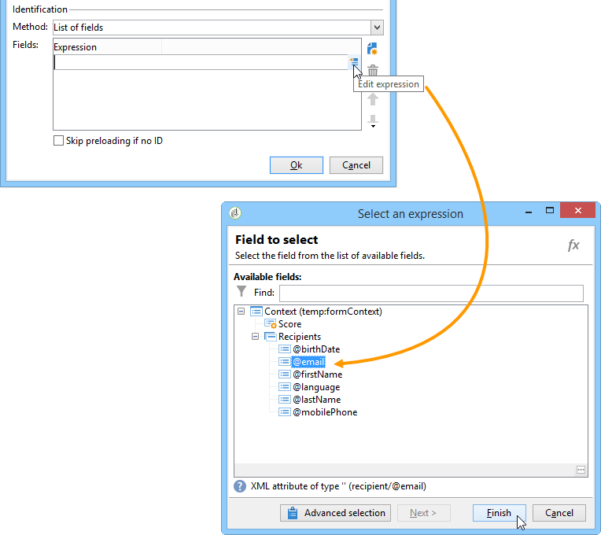

# Publicação de um formulário web{#publishing-a-web-form}

## Pré-carregamento dos dados do formulário {#pre-loading-the-form-data}

Se quiser atualizar os perfis armazenados no banco de dados por meio de um formulário web, use uma caixa de pré-carregamento. A caixa de pré-carregamento permite indicar como localizar o registro a ser atualizado no banco de dados.

Os seguintes métodos de identificação são possíveis:

* **[!UICONTROL Adobe Campaign Encryption]**

   Esse método de criptografia usa o identificador (ID) criptografado do Adobe Campaign. Esse método só é aplicável em um objeto do Adobe Campaign e a ID criptografada só pode ser gerada pela plataforma Adobe Campaign.

   Ao usar esse método, você precisa adaptar a URL do formulário a ser entregue ao endereço de email adicionando o parâmetro **`<%=escapeUrl(recipient.cryptedId) %>`**. Para obter mais informações, consulte [Entrega de um formulário por email](#delivering-a-form-via-email).

* **[!UICONTROL DES encryption]**

   

   Esse método de criptografia usa um identificador (ID) fornecido externamente, vinculado a uma chave compartilhada pela Adobe Campaign e pelo provedor externo. The **[!UICONTROL Des key]** field lets you enter this encryption key.

* **[!UICONTROL List of fields]**

   Essa opção permite escolher entre os campos no contexto atual do formulário, aquelas que serão usadas para localizar o perfil correspondente no banco de dados.

   

   Os campos podem ser adicionados às propriedades do formulário por meio da guia **[!UICONTROL Parameters]** (consulte [Adicionar parâmetros](../../web/using/defining-web-forms-properties.md#adding-parameters)). Eles são colocados na URL do formulário ou nas zonas de entrada.

   >[!CAUTION]
   >
   >Os dados nos campos selecionados não estão criptografados. Eles não devem ser fornecidos em um formulário criptografado porque o Adobe Campaign não poderá retirar a criptografia se a opção **[!UICONTROL Field list]** estiver selecionada.

   No exemplo a seguir, o pré-carregamento de perfis é baseado no endereço de email.

   A URL pode incluir o endereço de email não criptografado, nesse caso, os usuários têm acesso direto às páginas referentes.

   

   Caso contrário, eles serão solicitados a fornecer sua senha.

   

   >[!CAUTION]
   >
   >Se vários campos forem especificados na lista, os dados de **TODOS OS CAMPOS** deverão corresponder aos dados armazenados no banco de dados para que o perfil seja atualizado. Caso contrário, um novo perfil será criado.
   > 
   >Essa função é particularmente útil para aplicações web, mas não recomendada para formulários públicos. A opção de controle de acesso selecionado deve ser &quot;Habilitar controle de acesso&quot;.

The **[!UICONTROL Skip preloading if identification is empty]** option must be selected if you do not wish to update profiles. Nesse caso, cada perfil inserido será adicionado ao banco de dados após a aprovação do formulário. Essa opção é usada, por exemplo, quando o formulário é postado em um site.

The **[!UICONTROL Auto-load data referenced in the form]** option lets you automatically preload the data that matches input and merge fields in the form. However, data referenced in **[!UICONTROL Script]** and **[!UICONTROL Test]** activities is not concerned. Se esta opção não estiver selecionada, você precisará definir os campos utilizando a opção **[!UICONTROL Load additional data]**.

A opção **[!UICONTROL Load additional data]** permite adicionar informações que não são usadas nas páginas do formulário, mas ainda serão pré-carregadas.

Você pode, por exemplo, pré-carregar o gênero do recipient e direcionar automaticamente para a página apropriada através de uma caixa de teste.


## Gerenciamento do delivery e do rastreamento de formulários web {#managing-web-forms-delivery-and-tracking}

Depois que o formulário tiver sido criado, configurado e publicado, você poderá entregar e controlar as respostas do usuário.

### Ciclo de vida de um formulário {#life-cycle-of-a-form}

Há três estágios no ciclo de vida de um formulário:

1. **Formulário sendo editado**

   Esta é a fase de design inicial. Quando um novo formulário é criado, ele está na fase de edição. Access to the form, for testing purposes only, then requires the parameter **[!UICONTROL __uuid]** to be used in its URL. Essa URL pode ser acessada na subguia **[!UICONTROL Preview]**. Consulte [Parâmetros da URL do formulário](../../web/using/defining-web-forms-properties.md#form-url-parameters).

   >[!CAUTION]
   >
   >Desde que o formulário esteja sendo editado, sua URL de acesso é uma URL especial.

1. **Formulário Online**

   Quando a fase de design é concluída, o formulário pode ser entregue. Primeiro, precisa ser publicado. Para obter mais informações, consulte [Publicar um formulário](#publishing-a-form).

   The form will be **[!UICONTROL Live]** until it expires.

   >[!CAUTION]
   >
   >To be delivered, the URL of the survey must not contain the **[!UICONTROL __uuid]** parameter.

1. **Formulário indisponível**

   Depois que o formulário for fechado, a fase de delivery será finalizada e o formulário ficará indisponível: ele não estará mais acessível aos usuários.

   A data de expiração pode ser definida na janela de propriedades do formulário. Para obter mais informações, consulte [Disponibilizar um formulário online](#making-a-form-available-online)

O status da publicação de um formulário é exibido na lista de formulários.


### Publicação de um formulário {#publishing-a-form}

Para alterar o estado de um formulário, você precisa publicá-lo. Para fazer isso, clique no botão **[!UICONTROL Publication]** acima da lista de formulários web e selecione o estado na caixa suspensa.


### Disponibilização de um formulário online {#making-a-form-available-online}

Para ser acessado por usuários, o formulário deve estar em produção e iniciado, ou seja, dentro de seu período de validade. As datas de validade são inseridas por meio do link **[!UICONTROL Properties]** do formulário.

* Use os campos na seção **[!UICONTROL Project]** para inserir datas de início e término do formulário.

   

* Click the **[!UICONTROL Personalize the message displayed if the form is closed...]** link to define the error message to display if the user tries to access the form while it isn&#39;t valid.

   Consulte [Acessibilidade do formulário](../../web/using/defining-web-forms-properties.md#accessibility-of-the-form).

### Delivery de um formulário por email {#delivering-a-form-via-email}

Ao enviar um convite por email, você pode usar a opção **[!UICONTROL Adobe Campaign Encryption]** para reconciliação de dados. Para fazer isso, vá para o assistente do delivery e adapte o link ao formulário adicionando o seguinte parâmetro:

```
<a href="https://server/webApp/APP264?&id=<%=escapeUrl(recipient.cryptedId) %>">
```

Nesse caso, a chave de reconciliação para o armazenamento de dados deve ser o identificador criptografado do recipient. Para obter mais informações, consulte [Pré-carregamento dos dados do formulário](#pre-loading-the-form-data).

In this case, you need to check the **[!UICONTROL Update the preloaded record]** option in the record box. Para obter mais informações, consulte [Salvar respostas de formulários web](../../web/using/web-forms-answers.md#saving-web-forms-answers).


### Rastrear respostas {#log-responses}

O rastreamento de resposta pode ser ativado em uma guia dedicada para monitorar o impacto do seu formulário web. To do this, click the **[!UICONTROL Advanced parameters...]** link in the form properties window and select the **[!UICONTROL Log responses]** option.


A guia **[!UICONTROL Responses]** aparece para permitir que você visualize a identidade dos entrevistados.


Select a recipient and click the **[!UICONTROL Detail...]** button to view the responses provided.


Você pode processar os logs de resposta fornecidos em queries, por exemplo, para direcionar somente aqueles que não responderam ao enviar lembretes ou oferecer comunicações específicas apenas aos que responderam.

>[!NOTE]
>
>Para obter um rastreamento completo das respostas fornecidas, exporte as respostas e exiba ou crie relatórios dedicados, use o módulo opcional de **Pesquisa.** Para obter mais informações, consulte [esta seção](../../web/using/about-surveys.md).

